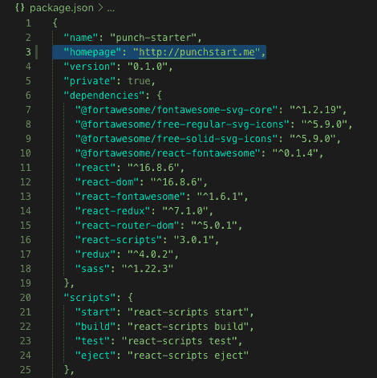
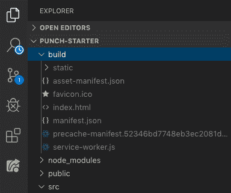
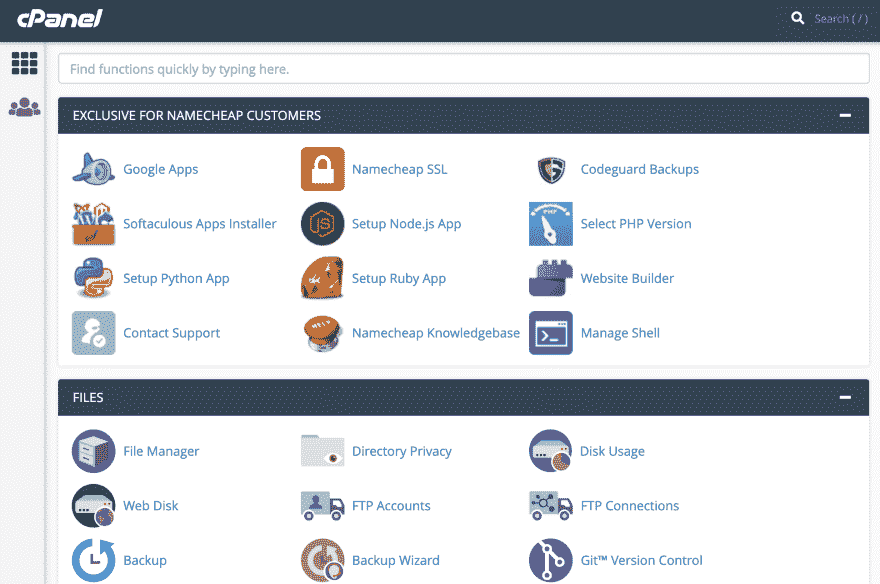
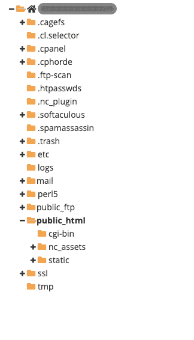
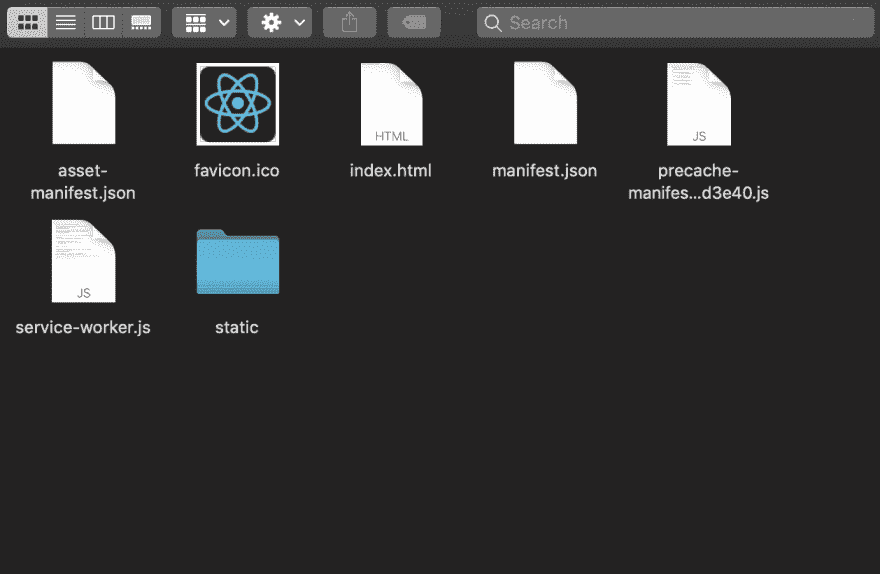
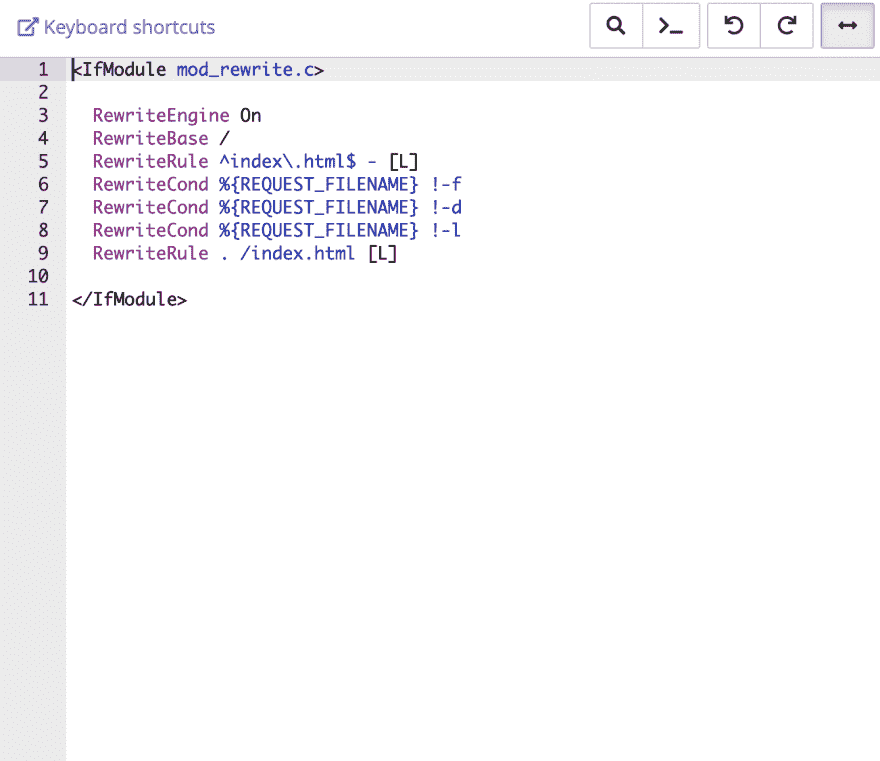

# 用 cPanel 在 5 分钟内部署/托管您的 React 应用

> 原文：<https://dev.to/crishanks/deploy-host-your-react-app-with-cpanel-in-under-5-minutes-4mf6>

# 潜水权在

在做一个名为 [Punchstarter](http://punchstart.me) 的 Kickstarter 克隆应用的个人项目时，我很难找到任何关于如何用 cPanel 在我自己的域上托管自定义应用的好文档。我希望这将对许多人有用。

### 1。购买域名和主机

要托管一个网站，你需要从托管服务提供商那里购买一个注册域名和一个托管计划(这两者都是通过众多渠道提供的，如 [Namecheap](https://www.namecheap.com/hosting/shared/) 或 [Godaddy](https://www.godaddy.com/hosting/web-hosting) )。如果你一起购买，这些提供商通常会自动将域名指向你的主机服务器。如果没有，[这个教程](https://sitebeginner.com/domains/domaintosite/)可以帮你解决。

### 2。将主页添加到 package.json 文件中

接下来，打开你的 React 应用。打开您的`package.json`文件并添加一个`"homepage"`属性，如下所示:

[](https://res.cloudinary.com/practicaldev/image/fetch/s--h1pJP0gP--/c_limit%2Cf_auto%2Cfl_progressive%2Cq_auto%2Cw_880/https://thepracticaldev.s3.amazonaws.com/i/4wqb71tznqilad5rnzma.png)

格式应该是`"homepage": "http://yourdomainname.whatever"`

### 3。创建`build`文件

在应用程序的根目录下，运行`yarn install`来安装更新的依赖项。一旦完成，您将运行的下一个命令是`yarn build` ( `npm install`和`npm build`也起作用)。

您会注意到这在您的项目中创建了一个名为`build`的新目录。构建文件夹本质上是你的程序的一个超级压缩版本，拥有你的浏览器识别和运行你的应用所需的一切。

[](https://res.cloudinary.com/practicaldev/image/fetch/s--Ok3totqu--/c_limit%2Cf_auto%2Cfl_progressive%2Cq_auto%2Cw_880/https://thepracticaldev.s3.amazonaws.com/i/5pbbk3zjvjyfftyappd8.png)

### 4。连接到 cPanel

让我们去找你的主机提供商(name price，Godaddy，Bluehost 等。).登录后，导航到您所在域的 cPanel 管理器。通常会有一个写着“管理”的下拉菜单，它会引导你到 cPanel。

[](https://res.cloudinary.com/practicaldev/image/fetch/s--A6IbB9L2--/c_limit%2Cf_auto%2Cfl_progressive%2Cq_auto%2Cw_880/https://thepracticaldev.s3.amazonaws.com/i/b27bb6a500yctbxysc0n.png)

您的 cPanel 管理器应该如下所示:

[](https://res.cloudinary.com/practicaldev/image/fetch/s--c0qzzC3V--/c_limit%2Cf_auto%2Cfl_progressive%2Cq_auto%2Cw_880/https://thepracticaldev.s3.amazonaws.com/i/17kybzgd5q1h6y2jd74x.png)

导航到文件管理器。在那里你会找到一个目录的下拉列表。我们感兴趣的是`public_html`。打开它。

[](https://res.cloudinary.com/practicaldev/image/fetch/s--9EIklQlV--/c_limit%2Cf_auto%2Cfl_progressive%2Cq_auto%2Cw_880/https://thepracticaldev.s3.amazonaws.com/i/via84rrhvsi29924si8v.png)

## 5。将构建文件内容添加到`public_html`

导航到应用程序根目录中的`build`文件。打开它并选择构建文件中的所有内容**。*如果你上传整个构建文件本身，这个过程将不会工作*。**

[](https://res.cloudinary.com/practicaldev/image/fetch/s--uvF6lKdn--/c_limit%2Cf_auto%2Cfl_progressive%2Cq_auto%2Cw_880/https://thepracticaldev.s3.amazonaws.com/i/20rta7k83xvk4lqtv9xn.png)

一旦你复制了构建文件中的所有内容*，将它们上传到`public_html`。*

## ⑥。创建并上传`.htaccess`文件

为了让路线在 React 应用程序中工作，您需要添加一个`.htaccess`文件。在`public_html`文件夹中，在`build`文件内容的同一层，添加一个新文件，命名为`.htaccess`。

编辑文件并插入以下样板信息:

```
<IfModule mod_rewrite.c>

  RewriteEngine On
  RewriteBase /
  RewriteRule ^index\.html$ - [L]
  RewriteCond %{REQUEST_FILENAME} !-f
  RewriteCond %{REQUEST_FILENAME} !-d
  RewriteCond %{REQUEST_FILENAME} !-l
  RewriteRule . /index.html [L]

</IfModule> 
```

<svg width="20px" height="20px" viewBox="0 0 24 24" class="highlight-action crayons-icon highlight-action--fullscreen-on"><title>Enter fullscreen mode</title></svg> <svg width="20px" height="20px" viewBox="0 0 24 24" class="highlight-action crayons-icon highlight-action--fullscreen-off"><title>Exit fullscreen mode</title></svg>

[](https://res.cloudinary.com/practicaldev/image/fetch/s--QeduoQ5u--/c_limit%2Cf_auto%2Cfl_progressive%2Cq_auto%2Cw_880/https://thepracticaldev.s3.amazonaws.com/i/g8acjvap0l60rhztz9ho.png)

保存文件。

## 大功告成。

就是这样！在浏览器中导航到您的域名地址，您应该会看到您的全功能 web 应用程序。

# 关于 FileZilla 的一个注记

我知道很多人喜欢使用 FileZilla 来部署和托管他们的定制 web 应用程序。我发现它对我的目的来说是不必要的，但是如果你选择，你可以:

1.  下载并运行 [FileZilla](https://filezilla-project.org/)
2.  [获取您域名的 ip 地址](https://ipinfo.info/html/ip_checker.php) -或者询问您的主机提供商
3.  输入域 ip、cPanel 登录、cPanel 用户名和主机端口(即 21。你的主机提供商应该为你提供这些信息)
4.  单击快速连接
5.  连接后，导航到、选择并复制`build`文件中的内容(在显示计算机目录的左侧窗格中)
6.  导航到右侧 cPanel 窗格中的`public_html`目录。将`build`文件的内容粘贴到`public_html`中
7.  用上面列出的相同信息创建`.htaccess`文件