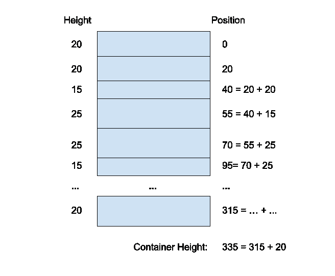
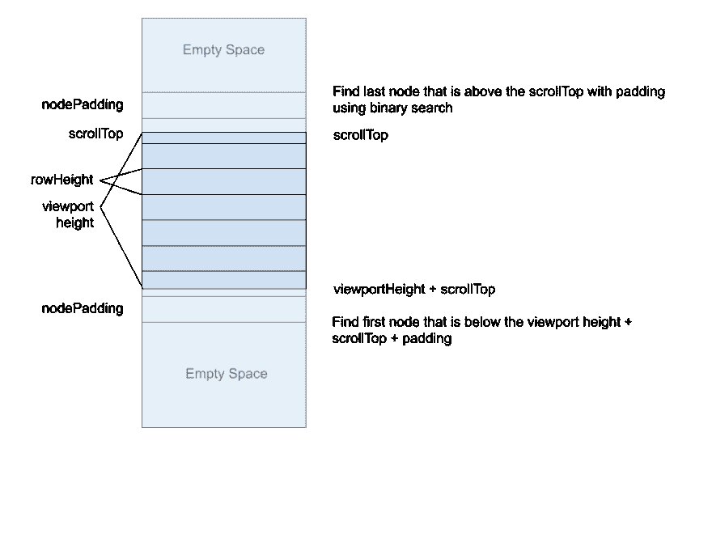

# 建立自己的虚拟卷轴-第二部分

> 原文：<https://dev.to/adamklein/build-your-own-virtual-scroll-part-ii-3j86>

在第 1 部分中，我们学习了构建虚拟滚动机制背后的基本原理和数学原理，并看到了一些伪代码和一些真实代码。

如果你还没看，建议你从那里开始了解术语: **[第一部分](https://dev.to/adamklein/build-your-own-virtual-scroll-part-i-11ib)**

在第 1 部分中，我们假设行高总是固定的，这使得我们的生活更加容易。但是我们如何支持动态高度，我们必须让用户提供高度还是可以自动计算出来？

# 自动高度？

先回答第二个问题。计算未渲染节点的高度不是一件小事，而且成本很高。这需要将它们渲染到屏幕之外，并处理一些潜在的边缘情况，这本身就是一个大问题。我们不会在本教程中讨论这个问题。

# 动态高度

然而，我们可以通过允许用户提供一个返回每行高度的函数来支持动态高度。这是用户可以通过对每种行类型呈现不同类型的行来离线计算的。

这使得我们的计算更加复杂，因为我们不能只乘以或除以 rowHeight。

## 计算节点的位置

当我们初始化组件时，我们将计算每个节点的位置，这将帮助我们完成第 1 部分中的所有计算步骤。

我们还需要对项目数组中的变化做出反应，并在整个数组发生变化时重新计算它的位置。这在现代有限元框架中通常是可以实现的。

为了计算一个**节点的位置**，我们取前一个节点的**位置，加上前一个节点**的**高度。**

我们必须在开始
 时进行全通

## 容器高度

现在我们有了节点的位置，这是一个非常简单的步骤。我们简单地取**最后一个节点的位置**并加上它的**高度**。

## 算出可见节点

为了解决这个问题，我们需要从第一个可见的节点开始。现在我们已经计算了节点的位置，这基本上就是找到滚动位置上方的最底部的节点。听起来很简单，但是由于位置是动态的，我们不能简单地用数学计算来定位那个节点。

### 天真解

简单的解决方案是从头开始迭代节点，直到找到一个位置大于 scrollTop 的节点。但这显然是一个糟糕的策略。当用户滚动时，这种计算会非常频繁地进行，并且必须非常高效。

### 二分搜索法

因为我们的节点已经排序，我们可以做一个**二分搜索法**。

> 二分搜索法:通过将搜索区间一分为二来搜索排序后的数组。以覆盖整个阵列的间隔开始。如果搜索关键字的值小于间隔中间的项目，则将间隔缩小到下半部分。否则，缩小到上半部分。重复检查，直到找到值或间隔为空。[https://www.geeksforgeeks.org/binary-search/](https://www.geeksforgeeks.org/binary-search/)

优点是复杂度为 O(log n)。这意味着即使你有一百万个节点，你也只能进行大约 20 次比较。

通常，在二分搜索法，我们寻找一个特定的值。这里，我们寻找一个在滚动位置之上的节点，而下一个节点的位置在它之下。

找到第一个节点后，我们像第 1 部分一样减少节点填充。

现在，为了计算出可见节点的数量，我们简单地添加节点，直到我们到达大于**scroll top**+**viewport height**的**节点位置**，并且添加填充。

## 将节点下移

既然我们有了节点的位置，我们的**偏移量**就是**第一个节点的位置**。

## 然后就这样了

就这样，我们得到了与第一部分中相同的数字，我们可以渲染可见的节点并向下移动它们。

# 性能优化

你可能意识到做所有这些计算会很昂贵。当用户滚动时，滚动事件可能会非常迅速地触发，我们希望确保不要做太多额外的计算，否则用户界面可能会很慢。
大多数显示器使用 60fps，重新计算速度超过 60 fps 只是浪费资源。

## 节流

实现这一点的一种方法是节流。

> 节流让我们可以控制函数被调用的速度。例如，如果一个事件每毫秒触发一次，我们希望回调只每 17 毫秒处理一次事件，而忽略中间的事件。

因此，您可以将滚动事件回调限制到 17ms，并确保最后一个事件(tail)也得到处理。

## requestAnimationFrame

我的首选方式是使用 requestAnimationFrame。

> window.requestAnimationFrame()方法告诉浏览器您希望执行动画，并请求浏览器在下一次重画之前调用指定的函数来更新动画。该方法将回调作为在重画之前调用的参数。更多信息:[https://developer . Mozilla . org/en-US/docs/Web/API/window/request animation frame](https://developer.mozilla.org/en-US/docs/Web/API/window/requestAnimationFrame)

这将保证您的计算将以 60fps 的速度运行。这意味着 scroll 事件需要运行 requestAnimationFrame 中的计算。但是如何防止在一个动画帧中注册多个回调呢？您可以简单地取消之前的回调(如果存在)，并请求另一个回调。

# 举例

下面是一个使用 React、二分搜索法和虚拟滚动的动态高度的例子，使用 React 和 hooks:
[https://code sandbox . io/s/virtual-scroll-dynamic-heights-using-hooks-6g mgu](https://codesandbox.io/s/virtual-scroll-dynamic-heights-using-hooks-6gmgu)

# 在树上虚拟滚动

我开发的一个更复杂的东西是在树上的虚拟滚动。该树增加了另一个复杂性，即每一层都可能被展开或折叠，并且树上的遍历是嵌套的。

克服这个问题的一个方法是把树弄平。这意味着每次展开或折叠一个节点时，都要在平面数组中插入或删除节点，并重新计算节点的位置。然后，虚拟滚动的行为就像列表上的常规虚拟滚动一样。

另一种方法(我采用的)，是根据树的当前状态(哪个是展开的，哪个是折叠的)计算节点位置。遍历树来寻找可见节点是在树上递归完成的。

你可以在这里查看源代码:
[https://github . com/500 tech/angular-tree-component/blob/master/lib/models/tree-virtual-scroll . model . ts](https://github.com/500tech/angular-tree-component/blob/master/lib/models/tree-virtual-scroll.model.ts)

谢谢，我希望你喜欢这两部分的博客！