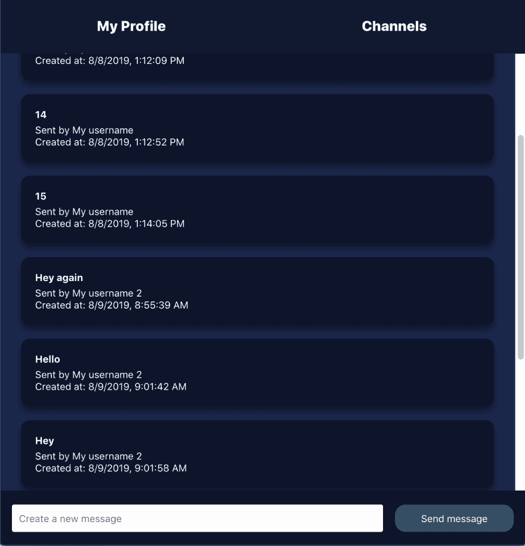
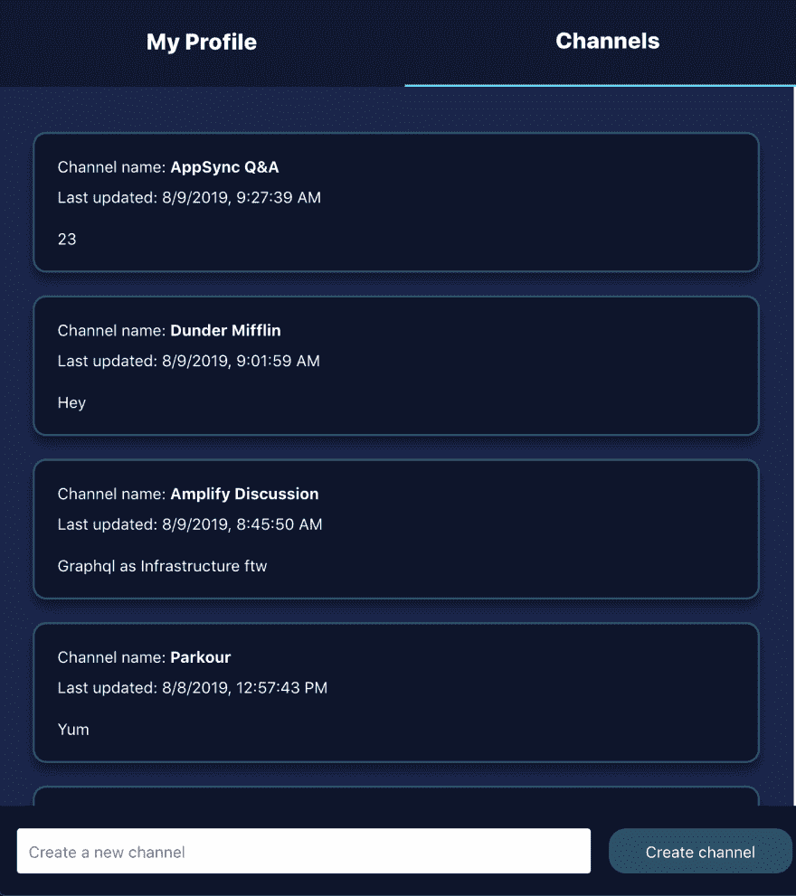
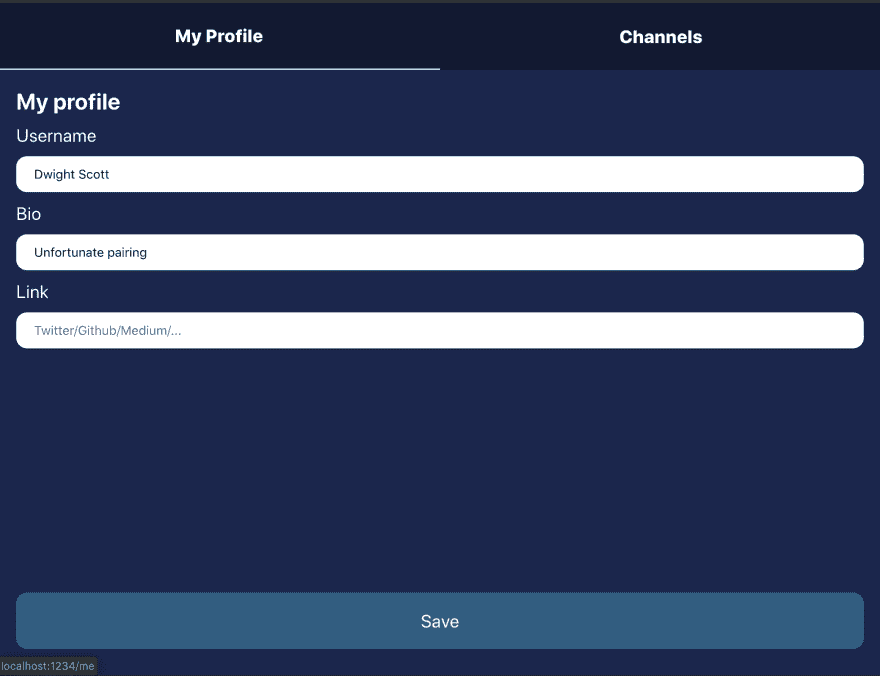

# AWS Amplify 分页和排序

> 原文：<https://dev.to/rakannimer/pagination-sorting-with-aws-amplify-4l37>

在我的上一篇文章中，[服务器端使用 Next.js 渲染实时 Web 应用，AWS Amplify & Next.js](https://dev.to/rakannimer/server-side-rendered-real-time-web-app-with-next-js-aws-amplify-graphql-2j49) 我们讨论了设置 Next.js React 应用并将其连接到服务器端和客户端 Amplify 的细节。

在这篇更高级的文章中，我们将介绍如何使用 Amplify 构建一个面向频道的群聊应用程序，该应用程序需要获取、收听、分页和排序数据列表。

请随意跳过这篇文章，查看最终代码[这里](https://github.com/rakannimer/pagination-and-sorting-with-aws-amplify/)和演示[这里](https://master.d134reqxn9j89v.amplifyapp.com)用 AWS Amplify 控制台构建和部署。

*   [项目要求](#project-requirements)
*   [定义本地状态](#defining-local-state)
*   [用 GraphQL 定义数据模型](#defining-the-data-model-with-graphql)
    *   [突变](#mutations)
    *   [创建我们的定制查询](#creating-our-custom-queries)
    *   [T2`getChannelList`](#getchannellist)
    *   [T2`getChannelMessages`](#getchannelmessages)
    *   [T2`updateChannel`](#updatechannel)
    *   [使用我们的定制查询](#using-our-custom-queries)
    *   [订阅量](#subscriptions)
*   [展开](#deploying)
*   [包装完毕](#wrapping-it-up)

## 项目要求

群聊应用程序应包含 3 条路线:

*   由 id 标识的聊天室。用户可以实时发送和接收消息。邮件按邮件创建数据降序排列(最新的在底部)。

[](https://res.cloudinary.com/practicaldev/image/fetch/s--8OdMjsBm--/c_limit%2Cf_auto%2Cfl_progressive%2Cq_auto%2Cw_880/https://thepracticaldev.s3.amazonaws.com/i/lgaed7j0wnf58makup8z.png)

*   `channels`按上次更新日期降序排列的频道列表(最新的总是在顶部)。用户可以添加频道并实时查看添加的频道。

[](https://res.cloudinary.com/practicaldev/image/fetch/s--jEgDznMJ--/c_limit%2Cf_auto%2Cfl_progressive%2Cq_auto%2Cw_880/https://thepracticaldev.s3.amazonaws.com/i/430gsiipeghyl0ef7vq0.png)

*   `me`当前用户的简档路线，用于编辑用户的基本信息。一个有 3 个字段的表单用户名，网址，简历

[](https://res.cloudinary.com/practicaldev/image/fetch/s--xBhBhjNZ--/c_limit%2Cf_auto%2Cfl_progressive%2Cq_auto%2Cw_880/https://thepracticaldev.s3.amazonaws.com/i/x130wve4ud2twd7pofjj.png)

> 调色板取自 [@dabit3](https://dev.to/dabit3) 的优秀[会议应用程序盒](https://github.com/dabit3/conference-app-in-a-box/)

## 定义本地状态

我们不会深入探讨该应用程序离线功能的实现细节，但你可以通过尝试[这里](https://master.d134reqxn9j89v.amplifyapp.com/)，或者通过检查最终代码[这里](https://github.com/rakannimer/pagination-and-sorting-aws-amplify/)来实现。如果你对代码有任何问题，请在这里留言或在[推特](https://twitter.com/rakannimer)上 ping 我，我很乐意回答你的问题！

整个应用程序使用单个状态对象。

我们的状态*没有*分页数据看起来是这样的:

```
export type State = {
  me: {
    id: string;
    name?: string;
    bio?: string;
    url?: string;
  };
  channels: Array<{
    id: string;
    messages: Array<{
      id: string;
      text: string;
      createdAt: string;
      senderId: string;
    }>;
    name: string;
    createdAt: string;
    updatedAt: string;
  }>;
}; 
```

为了能够对数据进行分页，我们将需要存储元素列表和一个额外的数据片段，即我们的 API 在获取项目列表时返回的`nextToken`字符串。

我们可以将该令牌存储在与列表相同的级别(例如{ channelsNextToken:string，messagesNextToken:{[channelId]:string } })。

然而，遵循我们的 API 使用的格式更容易，我们可以将它们定义为自定义列表，而不是将通道和消息作为数组。

一个列表有两个字段:items 和 nextToken。

items 数组中元素的类型取决于我们正在查询的列表。

于是状态变成:

```
type List<T = unknown> = { items: T[]; nextToken: string };

export type State = {
  me: {
    id: string;
    name?: string;
    bio?: string;
    url?: string;
  };
  channels: List<{
    id: string;
    messages: List<{
      id: string;
      text: string;
      createdAt: string;
      senderId: string;
    }>;
    name: string;
    createdAt: string;
    updatedAt: string;
  }>;
}; 
```

## 用 GraphQL 定义数据模型

我们希望频道中的消息按照`createdAt`排序，频道列表中的`channels`按照`updatedAt`排序。

为此，我们将一个`sortField`分配给我们的[连接指令](https://aws-amplify.github.io/docs/cli-toolchain/graphql#connection)。

```
type  Message  @model  {  id:  ID!  text:  String!  createdAt:  String  senderId:  String  channel:  Channel  @connection(name:  "SortedMessages")  messageChannelId:  String  # Because every message belongs to a channel  # a messageChannelId field is added when we create an instance  # of Message to know to which channel this message belongs.  # Note that when doing 1-to-n relations using connections with GraphQL Transformer  # between 2 types typeA & typeB where typeA has many typeB  # then a field typeBtypeAId is added to typeB to link it to the right typeA instance  }  type  Channel  @model  {  id:  ID!  name:  String!  createdAt:  String!  updatedAt:  String!  messages:  [Message]  @connection(name:  "SortedMessages",  sortField:  "createdAt")  channelList:  ChannelList  @connection(name:  "SortedChannels")  channelChannelListId:  String  # Same as in message, channel will have the id of its owner (ChannelList)  }  type  ChannelList  @model  {  id:  ID!  channels:  [Channel]  @connection(name:  "SortedChannels",  sortField:  "updatedAt")  }  type  User  @model  {  id:  ID!  name:  String  bio:  String  url:  String  }  # Note here our custom subscriptions.  # Amplify will generate subscriptions by default but the generated ones are too "broad".  # For example we don't want to listen to every new message created if we're in a channel,  # we just need messages that belong to the current channel.  type  Subscription  {  # Used when the user is in the channels route to see channels added by others in real-time  onCreateChannelInList(channelChannelListId:  ID!):  Channel  @aws_subscribe(mutations:  ["createChannel"])  # Used when the user is in the channels route to re-sort channels when their updatedAt timestamp changes  onUpdateChannelInList(channelChannelListId:  ID!):  Channel  @aws_subscribe(mutations:  ["updateChannel"])  # Used in 2 places :  # 1\. In the channels route to listen to new messages added to the channel (We need to display the latest message in every channel)  # 2\. In the channel route to receive new messages in real-time  onCreateMessageInChannel(messageChannelId:  ID!):  Message  @aws_subscribe(mutations:  ["createMessage"])  } 
```

使用这个 GraphQL 模式，Amplify 将:

1.  设置我们的应用程序在任何规模下工作所需的所有云资源。
2.  生成代码来 CRUD 数据

为了定制我们的数据分页和排序，我们需要自己做一些额外的工作，但对于其余的，我们将只使用由 Amplify 生成的代码。

### 突变

我们不需要为我们的突变编写任何查询，Amplify 为我们创建的突变就是我们所需要的。

在`src/graphql/mutations.ts`中，我们将找到我们能做的所有不同的可能突变。

我们将使用:

*   `createUser`
*   `createMessage`
*   `createChannel`
*   `updateChannel`
*   `createChannelList`

例如，当用户发送消息时:

```
import { API, graphqlOperation } from "aws-amplify";
import { createMessage as createMessageQuery } from "../graphql/mutations";
import { MessageType, Dispatcher } from "../types";

const addMessage = async (
  content: string,
  dispatch: Dispatcher,
  me: State["me"],
  channelId: string
) => {
  const message = {
    text: content,
    createdAt: `${Date.now()}`,
    id: nanoid(),
    senderId: me.id,
    messageChannelId: channelId
  };
  dispatch({
    type: "append-message",
    payload: message
  });
  setScrollDown(Date.now());
  try {
    await (API.graphql(
      graphqlOperation(createMessageQuery, { input: message })
    ) as Promise<unknown>);
  } catch (err) {
    console.warn("Failed to create message ", err);
  }
}; 
```

### 创建自定义查询

#### `getChannelList`

让我们在`src/models/`中创建一个新文件，并将其命名为`custom-queries.ts`。

在它里面，我们将添加一些函数，这些函数在被调用时返回一个 GraphQL 查询。

在`custom-queries.ts` :

```
export type GetChannelListInput = {
  channelLimit?: number;
  channelNextToken?: string;
  messageLimit?: number;
};

export const getChannelList = ({
  channelLimit = 5,
  channelNextToken = "",
  messageLimit = 1
}: GetChannelListInput) => `
query GetChannelList($id: ID!) {
  getChannelList(id: $id) {
    id
    channels(

      # Number of channels to fetch on each request

      limit: ${channelLimit},

      # sorting direction by the sortField we specified in our schema: updatedAt

      sortDirection: DESC,

      # nextToken is a long string that our API sends back that we can use to
      # retrieve the next batch of entries (older channels in this case)
      # When nextToken is null, then we reached the end of the list ${channelNextToken !== "" ? `nextToken:"${channelNextToken}"` : ``} ) {
      items {
        id
        name
        createdAt
        updatedAt
        messages(

          # How many messages per channel to retrieve, in our case 1
          limit: ${messageLimit},

          # To get the latest first

          sortDirection: DESC,
          # No need for nextToken here
        ) {
          items {
            id
            createdAt
            senderId
            text
          } 

        }
      }
      nextToken
    }
  }
}
`; 
```

仔细观察我们的查询，我们会注意到我们对频道和消息列表字段使用了 3 个可选参数，`limit`、`sortDirection`、&、`nextToken`，在上面的注释中已经解释过了。

#### `getChannelMessages`

这个应该直截了当地理解，它也用`limit`、`sortDirection`、&、

```
export type GetMessageListInput = {
  messageLimit?: number;
  messageNextToken?: string;
};

export const getMessageList = ({
  messageLimit = 10,
  messageNextToken = ""
}: GetMessageListInput) => `
query GetChannel($id: ID!) {
  getChannel(id: $id) {
    id
    name
    createdAt
    updatedAt
    messages(
      limit: ${messageLimit},
      sortDirection: DESC, ${messageNextToken !== "" ? `nextToken:"${messageNextToken}"` : ``} ) {
      items {
        id
        text
        createdAt
        senderId
      }
      nextToken
    }
  }
}
`; 
```

#### `updateChannel`

使用 AppSync 订阅 GraphQL 的结果是[突变选择集](https://docs.aws.amazon.com/appsync/latest/devguide/real-time-data.html)。

在我们的例子中，突变是`updateChannel`而订阅是`onUpdateChannel`

生成的`updateChannel`看起来是这样的:

```
mutation  UpdateChannel($input:  UpdateChannelInput!)  {  updateChannel(input:  $input)  {  id  name  createdAt  updatedAt  creatorId  messages  {  items  {  id  text  createdAt  senderId  messageChannelId  }  nextToken  }  channelList  {  id  channels  {  nextToken  }  }  channelChannelListId  }  } 
```

当会话更新时，我们希望接收最后一条消息和一些关于通道的信息。然而，默认情况下，列表是按升序排序的，所以我们需要告诉 AppSync API 我们希望它们按降序排序，我们将把集合中的消息限制为一条，因为我们只对最后一条感兴趣。

因此，我们编写了一个定制的更新查询(在`src/models/custom-queries.ts`中),它基于当订阅触发一个事件时我们想要的数据外观。

```
mutation  UpdateChannel($input:  UpdateChannelInput!)  {  updateChannel(input:  $input)  {  id  name  createdAt  updatedAt  creatorId  messages(limit:  1,  sortDirection:  DESC)  {  items  {  text  }  nextToken  }  channelChannelListId  }  } 
```

### 使用我们的自定义查询

上面的查询应该给了我们获取消息和通道所需的一切，比如 10 个一组的列表或者我们在上面的限制中指定的任何列表。

例如，在通道路由中，当组件接收到有效的通道 id 时，我们第一次运行查询:

```
import * as React from "react";
import { Flatlist, ActivityIndicator, View } from "react-native-web";
import { API, graphqlOperation } from "aws-amplify";

import { DispatcherContext } from "../state";

const getChannelMessages = (channelId: string, nextToken: string) => {
  try {
    const query = getMessageList({
      messageLimit: 10,
      messageNextToken: nextToken
    });
    const messages = await API.graphql(
      graphqlOperation(query, { id: channelId })
    );
    return {
      messages: messages.data.getChannel.messages,
      channel: messages.data.getChannel
    };
  } catch (err) {
    console.warn("Failed to get messages ", err);
    return { messages: { items: [], nextToken: "" }, channel: {} };
  }
};

const Channel = ({ channelId, messages }) => {
  const dispatch = React.use(DispatcherContext);
  const [isLoading, setIsLoading] = React.useState(false);
  React.useEffect(() => {
    let isMounted = true;
    if (!channelId) return;
    setIsLoading(true);
    // We start by sending an empty string as nextToken
    getChannelMessages(channelId, "")
      .then(({ messages, channel }) => {
        if (!isMounted) return;
        setIsLoading(false);
        // We store the new messages that contain the next batch of messages and update the nextToken giant string
        dispatch({ type: "append-messages", payload: { channelId, messages } });
        // And update the channel's updatedAt field
        dispatch({ type: "update-channel", payload: channel });
      })
      .catch(err => {
        console.warn(
          "Failed to retrieve channel messages for channel ",
          channelId
        );
        setIsLoading(false);
      });
    () => {
      isMounted = false;
    };
  }, [channelId]);
  return (
    <FlatList
      inverted={true}
      ref={flatlistRef}
      ListFooterComponent={() =>
        isLoading ? (
          <ActivityIndicator
            animating={true}
            color={colors.highlight}
            style={{ marginTop: 15, marginBottom: 15, height: 30 }}
          />
        ) : (
          <View style={{ height: 30 }} />
        )
      }
      keyExtractor={item => item.id}
      data={messages.items}
      renderItem={({ item }) => <Message key={item.id} message={item} />}
      onEndReached={() => {
        if (messages.nextToken === null) return;
        setIsLoading(true);
        // When the end is reached we fetch the next batch of messages if they exist
        getChannelMessages(channelId, messages.nextToken).then(
          ({ messages }) => {
            setIsLoading(false);
            dispatch({
              type: "append-messages",
              payload: { channelId, messages }
            });
          }
        );
      }}
      onEndReachedThreshold={0.01}
    />
  );
}; 
```

### 订阅

对于我们的订阅，我们不需要编写任何 GraphQL 查询。Amplify 会产生所有我们需要的。

在 GraphQL 转换器的 GraphQL 模式输入中，我们定义了一些订阅:

```
type  Subscription  {  # Used when the user is in the channels route to see channels added by others in real-time  onCreateChannelInList(channelChannelListId:  ID!):  Channel  @aws_subscribe(mutations:  ["createChannel"])  # Used when the user is in the channels route to re-sort channels when their updatedAt timestamp changes  onUpdateChannelInList(channelChannelListId:  ID!):  Channel  @aws_subscribe(mutations:  ["updateChannel"])  # Used in 2 places :  # 1\. In the channels route to listen to new messages added to the channel (We need to display latest message in every channel)  # 2\. In the channel route to receive new messages in real-time  onCreateMessageInChannel(messageChannelId:  ID!):  Message  @aws_subscribe(mutations:  ["createMessage"]) 
```

这将在`src/graphql/subscriptions.ts`中生成查询，并在`src/API.ts`中生成我们需要的类型

例如，让我们看看在一个频道上收听新消息所需的代码:

```
import { API, graphqlOperation} from 'aws-amplify'
import {
  onCreateMessageInChannel,
} from "../graphql/subscriptions";

const Channel = () => {
  React.useEffect(() => {
    let isMounted = true;
    if (!channelId) return;
    API.graphql(
      graphqlOperation(
        onCreateMessageInChannel,
        { messageChannelId: channelId }
      )
    ).subscribe(message => {
      const newMessage = message.value.data.onCreateMessageInChannel;
      if (newMessage === null || newMessage.senderId === me.id || !isMounted) return;
      // prepend instead of append because they are sorted in descending order by createdAt 
      dispatch({ type: "prepend-message", payload: newMessage });
    });
    () => {
      isMounted = false;
      onCreateListener.unsubscribe();
    };
  }, [channelId]);

  // Rest of the code
} 
```

很简单，监听 graphql 订阅并在卸载时关闭它。

## 正在部署

代码由 AWS Amplify 控制台构建和部署。要部署你自己的，你可以点击这个按钮 [](https://console.aws.amazon.com/amplify/home#/deploy?repo=https://github.com/rakannimer/pagination-and-sorting-with-aws-amplify) 或者只是将你的库连接到 Amplify 控制台，就这样。

如下图所示，Amplify 在主分支上构建和部署每个提交。

## 包装完毕

大多数应用程序需要处理数据列表，并从中逐步获取数据(聊天、评论、历史、提要)。

这篇文章讲述了用 React & Amplify 做这件事的挑战部分，并为你自己做一个提供了一个很好的起点！