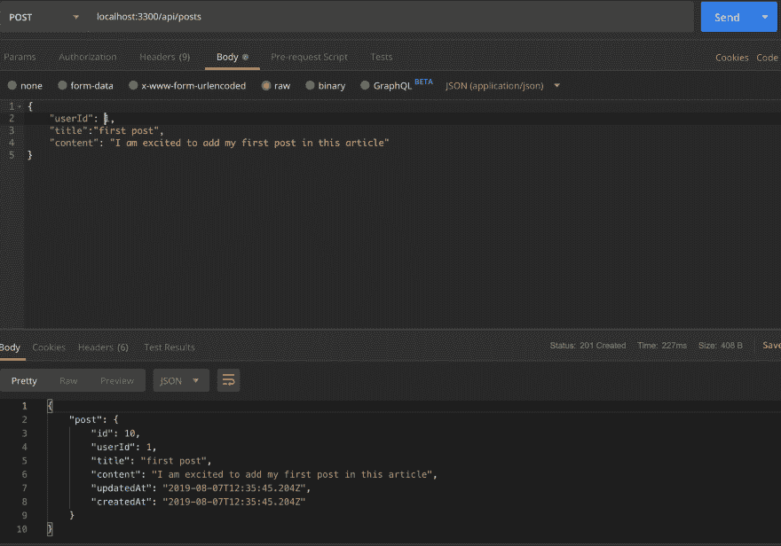
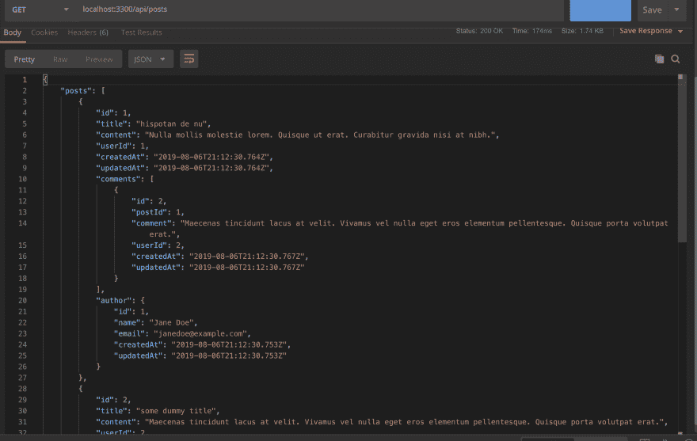

# 用序列执行 CRUD

> 原文：<https://dev.to/nedsoft/performing-crud-with-sequelize-29cf>

在本文第一部分的[中，我们介绍了设置序列、创建迁移/模型和播种数据库。在这一部分，我们将在第一部分执行 CRUD 构建。](https://www.oriechinedu.com/posts/getting-started-with-sequelize-and-postgres)

如果你想继续，你可以从[第一部分](https://www.oriechinedu.com/posts/getting-started-with-sequelize-and-postgres)开始，如果你还没有这样做，但是如果你已经熟悉了第一步，你可以自由地跳到这一部分。

> 你可以在这里克隆这篇文章[的完整代码](https://github.com/oriechinedu/sequelize-with-postgres-tutorial.git)

### 安装依赖项

```
 npm i express 
```

<svg width="20px" height="20px" viewBox="0 0 24 24" class="highlight-action crayons-icon highlight-action--fullscreen-on"><title>Enter fullscreen mode</title></svg> <svg width="20px" height="20px" viewBox="0 0 24 24" class="highlight-action crayons-icon highlight-action--fullscreen-off"><title>Exit fullscreen mode</title></svg>

我们需要安装 nodemon，它会在每次有变化时重启服务器，从而减轻手动重启服务器的压力。

```
 npm i -D nodemon 
```

<svg width="20px" height="20px" viewBox="0 0 24 24" class="highlight-action crayons-icon highlight-action--fullscreen-on"><title>Enter fullscreen mode</title></svg> <svg width="20px" height="20px" viewBox="0 0 24 24" class="highlight-action crayons-icon highlight-action--fullscreen-off"><title>Exit fullscreen mode</title></svg>

注意`-D`标志，它表示一个包只在开发环境中需要。

### 快递服务器设置

为了设置服务器，我们需要创建两个目录- `server`和`routes` :

```
mkdir server routes 
```

<svg width="20px" height="20px" viewBox="0 0 24 24" class="highlight-action crayons-icon highlight-action--fullscreen-on"><title>Enter fullscreen mode</title></svg> <svg width="20px" height="20px" viewBox="0 0 24 24" class="highlight-action crayons-icon highlight-action--fullscreen-off"><title>Exit fullscreen mode</title></svg>

在`server`和`routes`目录下各创建一个 index.js 文件:

```
touch server/index.js routes/index.js 
```

<svg width="20px" height="20px" viewBox="0 0 24 24" class="highlight-action crayons-icon highlight-action--fullscreen-on"><title>Enter fullscreen mode</title></svg> <svg width="20px" height="20px" viewBox="0 0 24 24" class="highlight-action crayons-icon highlight-action--fullscreen-off"><title>Exit fullscreen mode</title></svg>

将下面的代码添加到`routes/index.js`

```
 const { Router } = require('express');

const router = Router();

router.get('/', (req, res) => res.send('Welcome'))

module.exports = router; 
```

<svg width="20px" height="20px" viewBox="0 0 24 24" class="highlight-action crayons-icon highlight-action--fullscreen-on"><title>Enter fullscreen mode</title></svg> <svg width="20px" height="20px" viewBox="0 0 24 24" class="highlight-action crayons-icon highlight-action--fullscreen-off"><title>Exit fullscreen mode</title></svg>

将下面的代码添加到`server/index.js`

```
const express = require('express');
const routes = require('../routes');

const server = express();
server.use(express.json());

server.use('/api', routes);

module.exports = server; 
```

<svg width="20px" height="20px" viewBox="0 0 24 24" class="highlight-action crayons-icon highlight-action--fullscreen-on"><title>Enter fullscreen mode</title></svg> <svg width="20px" height="20px" viewBox="0 0 24 24" class="highlight-action crayons-icon highlight-action--fullscreen-off"><title>Exit fullscreen mode</title></svg>

接下来，我们在项目的根目录下创建应用入口点:

```
touch index.js 
```

<svg width="20px" height="20px" viewBox="0 0 24 24" class="highlight-action crayons-icon highlight-action--fullscreen-on"><title>Enter fullscreen mode</title></svg> <svg width="20px" height="20px" viewBox="0 0 24 24" class="highlight-action crayons-icon highlight-action--fullscreen-off"><title>Exit fullscreen mode</title></svg>

将下面的代码添加到`index.js`

```
require('dotenv').config();

const server = require('./server');

const PORT = process.env.PORT || 3300;

server.listen(PORT, () => console.log(`Server is live at localhost:${PORT}`)); 
```

<svg width="20px" height="20px" viewBox="0 0 24 24" class="highlight-action crayons-icon highlight-action--fullscreen-on"><title>Enter fullscreen mode</title></svg> <svg width="20px" height="20px" viewBox="0 0 24 24" class="highlight-action crayons-icon highlight-action--fullscreen-off"><title>Exit fullscreen mode</title></svg>

最后，我们将启动脚本添加到`package.json`

将下面的代码添加到`package.json`

```
 "scripts":  {  "start-dev":  "nodemon index.js"  }, 
```

<svg width="20px" height="20px" viewBox="0 0 24 24" class="highlight-action crayons-icon highlight-action--fullscreen-on"><title>Enter fullscreen mode</title></svg> <svg width="20px" height="20px" viewBox="0 0 24 24" class="highlight-action crayons-icon highlight-action--fullscreen-off"><title>Exit fullscreen mode</title></svg>

要启动服务器，请运行

```
npm start-dev 
```

<svg width="20px" height="20px" viewBox="0 0 24 24" class="highlight-action crayons-icon highlight-action--fullscreen-on"><title>Enter fullscreen mode</title></svg> <svg width="20px" height="20px" viewBox="0 0 24 24" class="highlight-action crayons-icon highlight-action--fullscreen-off"><title>Exit fullscreen mode</title></svg>

现在在 POSTMAN 上访问`localhost:3300/api`将返回`"Welcome"`,这表明服务器已经启动并正在运行。

### 创建新帖子【C IN CRUD】

首先，让我们创建一个新文件`controllers/index.js`，它将存放 CRUD 逻辑。

```
mkdir controllers && touch controllers/index.js 
```

<svg width="20px" height="20px" viewBox="0 0 24 24" class="highlight-action crayons-icon highlight-action--fullscreen-on"><title>Enter fullscreen mode</title></svg> <svg width="20px" height="20px" viewBox="0 0 24 24" class="highlight-action crayons-icon highlight-action--fullscreen-off"><title>Exit fullscreen mode</title></svg>

将下面的代码添加到`controllers/index.js`

```
const models = require('../database/models');

const createPost = async (req, res) => {
  try {
    const post = await models.Post.create(req.body);
    return res.status(201).json({
      post,
    });
  } catch (error) {
    return res.status(500).json({error: error.message})
  }
}

module.exports = {
  createPost,
} 
```

<svg width="20px" height="20px" viewBox="0 0 24 24" class="highlight-action crayons-icon highlight-action--fullscreen-on"><title>Enter fullscreen mode</title></svg> <svg width="20px" height="20px" viewBox="0 0 24 24" class="highlight-action crayons-icon highlight-action--fullscreen-off"><title>Exit fullscreen mode</title></svg>

接下来，我们需要创建创建新帖子的路径。编辑`routes/index.js`如下:

```
const { Router } = require('express');
const controllers = require('../controllers');

const router = Router();

router.get('/', (req, res) => res.send('Welcome'))

router.post('/posts', controllers.createPost);

module.exports = router; 
```

<svg width="20px" height="20px" viewBox="0 0 24 24" class="highlight-action crayons-icon highlight-action--fullscreen-on"><title>Enter fullscreen mode</title></svg> <svg width="20px" height="20px" viewBox="0 0 24 24" class="highlight-action crayons-icon highlight-action--fullscreen-off"><title>Exit fullscreen mode</title></svg>

现在，当您访问 Postman 上的创建帖子端点`[POST] localhost:330/api/posts`并为请求正文填写适当的值时，将会创建一个新帖子，如下图所示:

[](https://res.cloudinary.com/practicaldev/image/fetch/s--FEIEETJV--/c_limit%2Cf_auto%2Cfl_progressive%2Cq_auto%2Cw_880/https://thepracticaldev.s3.amazonaws.com/i/4mud24wrysmj5dotj5ak.png)

### 获取帖子列表[R in CRUD]

我们将创建另一个端点来检索文章列表。这里我们将应用 Sequelize 提供的 ORM 的`eager loading`特性。急切加载意味着在被查询的模型旁边检索相关的模型。在 Sequelize 中，使用`include`属性实现了快速加载，如下面的代码片段所示。

将以下代码添加到`controllers/index.js`。

```
const getAllPosts = async (req, res) => {
  try {
    const posts = await models.Post.findAll({
      include: [
        {
          model: models.Comment,
          as: 'comments'
        },
        {
          model: models.User,
          as: 'author'
        }
      ]
    });
    return res.status(200).json({ posts });
  } catch (error) {
    return res.status(500).send(error.message);
  }
} 
```

<svg width="20px" height="20px" viewBox="0 0 24 24" class="highlight-action crayons-icon highlight-action--fullscreen-on"><title>Enter fullscreen mode</title></svg> <svg width="20px" height="20px" viewBox="0 0 24 24" class="highlight-action crayons-icon highlight-action--fullscreen-off"><title>Exit fullscreen mode</title></svg>

通过将`getAllPosts`添加到`module.exports`对象来导出它。

```
module.exports = {
  createPost,
  getAllPosts
} 
```

<svg width="20px" height="20px" viewBox="0 0 24 24" class="highlight-action crayons-icon highlight-action--fullscreen-on"><title>Enter fullscreen mode</title></svg> <svg width="20px" height="20px" viewBox="0 0 24 24" class="highlight-action crayons-icon highlight-action--fullscreen-off"><title>Exit fullscreen mode</title></svg>

接下来，通过向`routes/index.js` :
添加以下代码来定义端点

```
router.get('/posts', controllers.getAllPosts); 
```

<svg width="20px" height="20px" viewBox="0 0 24 24" class="highlight-action crayons-icon highlight-action--fullscreen-on"><title>Enter fullscreen mode</title></svg> <svg width="20px" height="20px" viewBox="0 0 24 24" class="highlight-action crayons-icon highlight-action--fullscreen-off"><title>Exit fullscreen mode</title></svg>

现在，当您访问 Postman 上的 Get All Post 端点`[GET] localhost:330/api/posts`时，响应如下所示。

[](https://res.cloudinary.com/practicaldev/image/fetch/s--dl_nE82e--/c_limit%2Cf_auto%2Cfl_progressive%2Cq_auto%2Cw_880/https://thepracticaldev.s3.amazonaws.com/i/ng3d64furgs2l3zjodxu.png)

### 获得单个帖子[R in CRUD]

Sequelize 提供了一个方法`findOne`,用于根据模型的给定属性检索单个记录。

将下面的代码添加到`controllers/index.js`

```
const getPostById = async (req, res) => {
  try {
    const { postId } = req.params;
    const post = await models.Post.findOne({
      where: { id: postId },
      include: [
        {
          model: models.Comment,
          as: 'comments',
          include: [
           {
            model: models.User,
            as: 'author',
           }
          ]
        },
        {
          model: models.User,
          as: 'author'
        }
      ]
    });
    if (post) {
      return res.status(200).json({ post });
    }
    return res.status(404).send('Post with the specified ID does not exists');
  } catch (error) {
    return res.status(500).send(error.message);
  }
} 
```

<svg width="20px" height="20px" viewBox="0 0 24 24" class="highlight-action crayons-icon highlight-action--fullscreen-on"><title>Enter fullscreen mode</title></svg> <svg width="20px" height="20px" viewBox="0 0 24 24" class="highlight-action crayons-icon highlight-action--fullscreen-off"><title>Exit fullscreen mode</title></svg>

接下来，我们通过向`routes/index.js`
添加以下代码来创建端点

```
router.get('/posts/:postId', controllers.getPostById); 
```

<svg width="20px" height="20px" viewBox="0 0 24 24" class="highlight-action crayons-icon highlight-action--fullscreen-on"><title>Enter fullscreen mode</title></svg> <svg width="20px" height="20px" viewBox="0 0 24 24" class="highlight-action crayons-icon highlight-action--fullscreen-off"><title>Exit fullscreen mode</title></svg>

现在你在 Postman 上访问`[GET] localhost:330/api/posts/1`，得到的回应如下图。

[](https://res.cloudinary.com/practicaldev/image/fetch/s--z0p2wtUt--/c_limit%2Cf_auto%2Cfl_progressive%2Cq_auto%2Cw_880/https://thepracticaldev.s3.amazonaws.com/i/v9q735jz4mlkw3pyh46j.png) 
查看响应，我们使用嵌套的急切加载来获取一个帖子的作者的评论。

### 更新帖子【U in CRUD】

Sequelize 中的`update`方法更新作为参数传递给它的对象中指定的给定模型的字段。这减少了手动检查传递给`update`方法的对象并相应地更新模型字段的压力。

将下面的代码添加到`controllers/index.js`

```
const updatePost = async (req, res) => {
  try {
    const { postId } = req.params;
    const [ updated ] = await models.Post.update(req.body, {
      where: { id: postId }
    });
    if (updated) {
      const updatedPost = await models.Post.findOne({ where: { id: postId } });
      return res.status(200).json({ post: updatedPost });
    }
    throw new Error('Post not found');
  } catch (error) {
    return res.status(500).send(error.message);
  }
}; 
```

<svg width="20px" height="20px" viewBox="0 0 24 24" class="highlight-action crayons-icon highlight-action--fullscreen-on"><title>Enter fullscreen mode</title></svg> <svg width="20px" height="20px" viewBox="0 0 24 24" class="highlight-action crayons-icon highlight-action--fullscreen-off"><title>Exit fullscreen mode</title></svg>

然后，我们通过向`routes/index.js`
添加以下代码来创建端点

```
router.put('/posts/:postId', controllers.updatePost); 
```

<svg width="20px" height="20px" viewBox="0 0 24 24" class="highlight-action crayons-icon highlight-action--fullscreen-on"><title>Enter fullscreen mode</title></svg> <svg width="20px" height="20px" viewBox="0 0 24 24" class="highlight-action crayons-icon highlight-action--fullscreen-off"><title>Exit fullscreen mode</title></svg>

### 删除帖子【D in CRUD】

Sequelize 提供了一个删除模型记录的方法`destroy`。

将下面的代码添加到`controllers/index.js`

```
const deletePost = async (req, res) => {
  try {
    const { postId } = req.params;
    const deleted = await models.Post.destroy({
      where: { id: postId }
    });
    if (deleted) {
      return res.status(204).send("Post deleted");
    }
    throw new Error("Post not found");
  } catch (error) {
    return res.status(500).send(error.message);
  }
}; 
```

<svg width="20px" height="20px" viewBox="0 0 24 24" class="highlight-action crayons-icon highlight-action--fullscreen-on"><title>Enter fullscreen mode</title></svg> <svg width="20px" height="20px" viewBox="0 0 24 24" class="highlight-action crayons-icon highlight-action--fullscreen-off"><title>Exit fullscreen mode</title></svg>

然后用`DELETE`更新`routes/index.js`，如下所示:

```
router.delete('/posts/:postId', controllers.deletePost); 
```

<svg width="20px" height="20px" viewBox="0 0 24 24" class="highlight-action crayons-icon highlight-action--fullscreen-on"><title>Enter fullscreen mode</title></svg> <svg width="20px" height="20px" viewBox="0 0 24 24" class="highlight-action crayons-icon highlight-action--fullscreen-off"><title>Exit fullscreen mode</title></svg>

### 结论

我们已经能够使用 Sequelize 实现 CRUD。然而，为了保持简单，我们跳过了一些部分，比如表单输入验证、错误处理、关注点的适当分离。因此，您可以决定更进一步，做出那些改进。

如果你有任何问题或对这篇文章的改进有任何贡献，请随时通过你认为方便的任何方式联系我。

#### 建议的资源

*   [快递验证器](https://express-validator.github.io/docs/)
*   [对文件进行排序](https://sequelize.org/)
*   [如何编写生产就绪节点和 Express app](https://www.freecodecamp.org/news/how-to-write-a-production-ready-node-and-express-app-f214f0b17d8c/)