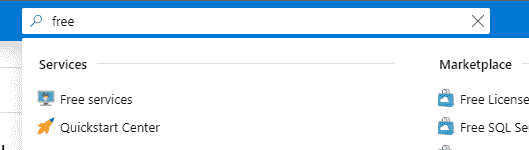
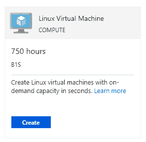
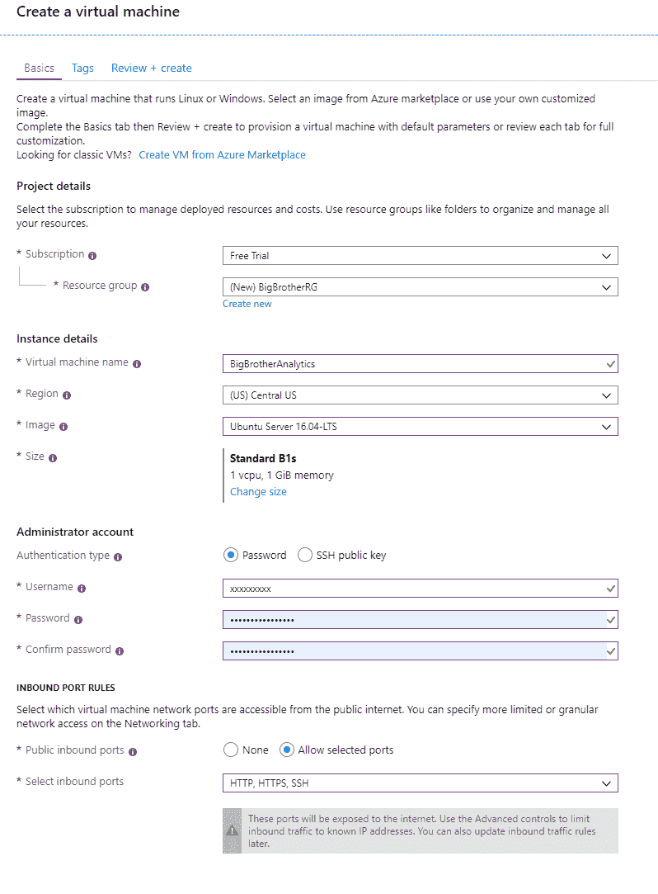
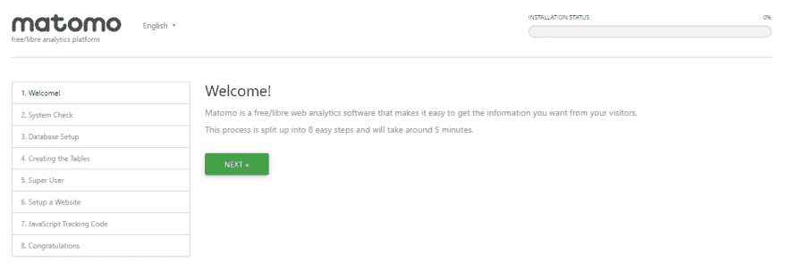
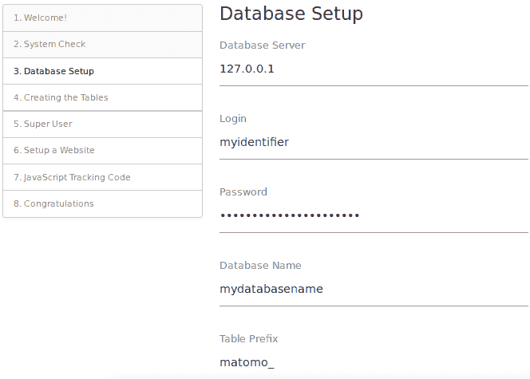

# 使用 Matomo 和 Azure 进行自托管 web 分析

> 原文：<https://dev.to/colinrubbert/self-hosted-web-analytics-with-matomo-and-azure-4m3f>

# Matomo + Azure =📈

# 什么是马托莫？

[Matomo](https://matomo.org) 是一个一体化的优质网络分析平台，拥有 100%的数据所有权。简单地说，你拥有你的数据，而不是其他人。这意味着没有通过谷歌分析，脸书分析或任何其他第三方网站分析软件滥用隐私。

隐私一直是我越来越关心的问题，我开始一点一点地收回一些控制权，并保护我的最终用户免受类似的滥用。成为你想看到的改变，俗话说。

# 你需要什么

就像以前的文章一样，我是 Azure 用户。Azure 很棒，使用起来很友好，简单，划算，而且很好。这就是我们要用的。

下面列出了我们所需的安装和配置。

*   Azure 上的一个帐户
*   访问 SSH 以配置基于 Linux 的虚拟机(WSL、Linux、macOS 等)

# 入门

## 先决条件

### 创建虚拟机

使用 Azure 的免费帐户和点数，我们将利用其他一些免费市场 Azure 服务。

登录您新创建或现有的 Azure 帐户，搜索`Free services`

[](https://res.cloudinary.com/practicaldev/image/fetch/s--YgEcn_hH--/c_limit%2Cf_auto%2Cfl_progressive%2Cq_auto%2Cw_880/https://d1qmdf3vop2l07.cloudfront.net/touted-salmon.cloudvent.net/compressed/_min_/1501522ef66d789d4aa8ea093bdd18a7.png)

选择`Free services`，你会看到一个免费服务列表。我们将选择 **Linux 虚拟机**，这将为我们提供 750 小时的免费 B1，这将为我们提供一些稳定、廉价的使用时间。即使在 750 小时的免费积分后，它仍然只需要大约 8 美元/月。相对来说，很便宜。

[](https://res.cloudinary.com/practicaldev/image/fetch/s--19ObEusw--/c_limit%2Cf_auto%2Cfl_progressive%2Cq_auto%2Cw_880/https://d1qmdf3vop2l07.cloudfront.net/touted-salmon.cloudvent.net/compressed/_min_/f968c50c998a96788181f4f8a3733fcc.png)

我们需要配置我们的虚拟机，就像这样。明显填写自己的唯一信息。如果你计划从多台计算机访问你的虚拟机，你选择了`Password`而不是`SSH public key`，这就不那么麻烦了。

[](https://res.cloudinary.com/practicaldev/image/fetch/s--PJ9X6swP--/c_limit%2Cf_auto%2Cfl_progressive%2Cq_auto%2Cw_880/https://d1qmdf3vop2l07.cloudfront.net/touted-salmon.cloudvent.net/compressed/_min_/fb54f52f88e3bcec7e36ce44053deb0c.png)

如果一切都配置正确，我们应该已经通过验证，如果你不修复你的错误，再试一次。然后点击`Create`开始创建您的虚拟机。

导航到您的虚拟机并检查`Public IP Address`是什么，然后我们将使用它 ssh 到我们的虚拟机。

### 配置虚拟机

SSH 进入您的虚拟机，方法是键入`ssh [username]@[public IP address]`，用您在创建虚拟机时指定的用户名替换`[username]`，然后用您虚拟机的公共 IP 地址替换`[public IP address]`。

登录后，通过运行以下命令来更新虚拟机。

```
sudo apt install php7.3 php7.3-cli php7.3-fpm php7.3-curl php7.3-gd mysql-server php7.3-mysql php-xml php7.3-mbstring unzip -y
sudo apt update
sudo apt upgrade -y 
```

现在我们已经更新到了虚拟机软件的最新版本，我们可以继续安装了。

### 创建数据库

在运行 Matomo 之前，我们需要为 Matomo 创建一个数据库。让我们以 root 用户的身份登录 MySQL。

```
mysql -u root -p 
```

创建数据库。

```
CREATE DATABASE matomo; 
```

为新数据库创建新用户。

```
CREATE USER `billybob@example.com` IDENTIFIED BY 'your_secret_password'; 
```

授予新用户对数据库的相关权限。

```
GRANT ALL ON matomo.* TO `billybob@example.com`; 
```

刷新权限并退出 MySQL 控制台。

```
FLUSH PRIVILEGES;
exit 
```

## 安装 Matomo

### 为 Matomo 安装 Nginx 并配置 Nginx

Matomo 将需要某种网络服务器软件，这样我们就可以按计划运行 Matomo。出于本教程的目的，我们将安装 Nginx。

```
sudo apt install -y nginx 
```

现在我们已经安装了 Nginx，我们需要为我们的 Matomo 实例配置 Nginx。首先，我们需要创建文件。

```
sudo nano /etc/nginx/sites-available/matomo.conf 
```

现在我们需要用我们的服务器配置填充文件。显然，用您特定的服务器名称来更改`server_name`。

```
server {

  listen [::]:443 ssl http2;
  listen 443 ssl http2;
  listen [::]:80;
  listen 80;

  server_name stats.fivethirtyfour.com;
  root /var/www/matomo/;
  index index.php;

  location ~ ^/(index|matomo|piwik|js/index).php {
    include snippets/fastcgi-php.conf;
    fastcgi_param HTTP_PROXY ""; 
    fastcgi_pass unix:/var/run/php/php7.3-fpm.sock; 
  }

  location = /plugins/HeatmapSessionRecording/configs.php {
    include snippets/fastcgi-php.conf;
    fastcgi_param HTTP_PROXY "";
    fastcgi_pass unix:/var/run/php/php7.3-fpm.sock;
  }

  location ~* ^.+\.php$ {
    deny all;
    return 403;
  }

  location / {
    try_files $uri $uri/ =404;
  }

  location ~ /(config|tmp|core|lang) {
    deny all;
    return 403;
  }

  location ~ \.(gif|ico|jpg|png|svg|js|css|htm|html|mp3|mp4|wav|ogg|avi|ttf|eot|woff|woff2|json)$ {
    allow all;
  }

  location ~ /(libs|vendor|plugins|misc/user) {
    deny all;
    return 403;
  }

} 
```

现在我们需要通过将文件链接到`sites-enabled`目录来激活新的 matomo.conf 配置。

```
sudo ln -s /etc/nginx/sites-available/matomo.conf /etc/nginx/sites-enabled 
```

测试 Nginx 配置的语法错误。

```
sudo nginx -t 
```

重新加载 Nginx 服务

```
sudo systemctl reload nginx.service 
```

### 下载&提取马托莫

在我们下载和安装 Matomo 之前，我们需要创建并移动到我们的 web 服务器的目录中。

```
sudo mkdir -p /var/wwww/ && cd /var/www/ 
```

现在我们需要先下载 Matomo，然后才能安装。从我们的控制台运行以下命令。第一部分是下载文件，第二部分是解压我们刚刚下载的文件，第三部分是清理。我们下载的 zip 文件。

```
wget https://builds.matomo.org/matomo.zip && unzip matomo.zip && rm matomo.zip 
```

最后，让我们将`/var/www/matomo`目录的所有权更改为`www-data user`

```
sudo chown -R www-data:www-data /var/www/matomo 
```

### 为 ssl 安装加密证书

通过 SSL 运行我们的服务和网站非常重要。它不仅给了我们隐私，也给了我们的用户信心和隐私。

首先，我们需要安装运行 LetsEncrypt 所需的存储库

```
sudo add-apt-repository ppa:certbot/certbot
sudo apt update
sudo apt upgrade -y
sudo apt install certbot python-certbot-nginx -y 
```

现在软件已经安装好了，我们需要使用 Nginx certbot 插件创建我们的证书。显然，改变你的网站将是什么领域。

```
sudo certbot --nginx -d stats.fivethirtyfour.com 
```

现在，如果我们查看我们的`/etc/nginx/sites-available/matomo.conf`文件，我们应该看到 certbot 已经为我们添加了 SSL 配置。

```
######################################
## SNIPPET OF THE MATOMO.CONF FILE  ##
######################################

ssl_certificate /etc/letsencrypt/live/stats.fivethirtyfour.com/fullchain.pem; # managed by Certbot
    ssl_certificate_key /etc/letsencrypt/live/stats.fivethirtyfour.com/privkey.pem; # managed by Certbot
}

server {
    if ($host = stats.fivethirtyfour.com) {
        return 301 https://$host$request_uri;
    } # managed by Certbot

  listen [::]:80;
  listen 80;
  server_name stats.fivethirtyfour.com;
    return 404; # managed by Certbot
} 
```

现在转到您部署站点的网站，您应该会看到 Matomo 安装页面。

[](https://res.cloudinary.com/practicaldev/image/fetch/s--2-tB2WTj--/c_limit%2Cf_auto%2Cfl_progressive%2Cq_auto%2Cw_880/https://d1qmdf3vop2l07.cloudfront.net/touted-salmon.cloudvent.net/compressed/_min_/4be9e8f3abe8716ef0dcc23732ee6ac2.png)

### 完成 Matomo 分析设置

现在，完成 Matomo 安装过程，一旦到达`Database Setup`部分，请确保将您在本指南前面的`Creating a database`部分创建的信息归档。

[](https://res.cloudinary.com/practicaldev/image/fetch/s--jA6gOBHx--/c_limit%2Cf_auto%2Cfl_progressive%2Cq_auto%2Cw_880/https://d1qmdf3vop2l07.cloudfront.net/touted-salmon.cloudvent.net/compressed/_min_/c1dc56749d140dc810ba1f80a7b14b6a.png)

继续浏览配置，一旦到达`Tracking code`部分，确保复制了跟踪代码片段。这是您将用来添加到您的网站，以收集分析信息。

## 恭喜您，Matomo Analytics 现已在 Azure 云实例中运行！！！

[](https://i.giphy.com/media/YnSTMd4T9BISZcHcAL/giphy.gif)

*最初发布于[https://fivethirtyfour.com](https://fivethirtyfour.com)*
[Matomo Web Analytics 和 Azure](https://fivethirtyfour.com/matomo-web-analytics-and-azure)