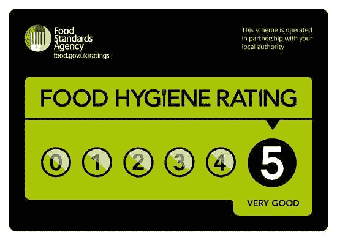

# 一个描述软件开发的类比

> 原文：<https://dev.to/defmyfunc/using-metaphor-to-describe-software-development-2462>

在我最近的 twitter feed 中，我注意到了大量描述软件开发的类比、隐喻和明喻(例如[https://twitter.com/jessitron/status/1165787547764551680](https://twitter.com/jessitron/status/1165787547764551680)),所以我想分享一下我在过去几年中一直使用的类比。我所看到的大多数类比都集中在考虑构建“传统工厂制造的产品”和软件交付中“持续产品开发”的概念之间的明显差异，在软件交付中，您不断地发现和调整“产品”以适应用户需求。

我最常用来比喻软件开发的是“经营一家餐馆”。

## 为什么？

根据这 5 秒谷歌搜索什么做一个很好的类比:

*   “一个很好的类比是两个冲突目标之间的妥协:熟悉度和代表性”——[https://www.scotthyoung.com/blog/2014/10/21/good-analogies/](https://www.scotthyoung.com/blog/2014/10/21/good-analogies/)

我还要补充一点:

*   "一个好的类比会很快让这个人发现真相."- @defmyfunc。一个我尊敬的人曾经告诉我，“有时我们不得不停止使用类比，只解释软件开发。”

这就是为什么我认为餐馆是一个很好的类比。

## 熟悉度

首先，我希望是简单的，熟悉的，大部分人:

*   了解准备食物的工作
*   会在某个时候让别人为他们准备好食物
*   会花钱请人为他们准备食物
*   看过某种形式的餐馆烹饪节目(即使只是在戈登·拉姆齐再次发誓之前关掉它)

作为在英国的奖励，我们有这些可爱的贴纸:

在每一个准备食物的地方，这意味着几乎每个人都知道有食品标准的立法和合规制度(即使他们不知道细节)。

## 代表性

现在我要用故事来证明，让你来决定。我经常从最初的类比开始，我用它来解释其他一切赖以存在的关键框架项目:

### 泛指比喻

把你的软件“产品”想象成一家餐馆，当人们使用你的产品时，那就是他们在你的餐馆享用美味可口的一餐。我们向他们收费，他们付钱给我们，如果我们想让他们回来，我们需要想办法向他们展示我们的价值，让他们成为忠诚的顾客。但在幕后，为了让我们的顾客能继续吃到美味可口的饭菜，并继续为它们买单，我们每天都需要做一大堆事情，比如清洁餐厅及其设备，清洁桌子，清洁盘子、餐具和锅碗瓢盆，问“你的饭菜怎么样？”。我们经常需要做一些事情，比如健康和安全认证，或者为我们的顾客创造新的令人兴奋的菜单。

### 技术债务

我们必须不断解决技术债务，就像一家餐馆必须清洗盘子和桌子才能继续提供服务一样。如果我们在最后做所有的清洁工作，而不是像服务一样，那么我们需要花更长的时间来准备下一次服务。如果我们根本不清洗，那么在某个时候服务就会停止，因为我们会用完干净的盘子。

### 可操作性

当顾客打翻饮料时，我们会试图清理，这通常会导致所有服务停止，现在，虽然这会干扰我们正在做的事情，但我们越来越擅长清理，并学习如何尽可能防止饮料溢出。

### 新功能和发布节奏

添加功能就像更改菜单一样。我们可以逐步不断地改变我们的菜单，或者每 6 个月从头开始重新做一次。

### 坚持计划 vs 有策略

目前，我们对所有菜肴进行了详细说明，并对菜单进行了层压，这使得它们的更改成本很高，这意味着我们的客户每 6 个月才会回来找我们，有时如果我们买不到食材，我们就不得不从菜单上删除一些东西。我们的员工很难跟踪这一点，最终也会让客户失望。如果我们 ***现在需要*** 来层压菜单，那么如果我把“今日鱼”而不是“新土豆鳕鱼”放在菜单上会怎么样，这样我可以适应现有的配料。当然...不用把菜单叠起来就好了...但是一步一步来...:)

### 建立/购买决策

目前，我们是一家小型的、定制的、精致的本地餐厅，我们可以在一周前决定菜单，使用当天新鲜的鱼。然而，这是昂贵的运行，我们的价格很高，但我们的客户喜欢我们，并不断回来...如果你愿意，我们可以变得更像麦当劳...我们可以变得非常擅长一遍又一遍地生产同样的东西...我们需要一份没有太多变化的“套餐”,但我们可以批量购买，这样可以节省很多钱，因为我们可能会让技能较低的人来经营餐厅。人们喜欢麦当劳，但他们对麦当劳的喜爱与我们不同。代价是，如果你要求我们大幅度改变菜单，可能会花很多钱，因为我们购买的专业设备可能不允许我们烹饪新菜单。当然，我们可以做一个新的汉堡，但是如果你想让我们做美食，我们没有机会。你想让我们成为收割机吗？菜单有些变化，也许每 3-6 个月我们会重新考虑一下菜单是否适合我们的客户群？

### 立法要求

理解数据安全就像理解食品卫生要求一样。你会去卫生等级为 1 的地方吃饭吗？如果便宜的话，你会的...:S...当然可以。无论如何，有些事情我们必须做，以满足法律合规性，没有商量的余地，但我们如何做，如果我们将这种行为集中起来，而不培训所有的*员工了解影响，我们可能会得到一个评级，这将严重影响顾客对餐厅的信任。*

 *### 还有许多许多更多...

我最喜欢的一个过去的时代是延伸一个类比，所以请随时测试这个，让我知道你如何使用它:)*