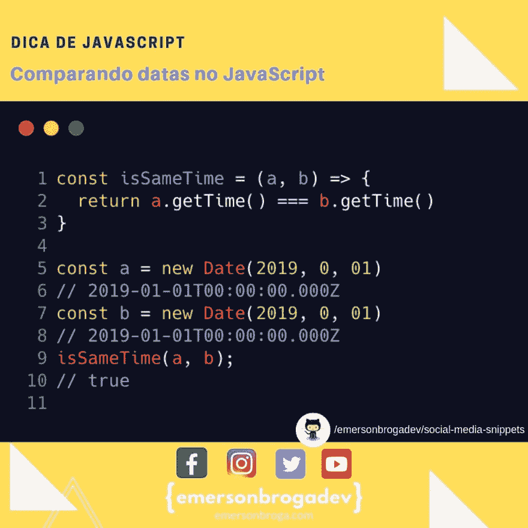

# 比较 JavaScript 中的日期

> [https://dev . to/emersonbroga/比较-非 javascript 日期-5b38](https://dev.to/emersonbroga/comparando-datas-no-javascript-5b38)

比较日期时，请使用 data 对象的时间戳并比较时间戳。

备注:在此范例中，维修月份为 0。

Obs2:请注意，timezone 可能会随您所在的 time zone 而变化。

# javascript #nodejs #react

[参加我们的开发者名单](https://emersonbroga.com/e/participe/)
[【学习 es 6】](https://amzn.to/2J4XnLg)[【查看 Instagram 上的提示](https://www.instagram.com/emersonbrogadev/)

=)