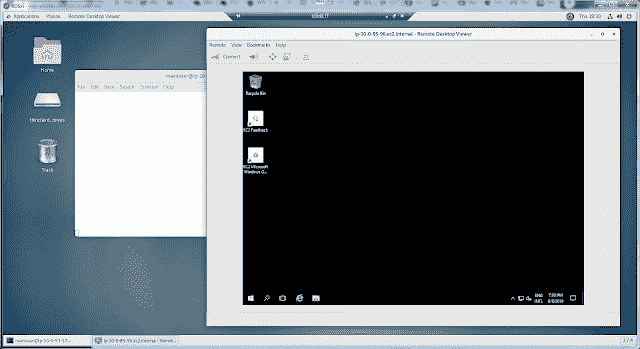

# 所以你想通过 RDP 访问一个被拦截的 EL7 主机

> 原文：<https://dev.to/ferricoxide/so-you-want-to-access-a-fipsed-el7-host-via-rdp-52ef>

现代企业安全环境的一大乐事是，企业经常会将内部网络锁定到非常高的程度。而且，随着软件和操作系统供应商提供新的拧紧螺栓，组织将倾向于这样做——他们有时这样做时没有考虑拧紧螺栓将产生的全部影响。

我的一些客户不仅使用入站防火墙保护他们的网络，还使用严格限制出站连接的防火墙。基本上，他们用户的桌面系统只能访问通过 HTTP/S 提供的外部服务。

同样，他们用户的桌面系统也配置了启用的应用程序白名单。这不仅可以防止超级用户安装需要特权访问才能安装的软件，还可以防止用户安装完全受限于其主目录的软件。这种安全姿态适合绝大多数桌面用户，但对开发人员来说就不那么适合了。更糟糕的是，将东西添加到白名单中接近“不可抗力”级别的请求。

我所在的团队提供云支持服务。这意味着我们既是开发者，又为客户的开发者提供服务。对于我们自己的需求(在现场时)和客户开发人员的需求，这意味着需要拥有远程(云托管)、“开发人员”桌面。我们和我们的客户使用的云服务提供商(CSP)提供远程桌面解决方案(例如 AWS 的“工作区”)。然而，由于前面提到的网络和桌面锁定，这些服务通常不能在我们的客户站点使用:即使本地桌面安装了像 RDP 和 SSH 客户端这样的工具，这些工具也只能在企业的内部网络中使用；如果远程桌面产品可以通过 HTTP/S 访问，通常是通过一个小部件，如果应用程序白名单不阻止的话，潜在的远程桌面用户会将它安装到他们的本地工作站上。

为了解决这个问题或者同时满足我们自己的需求(在现场时)和我们客户的开发人员的需求，我们建立了一套远程(云托管)、基于 Windows 的桌面。为了使它们可以在锁定的网络中使用，我们使用了 Apache 的鳄梨色拉酱服务。鳄梨色拉酱使远程 Windows 和 Linux 桌面在用户的网络浏览器中可用。

几年来，鳄梨色拉酱 Windows 桌面被证明是一个不错的解决方案。不幸的是，随着云战争的升温，通信服务提供商试图寻找方法将客户带入或强迫客户进入他们的数据中心，曾经不错的解决方案可能会变得*不*好——通常是由于价格因素。可悲的是，当云托管的 Windows 服务在其他 T2 电信运营商的数据中心运行时，微软似乎试图通过提高这些服务的价格来推动 Azure 的采用。

当我们等待这是否会发生以及如何发生时，我们选择了看看“我们能否找到基于 Windows 的(远程)开发人员桌面的更低成本替代方案。”我们和我们客户的大多数开发人员都是面向 Linux 的——或者至少是 Linux——很容易理解:使用 Linux 我们可以做什么。我们的鳄梨色拉酱服务已经使用基于 Linux 的容器来为 RDP 提供 HTTP/S 封装，鳄梨色拉酱本身通过 VNC 支持基于 Linux 的图形桌面的前端。也就是说，鉴于基础设施是围绕 RDP 构建的，即使解决方案堆栈中没有 Windows，也可以通过将通信保持在 RDP 来简化一些重组过程。

因为我们的安全指南之前要求我们使用“加固的”Red Hat 和基于 CentOS 的服务器来托管 Linux 应用程序，所以这是我们这个过程的起点。这种强化几乎总是给解决方案的部署带来“麻烦”——通常是因为软件不支持 SELinux 或者依赖于在 FIPS 模式下被禁用的内核位。这一次，问题出在 FIPS 模式上。

虽然在 Linux 上安装和使用 RDP 已经变得比以前容易多了(像 T2 XRDP T3 这样的工具现在实际上与 SELinux 策略模块一起发布了！)，但并不是所有的问题都解决了。当开始调查时，我发现 Enterprise Linux 7 的 XRDP 安装程序不是为在 FIPS 模式下工作而设计的。具体来说，当安装程序设置其加密密钥时，它会尝试使用基于 MD5 的方法。当在 Linux 内核上启用 FIPS 模式时，MD5 被禁用。

幸运的是，这只影响传统的 RDP 连接。RDP 目前首选的解决方案利用了 TLS。TLS 及其首选的密码和算法都与 FIPS 兼容。此外，即使安装程序未能设置加密密钥，这些密钥实际上是可选的:位于密钥预期位置的文件只需要*存在*，而不需要实际上是有效的密钥。这意味着安装程序中的问题可以通过在安装过程中添加一个`touch /etc/xrdp/rsakeys.ini`来解决。获得云托管、基于 Linux 的图形桌面最终成为一个问题:

1.  建立云托管的 Red Hat 或 CentOS 7 系统
2.  确保安装了“GNOME 桌面”和“图形管理工具”软件包组(因为，如果您的 EL7 起点和我们的一样，基本系统映像中将没有 GUI)
3.  一旦安装了这些，确保系统的默认运行状态已经设置为“graphical.target”。“GNOME Desktop”软件包组的安装程序应该已经为您解决了这个问题。用`systemctl get-default`检查运行水平。如果“GNOME 桌面”软件包组的安装程序没有正确设置，通过执行`systemctl set-default graphical.target`来纠正它
4.  通过执行`firewall-cmd --add-port=3389/tcp --permanent`确保 firewalld 允许连接到 XRDP 服务
5.  同样，确保无论存在什么样的 CSP 层网络控制，都允许 TCP 端口 3389 入站到启用了 XRDP 的 Linux 主机。
6.  ...如果你希望你的基于 Linux 的 RDP 主机的用户能够远程访问实际的基于 Windows 的服务器，安装 [Vinagre](https://wiki.gnome.org/Apps/Vinagre) 。
7.  重新启动以确保一切就绪并运行。

一旦完成上述工作，你就可以通过从一个 Windows 主机 RDPing 到你的新 Linux 主机来进行测试……而且，如果你已经安装了 Vinagre，RDP 从你的新的，支持 XRDP 的 Linux 主机到 Windows 主机(对于 RDP-inception 来说是一个很好的例子)。

**参考文献:**

*   在 [GitHub](https://github.com/neutrinolabs/xrdp/issues/1032) 上的空`/etc/xrdp/rsakeys.ini`文件解决方案
*   EPEL XRDP [安装程序错误](https://bugzilla.redhat.com/show_bug.cgi?id=1739176)