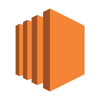
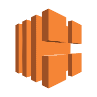
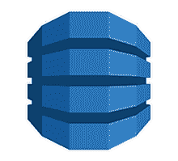
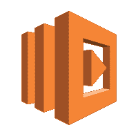
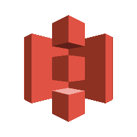
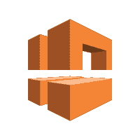

# 2020 年为您的企业选择的 10 大 AWS 服务

> 原文：<https://dev.to/serhiykozlov/top-10-aws-services-to-choose-for-your-business-in-2020-380l>

## **亚马逊的宇宙**

在过去的几年里，云计算已经彻底改变了科技行业。有了它，科技公司不再需要在硬件和基础设施上进行必要的投资；或者，他们可以购买适当数量的计算资源，以按需购买的方式即时运营其 IT 部门。

[亚马逊网络服务](https://aws.amazon.com/) (AWS)真正是云计算市场无可争议的先驱，他们根据需要推出计算服务。其广泛的产品组合中的 100 多种高效服务提供了全面的**基础架构即服务(IaaS)、软件即服务(SaaS)和平台即服务(PaaS)** 产品，其中包括数据库、应用程序开发、安全性、基础架构管理、存储等服务。
更多阅读: [AWS DevOps 工具](https://www.romexsoft.com/blog/what-is-devops/)

AWS 服务是开发和部署任何特定种类的云应用程序或扩展现有云环境的兼容构建模块。AWS 产品在技术上相互一致，从而带来高度可扩展和精炼的产品。AWS 拥有并操作维护其服务所需的硬件。

### **AWS 服务的优势:**

*   灵活且可扩展的 IT 资源
*   节省大量硬件成本
*   更快的创新
*   即时放大或缩小
*   必要资源的快速定位
*   完美的基础设施

更多阅读:[“采用 AWS 云的明确优势”](https://www.romexsoft.com/blog/benefits-of-aws-cloud/)

面对如此众多的 AWS 产品，很容易走错方向。这就是为什么我们列出了**十大最受欢迎和最受欢迎的企业基本 AWS 服务。**我们希望这份 AWS 服务概述能在您成为更强大、更具创新性的公司的道路上派上用场。

## **十大必备 AWS 服务:**

1.  **亚马逊 EC2 -** **亚马逊弹性计算云。**
2.  **亚马逊 ELB -** **弹性负载均衡。**
3.  **亚马逊 DynamoDB -** **NoSQL 云数据库。**
4.  **亚马逊红移-** **数据仓库。**
5.  **亚马逊 RDS - 关系数据库服务。T3】**
6.  **亚马逊 Lambda - 无服务器功能。T3】**
7.  **亚马逊 SNS - 简单通知服务。T3】**
8.  **亚马逊 S3 - 冗余文件存储。T3】**
9.  **亚马逊 Lex - 对话界面。T3】**
10.  **亚马逊 VPC - 虚拟私人。T3】**

### **亚马逊 EC2**

**特性: EC2 允许使用所选的操作系统创建虚拟机(实例)和其他服务器管理特性，如存储、安全性、端口。有很多预配置的实例模板——AMIs(Amazon 机器映像)。此外，可以根据需要配置实例。T3】**

**好处:**

*   非常容易扩展和缩小
*   与其他服务的整合
*   计时工资
*   无需部署昂贵的物理服务器
*   安全性和抵抗力
*   加速应用程序的开发和部署

### **亚马逊**ELB**T3】**

**特性:** ELB 自动在不同实例之间分配负载，换句话说，如果一个实例繁忙，另一个实例可以处理大量的传入流量。该服务有助于避开任何服务器热点。ELB 提供三种负载均衡器: 【应用负载均衡器】 网络负载均衡器， 经典负载均衡器。 ELB 确保只有健康的目标接收流量。

**好处:**

*   应用性能监控
*   自动放大或缩小
*   更好的性能
*   容错应用
*   强大的安全功能
*   用户认证
*   提高应用程序的可用性

### **亚马逊**DynamoDB**T3】**

**特性:这一完全托管的 NoSQL 云数据库平台可确保数据的存储、处理和访问，并支持规模驱动的高性能应用。它适用于文档和键值存储模型。非常适合物联网、广告技术、游戏和移动应用。DynamoDB 可以扩展以适应大型数据集。T3】**

**好处:**

*   支持关键任务工作负载
*   极快
*   无服务器
*   完全托管的内存缓存
*   任何规模的低延迟数据访问
*   个位数毫秒响应时间

**T4】**

### **亚马逊**红移**T3】**

**特性:该数据库即服务解决方案是云市场上最快的数据仓库。它可以容纳数 Pb 的数据，并根据您的需求进行扩展或缩减。红移支持关键任务分析工作负载。集群完全由 AWS 管理。该数据库与大多数第三方应用程序兼容。T3】**

**好处:**

*   性价比
*   快速执行
*   水平缩放
*   连续备份
*   柱状存储
*   大规模并行处理
*   数据湖整合

### **亚马逊**RDS**T3】**

**特性:该服务允许运行和管理关系数据库，而通常不必为其基础设施管理花费时间和大量资源。数据库可以配备 5 GB-6 TB 大小，可以在磁性或固态存储(SSD)上运行。该服务可以支持多种数据库引擎，如 Aurora、MySQL、PostgreSQL、SQL Server、MariaDB、Oracle、Microsoft SQL Server。T3】**

**好处:**

*   性价比
*   完全托管
*   高度可扩展
*   可调整大小
*   降低行政负担
*   几分钟内数据库的专用实例
*   自动软件补丁

### **亚马逊**λ****

**特性:也称为功能即服务(FaaS)。你几乎不需要为任何类型的应用程序或后端服务上传你的代码，Lambda 处理一切以高可用性运行和扩展你的代码。支持所有类型的开发任务。您可以执行代码功能，而不需要任何 EC2 服务器。T3】**

**好处:**

*   没有要管理的服务器
*   零投药
*   每次跑步付费
*   有助于避免复杂性和管理开销
*   应用程序的自动缩放

### **亚马逊**SNS**T4】**

**功能:允许向任何平台的用户发送通知。该服务发送电子邮件、文本消息、SQS(简单队列服务)、HTML 端点消息。支持分离微服务、分布式系统和无服务器应用。该服务是为高吞吐量、基于推送的多对多消息传递而构建的。T3】**

**好处:**

*   高消息持久性
*   完全托管服务
*   保护敏感数据的安全
*   与任何类型的应用程序(节点)集成。JS，Python，PHP)
*   用于大规模消息传递的低成本基础设施

### **亚马逊**S3**T4】**

**特性:**

这是一个三重冗余的可扩展数据存储。 数据存储在一个特定区域的 3 个数据中心，这保证了高度的数据安全性和对故障、错误和潜在威胁的充分保护。各种规模的公司都可以使用这项服务来存储、检索和保护任何数量的数据。该服务提供了对您的数据进行管理、分类和报告的可能性，以及跨您的对象运行大数据分析的可能性。

对象由数据、关键字(指定名称)和元数据组成。 对象存储在“文件夹”中，可以是私有的，也可以是公共的。该服务提供与 PCI-DSS、HIPAA/HITECH、FedRAMP 的集成。

**好处:**

*   高数据可用性
*   粒度数据控制
*   简单的数据传输
*   备份和恢复
*   极其安全的基础设施
*   可扩展性
*   几乎零延迟
*   高性能
*   易于使用的管理功能
*   轻松集成第三方应用

### **亚马逊**莱克斯****

**功能: Lex 是一项人工智能服务，用于为任何使用与亚马逊 Alexa 相同的深度学习技术的应用程序开发对话界面(语音和文本)。它们是自动语音识别(ASR)和自然语言理解(NLU)。您可以直接从 Amazon Lex 控制台构建、测试和部署您的聊天机器人。该服务支持创建具有高度吸引人的用户体验的应用程序。T3】**

**好处:**

*   有意义的互动
*   复杂的深度学习算法
*   易于使用的控制台
*   您需要支付语音请求文本的费用
*   自动缩放

### **亚马逊**VPC**T4】**

**功能:这项服务是亚马逊为应对日益增多的安全威胁和数据泄露而推出的。该服务允许在 AWS 上创建一个隔离的空间，并且只为授权的个人、团体或系统提供对它的访问。这为在定义的 VPC 下运行的数据和资源提供了额外的安全层。你的信息绝对不会暴露。T3】**

**好处:**

*   有效防范数据安全风险
*   到公司网络的可能 VPN 连接
*   确保信息的可访问性
*   完全控制虚拟网络环境
*   入站和出站过滤

**总结**

AWS 服务对于追求卓越灵活性、持续创新和向云迁移的企业来说是无价的。AWS 提供的广泛服务可以满足具有任何特定目标的任何企业的最复杂的要求。AWS 服务有助于大幅削减基础设施管理成本和硬件资本投资，并加快实现价值。公司为他们使用的东西付费。

Wit Amazon AWS 产品昂贵的内部数据中心需要维护和大量关注，可以被可扩展的高效数字基础设施所取代。[托管 AWS 服务](https://www.romexsoft.com/aws-managed-services/)帮助根据不断变化的业务环境升级或缩减基础设施，确保可靠性和安全性，并实现收入最大化。

但是你必须考虑这样一个事实，并不是所有的 AWS 服务都能相互匹配。您需要准确理解正确解决特定业务任务所需的技术堆栈和 AWS 服务组合。

你是否已经下定决心[迁移到 AWS](https://www.romexsoft.com/aws-cloud-migration/) 并建立一个蓬勃发展的基于云的企业？内部没有足够的云专业知识？

Romexsoft 是经过认证的 AWS 咨询合作伙伴，我们可以帮助您快速、安全地处理复杂的 AWS 环境 ，并根据您的业务需求将 AWS 服务进行精确组合。联系我们与我们公认的 [AWS 专家](https://www.romexsoft.com/get-in-touch/) 取得联系。

最初发表于 Romexsoft 博客[“2020 年为您的企业选择的 10 大 AWS 服务”](https://www.romexsoft.com/blog/top-10-aws-services/)