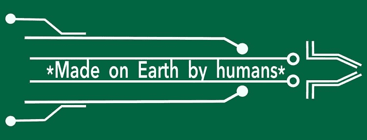
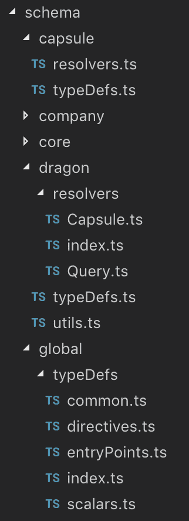
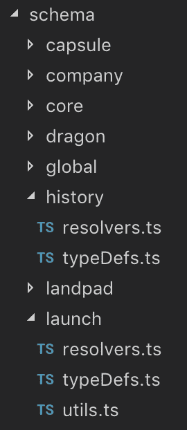
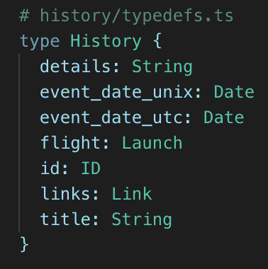
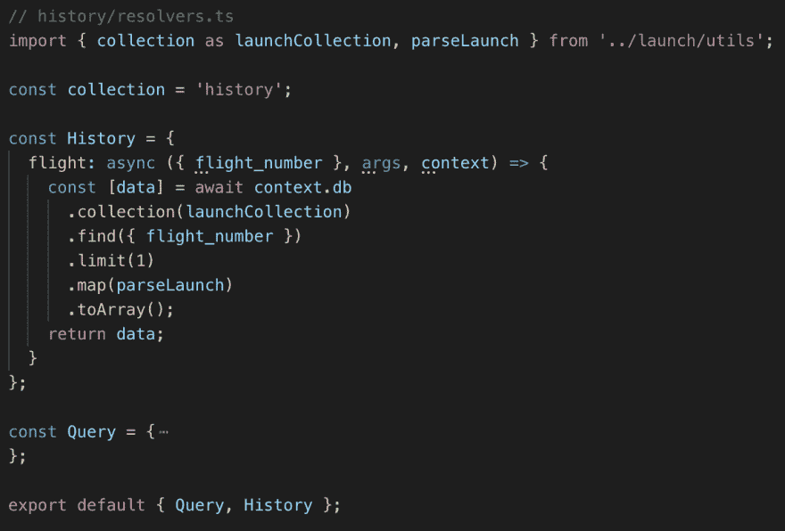
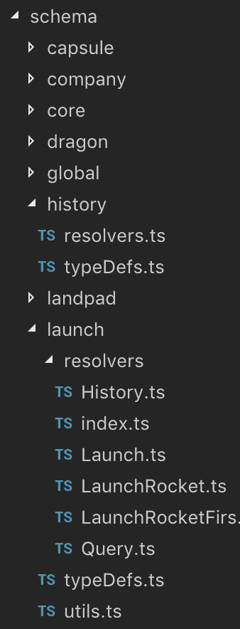
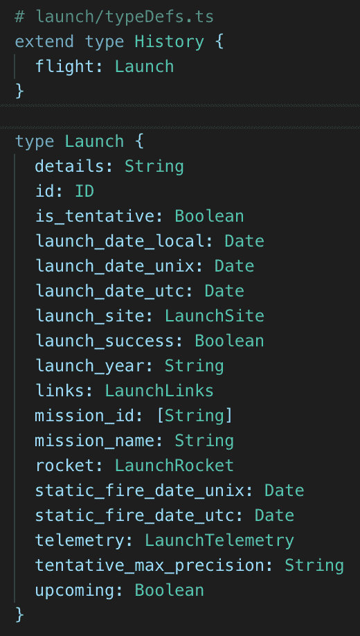
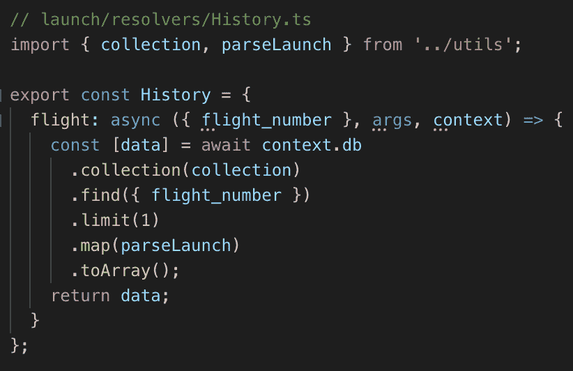
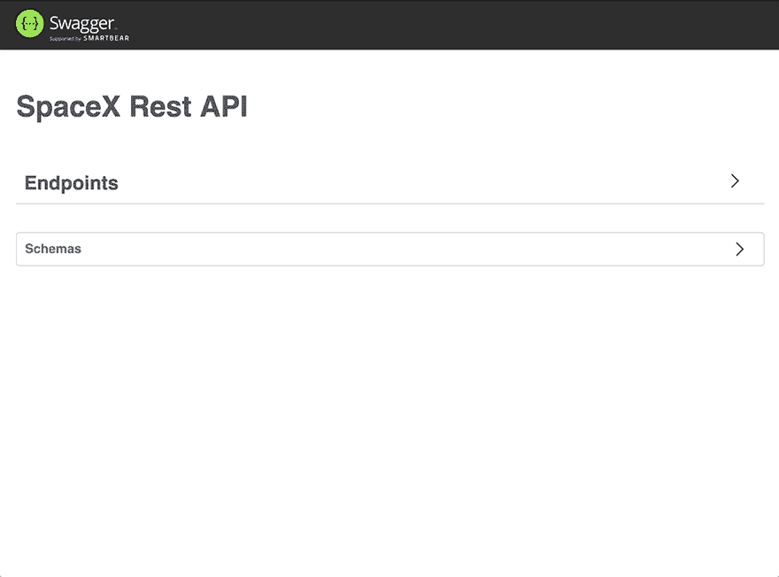

# 启动 SpaceX GraphQL API🚀

> 原文：<https://dev.to/swcarlosrj/launching-spacex-graphql-api-jl2>

发现💯创建生产就绪型现代 API 的工具和经验，基于🌎为人类而生！

[ 🌖](img/39cc9ecc96aab8af739906c25efbd023.png) ](https://res.cloudinary.com/practicaldev/image/fetch/s--_9NfY8Gx--/c_limit%2Cf_auto%2Cfl_progressive%2Cq_auto%2Cw_880/https://cdn-images-1.medium.com/max/3840/1%2AixnzMP6t4Iot9nZpBmr1Vw.png) *下一个目的地: [SpaceX Land](https://spacex.land) 🌖*

> # Do you have your own …
> 
> # How high is the rocket? How many launches have landed successfully? What is the maximum crew capacity of the space capsule?
> 
> # If you do, I may have good news for you!

### 🥁我很高兴地宣布…

> # [SpaceX🚀GraphQL API](https://api.spacex.land/graphql) 现已上线🎉

> # An API is used for
> 
> # Technicians
> 
> # & No technicians
> 
> # come from anywhere
> 
> Use any equipment
> 
> # Also,
> 
> # are those little dreamers

## 打开链接&尽情享受与真实的 SpaceX 数据✨互动吧

> # Discover all the interesting details about capsule, core, landing pad, launch, mission, payload, rocket, ship &. You can even check that Elon's Roadster has finally arrived at Mars!

**在进入技术细节之前，让我对 90%不知道什么是 [API](https://en.wikipedia.org/wiki/Application_programming_interface) 的人温和一点，只是讲一个轶事……**

在传统的 2018 年🎄圣诞晚餐时，我和我的物理学狂热分子叔叔谈论我正在做的关于 SpaceX API 的工作(*他从未听说过什么是 API，但他确实喜欢火箭的东西，所以愿意听*)，我拿起我的💻，打开浏览器，按几个键，我们就得到所有 SpaceX 火箭的名字，描述&发动机的细节，他惊讶于这是多么容易(*现在你甚至可以用你的📱，简直令人意乱情迷*。

在那之后，是的，在接下来的一个小时里我丢失了我的笔记本电脑😂他知道很多关于推进器的知识&因此，他开始探索 API，而我在玩小的。在某个时候，他拿来了一些发射图像，我 5 岁的表弟真诚地问我是否在里面🚀(我喜欢那些老姐的生活视角，他们相信一切皆有可能)。到那时，这已经发生了，由于这种**可访问的技术** &它们令人难以置信的功能，我们三个人花了晚上的一部分时间惊讶于火箭任务、太空舱&和其他 SpaceX 数据！

> # Moral: Let's build accessible software to continuously stimulate people's passion & dreams!

 *对于人类&其他人👽*

附注:那个小家伙已经比我更了解 SpaceX 了(因为他这个月一直在玩 API)。我很😃只是因为他很想知道。

## 开发者空间

好了，现在，我们来深入探讨技术细节。因为我坚信**可访问性** & a great **U/DX** 是软件被采用的基本要素，所以你可能必须处理其他问题，就像我发现现有的 SpaceX API 实现时一样…

### 动机

当我找到它时，我真的很兴奋地查看了可用的数据，但是…几分钟内我已经**处理版本、文档和第三方 SWs**，基本上，我放弃了，然后我决定开始迁移！

在这篇文章中，你会发现发生这种情况的主要原因。
[**将 SpaceX API 迁移到 GraphQL🚀**
*作为另一个物理、天文、火箭的爱好者，当我发现 SpaceX 公共 API(感谢全栈 Apollo…*medium.com](https://medium.com/open-graphql/migrating-spacex-api-to-graphql-e1fe69a3a8e7)

### 好处

关于 GraphQL & REST APIs 的优缺点，专家们已经写了大量的文章。我不打算在这里重复这些，但我完全鼓励你去研究它，你也可以查看 GraphQL 官方网站来了解它的主要特性！
[**GraphQL:一种 API 的查询语言。**
*GraphQL 为您的 API 中的数据提供了完整的描述，让客户能够准确地询问他们想要什么……* graph QL . org](https://graphql.org/)

### 实现

让我们谈谈*项目结构、类型安全&安全*展示使用的主要工具&最佳实践:

⚫️它遵循**模式优先**的方法，使用**领域模块化* *模式*** *结构。

该模式由不同的**数据集合** ( *胶囊、公司、核心、龙、历史、着陆平台、发射、发射台、任务、有效载荷、跑车、火箭&飞船*)分割，还包含**全局**类型定义(*由两者组成，公共&原始 GraphQL 类型定义*s)

所有这些都细分为以下几类:

🔘 **typeDefs**
它包含由关注点模块化的*数据集合*类型定义*。*

🔘**解析器**
功能负责*获取&过滤*所需的*数据*。

🔘**由*解析函数*组成的 utils**
或者*返回数据*可能需要的任何操作！

即使知道当前的 GraphQL API 实现并不太复杂，**它可能/将会增长**，这意味着我们必须**关心模块化**以避免代码重构，已经说过…

> # Break the pattern by focusing on the point rather than the type!

它可以让你轻松地识别出你的[琐碎解析器](https://graphql.org/learn/execution/#trivial-resolvers) &重用其中的逻辑函数👌

> # Divided by type

 👎

> # Get attention

 👍

⚫️提供**类型安全**自动生成 typedef&解析器**类型脚本**类型。

将我们的 GraphQL 模式作为**真实的单一来源，* *我们可能想要* *自动生成**我们的所有类型，以便在整个应用程序中保持数据结构同步。这就是 [**GraphQL 代码生成器](https://graphql-code-generator.com/) **(由 [Dotan Simha](https://dev.toundefined) 创建)的用武之地！
[**GraphQL 代码生成器*通过一个函数调用***
graphql-code-generator.com](https://graphql-code-generator.com/)从您的 GraphQL 模式生成代码

> # It generates all typedefs & parser functions (including data returned by args &) and script types.

如果您想了解更多关于 it 实施和优势的信息，请不要错过下面的帖子！
[**类型安全的 GraphQL 服务器🔎**
*这篇文章展示了在 GraphQL Servers*medium.com 中添加类型安全的动机&步骤](https://medium.com/open-graphql/type-safe-graphql-servers-3922b8a70e52)

⚫️it ' s**protected**from**infinite **&**复杂请求* *提供自定义错误消息。

将 GraphQL 视为一个巨大的端点，其中所有数据都可用，没有适当的保护可能会导致漏洞，例如受到 DoS(拒绝服务)攻击的影响。

使用像[graph QL-速率限制](https://github.com/teamplanes/graphql-rate-limit)、[graph QL-深度限制](https://github.com/stems/graphql-depth-limit)、&、[graph QL-验证-复杂性](https://github.com/4Catalyzer/graphql-validation-complexity)这样的工具可以很容易地避免这种情况

如果你对保证你的 GraphQL API 的安全感兴趣，不要错过这篇马克斯·斯托伊伯的文章💯关于主要问题的概述&其各自的解决方案！
[**保护您的 GraphQL API 免受恶意查询**
*使用 GraphQL 令人惊叹，但也有复杂的安全隐患。让我们深入了解一些必要的保护措施……* blog . apollographql . com](https://blog.apollographql.com/securing-your-graphql-api-from-malicious-queries-16130a324a6b)

### 数据

您可能想知道数据来自哪里，在深入研究之前，您必须知道通过 API 公开的数据…

> # is not the official data

虽然，**是几个 SpaceX 信息源提供的真实数据**，其中* *主要* *是 [Reddit SpaceX 论坛](https://www.reddit.com/r/spacex/)

It [Wiki](https://www.reddit.com/r/spacex/wiki) 部分充满了由社区成员撰写的数据，此外，还有更多来自以下网站:

*   [https://www.spacex.com](https://www.spacex.com/webcast)

*   [https://www.space-track.org](https://www.space-track.org)

*   [https://ssd.jpl.nasa.gov](https://ssd.jpl.nasa.gov)

*   [https://www.marinetraffic.com](https://www.marinetraffic.com)

    > # All data from these platforms are parsed & and collected in a public Mongo database, from which information is obtained.

这项令人难以置信的工作是由最受欢迎的非官方 [SpaceX REST API](https://api.spacexdata.com/) (已经运行了两年)完成的。我想为这样的工作给他们一个大呼小叫，让我们有能力访问所有这些有趣的数据。
[**r-SpaceX/SpaceX-API**🚀针对火箭、核心、太空舱、发射台和发射数据的开源 REST API](https://github.com/r-spacex/SpaceX-API)

我完全鼓励你帮助他们提出新的功能或修复现有的错误，他们一定会感激你的！

## SpaceX graph QL API

你可能想要👀在代码库中你可以找到所有提到的主题的实现，在这里！

> # T2] Buy back [T3】 API 【T4] document & everything

[https://codesandbox.io/embed/yv004pqnq9](https://codesandbox.io/embed/yv004pqnq9)

## ✋，还有更多…

> # What if you don't want to use GraphQL? That's fair, but … what if you could generate a REST API based on your GraphQL implementation to get all the benefits of both worlds? , does this make sense?

### 确实如此，你会想在使用&暴露 REST 的同时获得 GraphQL 的所有优点，比如:

🔘完全最新生成的文档。
🔘运行时数据验证* *确保类型安全。T3】🔘不再**痛苦**版本**。
🔘忘记**写**手动路由&控制器。
➕多了

> # 现在，这是可能的🤯，就用 Sofa Rest(Kamil Kisiela 的发明)根据你的 GraphQL 模式自动生成一个 REST API！
> 
> [😉沙发——最好的休息方式(就是 GraphQL)。彻底结束 REST vs GraphQL 的争论](https://medium.com/the-guild/sofa-the-best-way-to-rest-is-graphql-d9da6e8e7693)

### 说到这里，🥁我也要宣布…

> # [SpaceX REST API](https://api.spacex.land/rest/) 也上线了🎊

## 打开链接&试试可用的端点出来💫

> # If you are a fan of REST API, you can get the data exposed through the recorded endpoints. In addition, you will be able to get all the mentioned benefits from GraphQL, for example, the latest typed documents!

尽管如此，如果您追求性能，我还是建议您使用现有的 REST API ！

如果你已经实现了一个 GraphQL API，**在几分钟内**你也可以有一个 REST API，看看你是如何实现它的！

⚪️使用' *express* 并通过服务器共享你的**模式**(由*typedef*&*解析器*组成)，以及你的**上下文**！

⚪️使用 **sofa** & **OpenAPI** ，以便基于您的 *GraphQL 实现*生成一个* REST API*。您可能还想使用' *swagger-ui-express* 来为文档提供服务！

⚪️使用'*Apollo-server-express*'&将'*app*express 实例应用到 GraphQL 服务器上！

> # That's it! GraphQL rest and stop arguing & The best of both worlds!

## 非常欢迎公关人员🤗

还有很多工作要做，从*错误处理*、*测试*等等……我很乐意收到任何建议/问题，以改善现有的！
[**spacexland/api** 🚀graph QL&REST API 探索火箭，发射&其他 SpaceX 的数据*github.com](https://github.com/spacexland/api)

另外，我会让你们**为所有提到的技术**做出贡献，他们已经完成了如此不可思议的工作，但我很确定他们会感谢一些帮助！

## 打造酷🚀材料

创造和分享从未如此简单💯由于 Codesanbox [Ives van Hoorne](https://dev.toundefined) 的创造，web 应用程序项目使用你最喜欢的 FE 库。无论您是否从 **GraphQL** 开始，请给出一个👀在不同的实例中，你会发现有趣的用法！

### ❤️棱角分明

了解如何在 MVVM 架构中使用 TypeScript 与 GraphQL API 进行交互。

[https://codesandbox.io/embed/o9nmplk96y](https://codesandbox.io/embed/o9nmplk96y)

### 💙反应

钩子已经在这里了(不是开玩笑，看看[这个](https://github.com/facebook/react/pull/14679)),你可以把它们和 GraphQL 客户端库一起用作' [react-apollo-hook](https://github.com/trojanowski/react-apollo-hooks) '🤩

[https://codesandbox.io/embed/r4p8q1kmvp](https://codesandbox.io/embed/r4p8q1kmvp)

### 💚视图(vue)

您可能想学习如何用最酷的渐进式 JavaScript 框架编写查询和获取数据！

[https://codesandbox.io/embed/m3v8yv0nw9](https://codesandbox.io/embed/m3v8yv0nw9)

> # Choose the FE library of programming language & that you feel sure of, and arrange some to enjoy coding webapps in your calendar &!

如果自学还不足以成为建造某些东西的理由，你可能想知道来自世界各地的人们🌍愿意从你的项目中学习，说出来…

如果埃隆不能说服你，那就为他们去做吧，OSS 社区将会非常感激你的工作！不管怎样，我已经为每一个 SpaceX 代码沙箱制定了伟大的计划，特别是💡伙计们，帮我一把！

## 学分

首先，我想鼓励任何人开始写博客，你完全有能力这样做💪我几个月前才开始(我甚至没有写一篇像样的英语)，我对此感到非常高兴，你会变得更好，这只是时间问题。分享你的一切💜，人们会学习，喜欢&谢谢！

如果你和我一样是 GraphQL 的爱好者，我肯定会推荐在 [Open GraphQL](https://medium.com/open-graphql) 上发表文章。这是一个对任何事情都开放的出版物&任何由[纳德·达比特](https://dev.toundefined)经营的 GraphQL 相关的一切，给他发消息！，他肯定会愿意让你上船的！

此外，我还想对[公会](https://medium.com/the-guild) [乌里戈](https://dev.toundefined)的基金会用 [GraphQL 代码生成器](https://graphql-code-generator.com/)、[等工具支持 GraphQL 社区表示感谢😉沙发](https://sofa-api.com/)、 [GraphQL 模块](https://graphql-modules.com/) & [GraphQL 检查员](https://github.com/kamilkisiela/graphql-inspector)除此之外，它真的改变了 DX！

总结一下，希望你能从这篇文章中学到一些东西，除此之外，请继续为不可思议的 OSS 社区做贡献🤗

## 我们正在接近下一个目的地🌖，敬请期待不要错过落地！

请考虑一下🙏🏻荷兰、contribut♻️ing 和沙尔💜该死的。