# 将 API 迁移到 GraphQL 的经验教训📝

> 原文：<https://dev.to/swcarlosrj/lessons-learned-migrating-apis-to-graphql-3ef2>

这篇文章展示了**最佳实践**💫将 API 移植到 GraphQL。添加您的想法，共同提出问题/解决顾虑🤗给他们看看你的家人，但是🙏🏻，**分享知识**💜

## 吸取教训

### **模块化**👌你的类型定义&解析器👇

> 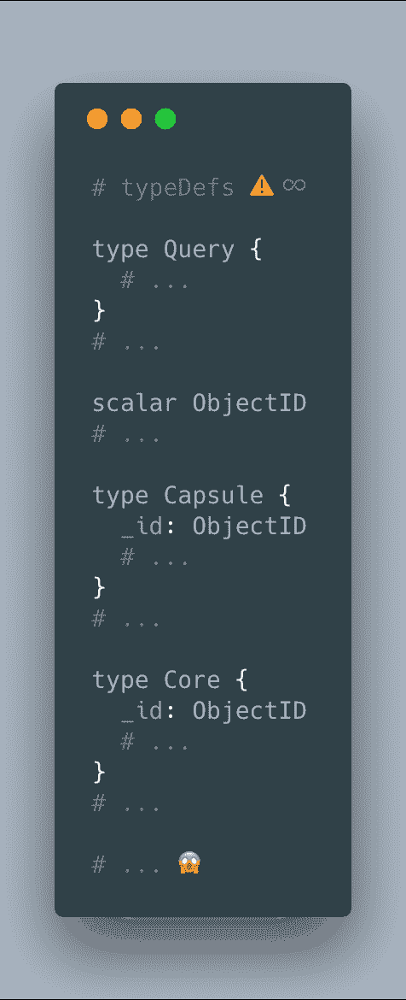卡洛斯鲁福[@ swcarlosrj](https://dev.to/swcarlosrj)为每个 typeDefs &解析器域创建不同的文件，然后导入并正确合并它们。随着模式的增长，您将😍要有模块化设计！2018 年 11 月 27 日上午 05:2707

### “通过**关注**打破你的模式，而不是通过类型”——[马丁·沃尔雷文](https://twitter.com/martijnwalraven)👇

> 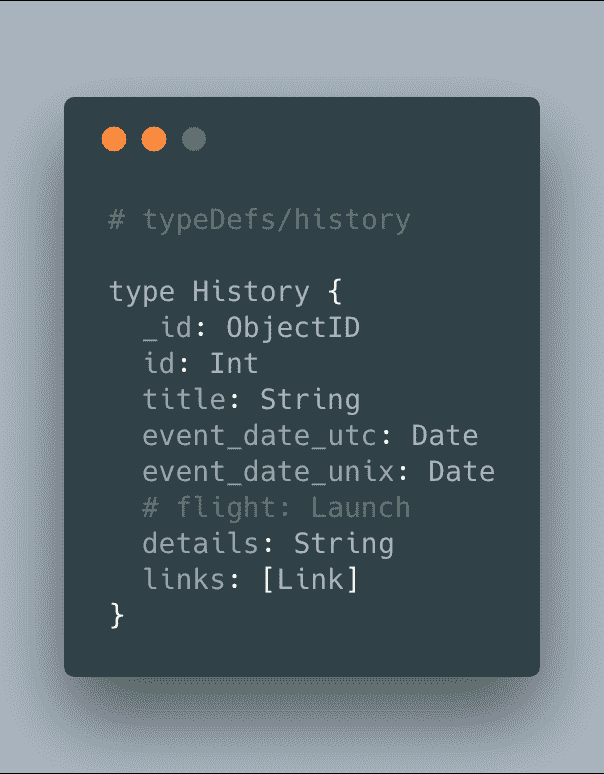卡洛斯鲁福[@ swcarlosrj](https://dev.to/swcarlosrj)“打破你的 [#GraphQL](https://twitter.com/hashtag/GraphQL) 模式靠关注，而不是靠类型”[@ martijnwalraven](https://twitter.com/martijnwalraven)[@ GraphQL summit](https://twitter.com/graphqlsummit)。尽可能地扩展你的类型定义，这将允许你清楚地定义你的类型定义& ♻️它们各自的解析器中的逻辑函数👌2018 年 11 月 27 日上午 05:34112

### 干♻️，用**上下文**！👇

> 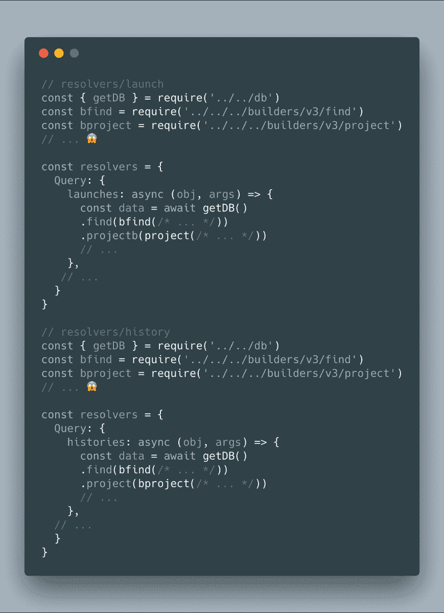卡洛斯鲁福[@ swcarlosrj](https://dev.to/swcarlosrj)你会😄能够访问解析器中的某些方法，对吗？，这就是原因👉语境👈出口。它对于传递一些东西很有用，比如身份验证范围、数据库连接和自定义获取函数。感谢 [@JakeDawkins](https://twitter.com/JakeDawkins) 的提示🤗2018 年 11 月 27 日下午 19:1517

### 评估你的模式是基于**特性**还是**领域**👇

> 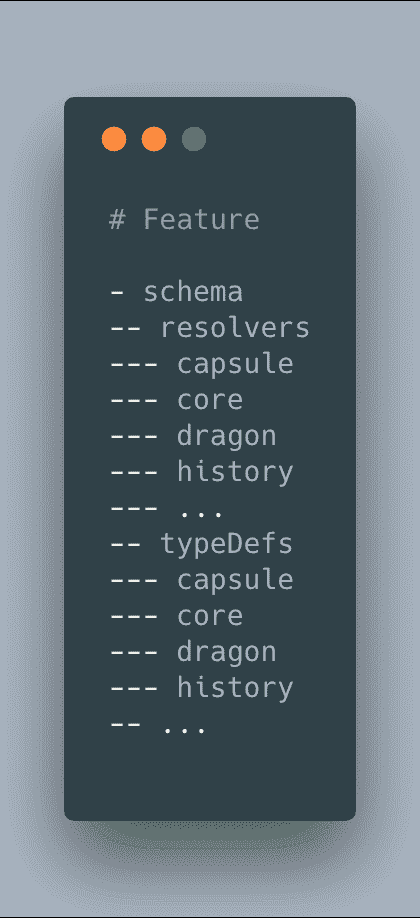卡洛斯·鲁福[@ swcarlosrj](https://dev.to/swcarlosrj)根据您的特性构造您的 [#GraphQL](https://twitter.com/hashtag/GraphQL) 模块化模式，只有 typedef&解析器😍通过特性来构建它，尽管如果特性的数量增加了，也要通过域来构建！2018 年 11 月 28 日上午 10:3119

### 展示什么**重要**👀第一👇

> 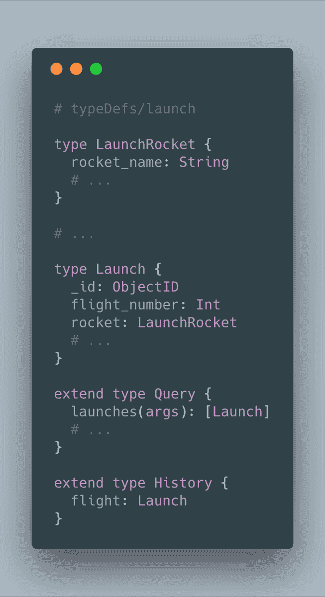卡洛斯鲁福[@ swcarlosrj](https://dev.to/swcarlosrj)在大型 [#GraphQL](https://twitter.com/hashtag/GraphQL) 模式中，您会注意到每个域都包含大量的类型，按优先顺序排列👉最重要的是。知道“extends”关键字代表类型之间的链接，将它们放到🔝然后添加域类型，最后添加字段类型2018 年 11 月 29 日 07:4505

### 解耦**全局**typedef！👇

> 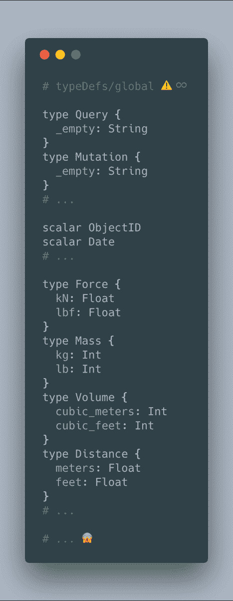卡洛斯鲁福[@ swcarlosrj](https://dev.to/swcarlosrj)标量、接口、枚举、输入…😱，您将在您的 [#GraphQL](https://twitter.com/hashtag/GraphQL) 模式中拥有♾全局类型定义，当您创建您的模式结构09:10am-30 201804时，不要错过识别&解耦它们的机会

### 占便宜🚀**的下一个**👇

> 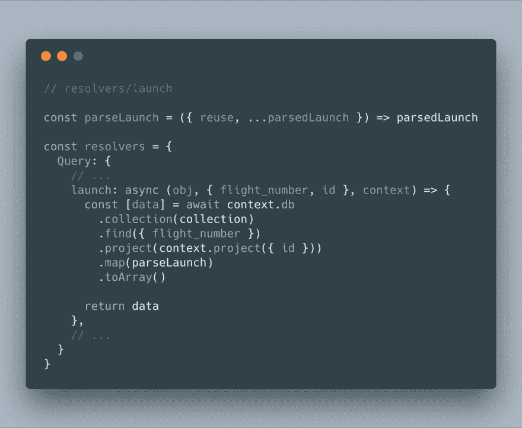卡洛斯鲁福[@ swcarlosrj](https://dev.to/swcarlosrj)使用 async/await 从 DB/API 获取数据，数组析构以获取单个元素，对象析构以加入/移除元素。⚠️不要忘记处理可能出现的错误！2018 年 12 月 01 日 21:41 分04

### 使用**联合**类型返回几种类型！👇

> 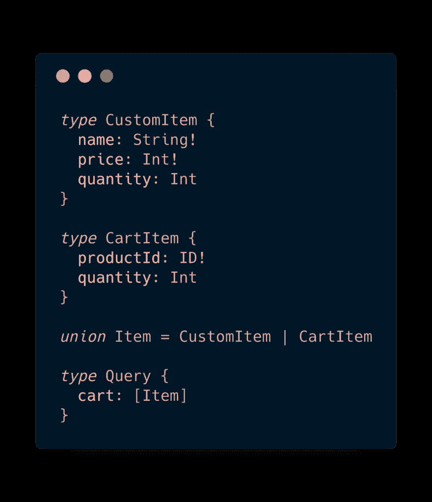杰米·巴顿[@ notrab](https://dev.to/notrab)如果你正在设计一个简单的、复杂的或者深度连接的 [#graphql](https://twitter.com/hashtag/graphql) API，考虑联合类型。我发现它们对多态关系非常有用🔥2018 年 12 月 10 日下午 14:15310

### 使用**化名**🔥重命名字段的结果👇

> 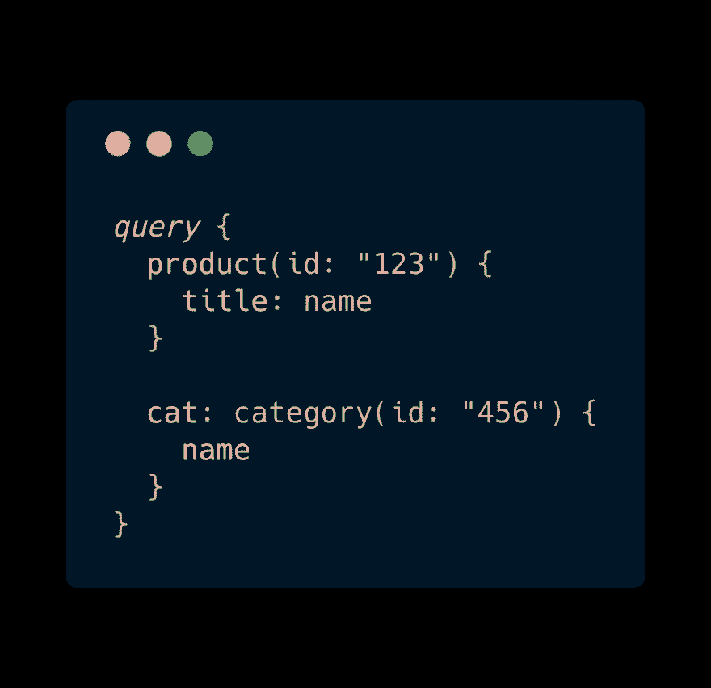杰米·巴顿[@ notrab](https://dev.to/notrab)[# graph QL](https://twitter.com/hashtag/graphql)内的字段别名被大大低估。使得使用像语义 UI 这样的前端库变得容易，语义 UI 期望对象/数组具有特定的键。将从 API 返回的字段重命名为您喜欢的任何名称。🔥2018 年 12 月 10 日下午 15:15929

### 不要**过度**，可以用 fetch 查询👇

> 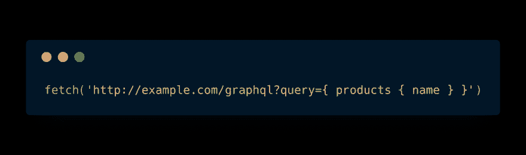杰米·巴顿[@ notrab](https://dev.to/notrab)不要忘记有时一个普通的旧获取请求就是你查询你的 [#graphql](https://twitter.com/hashtag/graphql) API 所需要的全部。
> 
> 如果你的请求很少，不要马上去接触所有的 npm 依赖项。
> 
> [# graph QL](https://twitter.com/hashtag/graphql)-request/urql 是很好的下一步，直到你需要 Apollo Client 带来的所有复杂性。21:30PM-2018 年 12 月 10 日423

### 干，用**碎片**！

> 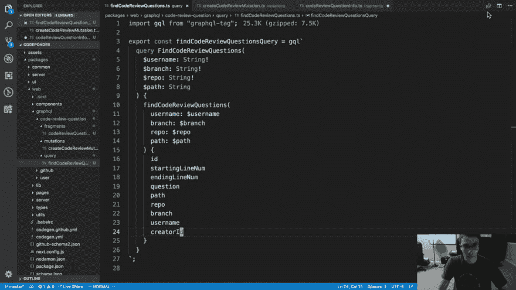<video loop="" controls=""><source src="https://video.twimg.com/ext_tw_video/1072876147472363520/pu/vid/320x180/elIlmL3ajSUJPmAr.mp4?tag=6" type="video/mp4"></video>Ben Awad@ bena wad 97如果你没有使用 [#graphql](https://twitter.com/hashtag/graphql) 片段，这里有一个我喜欢使用它们的例子。2018 年 12 月 12 日下午 15:30331

### 用**输入类型**去掉你的变量👇

> 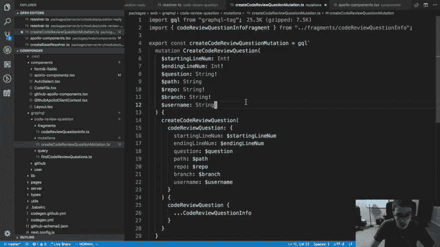<video loop="" controls=""><source src="https://video.twimg.com/ext_tw_video/1073228498024640512/pu/pl/e2DofZRc6e0yqQTX.m3u8?tag=6" type="application/x-mpegURL"></video>Ben Awad@ bena wad 97当您拥有 [#graphql](https://twitter.com/hashtag/graphql) 输入类型时，您可以单独传入变量或创建单个变量14:55 PM - 13 Dec 2018

## 额外🌟

### 不要错过本系列的第一部分，继续介绍 PayPal 构建 GraphQL APIs 的最佳实践👇

[**GraphQL 解析器:最佳实践**
*GraphQL 解析器可以很容易构建，但很难做好。以下是 PayPal 在…*medium.com](https://medium.com/paypal-engineering/graphql-resolvers-best-practices-cd36fdbcef55) 的最佳实践

## 加盖

**👉[模块化👌* *您的 typeDefs &解析器](https://twitter.com/swcarlosrj/status/1067288762810535936)T3】👉[“通过**关注**，而不是通过类型打破你的模式”——马丁·沃尔雷文](https://twitter.com/swcarlosrj/status/1067290487684571137)
👉[干♻️，用**上下文**！](https://twitter.com/swcarlosrj/status/1067497253294747650)T13】👉[评估你的模式是基于](https://twitter.com/swcarlosrj/status/1067727612233928704)
的**特性**还是**域**👉[展示什么是* *重要👀* *第一个](https://twitter.com/swcarlosrj/status/1068048289755475968)
👉[解耦**全局**类型定义](https://twitter.com/swcarlosrj/status/1068432024371789824)！
👉利用优势🚀
👉 [**使用**Union 返回几种类型**类型](https://twitter.com/swcarlosrj/status/1068983561934516227)！
👉[使用**别名**🔥重命名一个字段的结果](https://twitter.com/notrab/status/1072147677318651906)
👉[不要小题大做，可以**查询**用* *取](https://twitter.com/notrab/status/1072242050249166848)**
👉[干♻️，用**碎片**！](https://twitter.com/benawad97/status/1072876237301932032)
👉[用**输入**类型](https://twitter.com/benawad97/status/1073229966219862016)去掉你的变量

⭐️ [GraphQL 解析器:最佳实践](https://medium.com/paypal-engineering/graphql-resolvers-best-practices-cd36fdbcef55)

**已经等着添加您的了🤗，贡献更多经验教训👇**

> 卡洛斯鲁福[@ swcarlosrj](https://dev.to/swcarlosrj)经验教训将 API 迁移到 [#GraphQL](https://twitter.com/hashtag/GraphQL) 📝
> ↳分享你的💜
> ↳开🗣
> ↳是🤗
> 
> ⠀🤠
> 【线程】
> 👇🏽 👇🏽 👇🏽
> 👇 👇🏽👇🏽 👇
> 👇🏽 👇🏽
> 👇🏽 👇🏽
> 👢 👢05:27AM-2018 年 11 月 27 日1235

## 甚至更好…

## 创建帖子😀，课程😄，聚会😍，什么都行！，只是🤗又对教&学好奇🚀

我会继续关注这个帖子🔜有了更多的经验教训，敬请关注！

请考虑一下🙏🏻荷兰、contribut♻️ing 和沙尔💜该死的。