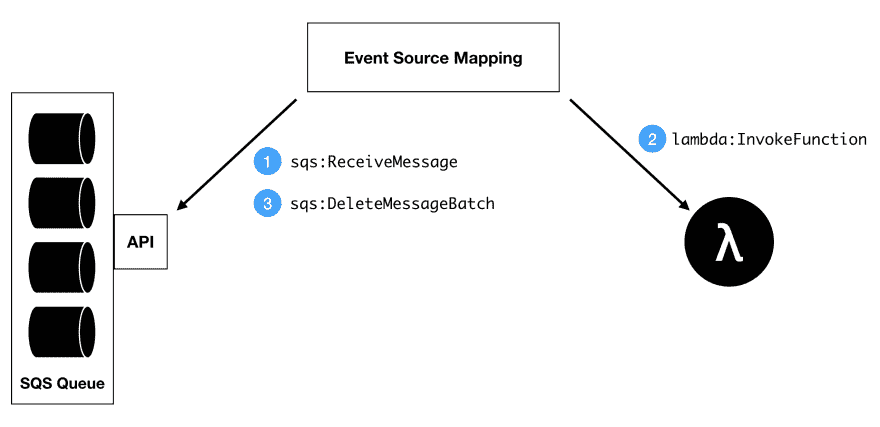

# 了解 AWS Lambda SQS 集成

> 原文：<https://dev.to/frosnerd/understanding-the-aws-lambda-sqs-integration-1981>

# 简介

AWS 为构建可伸缩、可靠和安全的云应用程序提供了不同的组件。Lambda 是一种按需执行代码的服务。Lambda 函数可以以许多不同的方式调用，例如由作为“无服务器”后端的一部分的 API 网关调用。在事件处理范围内，Lambda 可以与 SQS(队列)、SNS(发布/订阅)或 Kinesis 流等事件源结合使用。在这篇文章中，我们想集中讨论 this 积分。

SQS 是一个托管的分布式消息队列。由于 SQS 本身不是一个消息代理，消费者必须主动投票才能收到新消息。幸运的是，如果您为 Lambda 函数配置了 SQS 事件源，AWS 会为您处理轮询工作。

但是 does 积分到底是如何工作的呢？不同的配置参数，比如轮询策略、可见性超时、Lambda 超时和并发限制，如何影响您的集成行为？这就是我们现在要看的。该员额的其余部分结构如下。

首先，我们将查看 Lambda、SQS 的相关配置细节，以及与 Lambda SQS 集成相关的事件源映射。下一节将更详细地讨论这种集成，讨论它是如何实现的，以及在使用它时要注意哪些情况。我们通过总结主要发现来结束这篇文章。

# 配置

## λ

一个[λ函数](https://docs.aws.amazon.com/AWSCloudFormation/latest/UserGuide/aws-resource-lambda-function.html)有许多不同的配置参数。我们将重点关注以下三个方面，因为它们对函数作为事件处理器的工作方式有重大影响:死信配置、并发限制和函数超时。

*死信配置* ( `DeadLetterConfig`)是一个可选参数，允许您为函数设置死信队列或主题。根据调用类型，处理失败的消息将被转发到相应的资源。

Lambda 根据并发调用的数量自动伸缩。如果要限制最大并发，可以配置一个*并发限制* ( `ReservedConcurrentExecutions`)。它被称为保留执行，因为它还保留了 AWS 帐户范围的 Lambda 并发限制的相应份额。

最后但同样重要的是，*函数超时*起着重要的作用。为了避免永无休止的函数，AWS 会终止每个超过其配置超时的函数。如果您的函数不能轻易容忍这样的终止，请确保将超时设置得相当高。

## SQS

与本文相关的 [SQS 队列](https://docs.aws.amazon.com/AWSCloudFormation/latest/UserGuide/aws-properties-sqs-queues.html)配置属性是轮询策略和可见性超时。还可以通过创建 FIFO 队列(`FifoQueue`)来强制执行队列项的排序，但这样做时，就不能再将队列用作 Lambda 的事件源。

*轮询策略*可以通过`ReceiveMessageWaitTimeSeconds`参数进行配置。将参数设置为`0`对应*短轮询*，任意值> `0`对应*长轮询*。当客户端通过短轮询向 SQS 队列发出轮询请求时，API 将在不询问所有可用队列分区的情况下做出响应。尽管队列不为空，但这可能会导致空响应。由于每个请求所查询的分区集都不同，所以最终肯定会命中每个分区。另一方面，长轮询会询问所有服务器，并在配置的时间内等待它们的回答。

如果您的目标是低延迟，并且不介意为大量的 API 请求付费，那么您可以选择短轮询。然而，如果你能承受增加的延迟，我推荐长轮询(例如将`ReceiveMessageWaitTimeSeconds`设置为`2`)，因为它能节省成本。

第二个重要参数是*可见性超时* ( `VisibilityTimeout`)。因为 SQS 不知道消费者是否已经消费完一条消息，所以它从不自己删除消息。相反，一旦消息处理成功，从队列中删除消息是消费者的责任。为了避免消息被多个消费者使用，需要为可见性超时选择一个合理的值。

30 秒的可见性超时意味着无论何时消费者阅读了消息，所有后续的`ReceiveMessage`请求都不会在 30 秒内返回该消息。如果使用者没有在可见性超时内删除消息，它将再次对其他使用者可见。

## 事件源映射

当设置[事件源映射](https://docs.aws.amazon.com/en_us/AWSCloudFormation/latest/UserGuide/aws-resource-lambda-eventsourcemapping.html)时，没有太多需要配置的。一个可能与重试行为相关的属性是*批量* ( `BatchSize`)。SQS API 允许在一个请求中检索多条消息，AWS 将调用您的 Lambda，根据配置的批处理大小，一批有一到十条消息。

既然我们已经设置了 Lambda、SQS 和事件源映射的理论基础，那么让我们来看看整个实际设置。

# λSQS 集成细节

## 架构与流程

下图展示了一个成功的消息处理过程，它包括上一节中介绍的所有三个组件:SQS 队列、Lambda 函数和事件源映射。

首先，事件源映射通过使用事件源映射配置中指定的参数调用 [`sqs:ReceiveMessage`](https://docs.aws.amazon.com/AWSSimpleQueueService/latest/APIReference/API_ReceiveMessage.html) 动作来轮询队列。SQS 会立即将所有检索到的消息标记为正在处理，直到它们被删除或可见性超时。

接下来，事件源映射组件使用 [`lambda:InvokeFunction`](https://docs.aws.amazon.com/de_de/lambda/latest/dg/API_Invoke.html) 动作同步调用 Lambda 函数，将有效负载包装在 [SQS 事件](https://docs.aws.amazon.com/lambda/latest/dg/with-sqs.html)中。调用返回后，事件源映射组件向 SQS 发送 [`sqs:DeleteMessageBatch`](https://docs.aws.amazon.com/AWSSimpleQueueService/latest/APIReference/API_DeleteMessageBatch.html) 请求，处理流程结束。

在 Lambda 函数中出现错误的情况下，事件源映射组件将什么也不做，并且在超过可见性超时后，SQS 会使消息再次可见。

## 等幂事项

上面的流程很方便，AWS 会为您处理轮询和消息删除。然而，有些情况下会发生意想不到的事情。想象以下一连串的事件:

1.  一条新消息到达队列。
2.  AWS 用新消息调用 Lambda 函数，并使其不可见。
3.  Lambda 函数需要很长时间来处理消息。同时，超过了可见性超时。
4.  AWS 用同样的消息再次调用 Lambda 函数。
5.  现在，第一次 Lambda 执行完成，处理一次消息。
6.  现在第二次 Lambda 执行完成了，有效地第二次处理了消息。

这只有在 Lambda 执行时间超过可见性超时时才会发生。注意，将 visibility timeout 设置为与函数 timeout 相同的值没有帮助，因为在轮询队列和调用 Lambda 之间有一个滞后。如果 Lambda 调用由于 Lambda 不可用而受到限制或超时，这种延迟可能会增加。

为了避免这种情况，AWS 建议将可见性超时设置为函数超时的六倍。然而，这意味着对于 5 分钟的 Lambda，失败的执行将使消息在半小时内不可见。

另一个缓解策略是使所有操作幂等，这样您就不会介意意外的重复消息。这无论如何都是一个好主意，因为 SQS 只保证至少一次递送。当您接收或删除邮件时，保存邮件副本的 SQS 分区之一可能不可用。在这种情况下，该副本不会被删除或标记为不可见，并且一旦该服务器启动，您可能会再次看到该消息。

## 缩放和节流行为

SQS 支持几乎无限的吞吐量。Lambda 会自动扩展到某个限制(标准帐户的并发执行数为 1000)。然而，事件源映射组件既不知道 SQS，也不知道λ缩放行为。它将开始用 5 个并行线程轮询队列，为每个批处理调用 Lambda 函数。

一旦你的 Lambda 函数达到它的并发限制，调用就会被节流。在一个小实验中，我们向一个队列提交了 100 条消息，每条消息的处理时间大约为 20 秒，Lambda 函数的并发限制为 5。在那段时间里，我们观察到 Lambda API 大约有 200 次节流。

我相信 SQS 和 Lambda 之间的集成是以一种非常简单的方式完成的，不需要事件源映射组件对各自的组件有任何内部了解。它只使用标准 API、重试和超时的组合。

# 总结

在这篇文章中，我们看到了如何使用事件源映射让 Lambda 使用 SQS 消息。但是，需要注意一些配置属性，例如

*   SQS 轮询策略和可见性超时，
*   Lambda 死信配置、函数超时和并发限制，以及
*   事件源映射的批处理大小。

即使配置正确，SQS 也只能保证至少一次传递，因此您的 Lambda 函数可能会被同一条消息调用多次。您应该将您的系统设计成幂等的，这样重复的消息就无关紧要了。