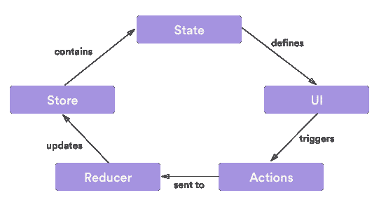

# 一个你能理解的 Redux 介绍

> 原文：<https://dev.to/macmacky/an-intro-to-redux-that-you-can-understand-55k8>

### 嗨伙计们！

在撰写本文时，Redux 是最流行的状态管理库。
部分是因为它大多与最流行的框架 [**React**](https://insights.stackoverflow.com/survey/2019#most-loved-dreaded-and-wanted) 一起使用。

那么什么是 **Redux** ？这是 JavaScript 应用程序的一个可预测的**状态管理**库。它在我们的应用程序中实现了一个**单向流**。它基于脸书的 Flux(一种关于如何构建客户端应用的应用架构),但也有一些不同。它可以用在客户端或前端，服务器端或后端或本地移动应用程序。

那么什么是**状态管理**？显然，它指的是我们如何在应用程序中管理状态或数据的方式。由于我们的 UI 或视图依赖于我们的状态或数据，我们的**状态管理**必须易于实现和理解。

那么什么是**单向流**？这意味着我们的应用程序数据将遵循单向绑定数据流。看下面这张图。
[](https://res.cloudinary.com/practicaldev/image/fetch/s--x1fwczA2--/c_limit%2Cf_auto%2Cfl_progressive%2Cq_auto%2Cw_880/https://thepracticaldev.s3.amazonaws.com/i/qstvf9u1i40d4ll1nx4y.png) 
我们不能从我们的 **UI** 直接转到**缩减器**我们必须先触发一个**动作**或者发送一个**动作**到**存储**我们必须先通过**缩减器**这就是**单向流**的意思。

### Redux 主要概念

**商店**——人们有时会混淆**商店**和**州**这两个词，以为它们是同一个东西，但事实并非如此。**状态**是我们的应用程序数据，而**存储**是保存**状态**的容器，它有一些必要的方法与之交互。

**动作** -我们更新或改变状态的唯一方式是通过**动作**。基本上，它是一个对象，告诉**减速器**功能，在我们的**状态**下我们想要什么变化。在**动作**中唯一需要的属性是**类型**属性。

```
 // Sample Action without data
    const toggleAction = {
       type : 'TOGGLE_MODAL'
    };

    //Sample Action with data
    const updateAction = {
       type :'UPDATE_DATA',
       payload : {
          datas: []
       }
    } 
```

Enter fullscreen mode Exit fullscreen mode

如果您在不同的组件中使用它，并且您意识到您在任何地方都重复这段代码，那么如果我们创建返回这些对象的函数并创建恒定的动作类型会更好，这样我们就可以避免错误拼写动作类型。这些函数被称为**动作创建者**，类型被称为 **Constact 动作类型**。

```
 const types = {
       TOGGLE_MODAL : 'TOGGLE_MODAL',
       UPDATE_DATA : 'UPDATE_DATA'
   };

   const toggle = () => ( {type:types.TOGGLE_MODAL} );

   const updateData = (data) => ( {type:types.UPDATE_DATA, payload:data} ); 
```

Enter fullscreen mode Exit fullscreen mode

**Reducer**——这是一个基于给定动作更新状态并返回新状态的函数。这是一个**纯函数**，这意味着这个函数的返回值完全基于给它的参数，它不会对它产生副作用，不会改变传递给它的参数，也不会访问其外部范围内的任何变量。

```
 const types = {
       TOGGLE_MODAL: 'TOGGLE_MODAL',
       UPDATE_DATA: 'UPDATE_DATA'
    };

    const initState = { datas: [], isModalOpen: false };

    function reducer(state = initState, action) {
       switch (action.type) {
          case types.TOGGLE_MODAL:
            return { ...state, isModalOpen: !state.isModalOpen };
          case types.UPDATE_DATA:
            return { ...state, datas: action.payload };
          default:
            return state;
       }
     } 
```

Enter fullscreen mode Exit fullscreen mode

这是一个 reducer 的样本模板，如果你的状态有很多属性，那么你可能有很多动作类型，那么也许是时候把它们分开放在另一个文件中了。

我对这些概念有一个类比。基本上**旧状态**就是你现在的车。**店**就像**洗车场**。**减速器**就像一个**输送机**它是一个类似隧道的地方，一个**动作**是**输送机**内的任何一个东西，像一个**旋转刷**、一个**干燥鼓风机**、**高压拱**，它在车上产生高压水，或者在**输送机**中发生的任何清洁过程都是一个**动作在**输送机**中完成所有流程后，您的汽车将获得**新状态**。**

在某些情况下使用 Redux 可能有些过头，比如如果你正在创建一个数据很少的应用程序，那么就不要使用 Redux，但是如果你有一个包含大量数据的大型应用程序，那么 Redux **可能是你的一个解决方案。**

#### 感谢各位阅读这篇帖子。

# 过得愉快😃！。