# 设置 IDE(集成开发环境)

> 原文：<https://dev.to/th3n00bc0d3r/setting-up-the-ide-integrated-development-environment-51lc>

欢迎来到 Linux，让我们开始让这个环境为我们工作，让我们创造奇迹。所以在屏幕的右上角点击任务栏并连接到互联网。

[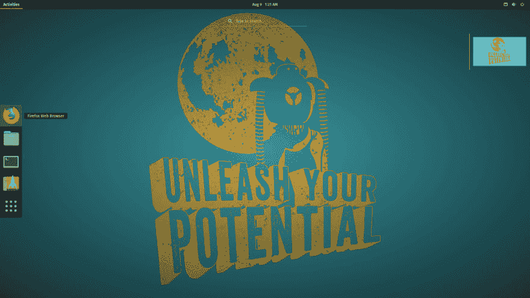](https://res.cloudinary.com/practicaldev/image/fetch/s--BfPy073O--/c_limit%2Cf_auto%2Cfl_progressive%2Cq_auto%2Cw_880/https://i.ibb.co/hXjBZn2/lin-0001-Screenshot-from-2019-08-09-01-21-49-png.jpg)

接下来点击左上角的 activities，你有 firefox，但是我们需要 chrome，所以打开 firefox，进入。[https://www.google.com/chrome/](https://www.google.com/chrome/)点击下载 Chrome。

[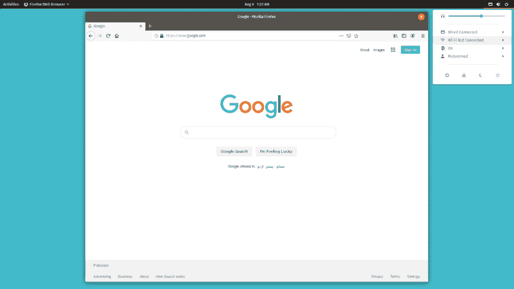](https://res.cloudinary.com/practicaldev/image/fetch/s--47PMWAx2--/c_limit%2Cf_auto%2Cfl_progressive%2Cq_auto%2Cw_880/https://i.ibb.co/Z63Z8qD/lin-0002-Screenshot-from-2019-08-09-01-22-26-png.jpg)

[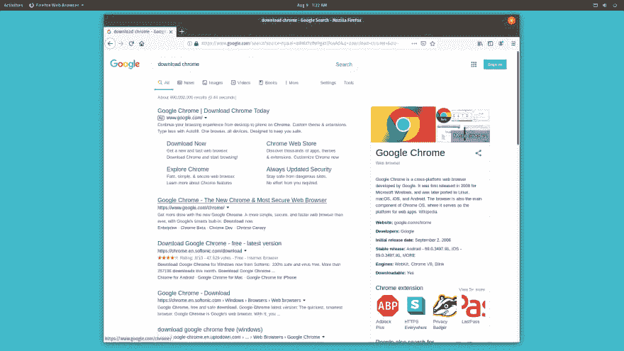](https://res.cloudinary.com/practicaldev/image/fetch/s--xHNP8F-M--/c_limit%2Cf_auto%2Cfl_progressive%2Cq_auto%2Cw_880/https://i.ibb.co/QryGCHp/lin-0003-Screenshot-from-2019-08-09-01-22-38-png.jpg)

[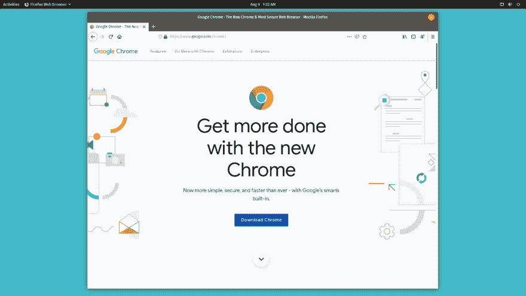](https://res.cloudinary.com/practicaldev/image/fetch/s--2A_7TpHR--/c_limit%2Cf_auto%2Cfl_progressive%2Cq_auto%2Cw_880/https://i.ibb.co/VmGScQP/lin-0004-Screenshot-from-2019-08-09-01-22-43-png.jpg)

你可以选择文件的类型，所以我们是基于 Debian 的。deb 文件就像一个。exe 文件。下载并点击它，安装程序就会启动。

[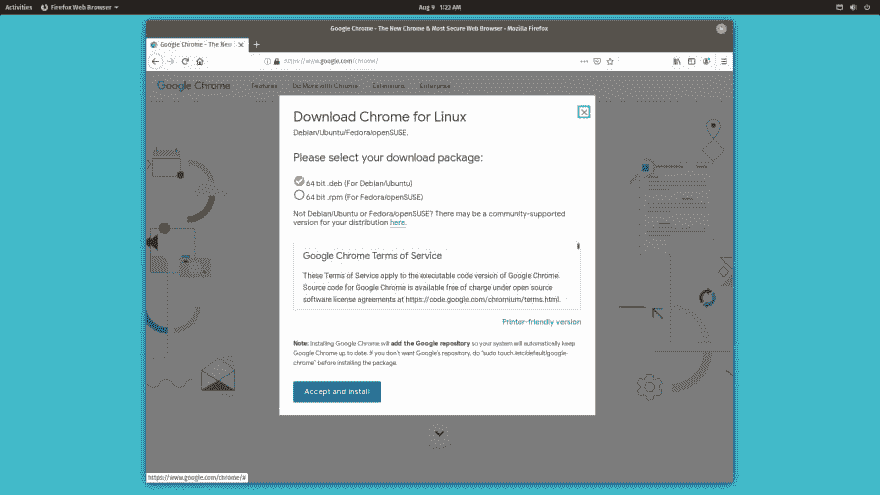](https://res.cloudinary.com/practicaldev/image/fetch/s--t5q9lDb6--/c_limit%2Cf_auto%2Cfl_progressive%2Cq_auto%2Cw_880/https://i.ibb.co/LkNTB0J/lin-0005-Screenshot-from-2019-08-09-01-22-46-png.jpg)

[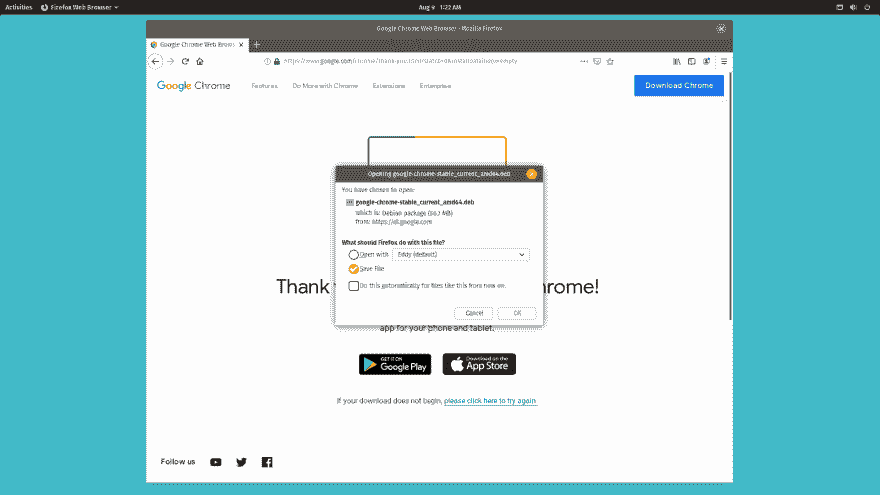](https://res.cloudinary.com/practicaldev/image/fetch/s--3kKe698R--/c_limit%2Cf_auto%2Cfl_progressive%2Cq_auto%2Cw_880/https://i.ibb.co/M1g1wkt/lin-0006-Screenshot-from-2019-08-09-01-22-51-png.jpg)

[](https://res.cloudinary.com/practicaldev/image/fetch/s--vPrWXOFX--/c_limit%2Cf_auto%2Cfl_progressive%2Cq_auto%2Cw_880/https://i.ibb.co/RTSLbsX/lin-0007-Screenshot-from-2019-08-09-01-23-04-png.jpg)

现在 Eddy 将打开所有 deb 文件的安装程序，是不是很简单。只要点击安装，你就有了 chrome。

[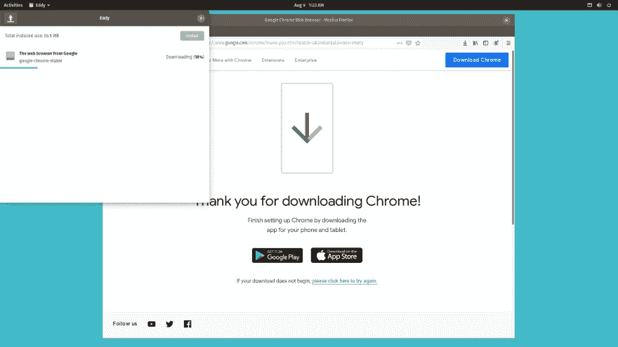](https://res.cloudinary.com/practicaldev/image/fetch/s--RFwBXP----/c_limit%2Cf_auto%2Cfl_progressive%2Cq_auto%2Cw_880/https://i.ibb.co/g4td9xg/lin-0008-Screenshot-from-2019-08-09-01-23-12-png.jpg)

[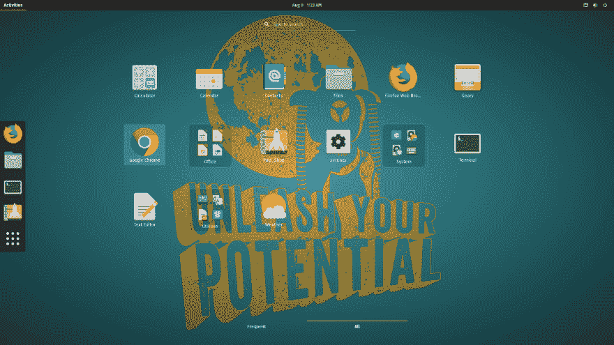](https://res.cloudinary.com/practicaldev/image/fetch/s--LR9Qd28Z--/c_limit%2Cf_auto%2Cfl_progressive%2Cq_auto%2Cw_880/https://i.ibb.co/n0DbrMB/lin-0009-Screenshot-from-2019-08-09-01-23-49-png.jpg)

接下来让我们安装 visual studio 代码，因此前往[https://code.visualstudio.com/download](https://code.visualstudio.com/download)并点击。deb 文件并重复该过程。

[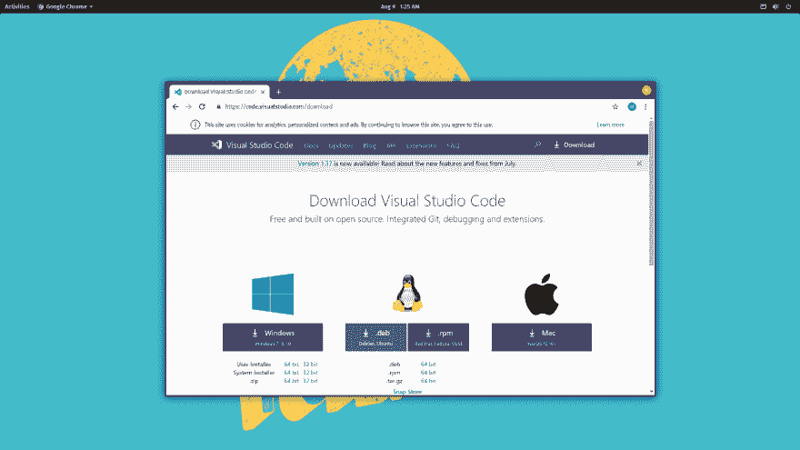](https://res.cloudinary.com/practicaldev/image/fetch/s--VofUDt1o--/c_limit%2Cf_auto%2Cfl_progressive%2Cq_auto%2Cw_880/https://i.ibb.co/FK716GG/lin-0010-Screenshot-from-2019-08-09-01-25-52-png.jpg)

接下来，我们需要 MySQL Workbench，前往[https://dev.mysql.com/downloads/workbench/](https://dev.mysql.com/downloads/workbench/)，从下拉菜单中选择 Ubuntu Linux。

[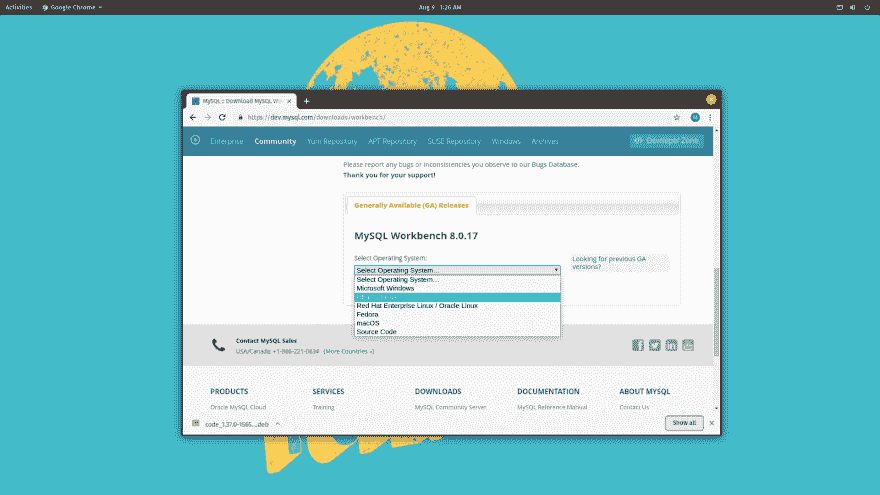](https://res.cloudinary.com/practicaldev/image/fetch/s--Ug_oy13e--/c_limit%2Cf_auto%2Cfl_progressive%2Cq_auto%2Cw_880/https://i.ibb.co/tQmxncN/lin-0011-Screenshot-from-2019-08-09-01-26-37-png.jpg)

[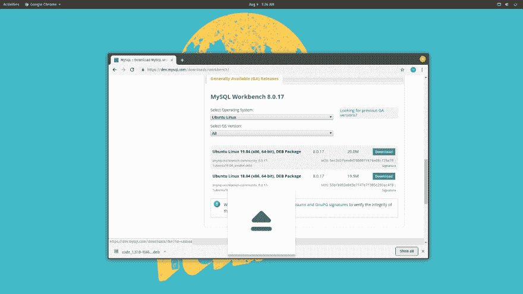](https://res.cloudinary.com/practicaldev/image/fetch/s--FnboqRaO--/c_limit%2Cf_auto%2Cfl_progressive%2Cq_auto%2Cw_880/https://i.ibb.co/BBgtttt/lin-0012-Screenshot-from-2019-08-09-01-26-48-png.jpg)

接下来选择 Deb 包并点击下载。

是的，它要求注册，算了，只要点击不谢谢，就开始我的下载。

[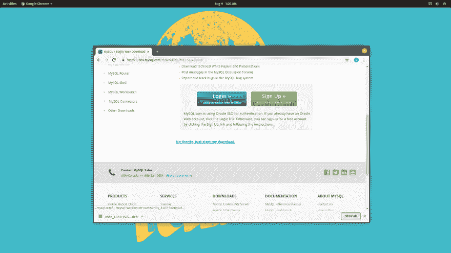](https://res.cloudinary.com/practicaldev/image/fetch/s--xoc9Q2rk--/c_limit%2Cf_auto%2Cfl_progressive%2Cq_auto%2Cw_880/https://i.ibb.co/VH0fhRS/lin-0013-Screenshot-from-2019-08-09-01-26-52-png.jpg)

[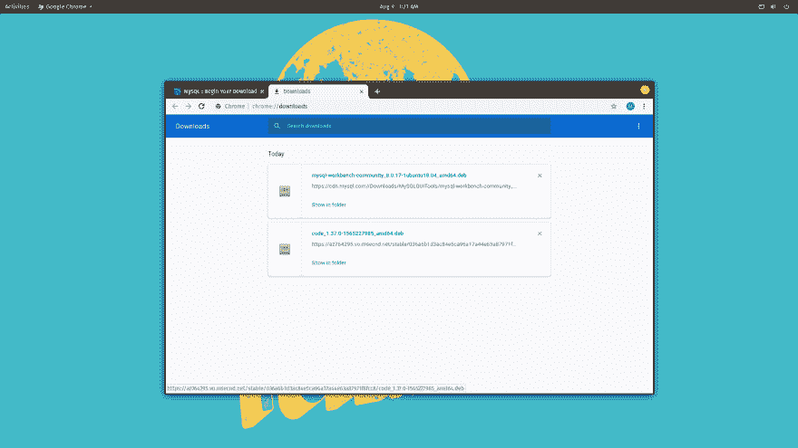](https://res.cloudinary.com/practicaldev/image/fetch/s--GtSQY46---/c_limit%2Cf_auto%2Cfl_progressive%2Cq_auto%2Cw_880/https://i.ibb.co/zRMYzxF/lin-0014-Screenshot-from-2019-08-09-01-27-03-png.jpg)

现在你可以点击 Deb 文件，安装程序就会启动，如果你分别点击两个文件，它会排队，你可以安装多个文件，这是多么美妙。

[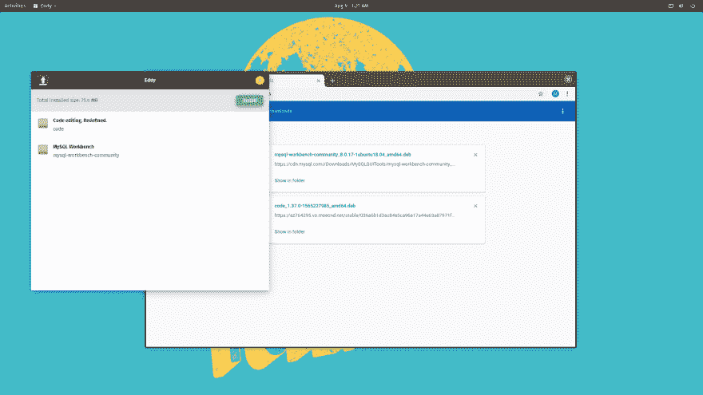](https://res.cloudinary.com/practicaldev/image/fetch/s--LlyDpUa7--/c_limit%2Cf_auto%2Cfl_progressive%2Cq_auto%2Cw_880/https://i.ibb.co/PwvWb5D/lin-0015-Screenshot-from-2019-08-09-01-27-12-png.jpg)

[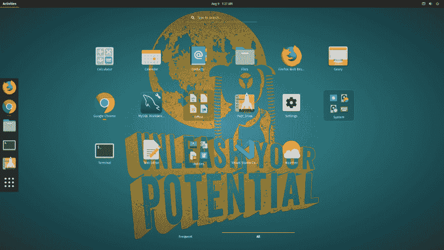](https://res.cloudinary.com/practicaldev/image/fetch/s--rXVa5N_H--/c_limit%2Cf_auto%2Cfl_progressive%2Cq_auto%2Cw_880/https://i.ibb.co/xqf7T9s/lin-0016-Screenshot-from-2019-08-09-01-27-42-png.jpg)

现在，如果您单击“activities ”,并选择带点的图标，您可以看到我们已经安装了这些程序。

我们需要的最后一件事是一个依赖项，所以使用下面的链接并安装。deb 文件。

[https://packages . sury . org/PHP/pool/main/libz/libzip/libzip5-dbg sym _ 1 . 3 . 2-1% 2b 0 ~ 2018 07 14172643.1% 2 bstretch ~ 1 . GBP 053542 _ amd64 . deb](https://packages.sury.org/php/pool/main/libz/libzip/libzip5-dbgsym_1.3.2-1%2B0~20180714172643.1%2Bstretch~1.gbp053542_amd64.deb)

**为开发者设置本地服务器**

现在我们将安装一个带有 php 的本地 web 服务器和一个用于本地开发和测试的数据库服务器。右键单击桌面，然后单击在终端中打开。我们需要添加一些远程存储库，以便我们可以获得安装所需的附加文件。在终端复制粘贴下面的代码，一个接一个。

[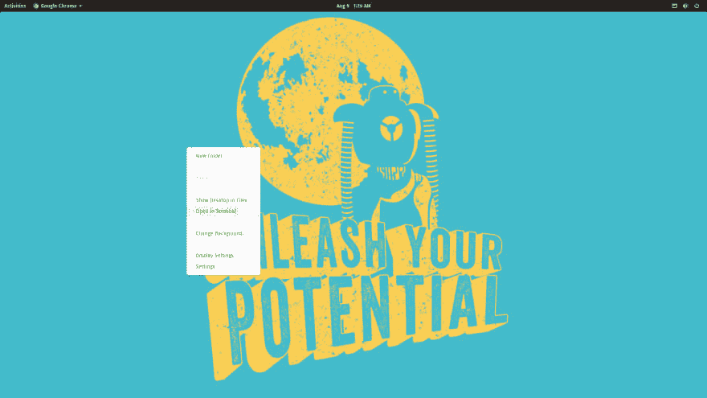](https://res.cloudinary.com/practicaldev/image/fetch/s--5LkMEmxj--/c_limit%2Cf_auto%2Cfl_progressive%2Cq_auto%2Cw_880/https://i.ibb.co/qrDnMdy/lin-0017-Screenshot-from-2019-08-09-01-29-00-png.jpg)T3】

```
sudo apt-get install software-properties-common

sudo add-apt-repository ppa:ondrej/php

sudo apt-get update 
```

<svg width="20px" height="20px" viewBox="0 0 24 24" class="highlight-action crayons-icon highlight-action--fullscreen-on"><title>Enter fullscreen mode</title></svg> <svg width="20px" height="20px" viewBox="0 0 24 24" class="highlight-action crayons-icon highlight-action--fullscreen-off"><title>Exit fullscreen mode</title></svg>

[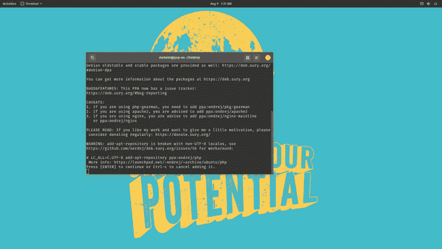](https://res.cloudinary.com/practicaldev/image/fetch/s--V5M0YKro--/c_limit%2Cf_auto%2Cfl_progressive%2Cq_auto%2Cw_880/https://i.ibb.co/mGbM1mp/lin-0021-Screenshot-from-2019-08-09-01-31-40-png.jpg)

现在，下面的命令将把 Nginx 安装为 web 服务器和 PHP 7.3

sudo apt-get install nginx PHP 7.3-fpm PHP 7.3-CLI PHP 7.3-MySQL PHP 7.3-GD PHP 7.3-imagick PHP 7.3-recode PHP 7.3-tidy PHP 7.3-xmlrpc PHP 7.3-common PHP 7.3-curl PHP 7.3-MB string PHP 7.3-XML PHP 7.3-BC math PHP 7.3-bz2 PHP 7.3-intl PHL

现在让我们看看是否一切正常，使用以下命令进行检查。打开 Chrome，转到 [http://localhost/](http://localhost/) 也就是自己的电脑。

[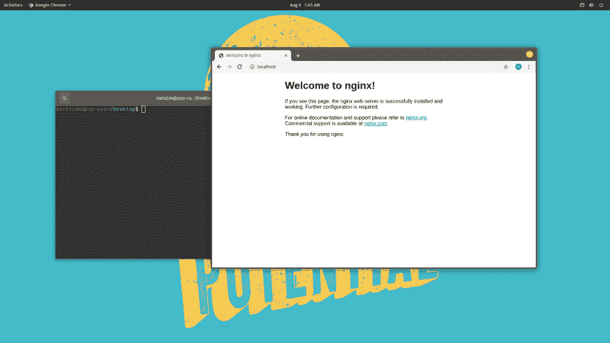](https://res.cloudinary.com/practicaldev/image/fetch/s--eM5jxmGp--/c_limit%2Cf_auto%2Cfl_progressive%2Cq_auto%2Cw_880/https://i.ibb.co/t4FhKCQ/lin-0023-Screenshot-from-2019-08-09-01-45-30-png.jpg)

接下来让我们测试 PHP，在终端中键入

```
sudo php -v 
```

<svg width="20px" height="20px" viewBox="0 0 24 24" class="highlight-action crayons-icon highlight-action--fullscreen-on"><title>Enter fullscreen mode</title></svg> <svg width="20px" height="20px" viewBox="0 0 24 24" class="highlight-action crayons-icon highlight-action--fullscreen-off"><title>Exit fullscreen mode</title></svg>

[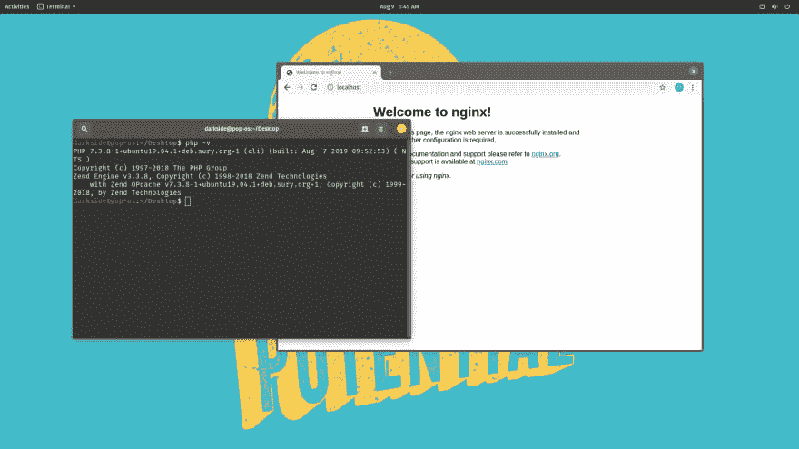](https://res.cloudinary.com/practicaldev/image/fetch/s--SIQz486G--/c_limit%2Cf_auto%2Cfl_progressive%2Cq_auto%2Cw_880/https://i.ibb.co/nbvR065/lin-0024-Screenshot-from-2019-08-09-01-45-54-png.jpg)

现在我们需要在终端类型
中稍微调整 Nginx

```
sudo nano /etc/nginx/nginx.conf 
```

<svg width="20px" height="20px" viewBox="0 0 24 24" class="highlight-action crayons-icon highlight-action--fullscreen-on"><title>Enter fullscreen mode</title></svg> <svg width="20px" height="20px" viewBox="0 0 24 24" class="highlight-action crayons-icon highlight-action--fullscreen-off"><title>Exit fullscreen mode</title></svg>

[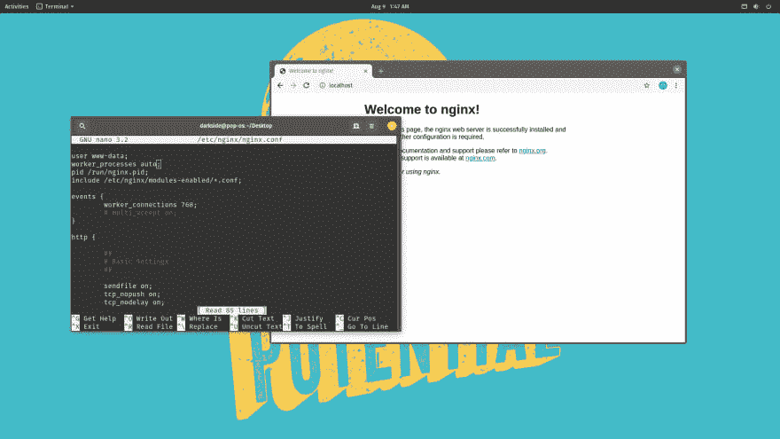](https://res.cloudinary.com/practicaldev/image/fetch/s--XQulSmFx--/c_limit%2Cf_auto%2Cfl_progressive%2Cq_auto%2Cw_880/https://i.ibb.co/FBMntZR/lin-0025-Screenshot-from-2019-08-09-01-47-04-png.jpg)

使用箭头向下移动到用户，并用你的用户名替换 www-data，在我的例子中是 darkside。还要将 worker_processes 设置为 1。

[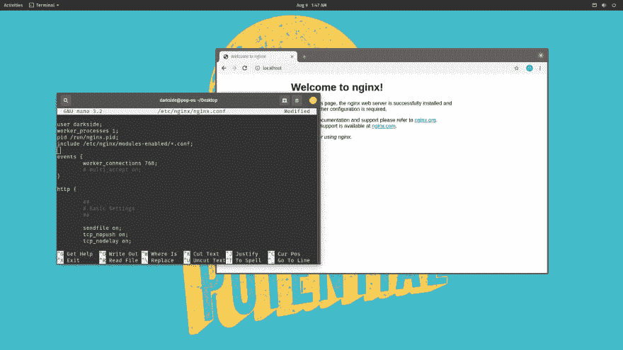](https://res.cloudinary.com/practicaldev/image/fetch/s--fCa_Z2l5--/c_limit%2Cf_auto%2Cfl_progressive%2Cq_auto%2Cw_880/https://i.ibb.co/CBq5htH/lin-0026-Screenshot-from-2019-08-09-01-47-15-png.jpg)

[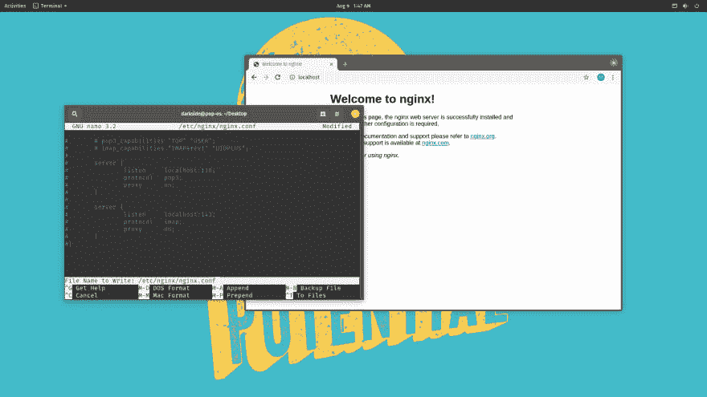](https://res.cloudinary.com/practicaldev/image/fetch/s--cKHbugvk--/c_limit%2Cf_auto%2Cfl_progressive%2Cq_auto%2Cw_880/https://i.ibb.co/tp7W8BB/lin-0027-Screenshot-from-2019-08-09-01-47-25-png.jpg)

现在要保存，请按键盘上的 Ctrl + O 并按 enter，然后按 Ctrl + X 退出。

接下来，我们需要修正 PHP 中的一些东西，比如终端类型

```
sudo nano /etc/php/7.3/fpm/pool.d/www.conf 
```

<svg width="20px" height="20px" viewBox="0 0 24 24" class="highlight-action crayons-icon highlight-action--fullscreen-on"><title>Enter fullscreen mode</title></svg> <svg width="20px" height="20px" viewBox="0 0 24 24" class="highlight-action crayons-icon highlight-action--fullscreen-off"><title>Exit fullscreen mode</title></svg>

现在向下滚动，在 user = www-data 中用你的用户名替换它 www-data，在我的例子中是 darkside，对 group 做同样的操作。

[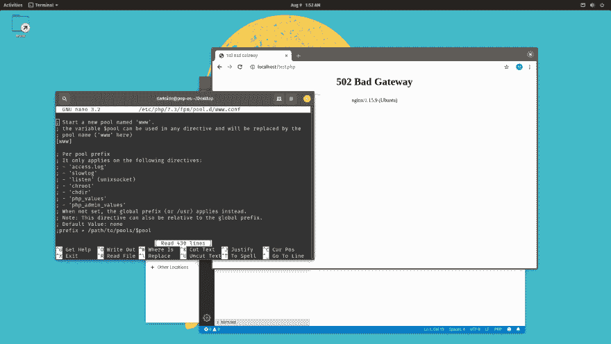](https://res.cloudinary.com/practicaldev/image/fetch/s--ETRdSF8X--/c_limit%2Cf_auto%2Cfl_progressive%2Cq_auto%2Cw_880/https://i.ibb.co/XCZJBxq/lin-0033-Screenshot-from-2019-08-09-01-52-37-png.jpg)

[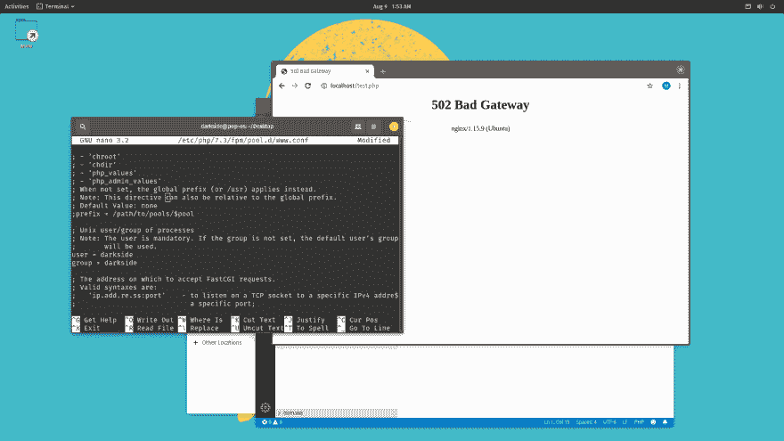](https://res.cloudinary.com/practicaldev/image/fetch/s--DUZ29E26--/c_limit%2Cf_auto%2Cfl_progressive%2Cq_auto%2Cw_880/https://i.ibb.co/QDsYmtr/lin-0034-Screenshot-from-2019-08-09-01-52-59-png.jpg)

再向下滚动一点点，你会发现 listen.owner 和 listen.group，将它们设置为你的用户名，在我的例子中是 darkside。现在按 Ctrl + O 保存，然后按 Ctrl + X 退出。

[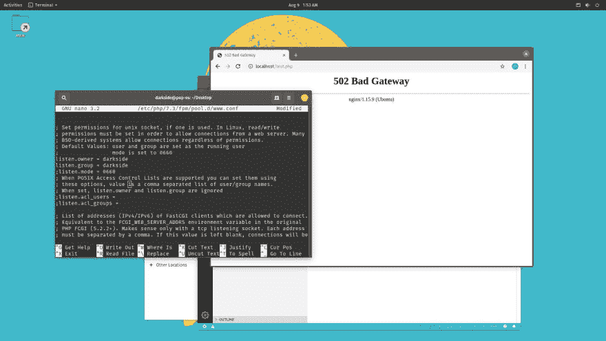](https://res.cloudinary.com/practicaldev/image/fetch/s--TUBsV5IM--/c_limit%2Cf_auto%2Cfl_progressive%2Cq_auto%2Cw_880/https://i.ibb.co/YP47gHq/lin-0035-Screenshot-from-2019-08-09-01-53-03-png.jpg)

在下面键入下一个；
T2 ``sudo nano /etc/nginx/sites-available/default`` 

 `向下滚动一点，将 index.php 添加到索引标记中，并将 server_name 设置为 localhost，如屏幕所示。

[](https://res.cloudinary.com/practicaldev/image/fetch/s--rUl058W8--/c_limit%2Cf_auto%2Cfl_progressive%2Cq_auto%2Cw_880/https://i.ibb.co/C2dRJ2G/lin-0029-Screenshot-from-2019-08-09-01-48-32-png.jpg)

接下来向下滚动一点，从 location ~中删除#标签。php$ {，这是取消注释行。同样来自 include 片段和 fastcgi_pass。fastcgi_pass 被设置为 7.0，所以我们需要将其设置为 7.3，只需转到该行的末尾，并将其设置如下

[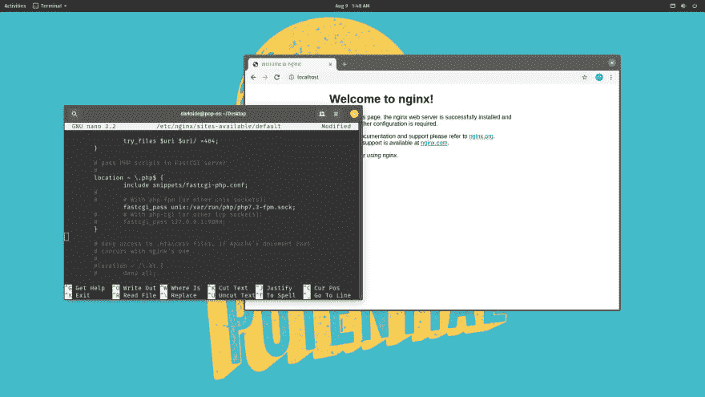](https://res.cloudinary.com/practicaldev/image/fetch/s--80zrTblU--/c_limit%2Cf_auto%2Cfl_progressive%2Cq_auto%2Cw_880/https://i.ibb.co/2yfXrZx/lin-0028-Screenshot-from-2019-08-09-01-48-24-png.jpg)

fastcgi _ pass UNIX://var/run/PHP/PHP 7.3-fpm . sock

另外，取消对大括号(})的注释。接下来按 Ctrl + O 保存，按 Ctrl +X 退出。

现在让我们重新启动 PHP 和 NGINX，并在它之前测试它。

``
sudo nginx -t`

 `sudo 服务 nginx 重新启动

sudo php-fpm7.3 -t

sudo 服务 php7.3-fpm 重启
`

 `[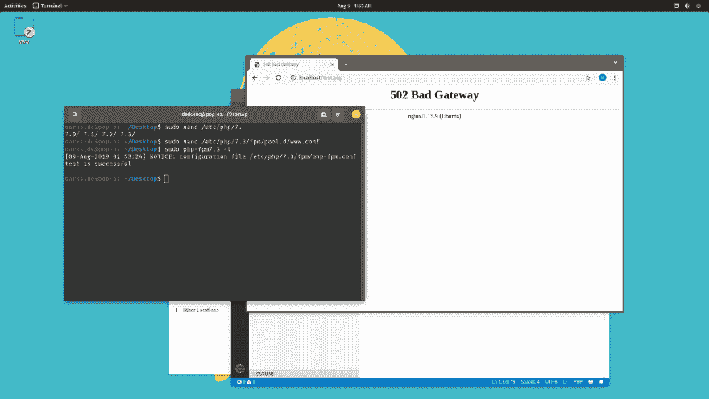](https://res.cloudinary.com/practicaldev/image/fetch/s--OhXnmfuT--/c_limit%2Cf_auto%2Cfl_progressive%2Cq_auto%2Cw_880/https://i.ibb.co/gMbsCYF/lin-0036-Screenshot-from-2019-08-09-01-53-27-png.jpg)

运行下一个命令来修复一些权限＄( whoami)变量将采用您当前登录的用户的值。

``
sudo chown-R $(whoami):$(whoami)/var/www/html/`

 `sudo chmod-R 755/var/www
` `现在让我们为将要工作的 www 目录创建一个快捷方式。在终端中键入以下内容。`

 ```sudo ln -s /var/www/ ~/Desktop/`` 

 ``[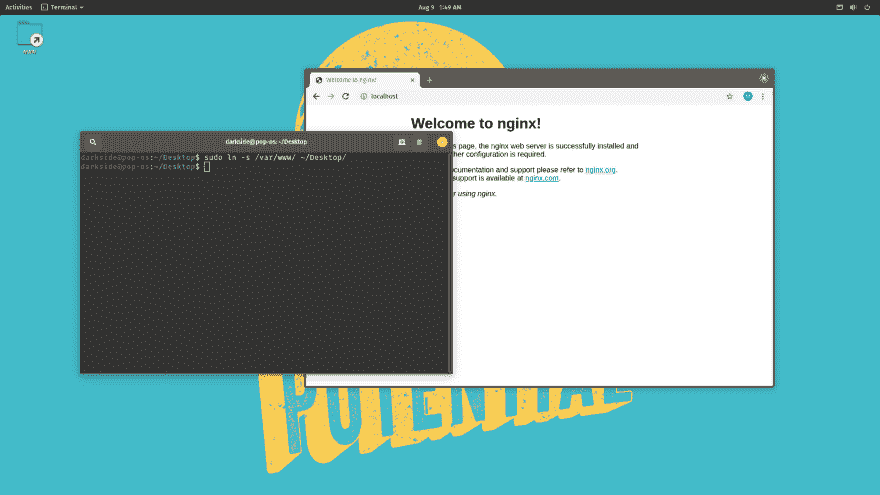](https://res.cloudinary.com/practicaldev/image/fetch/s--TnFB2DCy--/c_limit%2Cf_auto%2Cfl_progressive%2Cq_auto%2Cw_880/https://i.ibb.co/6Fw486t/lin-0030-Screenshot-from-2019-08-09-01-49-57-png.jpg)

桌面上会出现一个文件夹，这是我们工作的 web 目录。让我们打开它。

现在从活动开始，让我们打开 visual studio 代码并测试一些东西。打开它，如果你想改变主题。将文件夹拖放到 visual studio 代码中，并移除 index.nginx-debian.html 文件。

[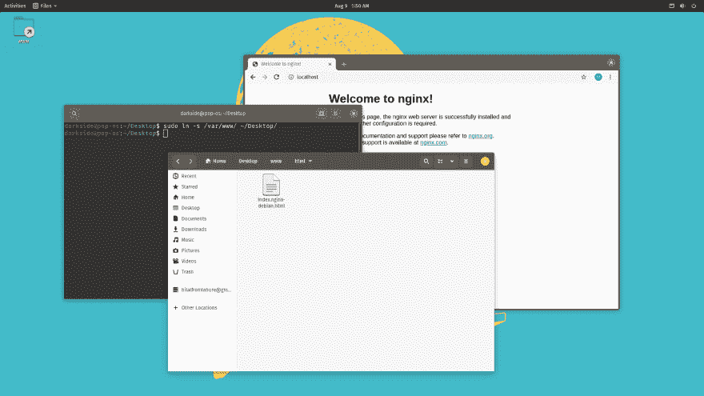](https://res.cloudinary.com/practicaldev/image/fetch/s--Sv4uY-4g--/c_limit%2Cf_auto%2Cfl_progressive%2Cq_auto%2Cw_880/https://i.ibb.co/vxKN4Sc/lin-0031-Screenshot-from-2019-08-09-01-50-06-png.jpg)

[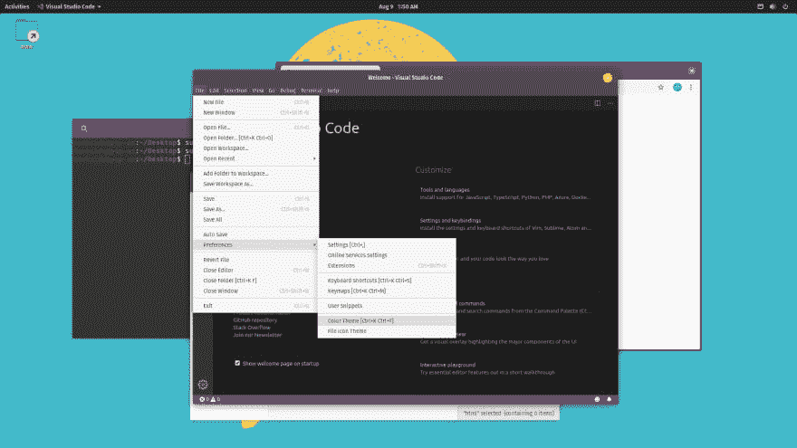](https://res.cloudinary.com/practicaldev/image/fetch/s--yLUhnv5x--/c_limit%2Cf_auto%2Cfl_progressive%2Cq_auto%2Cw_880/https://i.ibb.co/QJYBk1X/lin-0032-Screenshot-from-2019-08-09-01-50-50-png.jpg)

创建一个新的文件 index.html 和类型的任何东西。现在，如果你刷新浏览器的 [http://localhost/](http://localhost/) ，它将开始显示。

创建一个新的文件 test.php，并添加以下代码

 ``<?php phpinfo();?>`` 

 ``现在打开[http://localhost/test . php](http://localhost/test.php)，你应该看到这个屏幕，伟大的 PHP 已经启动并运行。

[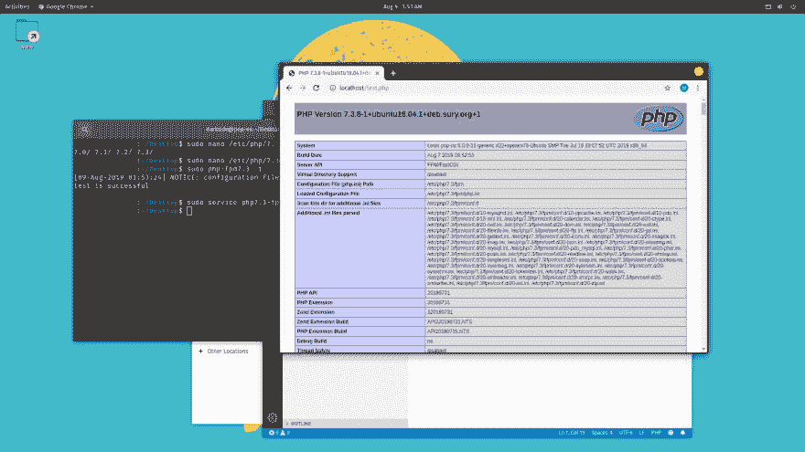](https://res.cloudinary.com/practicaldev/image/fetch/s--Qo9Ts0hx--/c_limit%2Cf_auto%2Cfl_progressive%2Cq_auto%2Cw_880/https://i.ibb.co/tBmbLqc/lin-0037-Screenshot-from-2019-08-09-01-53-40-png.jpg)

现在我们需要数据库服务器，所以我们将安装 mariadb。在终端中键入以下内容。

 ``sudo apt-key adv --recv-keys --keyserver hkp://keyserver.ubuntu.com:80 0xF1656F24C74CD1D8`` 

 ``[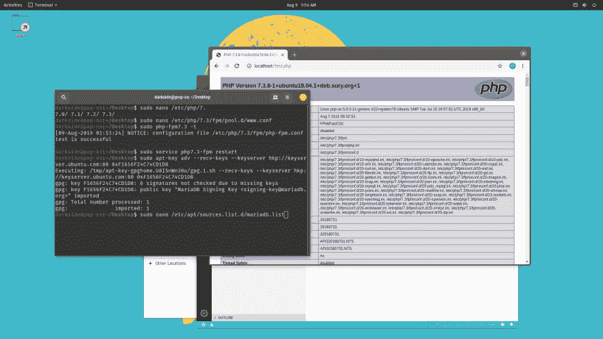](https://res.cloudinary.com/practicaldev/image/fetch/s--sZak4rmf--/c_limit%2Cf_auto%2Cfl_progressive%2Cq_auto%2Cw_880/https://i.ibb.co/CBRYykJ/lin-0038-Screenshot-from-2019-08-09-01-54-14-png.jpg)

sudo nano/etc/apt/sources . list . d/Maria db . list

粘贴下面的

 `# MariaDB 10.3 资源库

deb [arch=amd64，arm64，PPC 64 El][http://sfo 1 . mirrors . digital ocean . com/Maria db/repo/10.3/Ubuntu](http://sfo1.mirrors.digitalocean.com/mariadb/repo/10.3/ubuntu)仿生主

deb-src[http://sfo 1 . mirrors . digital ocean . com/Maria db/repo/10.3/Ubuntu](http://sfo1.mirrors.digitalocean.com/mariadb/repo/10.3/ubuntu)仿生主

`

 `[](https://res.cloudinary.com/practicaldev/image/fetch/s--d3QhPZd4--/c_limit%2Cf_auto%2Cfl_progressive%2Cq_auto%2Cw_880/https://i.ibb.co/g4fXJ1c/lin-0039-Screenshot-from-2019-08-09-01-54-24-png.jpg)

按 Ctrl + O 保存，按 Ctrl + X 退出。

接下来键入以下内容；

``
须藤 apt 更新`

 `sudo 安装 mariadb-server

`

 `现在安装将开始，您将被提示输入密码。输入任何东西，我输入 noob。它会再次要求重打。

[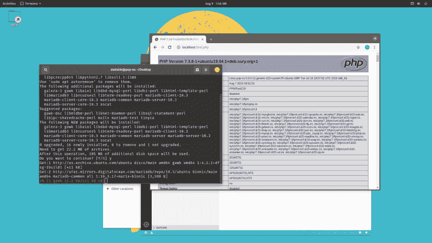](https://res.cloudinary.com/practicaldev/image/fetch/s--MVNINn-8--/c_limit%2Cf_auto%2Cfl_progressive%2Cq_auto%2Cw_880/https://i.ibb.co/vDhFXL8/lin-0040-Screenshot-from-2019-08-09-01-56-38-png.jpg)

完成后，键入以下命令检查数据库服务器

``
sudo systmectl 状态 mariadb`

 ``

 `[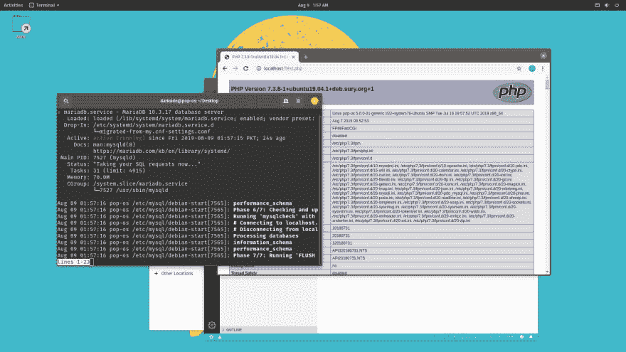](https://res.cloudinary.com/practicaldev/image/fetch/s--YfDrIVCt--/c_limit%2Cf_auto%2Cfl_progressive%2Cq_auto%2Cw_880/https://i.ibb.co/mtQXFfV/lin-0041-Screenshot-from-2019-08-09-01-57-42-png.jpg)

它应该是绿色的活动运行。干得好！现在拍拍自己。现在，键入以下命令连接到数据库服务器

``
mysql -u root -p`

 ``

 `[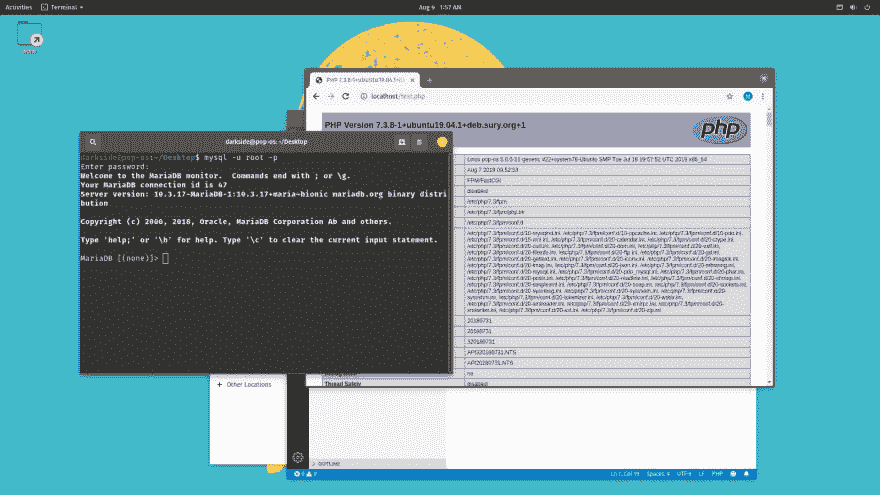](https://res.cloudinary.com/practicaldev/image/fetch/s--wK_0AjMM--/c_limit%2Cf_auto%2Cfl_progressive%2Cq_auto%2Cw_880/https://i.ibb.co/hgcCXXb/lin-0042-Screenshot-from-2019-08-09-01-57-55-png.jpg)

[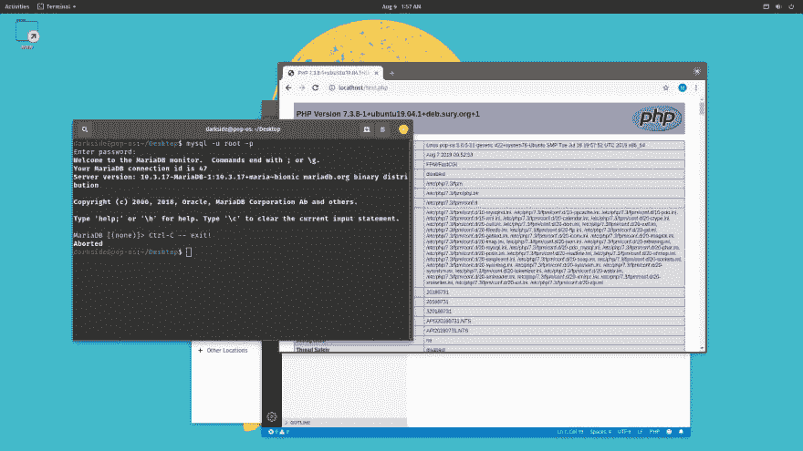](https://res.cloudinary.com/practicaldev/image/fetch/s--8GaWQTfy--/c_limit%2Cf_auto%2Cfl_progressive%2Cq_auto%2Cw_880/https://i.ibb.co/C5j4gGV/lin-0043-Screenshot-from-2019-08-09-01-57-58-png.jpg)

按 Ctrl + C 退出。

现在打开 MySQL workbench，您可以在那里配置设置，通过单击加号创建一个新的连接。

[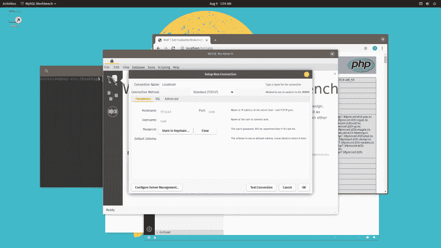](https://res.cloudinary.com/practicaldev/image/fetch/s--0W4uAoBS--/c_limit%2Cf_auto%2Cfl_progressive%2Cq_auto%2Cw_880/https://i.ibb.co/TR7hfv2/lin-0044-Screenshot-from-2019-08-09-01-59-15-png.jpg)

[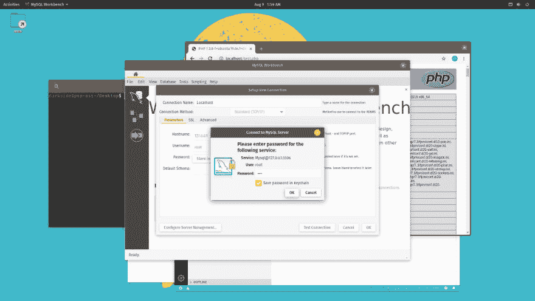](https://res.cloudinary.com/practicaldev/image/fetch/s--wnEo7pN0--/c_limit%2Cf_auto%2Cfl_progressive%2Cq_auto%2Cw_880/https://i.ibb.co/2yVF7nC/lin-0045-Screenshot-from-2019-08-09-01-59-22-png.jpg)

在我的例子中，点击 Test Connection 并输入密码

用户名:root

密码:noob

[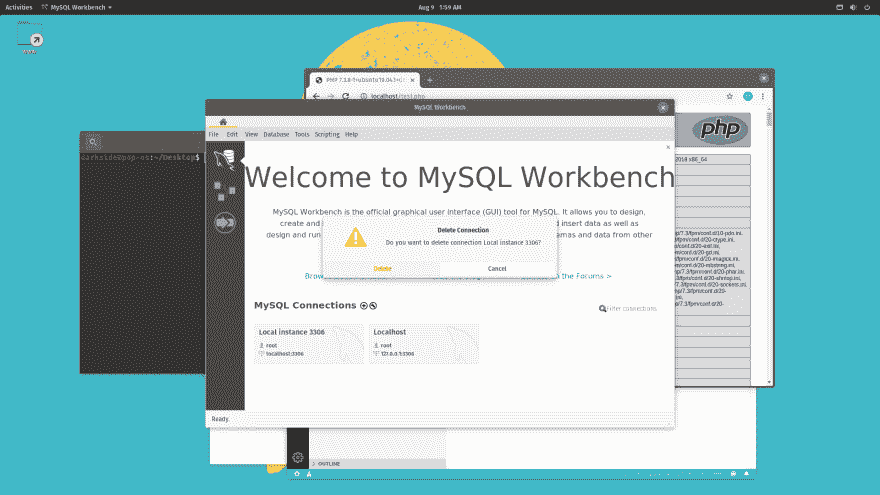](https://res.cloudinary.com/practicaldev/image/fetch/s--owLFOvzZ--/c_limit%2Cf_auto%2Cfl_progressive%2Cq_auto%2Cw_880/https://i.ibb.co/JCMxQTK/lin-0046-Screenshot-from-2019-08-09-01-59-30-png.jpg)

将密码存储在钥匙串中，然后点按“好”

删除默认连接，它有时会出错。

[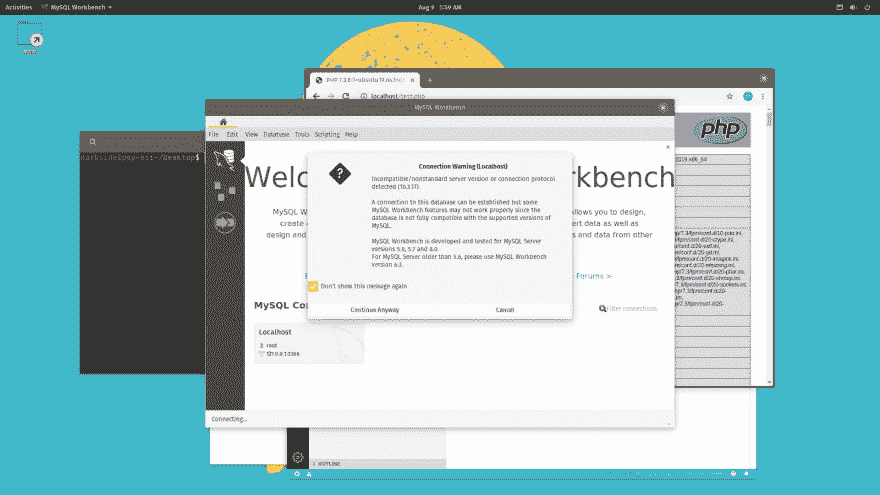](https://res.cloudinary.com/practicaldev/image/fetch/s--h4iJQ2gy--/c_limit%2Cf_auto%2Cfl_progressive%2Cq_auto%2Cw_880/https://i.ibb.co/djF0npM/lin-0047-Screenshot-from-2019-08-09-01-59-34-png.jpg)

现在双击它，选中不再显示，然后点击继续。

我们想做的最后一件事是安装一个著名的数据库工具 phpmyadmin。打开 chrome，前往[http://phpmyadmin.net/downloads/](http://phpmyadmin.net/downloads/)，点击下载 4.9。它将下载一个压缩文件。

将其解压缩到 www/html 目录。

[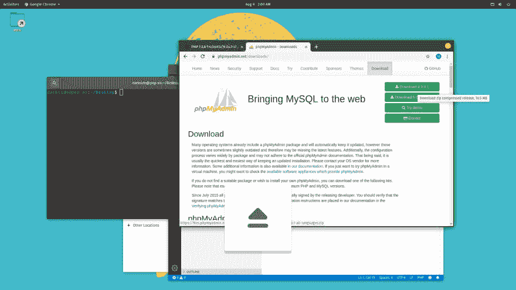](https://res.cloudinary.com/practicaldev/image/fetch/s--QitwhXVL--/c_limit%2Cf_auto%2Cfl_progressive%2Cq_auto%2Cw_880/https://i.ibb.co/qr5wGfs/lin-0048-Screenshot-from-2019-08-09-02-00-29-png.jpg)

[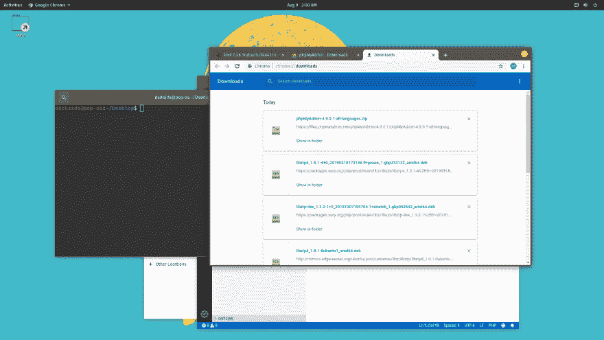](https://res.cloudinary.com/practicaldev/image/fetch/s--aaNaL9gi--/c_limit%2Cf_auto%2Cfl_progressive%2Cq_auto%2Cw_880/https://i.ibb.co/NnZtYb7/lin-0049-Screenshot-from-2019-08-09-02-00-35-png.jpg)

[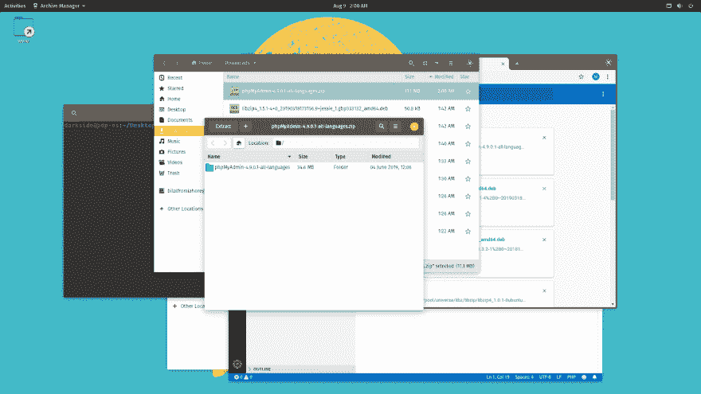](https://res.cloudinary.com/practicaldev/image/fetch/s--SbHCd0Zr--/c_limit%2Cf_auto%2Cfl_progressive%2Cq_auto%2Cw_880/https://i.ibb.co/1qzg84R/lin-0050-Screenshot-from-2019-08-09-02-00-44-png.jpg)

[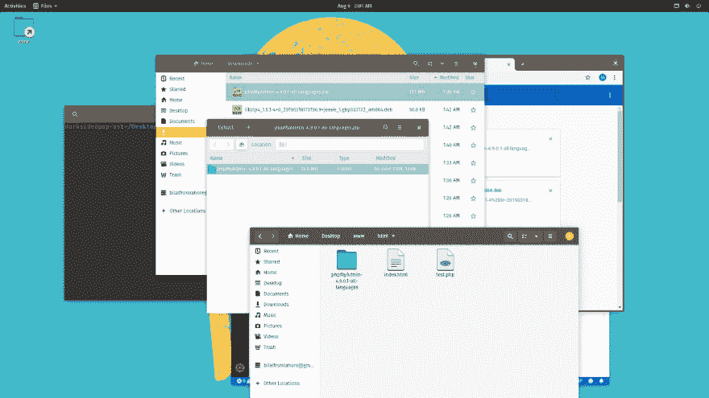](https://res.cloudinary.com/practicaldev/image/fetch/s--vfv0wOhW--/c_limit%2Cf_auto%2Cfl_progressive%2Cq_auto%2Cw_880/https://i.ibb.co/bmKfL5P/lin-0051-Screenshot-from-2019-08-09-02-01-08-png.jpg)

现在重命名为 phpmyadmin。

[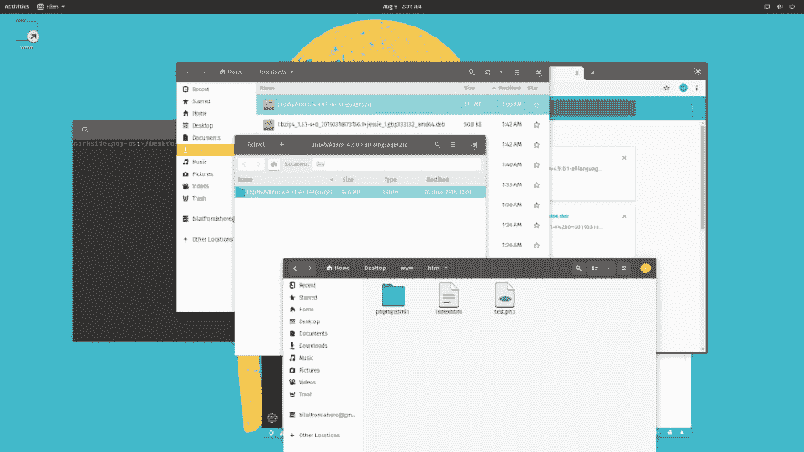](https://res.cloudinary.com/practicaldev/image/fetch/s--S81BBjct--/c_limit%2Cf_auto%2Cfl_progressive%2Cq_auto%2Cw_880/https://i.ibb.co/HKk8JB8/lin-0052-Screenshot-from-2019-08-09-02-01-16-png.jpg)

[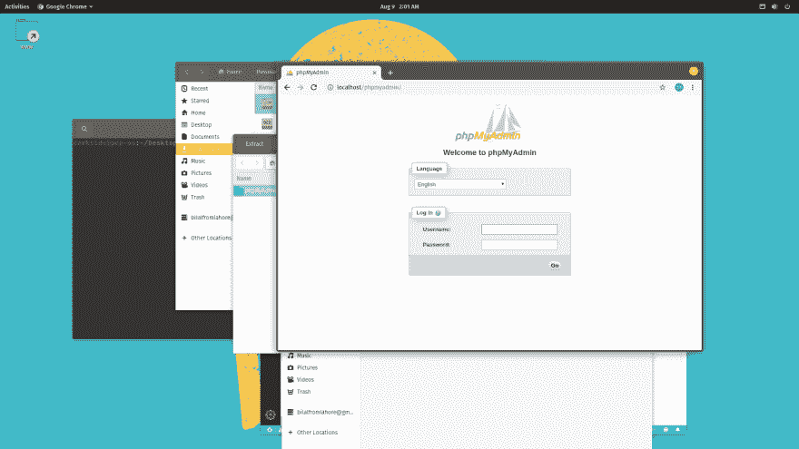](https://res.cloudinary.com/practicaldev/image/fetch/s--iqlW7dya--/c_limit%2Cf_auto%2Cfl_progressive%2Cq_auto%2Cw_880/https://i.ibb.co/w0HXh6N/lin-0053-Screenshot-from-2019-08-09-02-01-28-png.jpg)

现在，如果您打开 http://localhost/phpmyadmin ，您应该会看到这个页面，您的数据库凭证将在这里工作。

[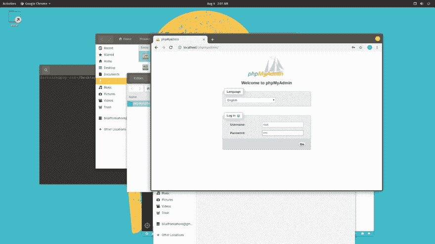](https://res.cloudinary.com/practicaldev/image/fetch/s--INKvxciO--/c_limit%2Cf_auto%2Cfl_progressive%2Cq_auto%2Cw_880/https://i.ibb.co/ysDtHLn/lin-0054-Screenshot-from-2019-08-09-02-01-31-png.jpg)

伟大的家伙！干杯喝杯啤酒，咖啡，茶，庆祝一下我们现在有了一个完整的 linux 开发环境。

[Noob 指数](https://dev.to/th3n00bc0d3r/noob-guides-index-4mne)```````````````````