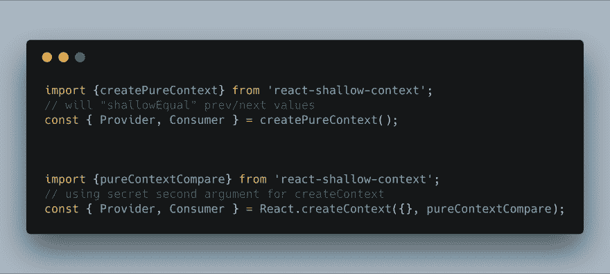

# 我，回顾一年

> 原文：<https://dev.to/thekashey/me-a-year-in-review-35oh>

> “我”——37 岁的 Atlassian 高级 JavaScript 开发人员，3 个男孩和一只缅因猫的父亲，外加活跃的开源贡献者。

有时候回顾一下，回忆一下你做过的事情是很好的。今天，我会试着记起我在过去一年中创造的所有东西，就像我刚刚在工作中为我的*绩效评估*所做的那样，但这次与开源相关。只是关于你可能感兴趣的东西。

为什么是今天？今天是我的生日！

> *   Cycle: August 9th, 2018-> August 9th, 2019
> *   26 articles, 4 non-technical articles-one article every two weeks
> *   618 Submission-4 submissions per day!
> *   92 PRs and 124 PRS
> *   ~20 new projects, 161 in total

## 80 年 8 月 19 日回购提交

*   将[gae Aron/react-side-effect](https://github.com/gaearon/react-side-effect)替换为[kashey/react-client side-effect](https://github.com/theKashey/react-clientside-effect)以使我的“单例”组件，如 [react-focus-lock](https://github.com/theKashey/react-focus-lock) 更加 SSR 友好，并且更加轻量级。
*   与[反应动力插头](https://github.com/renatorib/react-powerplug)组队。一个可怕的无头状态容器，它是钩子之前的钩子。我节省了很多时间！
*   创建了 [react-push-channel](https://github.com/theKashey/react-push-channel) 来解决异步 SSR 的“头盔”渲染。基本上这是一个声明形式的回调。

### 📖文章

文章介绍**部分水合和渐进式代码拆分** - [反应-导入-组件](https://github.com/theKashey/react-imported-component)和[反应-预渲染-组件](https://github.com/theKashey/react-prerendered-component)我之前已经创建了一点。
[https://medium . com/@ antonkorzunov/react-server-side-code-splitting-made-again-a 61f 8 cbbd 64 b](https://medium.com/@antonkorzunov/react-server-side-code-splitting-made-again-a61f8cbbd64b)

[反应-移除](https://github.com/theKashey/react-remock)的案例研究及其在浅/安装测试中的使用。处理渲染道具和*糖*的简单方法。
T5】https://medium . com/hacker noon/why-I-always-use-shallow-rendering-a 3a 50 da 60942

我的**第一次📷博文** -我在美丽澳洲的一天:
[https://medium . com/@ antonkorzunov/one-day-of-a-js-developer-in-Sydney-from-50mm-1-8-0-3ev-point-of-view-5a 65 aa 081905](https://medium.com/@antonkorzunov/one-day-of-a-js-developer-in-sydney-from-50mm-1-8-0-3ev-point-of-view-5a65aa081905)

我对 Redux 的遗嘱。你可能需要它。
[https://codeburst.io/you-probably-need-redux-e0c49ab4d98f](https://codeburst.io/you-probably-need-redux-e0c49ab4d98f)

## 112 年 9 月提交 24 个回购

*   跳入 React/Redux/Context [优化](https://github.com/reduxjs/react-redux/pull/1021)。带走的是【已知用法的 T2】-一个简单的*对象键用法跟踪器*和[反应事件范围](https://github.com/theKashey/react-event-horizon) -只是一个声明性的事件挂起器。
*   发布的 [plimited](https://github.com/theKashey/plimited) -一个基于承诺的小型连接池，我已经创建了它来根据我们的需要控制木偶师。从那以后就没见过更有用的了。>“连接池测试”是我们技术面试中的常见问题。a 见过几十次受访者如何试图在 10 分钟内实现它，并花了几天时间做同样的事情。

### 📖文章

什么是不变性，为什么需要不变性？
[https://itnext.io/immutable-vs-immutable-js-d524bf515bcd](https://itnext.io/immutable-vs-immutable-js-d524bf515bcd)

## 115 年 10 月提交 27 次回购

*   创建了 [runtime-compress-loader](https://github.com/theKashey/runtime-compress-loader) 来移除内嵌到 every 文件中的 babel(或 ts)助手的负担。结果是一个更小的包，更热(更快)的代码！
*   创建了 [jsx-compress-loader](https://github.com/theKashey/jsx-compress-loader) 来代替`$JSX$`对`React.createElement`的所有调用。结果是更小的包大小和更好的运行时性能。
*   创建了[反应-浅层-上下文](https://github.com/theKashey/react-shallow-context)浅层反应。上下文，这是解决一些常见的上下文相关问题的好方法

> 安东·科尔祖诺夫[@ the kashey](https://dev.to/thekashey)React 有 PureComponents 和 shouldComponentUpdate。
> 上下文 API...也支持这种东西——通过 React.createContext
> 
> 让我在这里帮你——React-shallow-context 会为你做这项工作。
> 
> 代替 memo ization——只需使用 createPureContext02:17am-04 2018 年 10 月835

*   还创建了一个非常有用的 [react-event-injector](https://github.com/theKashey/react-event-injector) 来处理被动(或主动)事件。从那以后再也没用过。
*   将 aria 隐藏代码从 reach-ui/smooth-ui 提取到...[咏叹调——隐藏的](https://github.com/theKashey/aria-hidden)。
*   打开关于[受控类型比较](https://github.com/reactjs/rfcs/pull/74)的 React RFC。今天所有的热重装都是基于这个原则。

### 📖文章

一个让你的 SSR 做得更好的“嘲讽”方法。或者只是可能。我所知道的关于**依赖和模块管理**的一切。

[https://medium . com/hacker noon/SSR-dependency-mocking-is-the-answer-d8d 8 c 371 aa 94](https://medium.com/hackernoon/ssr-dependency-mocking-is-the-answer-d8d8c371aa94)

## 141 年 11 月提交 18 次回购

*   没有新项目:)

### 📖文章

使用`rewiremock`和`react-remock`来控制你的故事书。因为你能，而不是因为你应该。

[https://medium . com/@ antonkorzunov/rewrite-a-story book-AE 4682176 cc 3](https://medium.com/@antonkorzunov/rewrite-a-storybook-ae4682176cc3)

## 106 年 12 月 20 次回购提交

*   又没有新项目了

*   🙀将 DEV 加入🙀

### 📖文章

React-Hot-Loader 4.6 是一大进步(正如我最近所想的)。

 [## 反应热加载器 4.6

### 安东·科尔祖诺夫 12 月 13 日 183 分钟阅读

#javascript #react #devtools](/thekashey/react-hot-loader-46-3d7c)

测试有限反应元件。从那以后我设计的主要方法。

 [## 有限战争

### 安东·科尔祖诺夫 1 月 1 日 196 分钟阅读

#react #testing #javascript](/thekashey/infinite-war-995)

## 102 年 1 月提交 20 次回购

*   创造了[反应-移除-滚动](https://github.com/theKashey/react-remove-scroll)作为[反应-滚动-锁定](https://github.com/theKashey/react-scroll-locky)的缩小版。不是为了好玩而创作，而是为了`reach-ui`。

## 83 年 2 月 11 次回购提交

*   创造了[移交](https://github.com/theKashey/devolution) -一个你的包的通天塔。一种非常简单(也非常快速)的方式来发布现代和遗留包，以及在 node_modules 中使用 es6。
*   创建了[二手样式](https://github.com/theKashey/used-styles)，一个在 SSR 过程中提取二手样式的工具。再解决一个问题，那就太棒了！

## 107 年 3 月 24 日回购提交

*   创建了 [kashe](https://github.com/theKashey/kashe) ，作为基于弱映射的记忆库。
*   普及的[多入口点-示例](https://github.com/theKashey/multiple-entry-points-example)发货模式:)多入口点。

### 📖文章

嘲讽是一个强大的模式，这里是为什么:
[https://medium . com/@ antonkorzunov/a-JavaScript-mocking-case-65 f 67 ab 9 F6 d 2](https://medium.com/@antonkorzunov/a-javascript-mocking-case-65f67ab9f6d2)

所有客户端和服务器端代码拆分解决方案概述。

 [## 💡2019 年反应代码拆分

### 安东·科尔祖诺夫 3 月 19 日 19 时 7 分读取

#react #javascript #ssr #codesplitting](/thekashey/react-code-splitting-in2019-3cmg)

CSS 正确排序可能很难，有一个简单的方法，或者让我们称之为模式，来解决这个问题。

 [## 《哈利·波特与 CSS 的秩序》

### 安东·科尔祖诺夫 3 月 25 日 19 时 10 分阅读

#css #stylelint #order #styleguide](/thekashey/happy-potter-and-the-order-of-css-5ec)

## 86 年 4 月 16 次回购提交

*   试图创建[用户选择](https://github.com/theKashey/useReselect)——一个`reselect`的`kashe`动力版本。
*   在我的朋友戴的帮助下，我的速度比快了两倍。

### 📖文章

React 组件的超快速同步客户端/服务器端缓存。

 [## 🧠新的反应和旧的缓存

### 安东·科尔祖诺夫 4 月 3 日 196 分钟阅读

#react #cache #ssr](/thekashey/a-new-react-and-the-old-cache-15h5)

现代记忆是一件困难的事情。一个关于它的大案例研究。

 [## 记忆勿忘我炸弹

### Anton Korzunov 4 月 1 日 1912 分钟阅读

#javascript #cache #memoization #optimization](/thekashey/memoization-forget-me-bomb-34kh)

基于对象密钥使用的记忆(如 MobX)证明。

 [## 我如何编写世界上最快的记忆库

### 安东·科尔祖诺夫 4 月 16 日 19 时 11 分阅读

#memoization #javascript #proxy #weakmap](/thekashey/how-i-wrote-the-world-s-fastest-memoization-library-34io)

为什么`sinon`和`proxyquire`不好，为什么`rewiremock`稍微好一点。

 [## 请不要玩 proxyquire 了

### 安东·科尔祖诺夫 4 月 29 日 19 时 12 分阅读

#javascript #node #mocking #proxyquire](/thekashey/please-stop-playing-with-proxyquire-11j4)

## 103 年 5 月在 20 个回购中提交

*   发布[边车图案](https://github.com/theKashey/use-sidecar)
*   开源 [my-sql-files](https://github.com/theKashey/my-sql-files) -基于 mysql 的小文件存储
*   并使[rewiremock](https://github.com/theKashey/rewiremock)ESM 兼容

### 📖文章

边车(我称之为蝙蝠侠/罗宾)代码分割模式
[https://dev.to/thekashey/sidecar-for-a-code-splitting-1o8g](https://dev.to/thekashey/sidecar-for-a-code-splitting-1o8g)

使用`react-remock`让快照测试变得更容易忍受

 [## 反应浅层快照

### 安东·科尔祖诺夫 5 月 16 日 194 分钟阅读

#react #testing #snapshots #mocking](/thekashey/reach-shallow-snapshot-506)

一个浏览器驱动的“html 状态”如何取代 js 驱动的“组件状态”的例子。

 [## 请看 HTML 状态

### 安东·科尔祖诺夫 5 月 21 日 1915 分钟阅读

#redux #state #html #a11y](/thekashey/behold-the-html-state-5e8b)

## 153 年 6 月 17 次回购提交

*   已创建[使用-回调-引用](https://github.com/theKashey/use-callback-ref)。应该在 react 标准里！
*   修正了[的尺寸限制](https://github.com/ai/size-limit)一点
*   用`sidecar`让[反应——对焦——锁定](https://github.com/theKashey/react-focus-lock)和[好友](https://github.com/theKashey/react-focus-on)至少小两倍。

### 📖文章

`createRef`，`useRef`，参太多，而且都不一样。`useCallbackRef`这一次。

 [## 同一个 useRef，但是它会回调🤙

### Anton Korzunov 6 月 22 日 193 分钟阅读

#react #ref #hooks](/thekashey/the-same-useref-but-it-will-callback-8bo)

📷React Sydney
[报道 https://medium . com/@ antonkorzunov/React Sydney-June-19-50mm-49de 33 daed 8 b](https://medium.com/@antonkorzunov/reactsydney-june-19-50mm-49de33daed8b)

📷来自 syd js
T1】的报道 https://medium . com/@ antonkorzunov/syd js-jun-2019-AWS-showcase-93265 E4 d0e 10

## 115 年 7 月 17 次回购中的提交

*   没有新的(有趣的)项目

### 📖文章

这是一篇关于我们为自己创造的对抗复杂性的永无止境的文章。

 [## 分块吃熊

### 安东·科尔祖诺夫 7 月 31 日 19 时 16 分阅读

#redux #react #javascript #complexity](/thekashey/eat-bear-in-parts-3f0o)

没有单元测试和集成测试这样的东西。It **需求**和**实现**测试。

 [## 更喜欢集成测试？重新考虑

### 安东·科尔祖诺夫 7 月 29 日 196 分钟阅读

#testing #webdev #codequality #tdd](/thekashey/prefer-integration-tests-think-twice-1l6d)

📷React Sydney
T1】报道 https://medium . com/@ antonkorzunov/React-Sydney-45-1 d52 c 061 a3 a5

## 八月

*   🍺

📷React Sydney
[报道 https://medium . com/@ antonkorzunov/React-Sydney-46-bfe 5 fa 4 fc 658](https://medium.com/@antonkorzunov/react-sydney-46-bfe5fa4fc658)