# useEffect 与 useLayoutEffect，使用简单易懂的语言

> 原文：<https://dev.to/bnevilleoneill/useeffect-vs-uselayouteffect-in-plain-approachable-language-1943>

**由[ohan Emmanuel](https://blog.logrocket.com/author/ohansemmanuel/)**编写

在你认为这是另一篇“基本的”React 文章之前，我建议你慢一点。

假设你真的理解了`useEffect`和`useLayoutEffect`的区别，你能简单解释一下这个区别吗？你能用具体、实际的例子描述它们的细微差别吗？

[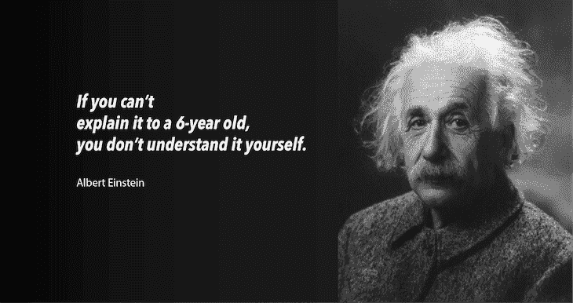](https://res.cloudinary.com/practicaldev/image/fetch/s--v2qQwSko--/c_limit%2Cf_auto%2Cfl_progressive%2Cq_auto%2Cw_880/https://i0.wp.com/blog.logrocket.com/wp-content/uploads/2019/08/einstein-explain-six-year-old.png%3Fresize%3D730%252C386%26ssl%3D1)

可以吗？

你将要阅读的内容可以说是你在互联网上任何地方都能找到的最简单的主题。我将用具体的例子来描述`useEffect`和`useLayoutEffect`之间的区别，这将帮助你在需要的时候巩固你的理解。

让我们开始吧。

[](https://logrocket.com/signup/)

## `useEffect`和`useLayoutEffect`的实际区别是什么？

散布在官方[钩子 API 参考](https://reactjs.org/docs/hooks-reference.html)上的是指向`useEffect`和`useLayoutEffect`区别的指针。

也许其中最突出的是在第一段[中发现的](https://reactjs.org/docs/hooks-reference.html#uselayouteffect)详细描述了`useLayoutEffect`钩子:

> "签名与`useEffect`相同，但是它在所有 DOM 突变后同步触发."

上面句子中的第一个从句很容易理解。两个钩子的签名是一样的。`useEffect`的签名如下所示:

```
useEffect(() => {
  // do something
}, ) 
```

<svg width="20px" height="20px" viewBox="0 0 24 24" class="highlight-action crayons-icon highlight-action--fullscreen-on"><title>Enter fullscreen mode</title></svg> <svg width="20px" height="20px" viewBox="0 0 24 24" class="highlight-action crayons-icon highlight-action--fullscreen-off"><title>Exit fullscreen mode</title></svg>

`useLayoutEffect`的签名完全一样！

```
useLayoutEffect(() => {
  // do something
}, ) 
```

<svg width="20px" height="20px" viewBox="0 0 24 24" class="highlight-action crayons-icon highlight-action--fullscreen-on"><title>Enter fullscreen mode</title></svg> <svg width="20px" height="20px" viewBox="0 0 24 24" class="highlight-action crayons-icon highlight-action--fullscreen-off"><title>Exit fullscreen mode</title></svg>

事实上，如果你遍历一个代码库，用`useLayoutEffect`替换每一个`useEffect`调用，虽然不同，但这在大多数情况下都会起作用。

例如，我从[的 React Hooks Cheatsheet](https://react-hooks-cheatsheet.com/examples/fetching-data) 中取了一个例子，它从一个远程服务器获取数据，并将实现改为使用`useLayoutEffect`而不是`useEffect`。

[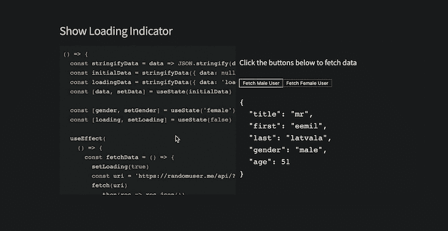](https://res.cloudinary.com/practicaldev/image/fetch/s--cKt5LzAB--/c_limit%2Cf_auto%2Cfl_progressive%2Cq_66%2Cw_880/https://i2.wp.com/blog.logrocket.com/wp-content/uploads/2019/08/data-fetching-example.gif%3Fresize%3D730%252C378%26ssl%3D1)

还能用！

因此，我们在这里建立了第一个重要的事实:`useEffect`和`useLayoutEffect`具有相同的签名。因此，很容易假设这两个钩子的行为方式相同。然而，上述引文的第二部分对大多数人来说有点模糊:

> “…它会在所有 DOM 突变后同步触发。”

`useEffect`和`useLayoutEffect`的区别仅仅在于被解雇时的*。*

请继续阅读。

## 一个 5 岁孩子的解释

考虑以下人为的反应用:

```
function Counter() {
    const [count, setCount] = useState(0)
    useEffect(() => {
      // perform side effect
      sendCountToServer(count)
    }, [count])
    <div>
        <h1> {`The current count is ${count}`} </h1>
        <button onClick={() => setCount(count => count + 1)}>
            Update Count
        </button>
</div> }
// render Counter
<Counter /> 
```

<svg width="20px" height="20px" viewBox="0 0 24 24" class="highlight-action crayons-icon highlight-action--fullscreen-on"><title>Enter fullscreen mode</title></svg> <svg width="20px" height="20px" viewBox="0 0 24 24" class="highlight-action crayons-icon highlight-action--fullscreen-off"><title>Exit fullscreen mode</title></svg>

当组件被安装时，以下内容被绘制到用户的浏览器:

```
// The current count is 0 
```

<svg width="20px" height="20px" viewBox="0 0 24 24" class="highlight-action crayons-icon highlight-action--fullscreen-on"><title>Enter fullscreen mode</title></svg> <svg width="20px" height="20px" viewBox="0 0 24 24" class="highlight-action crayons-icon highlight-action--fullscreen-off"><title>Exit fullscreen mode</title></svg>

随着按钮的每一次点击，计数器状态被更新，DOM 突变被打印到屏幕上，并且效果函数被触发。

我想请你拓展一下你的视觉想象力，但事实是这样的:

**1。用户执行一个动作，即点击按钮。**

**2。React 在内部更新计数状态变量。**

**3。React 处理 DOM 变异。**

随着点击而来的是状态更新，这又触发了 DOM 突变，即，对 DOM 的改变。`h1`元素的文本内容必须从“当前计数是 ***先前值*** ”更改为“当前计数是 ***新值*** ”

[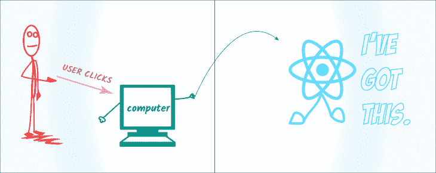](https://res.cloudinary.com/practicaldev/image/fetch/s--eCqnFMl3--/c_limit%2Cf_auto%2Cfl_progressive%2Cq_auto%2Cw_880/https://i0.wp.com/blog.logrocket.com/wp-content/uploads/2019/08/state-update-illustration.png%3Fresize%3D730%252C290%26ssl%3D1)

**4。浏览器将这个 DOM 更改绘制到浏览器的屏幕上。**

上面的步骤 1、2 和 3*没有*向用户显示任何视觉变化。只有在浏览器描绘了 DOM 的变化/突变之后，用户才真正看到变化；没有浏览器绘画，没有对用户的视觉改变。

React 将关于 DOM 变化的细节交给浏览器引擎，浏览器引擎计算出将变化绘制到屏幕上的整个过程。理解下一步对讨论的主题至关重要。

**5。只有在浏览器绘制了 DOM 变化之后，才会触发`useEffect`函数。**

这里有一个插图可以帮助你记住整个过程。

[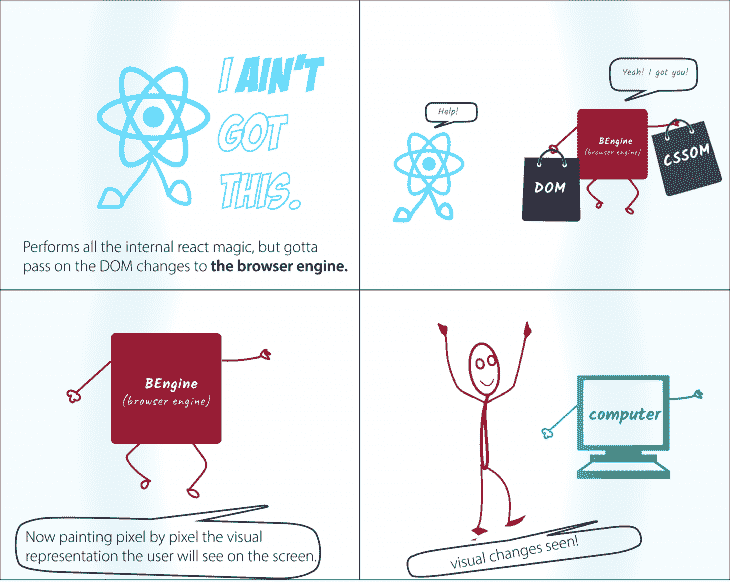](https://res.cloudinary.com/practicaldev/image/fetch/s--R1d5mZ2k--/c_limit%2Cf_auto%2Cfl_progressive%2Cq_auto%2Cw_880/https://i2.wp.com/blog.logrocket.com/wp-content/uploads/2019/08/browser-painting-illustration.png%3Fresize%3D730%252C582%26ssl%3D1)

这里要注意的是，传递给`useEffect`的函数将在 DOM 改变被绘制到屏幕上之后，只在被触发*。*

你会发现官方文档是这样写的:传递给`useEffect`的函数将在渲染提交给屏幕后运行*。*

[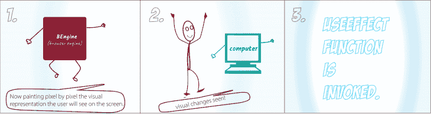](https://res.cloudinary.com/practicaldev/image/fetch/s--LQWGvXnB--/c_limit%2Cf_auto%2Cfl_progressive%2Cq_auto%2Cw_880/https://i1.wp.com/blog.logrocket.com/wp-content/uploads/2019/08/useeffect-function-illustration.png%3Fresize%3D730%252C193%26ssl%3D1)

从技术上讲，effect 函数是异步触发的，不会阻塞浏览器的绘制过程。从上图中不明显的是，对于大多数 DOM 突变来说，这仍然是一个非常快的操作。如果`useEffect`函数本身触发了另一个 DOM 突变，这发生在第一个之后，但是这个过程通常非常快。

**注意:**虽然`useEffect`被推迟到浏览器完成绘制之后，但它肯定会在任何新的渲染之前触发。React 将总是在开始新的更新之前刷新以前的渲染效果。

现在，这和`useLayoutEffect`钩子有什么不同？

与`useEffect`不同，传递给`useLayoutEffect`钩子的函数在所有 DOM 突变之后被同步**触发**。

[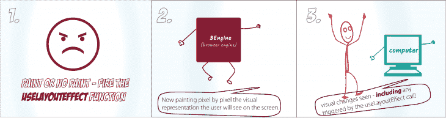](https://res.cloudinary.com/practicaldev/image/fetch/s--o2DF6dCu--/c_limit%2Cf_auto%2Cfl_progressive%2Cq_auto%2Cw_880/https://i2.wp.com/blog.logrocket.com/wp-content/uploads/2019/08/uselayouteffect-function-illustration.png%3Fresize%3D730%252C193%26ssl%3D1)

简单来说，`useLayoutEffect`并不真正关心浏览器是否画出了 DOM 的变化。它在计算出 DOM 突变后立即触发该函数。

虽然这看起来不太理想，但是在特定的用例中非常鼓励这样做。例如，必须对用户可见的 DOM 突变应该在下一次绘制之前同步触发。这使得用户不会感觉到视觉上的不一致。我将在本文的后面给出一个例子。

记住，在浏览器有机会绘制之前，`useLayoutEffect`中安排的更新将被同步刷新。

## 例题中`useEffect`与`useLayoutEffect`的区别

如以上章节所述，`useEffect`和`useLayoutEffect`的区别在于它们被触发时的**。即便如此，如果没有具体的例子，也很难量化这种差异。**

在这一节中，我将重点介绍三个例子，它们突出了`useEffect`和`useLayoutEffect`之间的差异。

### 1。执行时间

现代浏览器很快——非常快。我们将运用一些创造性来看看`useEffect`和`useLayoutEffect`的执行时间有什么不同。

在我们将要讨论的[第一个例子](https://codesandbox.io/s/useeffect-uselayouteffect-time-of-execution-gtrvg?fontsize=14)中，我有一个类似于我们之前考虑的计数器。

[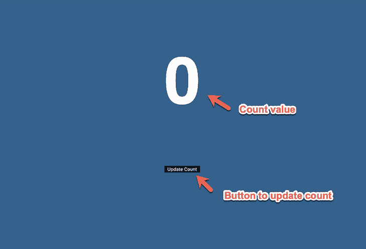](https://res.cloudinary.com/practicaldev/image/fetch/s--rCMB7Ge4--/c_limit%2Cf_auto%2Cfl_progressive%2Cq_auto%2Cw_880/https://i0.wp.com/blog.logrocket.com/wp-content/uploads/2019/08/useeffect-count-example-1.png%3Fresize%3D730%252C497%26ssl%3D1)

该计数器的不同之处在于增加了两个`useEffect`调用。

```
useEffect(() => {
    console.log("USE EFFECT FUNCTION TRIGGERED");
});
useEffect(() => {
    console.log("USE SECOND EFFECT FUNCTION TRIGGERED");
}); 
```

<svg width="20px" height="20px" viewBox="0 0 24 24" class="highlight-action crayons-icon highlight-action--fullscreen-on"><title>Enter fullscreen mode</title></svg> <svg width="20px" height="20px" viewBox="0 0 24 24" class="highlight-action crayons-icon highlight-action--fullscreen-off"><title>Exit fullscreen mode</title></svg>

请注意，效果记录不同的文本取决于哪个被触发，正如所料，第一个效果功能在第二个之前被触发。

[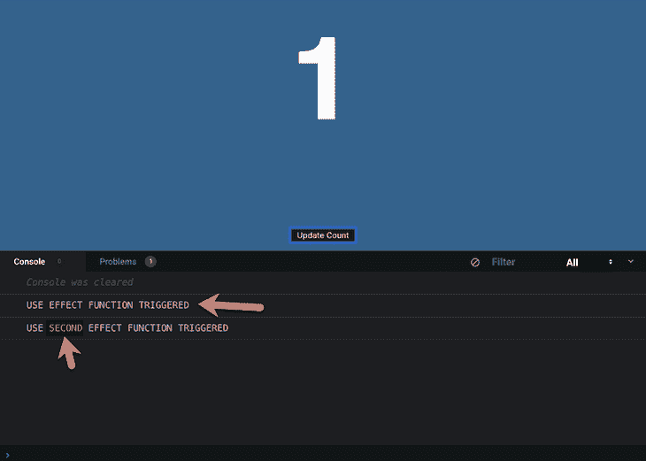](https://res.cloudinary.com/practicaldev/image/fetch/s--ACcwjYXz--/c_limit%2Cf_auto%2Cfl_progressive%2Cq_auto%2Cw_880/https://i1.wp.com/blog.logrocket.com/wp-content/uploads/2019/08/useeffect-count-example-2.png%3Fresize%3D730%252C521%26ssl%3D1)

当一个组件中有多个`useEffect`调用时，效果调用的顺序保持不变。第一个被触发，然后是第二个——如此循环往复。

现在，如果第二个`useEffect`钩子被替换成一个`useLayoutEffect`钩子会发生什么？

```
useEffect(() => {
    console.log("USE EFFECT FUNCTION TRIGGERED");
});
useLayoutEffect(() => {
    console.log("USE LAYOUT EFFECT FUNCTION TRIGGERED");
}); 
```

<svg width="20px" height="20px" viewBox="0 0 24 24" class="highlight-action crayons-icon highlight-action--fullscreen-on"><title>Enter fullscreen mode</title></svg> <svg width="20px" height="20px" viewBox="0 0 24 24" class="highlight-action crayons-icon highlight-action--fullscreen-off"><title>Exit fullscreen mode</title></svg>

尽管`useLayoutEffect`挂钩被放置在`useEffect`挂钩之后，但是`useLayoutEffect`挂钩首先被触发！

[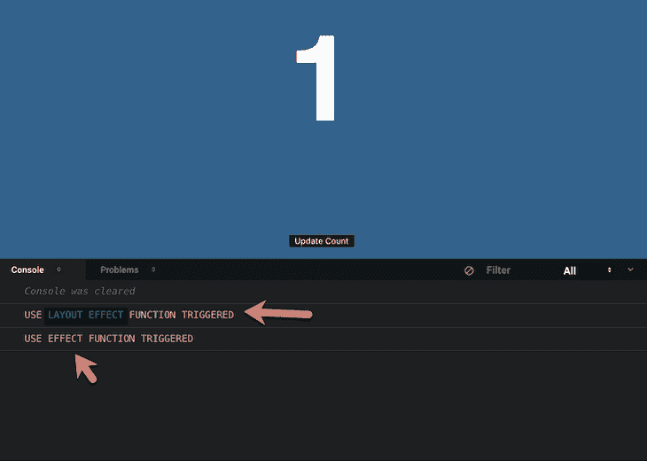](https://res.cloudinary.com/practicaldev/image/fetch/s--Ifby9siU--/c_limit%2Cf_auto%2Cfl_progressive%2Cq_auto%2Cw_880/https://i2.wp.com/blog.logrocket.com/wp-content/uploads/2019/08/useeffect-count-example-3.png%3Fresize%3D730%252C520%26ssl%3D1)

这可以理解。在绘制 DOM 突变之前，同步触发`useLayoutEffect`函数。然而，`useEffect`函数在 DOM 突变被描绘后被调用*。*

这有意义吗？

关于`useEffect`和`useLayoutEffect`钩子的执行时间，我还有一个更有趣的例子。

在下面的例子中，我将带你回到大学时代，或者任何你曾经绘制图表的苦乐参半的经历。[](https://res.cloudinary.com/practicaldev/image/fetch/s--2EAkP1Kt--/c_limit%2Cf_auto%2Cfl_progressive%2Cq_auto%2Cw_880/https://s.w.oimg/core/emoji/12.0.0-1/72x72/1f642.png)

示例应用程序有一个按钮，用于切换标题的可视状态——是否晃动。这是正在运行的应用程序:

[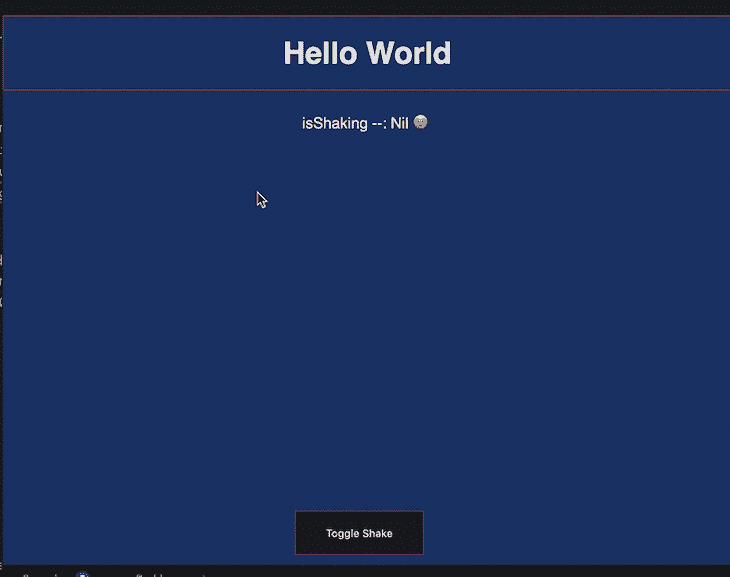](https://res.cloudinary.com/practicaldev/image/fetch/s--wtOn1_Ya--/c_limit%2Cf_auto%2Cfl_progressive%2Cq_66%2Cw_880/https://i0.wp.com/blog.logrocket.com/wp-content/uploads/2019/08/title-shake-example-app.gif%3Fresize%3D730%252C577%26ssl%3D1)

我选择这个例子的原因是确保当按钮被点击时，浏览器实际上有一些有趣的变化要画，因此有动画。

标题的可视状态在`useEffect`函数调用中切换。如果你感兴趣，你可以[查看实现](https://codesandbox.io/s/useeffect-uselayouteffect-time-of-execution-2-kqnqp?fontsize=14)。

然而，重要的是，我通过每秒切换视觉状态，即通过点击按钮，收集了重要的数据。这是通过`useEffect`和`useLayoutEffect`完成的。

使用`performance.now`，我测量了`useEffect`和`useLayoutEffect`点击按钮和触发效果功能之间的差异。

以下是我收集的数据:

[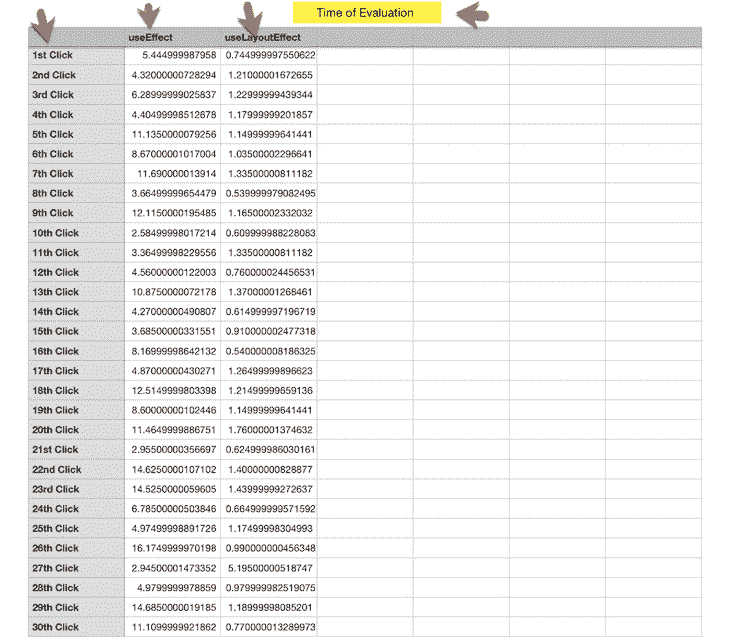](https://res.cloudinary.com/practicaldev/image/fetch/s---3_hO8d_--/c_limit%2Cf_auto%2Cfl_progressive%2Cq_auto%2Cw_880/https://i0.wp.com/blog.logrocket.com/wp-content/uploads/2019/08/time-of-evaluation-data-sheet.png%3Fresize%3D730%252C644%26ssl%3D1)

无法解释的数字对视觉思维毫无意义。根据这些数据，我创建了一个图表来直观地表示`useEffect`和`useLayoutEffect`的执行时间。给你:

[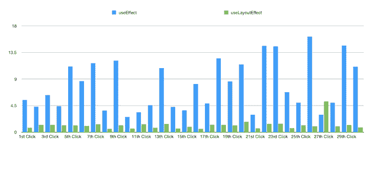](https://res.cloudinary.com/practicaldev/image/fetch/s--y-_Ohr4K--/c_limit%2Cf_auto%2Cfl_progressive%2Cq_auto%2Cw_880/https://i2.wp.com/blog.logrocket.com/wp-content/uploads/2019/08/time-of-evaluation-graph.png%3Fresize%3D730%252C330%26ssl%3D1)

看看`useEffect`比`useLayoutEffect`晚发射了多少？

花点时间来解释上面的图表。简而言之，它代表了触发`useEffect`和`useLayoutEffect`效果函数之间的时间差——在某些情况下超过 10 倍。

您将看到这种时间差如何在诸如 DOM 动画等用例中发挥巨大作用，下面的示例 3 对此进行了解释。

### 2。受过训练会玩把戏的

昂贵的计算是非常昂贵的。如果处理不当，这些会对应用程序的性能产生负面影响。

对于在浏览器中运行的应用程序，您必须小心不要仅仅因为您在后台运行繁重的计算就阻止用户查看可视化更新。

在如何处理繁重的计算方面，`useEffect`和`useLayoutEffect`的行为是不同的。如前所述，`useEffect`会将效果函数的执行推迟到 DOM 突变完成之后，这是两者中显而易见的选择。(顺便说一句，我知道`useMemo`对于记忆繁重的计算非常有用。这篇文章忽略了这个事实，只是比较了`useEffect`和`useLayoutEffect`。)

我有支持我刚才观点的例子吗？你打赌！

由于大多数现代计算机都非常快，我设置了一个不实用的应用程序，但足以满足我们的用例。

应用程序呈现了一个看似无害的初始屏幕:

[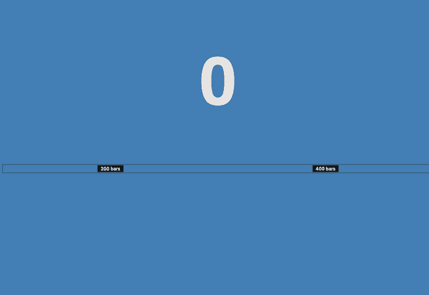](https://res.cloudinary.com/practicaldev/image/fetch/s--_Pl6BADn--/c_limit%2Cf_auto%2Cfl_progressive%2Cq_auto%2Cw_880/https://i1.wp.com/blog.logrocket.com/wp-content/uploads/2019/08/initial-app-render.png%3Fresize%3D730%252C503%26ssl%3D1)

然而，它有两个可点击的按钮，可以触发一些有趣的变化。例如，点击 **200 条**按钮将计数状态设置为 200。

[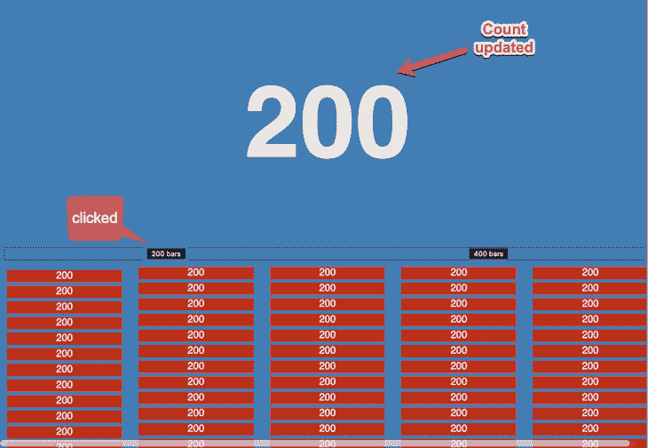](https://res.cloudinary.com/practicaldev/image/fetch/s--wGY85dp3--/c_limit%2Cf_auto%2Cfl_progressive%2Cq_auto%2Cw_880/https://i2.wp.com/blog.logrocket.com/wp-content/uploads/2019/08/app-render-count-state-200.png%3Fresize%3D730%252C504%26ssl%3D1)

但这还不是全部。它还迫使浏览器在屏幕上绘制 200 个新的条形。

[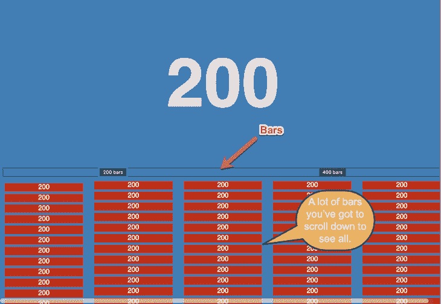](https://res.cloudinary.com/practicaldev/image/fetch/s--rLNx9v5Y--/c_limit%2Cf_auto%2Cfl_progressive%2Cq_auto%2Cw_880/https://i1.wp.com/blog.logrocket.com/wp-content/uploads/2019/08/app-render-200-bars.png%3Fresize%3D730%252C504%26ssl%3D1)

下面是方法:

```
... 
return (
...
   <section
        style={{
            display: "column",
            columnCount: "5",
            marginTop: "10px" }}>
        {new Array(count).fill(count).map(c => (
          <div style={{
                height: "20px",
                background: "red",
                margin: "5px"
         }}> {c}
         </div> ))}
   </section>
) 
```

<svg width="20px" height="20px" viewBox="0 0 24 24" class="highlight-action crayons-icon highlight-action--fullscreen-on"><title>Enter fullscreen mode</title></svg> <svg width="20px" height="20px" viewBox="0 0 24 24" class="highlight-action crayons-icon highlight-action--fullscreen-off"><title>Exit fullscreen mode</title></svg>

这不是一种表现 200 个条形的非常有效的方法，因为我每次都在创建新的数组，但这是关键:让浏览器工作。

哦，这还不是全部。点击也触发了繁重的计算。

```
...
useEffect(() => {
    // do nothing when count is zero
    if (!count) {
      return;
}
    // perform computation when count is updated.
    console.log("=== EFFECT STARTED === ");
    new Array(count).fill(1).forEach(val => console.log(val));
    console.log(`=== EFFECT COMPLETED === ${count}`);
}, [count]); 
```

<svg width="20px" height="20px" viewBox="0 0 24 24" class="highlight-action crayons-icon highlight-action--fullscreen-on"><title>Enter fullscreen mode</title></svg> <svg width="20px" height="20px" viewBox="0 0 24 24" class="highlight-action crayons-icon highlight-action--fullscreen-off"><title>Exit fullscreen mode</title></svg>

在 effect 函数中，我创建了一个长度等于计数的新数组——在本例中是一个包含 200 个值的数组。我对数组进行循环，并为数组中的每个值向控制台打印一些内容。

尽管如此，您仍需要关注屏幕更新和日志控制台，看看这是如何表现的。

对于`useEffect`，在日志被触发之前，您的**屏幕用新的计数值**更新**。**

这是一个实际操作的截屏:

[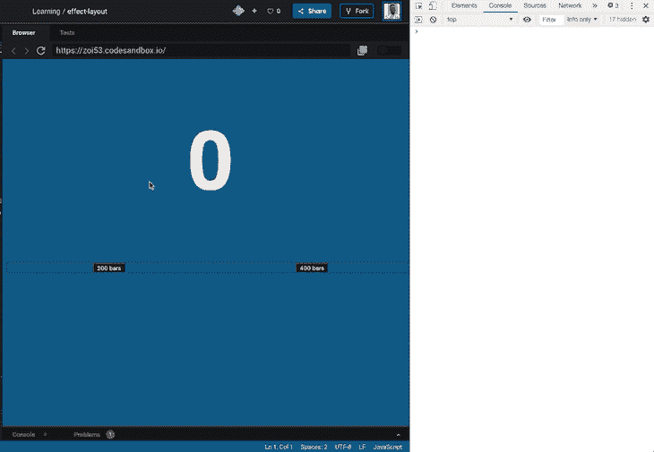](https://res.cloudinary.com/practicaldev/image/fetch/s--gMSrhCB9--/c_limit%2Cf_auto%2Cfl_progressive%2Cq_66%2Cw_880/https://i1.wp.com/blog.logrocket.com/wp-content/uploads/2019/08/logs-triggered-useeffect.gif%3Fresize%3D730%252C506%26ssl%3D1)

如果你有一双鹰眼，你可能会发现！对于我们其余的人来说，这是同样的慢镜头。在繁重的计算之前，你不可能错过屏幕更新！

那么这种行为和`useLayoutEffect`一样吗？不要！远非如此。

使用`useLayoutEffect`，计算将在浏览器绘制更新之前被触发。由于计算需要一些时间，这会消耗浏览器的绘制时间。

下面是用`useLayoutEffect`替换`useEffect`调用后执行的相同操作:

[](https://res.cloudinary.com/practicaldev/image/fetch/s--kXgNN0J3--/c_limit%2Cf_auto%2Cfl_progressive%2Cq_66%2Cw_880/https://i1.wp.com/blog.logrocket.com/wp-content/uploads/2019/08/logs-triggered-uselayouteffect.gif%3Fresize%3D730%252C507%26ssl%3D1)

这是在[慢镜头](https://youtu.be/irUvYd39k4c)。您可以看到`useLayoutEffect`是如何阻止浏览器绘制 DOM 变化的。你可以玩一下演示版，但是小心不要让你的浏览器崩溃。

为什么处理繁重计算的不同很重要？在可能的情况下，选择`useEffect`钩子，以避免在浏览器画图过程中不引人注目。在现实世界中，这通常是大多数时候！嗯，除了当你从 DOM 中读取布局或者做一些与 DOM 相关的事情需要尽快绘制的时候。

下一节将展示一个实际例子。

### 3。不一致的视觉变化

这是`useLayoutEffect`真正闪耀的地方。想出一个这样的例子也有点棘手。

但是，请考虑以下截屏。用`useEffect`:

[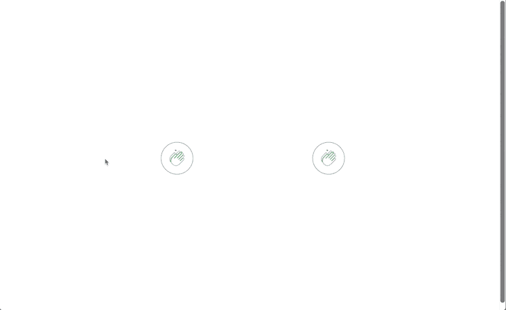](https://res.cloudinary.com/practicaldev/image/fetch/s--Ay35pr9b--/c_limit%2Cf_auto%2Cfl_progressive%2Cq_66%2Cw_880/https://i0.wp.com/blog.logrocket.com/wp-content/uploads/2019/08/visual-changes-useeffect.gif%3Fresize%3D730%252C447%26ssl%3D1)

用`useLayoutEffect`:

[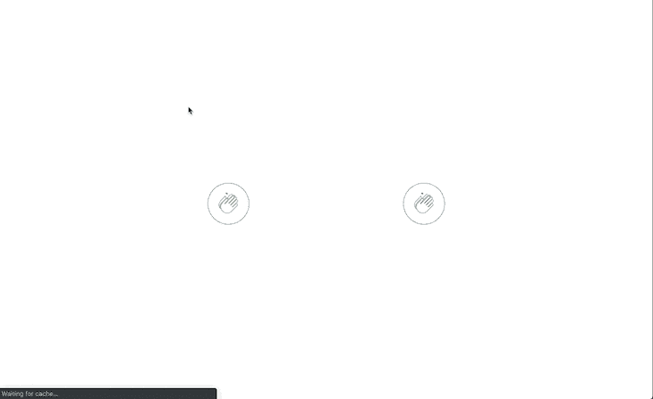](https://res.cloudinary.com/practicaldev/image/fetch/s--ZirOUyOw--/c_limit%2Cf_auto%2Cfl_progressive%2Cq_66%2Cw_880/https://i0.wp.com/blog.logrocket.com/wp-content/uploads/2019/08/visual-changes-uselayouteffect.gif%3Fresize%3D730%252C447%26ssl%3D1)

这些是我在用 React 钩子开发高级模式时，在我即将发布的 Udemy 视频课程中发现自己的真实场景。

这里的问题是，使用`useEffect`，在 DOM 改变被绘制之前，你会得到一个闪烁。这与 refs 如何传递给定制钩子(即你写的钩子)有关。最初，在呈现附加的 DOM 节点时，这些 refs 在实际设置之前以`null`开始。

如果组件一挂载，你就依赖这些引用来执行动画，那么你会发现在你的动画开始之前，浏览器会有不愉快的闪烁。`useEffect`是这种情况，而`useLayoutEffect`不是。

即使没有这种闪烁，有时你可能会发现`useLayoutEffect`制作的动画看起来比`useEffect`更黄油、更干净、更快。在处理复杂的用户界面动画时，一定要测试这两个钩子。

## 结论

唷！这是多么长的一段话啊！不管怎样，你已经掌握了足够的信息。去构建高性能的应用程序，并在需要的地方使用期望的钩子。

想看看我的(新)带钩子的高级反应模式吗？报名[等候名单](https://forms.gle/Qd6yZC1Lhcosnc2f8)！

* * *

**编者按:**看到这个帖子有问题？你可以在这里找到正确的版本。

## Plug: [LogRocket](https://logrocket.com/signup/) ，一款适用于网络应用的 DVR

[](https://res.cloudinary.com/practicaldev/image/fetch/s--6FG5kvEL--/c_limit%2Cf_auto%2Cfl_progressive%2Cq_auto%2Cw_880/https://i2.wp.com/blog.logrocket.com/wp-content/uploads/2017/03/1d0cd-1s_rmyo6nbrasp-xtvbaxfg.png%3Fresize%3D1200%252C677%26ssl%3D1)

[log rocket](https://logrocket.com/signup/)是一个前端日志工具，让你重放问题，就像它们发生在你自己的浏览器中一样。LogRocket 不需要猜测错误发生的原因，也不需要向用户询问截图和日志转储，而是让您重放会话以快速了解哪里出错了。它可以与任何应用程序完美配合，不管是什么框架，并且有插件可以记录来自 Redux、Vuex 和@ngrx/store 的额外上下文。

除了记录 Redux 动作和状态，LogRocket 还记录控制台日志、JavaScript 错误、stacktraces、带有头+体的网络请求/响应、浏览器元数据、自定义日志。它还使用 DOM 来记录页面上的 HTML 和 CSS，甚至为最复杂的单页面应用程序重新创建像素级完美视频。

[免费试用](https://logrocket.com/signup/)。

* * *

用简单易懂的语言写的帖子[use effect vs . useLayoutEffect](https://blog.logrocket.com/useeffect-vs-uselayouteffect/)首先出现在[博客](https://blog.logrocket.com)上。