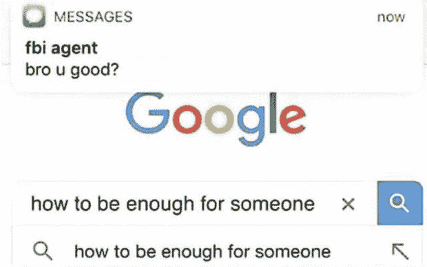
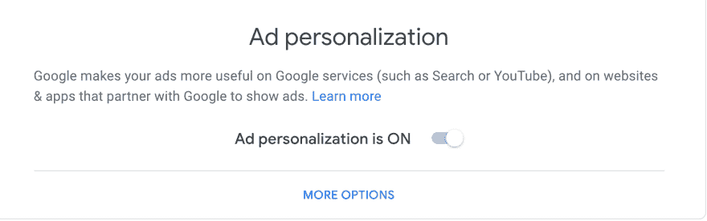
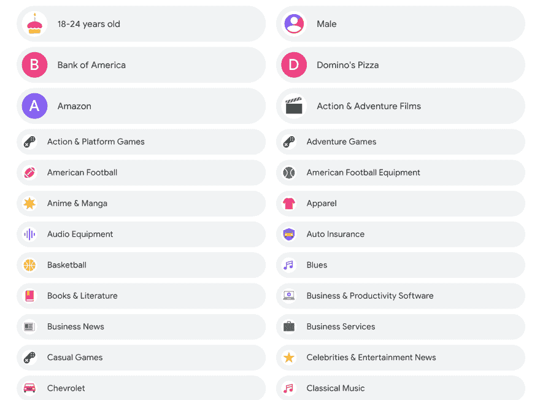
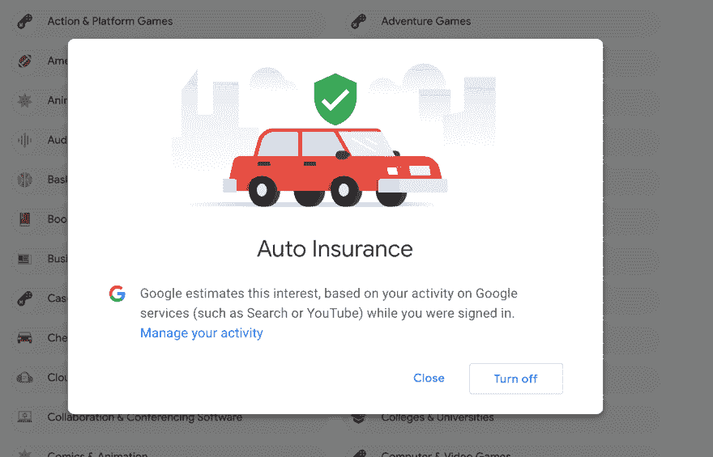
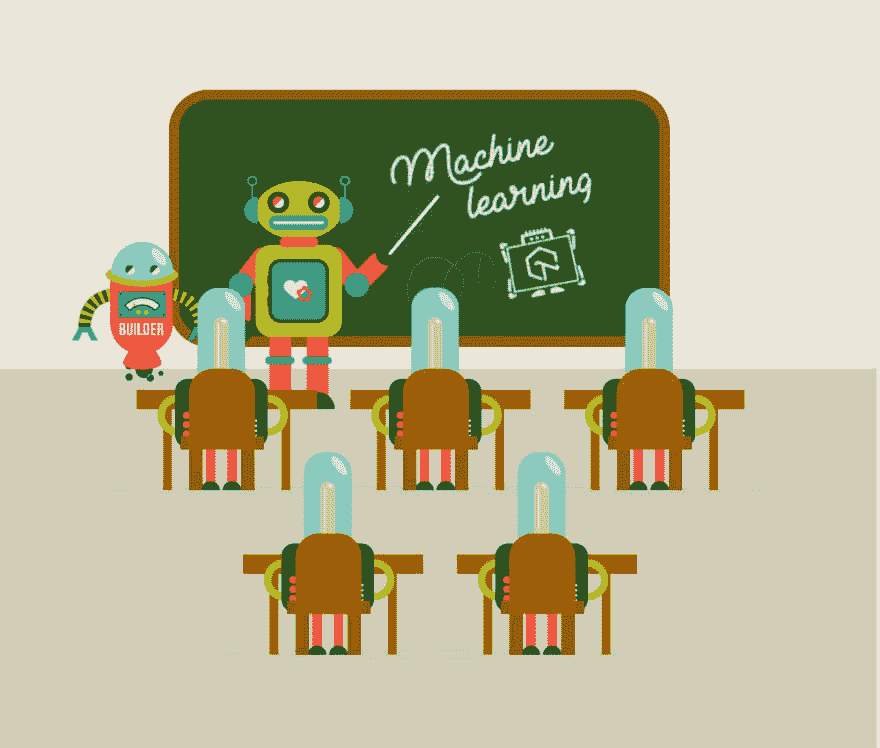

# 个性化您的谷歌广告设置

> 原文：<https://dev.to/brohittv/personalizing-your-google-ad-settings-3fch>

# 谷歌广告

无论是 youtube 视频还是游戏网站，你到处都可以看到谷歌广告，但你有没有注意到，有时广告是关于你正在思考的东西，现在你偏执地认为政府在听你说话，你屏幕后面的联邦调查局人员知道你所有最深最黑暗的秘密...

## 嗯...虽然这不是完全错误的，但也不是完全正确的

所以今天我将谈论谷歌广告设置以及如何个性化它们...

让我们从如何进入谷歌广告设置开始...简单的点击[这个](https://lmgtfy.com/?q=google+ad+settings)

我只是开玩笑，虽然你可以谷歌“谷歌广告设置”这个词，你也可以直接去[这里](https://adssettings.google.com/authenticated)

# 开始

这是你应该清楚看到的第一件事，它允许你选择有针对性的广告，现在理想的情况是你确实想要有针对性的广告，因为它们会特别迎合你，然而这个页面最酷的事情是你可以看到谷歌对你的看法，以及你是谁，基于你在探索谷歌时打开的所有活动..因此，如果你在谷歌上播放了一些音乐，谷歌知道这首歌，然后将它添加到你的个人资料中..这里是你可以看到他们的地方

如你所见，谷歌有我的正确年龄..只要点击它就可以更新，所以如果你们想根据你浏览的内容知道你的互联网时代，这是一个很好的方法来查看它！现在我也注意到了一些我特别不喜欢的广告，比如汽车保险和雪佛兰，这意味着我不想看到这些东西的广告...解决方法很简单！

点击你不想看到的广告就行了

点击“关闭”..现在谷歌明白你不想看到这些广告，但如果谷歌“感觉”你一直在看关于汽车保险的视频，它可能会再次打开广告设置，并根据这些视频调整你的年龄。

# 变深

但是谷歌广告的设置可以更加深入..你可以点击广告设置，在这个页面管理谷歌跟踪和不跟踪的活动..[https://myactivity.google.com/myactivity](https://myactivity.google.com/myactivity)

你的活动页面显示了谷歌保存的关于你的所有历史和数据..严格来说，这是你办公桌后面的联邦调查局特工，他知道你的一切，包括你不知道自己喜欢的东西..现在，它如何拥有这些信息，以及它如何能够使用这些信息为您带来正确的视频来观看接下来，我将在我的下一个关于基本机器学习的博客中解释..现在我将解释活动页面

在我的例子中，我们正在看我的 YouTube 历史..谷歌正在利用我在 Youtube 上的历史记录来给我的个人资料分类，它“认为”我会喜欢，并给我带来与此相关的广告...但是请注意，您在匿名或使用不保存 cookies 的私人浏览器时访问的网站不会让谷歌收集您的信息...然而，不要被愚弄，因为你点击的每个广告仍然保存着关于你的 cookies，这就是为什么当你凌晨 2 点起床时，你会看到那个约会应用广告，因为谷歌知道你是孤独的程序员，寻求并想要朋友，无论如何你明白这一点...确保您知道谁在跟踪哪些 cookies😂

# 利用这一点为自己谋利

你可以用不同的方式来利用你的广告设置...首先，你可以编辑你的个人资料来更好地代表你，但是谷歌现在仍然会投放同样的旧广告，这可能会变得很无聊...快的..

因此，利用这一优势的最佳方式是具体而广泛地具体，去掉错综复杂的细节，让谷歌对你随机拍照，检查你是否喜欢这个广告...并将它发送给它的教师机器人....

...为我的下一篇博客埋下伏笔