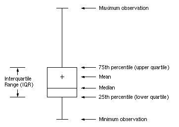
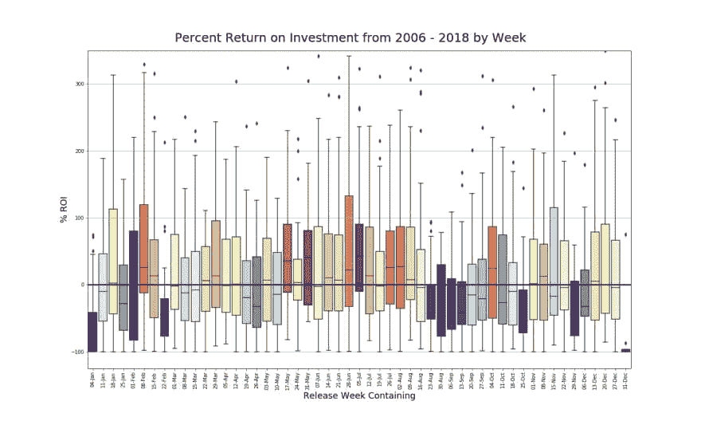
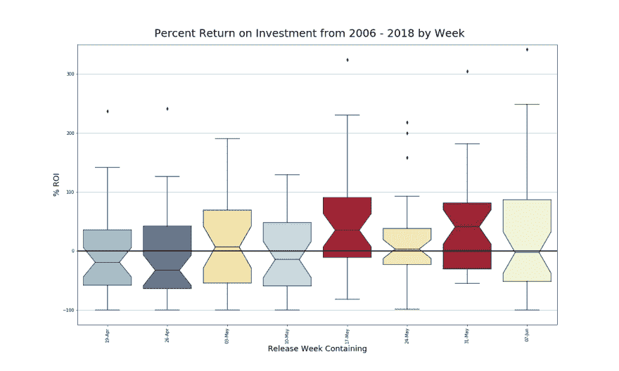
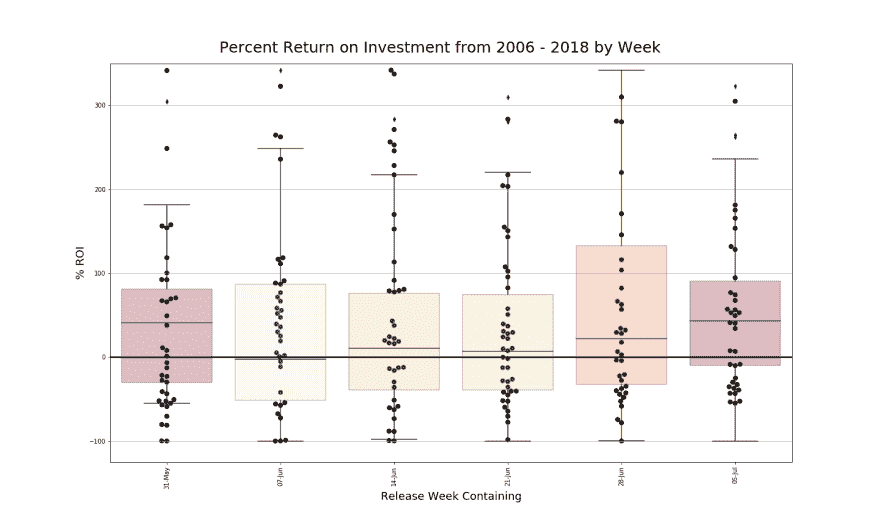

# 箱线图+

> 原文：<https://dev.to/cristinatrico/boxplots-16o5>

花了 6 年时间回答这个问题，“我们什么时候才能在现实生活中使用它？”我很兴奋能以不同的观众来接近方块图。

**基础知识:**

箱线图是一种标准化方法，用于显示基于 5 个数字汇总的数据分布:最小值、四分位数 1 中值、四分位数 2 和最大值。

**IQR** :四分位数范围，计算为 Q3-Q1
T3】最小值:Q1-1.5 * IQR
T6】四分位数 1 :第 25 百分位
**中位数**:数据全范围第 50 百分位中心值
**四分位数 3** :第 75 百分位
**最大值** : Q3 + 1.5 * IQR

T3】

[Image Source](https://support.sas.com/documentation/cdl/en/statug/63347/HTML/default/viewer.htm#statug_boxplot_sect012.htm)

除了汇总行之外，箱线图还允许您查看异常值、对称性、分组紧密度以及数据可能存在的任何偏差。当你想要更多的信息，而不仅仅是趋势的中心测量值时，箱线图是最好的选择，因为它们使分散性和可变性可见。

**分组比较:**

当你比较多组数据时，箱线图发挥了它的魔力。可见的汇总统计数据使组之间的相似性和差异显而易见。例如，下面的情节是在探索电影数据的趋势时创建的。从 2006 年到 2018 年的电影发行日期按发行周分组，并根据%ROI 绘制。目的是确定是否有几周在盈利方面对其他人有利。
 
在这里，视觉效果通过使用色彩映射表得到了增强。基于高于或低于盈亏平衡点的数据百分比，箱线图以渐变或红色或蓝色着色。视觉允许快速洞察，指导进一步的探索。

**扩展:**
尽管信息很深，但在图之间有一个更直接的比较手段可能是有用的。专注于发布周数据的子集，我想实现缺口箱线图和蜂群覆盖图。

**缺口箱线图:**
缺口箱线图显示中位数周围的置信区间，一般是 95%的置信区间。如果比较的箱线图中的凹口不重叠，则有证据表明中间值明显不同。我选择了几个星期，在这些星期里，我预计一些中位数会显著不同，一些不会。
 
凹口有助于显示 5 月 17 日和 5 月 31 日这两个星期的中位数与 4 月 19 日和 4 月 26 日这两个星期的中位数有显著差异。

**Swarm Overlay 箱线图:**
箱线图的一个缺点是无法看到所有潜在的观察结果。群体图叠加不仅允许我们看到所有的观察结果，而且确保数据点之间的距离最小，不会重叠。群体叠加更好地表示了值的分布。
 
要获得蜂群叠加的完整效果，请务必更改您的方框图的透明度级别，否则您的点将隐藏在方框本身的后面。