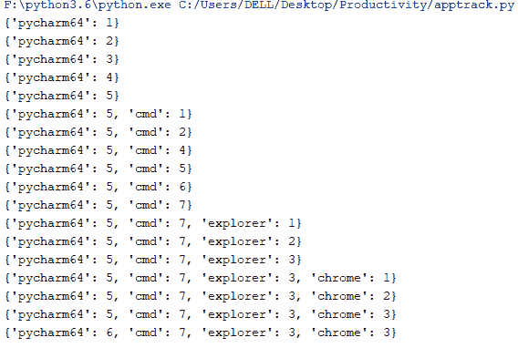

# 使用 python 跟踪 windows 应用程序的使用时间。

> 原文：<https://dev.to/tkkhhaarree/track-windows-app-usage-time-using-python-h9h>

我们在玩游戏、看电影、听 Spotify 上浪费了很多时间。因此，跟踪 Windows 电脑中各种应用的使用情况变得非常重要。

我们将学习如何编写 python 脚本来跟踪你在各种桌面应用上花费的时间，如 VSCode、Spotify、File explorer 等。要运行此脚本，您需要 Python 版或更低版本。这个脚本不能在 Python 3.7 中运行，因为 Python 3.7 目前不支持我们将使用的库。

首先使用 pip 命令安装 psutil、pywin32、win32gui 库:
`pip install pywin32 win32gui psutil`
现在在代码编辑器中编写以下脚本:

```
from win32gui import GetForegroundWindow
import psutil
import time
import win32process

process_time={}
timestamp = {}
while True:
    current_app = psutil.Process(win32process.GetWindowThreadProcessId(GetForegroundWindow())[1]).name().replace(".exe", "")
    timestamp[current_app] = int(time.time())
    time.sleep(1)
    if current_app not in process_time.keys():
        process_time[current_app] = 0
    process_time[current_app] = process_time[current_app]+int(time.time())-timestamp[current_app]
    print(process_time) 
```

现在运行这个脚本。你会在控制台上看到每秒钟打印的应用程序时间。当您在不同的应用程序之间切换时，花费在这些应用程序上的时间会一直显示在控制台上。

[](https://res.cloudinary.com/practicaldev/image/fetch/s--ekSg1yjd--/c_limit%2Cf_auto%2Cfl_progressive%2Cq_auto%2Cw_880/https://thepracticaldev.s3.amazonaws.com/i/jvwuqmd5j7nrgrkx8pem.PNG) 
这段代码是如何工作的？
首先我们维护两个字典:`timestamp`和`process_time`。在`timestamp`字典中，我们存储了在活动/前台窗口中找到特定应用程序的最新 Unix 时间戳。应用程序名和最新的时间戳作为键值对存储在这个字典中。

在`process_time`字典中，我们存储了一个应用程序在活动/前台窗口中花费的总时间。这是我们想要通过这个脚本跟踪的时间。

使用行:

```
current_app = psutil.Process(win32process.GetWindowThreadProcessId(GetForegroundWindow())[1]).name().replace(".exe", "") 
```

我们得到了当前在前台窗口中的应用程序的名字。首先，我们将这个 app 的时间戳存储在`timestamp`字典中。
然后，为了计算这个 app 的`process_time`。我们将从当前 unix 时间中减去该应用的`timestamp`，并将结果加到该应用的`process_time`:

```
process_time[current_app] = process_time[current_app]+(int(time.time())-timestamp[current_app]) 
```

我们还在代码中使用了`time.sleep()`,以便 while 循环只在特定的时间间隔后重复。

就是这样！如果您愿意，可以进一步修改这个脚本，在它周围创建一个前端，添加对永久存储数据的数据库支持等等。希望你喜欢这篇文章。如有疑问请评论。也看看我的博客上的其他文章吧！