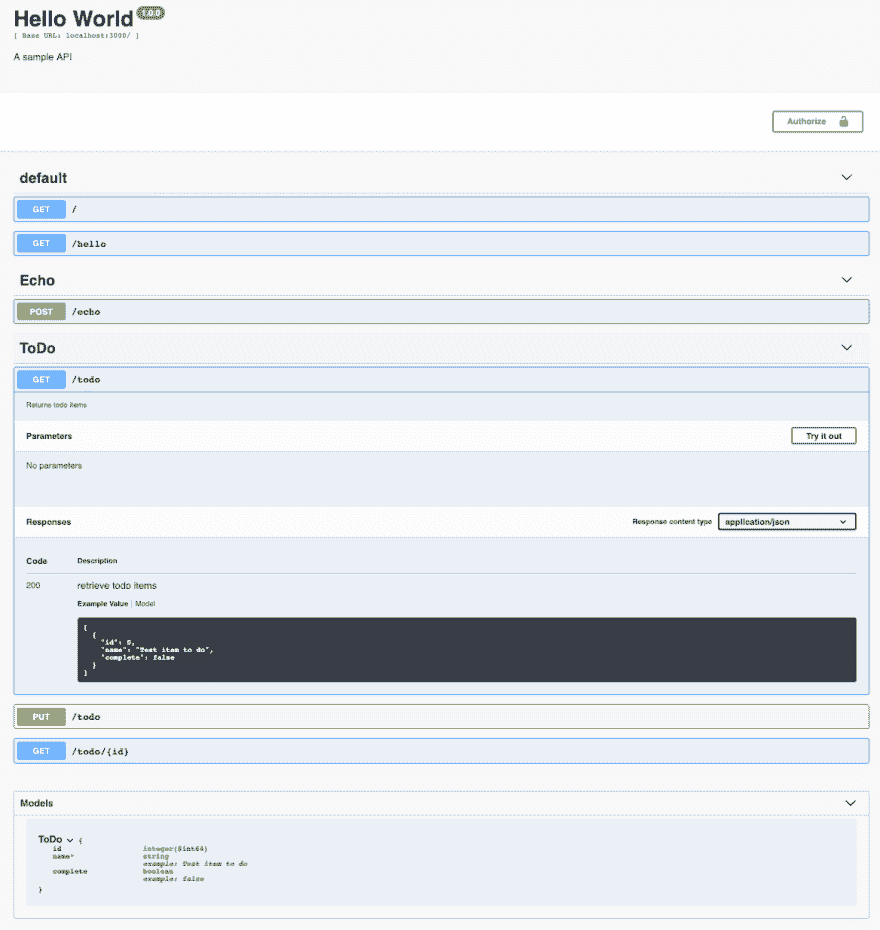
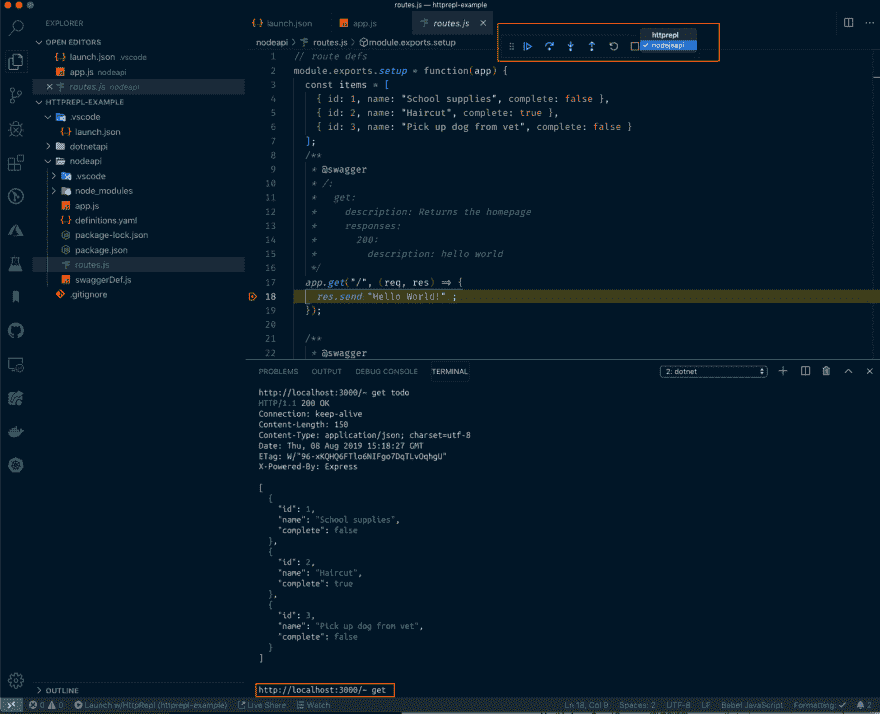

# 使用 HttpRepl 从命令行测试 RESTful 服务

> 原文：<https://dev.to/dotnet/testing-restful-services-from-the-command-line-with-httprepl-2a92>

工具是我们完成事情的方式，每当一个新的工具出现时，我都会迅速投入进去，看看它是否有助于更快、更好地完成我的工作，编写更少的代码，更有效地测试，甚至只是促进更好的工作流程的想法。

本周。NET 团队发布了一个新版本的 HttpRepl，这是一个用于与 RESTful 服务交互的开源命令行工具。

*   [公告帖子:HttpRepl:一个用于与 RESTful HTTP 服务交互的命令行工具](https://devblogs.microsoft.com/aspnet/httprepl-a-command-line-tool-for-interacting-with-restful-http-services/?WT.mc_id=devto-blog-shboyer)
*   [GitHub/aspnet/http prepl](https://github.com/aspnet/HttpRepl)
*   [Docs:用 HTTP REPL 测试 web APIs】](https://docs.microsoft.com/aspnet/core/web-api/http-repl?view=aspnetcore-2.2&tabs=macos&WT.mc_id=devto-blog-shboyer)

现在，已经有很多测试 API 的工具了。邮递员众所周知， **curl** 用于简单的调用，然后还有 [HTTPie](https://httpie.org/) 也用于命令行。

`dotnet httprepl`有点不同，它为您提供了以处理文件和文件夹的方式处理服务的能力。

```
dotnet httprepl http://localhost:3000
(Disconnected)~ set base "http://localhost:3000"

http://localhost:3000/~ set swagger http://localhost:3000/api-docs.json

http://localhost:3000/~ ls
.       [get]
hello   [get]
echo    [post]
todo    [get|put]

http://localhost:3000/~ cd todo
/todo    [get|put]

http://localhost:3000/todo~ ls
.      [get|put]
..     [get]
{id}   [get]

http://localhost:3000/todo~ 
```

<svg width="20px" height="20px" viewBox="0 0 24 24" class="highlight-action crayons-icon highlight-action--fullscreen-on"><title>Enter fullscreen mode</title></svg> <svg width="20px" height="20px" viewBox="0 0 24 24" class="highlight-action crayons-icon highlight-action--fullscreen-off"><title>Exit fullscreen mode</title></svg>

为了检索待办事项列表，在`/todo`路径上调用`get`操作，就像在浏览器中一样。

> 注意，这个例子是用 express 在 Node.js 中编写的。虽然这是一个. NET 核心工具，但它可以用于任何 HTTP RESTful 服务。

```
http://localhost:3000/~ get /todo
HTTP/1.1 200 OK
Connection: keep-alive
Content-Length: 150 Content-Type: application/json;  charset=utf-8
Date: Thu, 08 Aug 2019 14:27:34 GMT
ETag: W/"96-xKQHQ6FTlo6NIFgo7DqTLvOqhgU"
X-Powered-By: Express

[
  {
    "id": 1,
    "name": "School supplies",
    "complete": false
  },
  {
    "id": 2,
    "name": "Haircut",
    "complete": true
  },
  {
    "id": 3,
    "name": "Pick up dog from vet",
    "complete": false
  }
]

http://localhost:3000/~ 
```

<svg width="20px" height="20px" viewBox="0 0 24 24" class="highlight-action crayons-icon highlight-action--fullscreen-on"><title>Enter fullscreen mode</title></svg> <svg width="20px" height="20px" viewBox="0 0 24 24" class="highlight-action crayons-icon highlight-action--fullscreen-off"><title>Exit fullscreen mode</title></svg>

## 安装和配置

HttpRepl 是一个[点网全局工具](https://docs.microsoft.com/dotnet/core/tools/global-tools?WT.mc_id=devto-blog-shboyer#install-a-global-tool)，需要[。NET Core SDK](https://dotnet.microsoft.com/download/dotnet-core/3.0?WT.mc_id=devto-blog-shboyer) 待安装。

```
dotnet tool install -g Microsoft.dotnet-httprepl --version "3.0.0-*" 
```

<svg width="20px" height="20px" viewBox="0 0 24 24" class="highlight-action crayons-icon highlight-action--fullscreen-on"><title>Enter fullscreen mode</title></svg> <svg width="20px" height="20px" viewBox="0 0 24 24" class="highlight-action crayons-icon highlight-action--fullscreen-off"><title>Exit fullscreen mode</title></svg>

## 启用您的 HTTP 服务

开箱即用，您不需要做任何事情来支持 HttpRepl 全局工具。然而，为了支持`ls`操作来显示端点，您的 API 或服务必须有一个 [OpenAPI(又名 Swagger)](https://swagger.io) 规范来指向。默认情况下，HttpRepl 会寻找`/swagger/v1/swagger.json`

> 在 ASP.NET 核心[中，NSwag](https://docs.microsoft.com/aspnet/core/tutorials/getting-started-with-nswag?view=aspnetcore-2.2&tabs=visual-studio&WT.mc_id=devto-blog-shboyer) 和 [Swashbuckle](https://docs.microsoft.com/aspnet/core/tutorials/getting-started-with-swashbuckle?view=aspnetcore-2.2&tabs=visual-studio&WT.mc_id=devto-blog-shboyer) 是创建 OpenAPI 规范的两个选项。[查看文档了解如何通过几个步骤实现这一点](https://docs.microsoft.com/aspnet/core/tutorials/web-api-help-pages-using-swagger?view=aspnetcore-2.2&WT.mc_id=devto-blog-shboyer)。

对于 Node.js ToDo 示例，我使用了 [swagger-jsdoc](https://www.npmjs.com/package/swagger-jsdoc) ，并在`/swagger`
为 Swagger UI 创建了一条路径

```
app.get("/api-docs.json", (req, res) => {
  res.setHeader("Content-Type", "application/json");
  res.send(swaggerSpec);
});

app.use("/swagger", swaggerUi.serve, swaggerUi.setup(swaggerSpec)); 
```

<svg width="20px" height="20px" viewBox="0 0 24 24" class="highlight-action crayons-icon highlight-action--fullscreen-on"><title>Enter fullscreen mode</title></svg> <svg width="20px" height="20px" viewBox="0 0 24 24" class="highlight-action crayons-icon highlight-action--fullscreen-off"><title>Exit fullscreen mode</title></svg>

所以我也可以很容易地使用 UI 测试我的 API。

[](https://res.cloudinary.com/practicaldev/image/fetch/s--zwU-BZb0--/c_limit%2Cf_auto%2Cfl_progressive%2Cq_auto%2Cw_880/https://thepracticaldev.s3.amazonaws.com/i/gjs15twax41hvh0u4ztp.png)

# 在 VSCode 中设置

我们可以很容易地从 VSCode 启动 API，启动另一个终端并键入启动命令来初始化 HttpRepl，但是这样做的效率在哪里呢？

Visual Studio 代码具有[复合的概念，允许您在 launch.json 文件中设置多个配置](https://code.visualstudio.com/docs/editor/debugging?WT.mc_id=devto-blog-shboyer#_compound-launch-configurations)，启动多个调试配置。这在前端和后端系统需要同时调试的情况下尤其有用。

在下面的配置中， **nodejsapi** 和**http prepl**都被设置为 start。

```
{
  // Use IntelliSense to learn about possible attributes.
  // Hover to view descriptions of existing attributes.
  // For more information, visit: https://go.microsoft.com/fwlink/?linkid=830387
  "version": "0.2.0",
  "compounds": [
    {
      "name": "Launch w/HttpRepl",
      "configurations": [
        "nodejsapi",
        "httprepl"
      ]
    }
  ],
  "configurations": [
    {
      "name": "httprepl",
      "type": "coreclr",
      "request": "launch",
      "program": "dotnet",
      "args": ["httprepl", "http://localhost:3000"],
      "cwd": "${workspaceFolder}",
      "stopAtEntry": false,
      "console": "integratedTerminal"
    },
    {
      "type": "node",
      "request": "launch",
      "name": "nodejsapi",
      "program": "${workspaceFolder}/nodeapi/app.js"
    }
  ]
} 
```

<svg width="20px" height="20px" viewBox="0 0 24 24" class="highlight-action crayons-icon highlight-action--fullscreen-on"><title>Enter fullscreen mode</title></svg> <svg width="20px" height="20px" viewBox="0 0 24 24" class="highlight-action crayons-icon highlight-action--fullscreen-off"><title>Exit fullscreen mode</title></svg>

点击 F5 或 Debug 启动配置，并在集成终端中启动 API 和 HttpRepl，我可以测试`get /todo`和`get`方法，而无需留下 VS 代码并点击断点。

[](https://res.cloudinary.com/practicaldev/image/fetch/s--SK4VjvMH--/c_limit%2Cf_auto%2Cfl_progressive%2Cq_auto%2Cw_880/https://thepracticaldev.s3.amazonaws.com/i/54ob70x88fmg10wowg54.png)

# 反馈

是[开源](https://github.com/aspnet/HttpRepl)，请反馈 [GitHub](https://github.com/aspnet/HttpRepl) ！

阅读文档，[用 HTTP REPL](https://docs.microsoft.com/aspnet/core/web-api/http-repl?view=aspnetcore-2.2&tabs=macos&WT.mc_id=devto-blog-shboyer) 测试 web APIs。通过定制、运行脚本文件等等，您可以做更多的事情。

参与改进您的工具。谢谢！