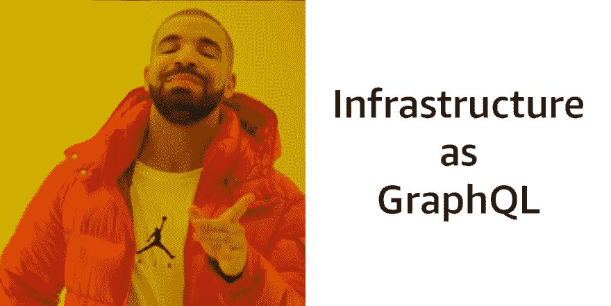

# GraphQL 菜谱(V2)——用 GraphQL 转换构建 API

> 原文：<https://dev.to/open-graphql/graphql-recipes-building-apis-with-graphql-transform-3jp0>

这是本帖的 **V2** ，更新了新的模式和来自 Amplify 的最新指令。

> 由 Tarn Nguyen 在 Unsplash 上拍摄的封面照片
> 
> 要查看仅包含部署这些应用程序的代码和说明的 repo，请单击[此处](https://github.com/dabit3/graphql-app-recipes)。

在我的帖子[GraphQL 和全栈无服务器时代的基础设施代码](https://dev.to/dabit3/infrastructure-as-code-in-the-era-of-graphql-and-full-stack-serverless-11bc)中，我展示了如何利用 graph QL、 [AWS Amplify CLI](https://docs.amplify.aws/) 和 [GraphQL Transform](https://docs.amplify.aws/cli/graphql-transformer/directives) 库来构建、共享和部署全栈云应用。

在这篇文章中，我创建了带注释的 GraphQL 模式，您可以用它来部署流行类型的应用程序。

* * *

[GraphQL Transform](https://docs.amplify.aws/cli/graphql-transformer/directives) 库允许您使用 GraphQL 模式指令部署具有 NoSQL 数据库、身份验证、弹性搜索引擎、lambda 函数解析器、关系、授权等特性的 AWS AppSync GraphQL APIs。

例如，下面的模式使用了`@model`指令:

```
type  Note  @model  {  id:  ID!  name:  String!  description:  String  } 
```

Enter fullscreen mode Exit fullscreen mode

此架构将部署以下内容:

1.  GraphQL API
2.  此基本类型的 CRUD GraphQL 操作:创建、读取、更新、删除和列出
3.  GraphQL 订阅(由突变事件触发；创建、更新、删除)
4.  DynamoDB NoSQL 数据库
5.  GraphQL 解析器将 DynamoDB 表映射到 GraphQL CRUD 操作

在这篇文章中，GraphQL 转换库提供了 8 个指令:

```
@model
// Deploys DynamodDB table + resolvers + additional GraphQL schema

@auth
// Allows the definition of auth rules and builds corresponding GraphQL resolvers based on these rules

@connection
// Enables you to specify relationships between `@model` object types 

@searchable
// Handles streaming the data of an @model object type to Amazon Elasticsearch Service and configures search resolvers that search that information

@function
//  Allows you to quickly & easily configure AWS Lambda resolvers within your AWS AppSync API

@key
// Enables you to configure custom data access patterns for @model types

@versioned
// Adds object versioning and conflict resolution to a type

@http
// Allows you to quickly configure HTTP resolvers within your AWS AppSync API 
```

Enter fullscreen mode Exit fullscreen mode

使用这个库，您可以只使用带注释的 GraphQL 模式来部署应用程序的后端。

在本文中，我将展示一些示例模式，当它们与 Amplify GraphQL 转换库一起使用时，将为许多流行的应用程序类型构建后端。

1.  [待办事宜应用](https://dev.to/open-graphql/graphql-recipes-building-apis-with-graphql-transform-3jp0#todo-app)
2.  [活动应用](https://dev.to/open-graphql/graphql-recipes-building-apis-with-graphql-transform-3jp0#events-app)
3.  [聊天应用](#chat-app)
4.  [电子商务 App](https://dev.to/open-graphql/graphql-recipes-building-apis-with-graphql-transform-3jp0#ecommerce-app)
5.  [WhatsApp 克隆](https://dev.to/open-graphql/graphql-recipes-building-apis-with-graphql-transform-3jp0#whatsapp-clone)
6.  [Reddit 克隆](https://dev.to/open-graphql/graphql-recipes-building-apis-with-graphql-transform-3jp0#reddit-clone)
7.  [多用户聊天应用](https://dev.to/open-graphql/graphql-recipes-building-apis-with-graphql-transform-3jp0#multiuser-chat-app)
8.  [Instagram 克隆](https://dev.to/open-graphql/graphql-recipes-building-apis-with-graphql-transform-3jp0#instagram-clone)
9.  [会议 App](https://dev.to/open-graphql/graphql-recipes-building-apis-with-graphql-transform-3jp0#conference-app)

> 要获得展示如何使用 GraphQL 转换库部署这些应用程序的教程，请查看这里的文档。
> 
> 某些应用程序可能需要针对某些订阅的额外自定义授权逻辑，而您可能不希望所有用户都可以访问这些逻辑。要了解更多信息，请查看此处的文档[。](https://docs.aws.amazon.com/appsync/latest/devguide/security-authorization-use-cases.html)

## 测试这些出来

要部署这些应用程序，请运行以下命令:

> 确保首先[安装 AWS Amplify CLI](https://aws-amplify.github.io/docs/)

```
$ amplify init
# Follow the steps to give the project a name, environment name, and set the default text editor.
# Accept defaults for everything else and choose your AWS Profile.

# If the app needs auth, add auth (choose the defaults)
$ amplify add auth

$ amplify add api

> Choose GraphQL
> If using authentication, choose Amazon Cognito as one of the authentication types
> Update GraphQL schema

# if the app needs storage (i.e. images or video)
$ amplify add storage

$ amplify push 
```

Enter fullscreen mode Exit fullscreen mode

### 本地测试

您现在可以使用[本地模拟](https://aws-amplify.github.io/docs/cli-toolchain/usage#api-mocking-setup)来本地测试无服务器 GraphQL APIs、数据库和无服务器函数。

```
$ amplify mock 
```

Enter fullscreen mode Exit fullscreen mode

观看此视频，快速了解本地测试:

[https://www.youtube.com/embed/vC9y0qc5PP4](https://www.youtube.com/embed/vC9y0qc5PP4)

## 待办事宜应用

让我们从一个非常基础的东西开始:一个 Todo 应用程序。

此应用程序有以下要求。用户应该能够:

1.  列出所有待办事项
2.  创建、更新和删除待办事项

基于这些要求，我们可以假设该应用程序需要以下内容:

1.  待办事项类型
2.  数据库ˌ资料库
3.  突变的 GraphQL 定义(创建、更新、删除 todos)
4.  查询的 GraphQL 定义(listTodos)
5.  所有操作的 GraphQL 解析器

为了构建这个应用程序，我们可以使用下面的带注释的 GraphQL 模式:

```
type  Todo  @model  {  id:  ID!  name:  String!  description:  String  } 
```

Enter fullscreen mode Exit fullscreen mode

这将部署整个 GraphQL API，包括 DynamoDB NoSQL 数据库、用于 GraphQL CRUD 和列表操作的附加 GraphQL 模式、GraphQL 订阅以及将模式映射到数据库的 GraphQL 解析器。

## 活动 App

接下来，让我们看看如何创建一个事件应用程序。这里需要注意的一点是，我们需要一种方法，只有**管理员**能够创建、更新和删除事件，而公共或其他登录用户(非管理员)只能读取事件。

我们还希望能够查询并获得事件的排序列表(按日期)。还有一个可选的`Comment`类型，可以实现它来允许对事件进行评论，并使用`@connection`指令在事件和评论之间启用一对多关系。

根据这些要求，用户应该能够:

1.  按事件日期顺序列出事件
2.  查看单个事件
3.  创建评论(仅限登录用户)
4.  查看对事件的评论

管理员还应该能够:

1.  创建活动
2.  更新和删除事件

为了构建这个应用程序，我们可以使用下面的带注释的 GraphQL 模式:

```
type  Event  @model  @key(name:  "itemType",  fields:  ["itemType",  "time"],  queryField:  "eventsByDate")  @auth(rules:  [  {  allow:  groups,  groups:  ["Admin"]  },  {  allow:  public,  operations:  [read]  },  {  allow:  private,  operations:  [read]  }  ])  {  id:  ID!  name:  String!  description:  String  time:  String!  itemType:  String!  comments:  [Comment]  @connection  #optional comments field  }  # Optional Comment type  type  Comment  @model  @auth(rules:  [  {  allow:  owner,  ownerField:  "author"  },  {  allow:  public,  operations:  [read]  },  {  allow:  private,  operations:  [read]  }  ])  {  id:  ID!  message:  String!  author:  String  } 
```

Enter fullscreen mode Exit fullscreen mode

### 创建一个事件

当创建一个新事件时，我们需要用一个一致的值填充参数`itemType`，以便能够按照事件的时间进行排序:

```
mutation  createEvent  {  createEvent(input:  {  name:  "Rap battle of the ages"  description:  "You don't want to miss this!"  time:  "2018-07-13T16:00:00Z"  itemType:  "Event"  })  {  id  name  description  time  }  } 
```

Enter fullscreen mode Exit fullscreen mode

> 注意:因为`itemType`在所有项目中都是相同的(“Event”)值，所以您也可以更新解析器请求映射模板来自动填充该值，因此不需要在变异中指定它。

现在，要查询已排序事件的列表，可以使用下面的查询:

```
query  listEvents  {  eventsByDate(itemType:  "Event")  {  items  {  id  name  description  time  }  }  } 
```

Enter fullscreen mode Exit fullscreen mode

一旦通过运行`amplify add auth`创建了身份验证，就可以运行`amplify console auth`将用户添加到`Admin`组，或者在某些用户注册时使用 [Lambda 触发器](https://aws.amazon.com/blogs/mobile/amplify-framework-adds-support-for-aws-lambda-functions-and-amazon-dynamodb-custom-indexes-in-graphql-schemas/)自动完成这项工作。

### 创建对事件的评论

使用`eventCommentsId`字段，您可以指定您希望与评论:
相关联的事件

```
mutation  createComment  {  createComment(input:  {  eventCommentsId:  "7f0d82f5-b57e-4417-b515-ce04475675a2"  message:"Amazing!"  })  {  id  message  }  } 
```

Enter fullscreen mode Exit fullscreen mode

## 聊天 app

在这个例子中，我们将看看如何创建一个基本的聊天应用程序。对于一个通过授权管理多个用户的更真实的聊天应用程序，查看一下[多用户聊天应用程序](#multiuser-chat-app)的例子。

此应用程序有以下要求。用户应该能够:

1.  创建对话
2.  在对话中创建消息
3.  查看所有对话和消息
4.  实时订阅新消息和对话

```
type  Conversation  @model  {  id:  ID!  name:  String  messages:  [Message]  @connection(keyName:  "messagesByConversationId",  fields:  ["id"])  createdAt:  String  updatedAt:  String  }  type  Message  @model(subscriptions:  null,  queries:  null)  @key(name:  "messagesByConversationId",  fields:  ["conversationId"])  {  id:  ID!  conversationId:  ID!  content:  String!  conversation:  Conversation  @connection(fields:  ["conversationId"])  createdAt:  String  } 
```

Enter fullscreen mode Exit fullscreen mode

下面的 GraphQL 查询和变化将允许用户创建对话、在对话中创建消息以及查看所有对话和消息:

```
mutation  createConversation  {  createConversation(input:  {  name:  "my first conversation"  })  {  name  id  }  }  mutation  createMessage  {  createMessage(input:  {  conversationId:  "your-conversation-id"  content:  "Hello world"  })  {  id  content  }  }  query  listConversations  {  listConversations  {  items  {  name  messages  {  items  {  content  }  }  }  }  } 
```

Enter fullscreen mode Exit fullscreen mode

## 电子商务 App

此应用程序有以下要求。客户应该能够:

1.  创建一个帐户
2.  查看产品
3.  创建订单
4.  向订单添加行项目
5.  查看他们的帐户以及所有相关的订单和商品

管理员应该能够:

1.  创建、更新和删除产品、订单和客户
2.  获取订单、产品和客户
3.  按客户 id 提取订单

基于这些要求，我们可以假设该应用程序需要以下内容:

1.  产品、客户、行项目和订单类型
2.  产品、客户、行项目和订单的数据库表
3.  突变的 GraphQL 定义(创建、更新、删除产品、客户和订单)
4.  查询的 GraphQL 定义(get，list)
5.  所有操作的 GraphQL 解析器

为了构建这个应用程序，我们可以使用下面的带注释的 GraphQL 模式:

```
type  Customer  @model(subscriptions:  null)  @auth(rules:  [  {  allow:  owner  },  {  allow:  groups,  groups:  ["Admin"]  }  ])  {  id:  ID!  name:  String!  email:  String!  address:  String  orders:  [Order]  @connection(keyName:  "byCustomerId",  fields:  ["id"])  }  type  Product  @model(subscriptions:  null)  @auth(rules:  [  {  allow:  groups,  groups:  ["Admin"]  },  {  allow:  public,  operations:  [read]  },  {  allow:  private,  operations:  [read]  }  ])  {  id:  ID!  name:  String!  description:  String  price:  Float!  image:  String  }  type  LineItem  @model(subscriptions:  null)  @key(name:  "byOrderId",  fields:  ["orderId"])  @auth(rules:  [  {  allow:  owner  },  {  allow:  groups,  groups:  ["Admin"]  }  ])  {  id:  ID!  orderId:  ID!  productId:  ID!  qty:  Int  order:  Order  @connection(fields:  ["orderId"])  product:  Product  @connection(fields:  ["productId"])  description:  String  price:  Float  total:  Float  }  type  Order  @model(subscriptions:  null)  @key(name:  "byCustomerId",  fields:  ["customerId",  "createdAt"],  queryField:  "ordersByCustomerId")  @auth(rules:  [  {  allow:  owner  },  {  allow:  groups,  groups:  ["Admin"]  }  ])  {  id:  ID!  customerId:  ID!  total:  Float  subtotal:  Float  tax:  Float  createdAt:  String!  customer:  Customer  @connection(fields:  ["customerId"])  lineItems:  [LineItem]  @connection(keyName:  "byOrderId",  fields:  ["id"])  } 
```

Enter fullscreen mode Exit fullscreen mode

现在，您应该能够对 API 执行以下 GraphQL 操作:

```
mutation  createProduct  {  createProduct(input:  {  name:  "Yeezys"  description:  "Best shoes ever"  price:  200.00  })  {  id  name  description  price  }  }  mutation  createCustomer  {  createCustomer(input:  {  name:  "John Doe"  email:  "johndoe@myemail.com"  address:  "555 Hwy 88"  })  {  id  email  name  address  }  }  mutation  createOrder  {  createOrder(input:  {  subtotal:  250.00  total:  275.00  tax:  25.00  customerId:  "some-customer-id"  })  {  id  subtotal  tax  total  customer  {  name  }  }  }  mutation  createLineItem  {  createLineItem(input:  {  qty:  1  productId:  "some-product-id"  orderId:  "some-order-id"  price:  250.00  total:  250.00  })  {  id  qty  }  }  query  getCustomer  {  getCustomer(id:  "some-customer-id")  {  id  name  address  orders  {  items  {  id  lineItems  {  items  {  description  price  total  qty  product  {  id  name  description  }  }  }  }  }  }  }  query  ordersByCustomerId  {  ordersByCustomerId(  customerId:  "some-customer-id"  )  {  items  {  id  lineItems  {  items  {  id  price  total  }  }  total  subtotal  tax  }  }  }  query  listOrders  {  listOrders  {  items  {  id  total  subtotal  tax  lineItems  {  items  {  id  price  product  {  id  price  description  }  }  }  }  }  } 
```

Enter fullscreen mode Exit fullscreen mode

## WhatsApp 克隆

此应用程序有以下要求。用户应该能够:

1.  创建一个帐户
2.  用他们的头像更新他们的个人资料
3.  创建对话
4.  在对话中创建消息

基于这些要求，我们可以假设该应用程序需要以下内容:

1.  用户、对话和消息类型
2.  用户、对话和消息的数据库表
3.  变异的 GraphQL 定义(创建、更新、删除用户、对话和消息)
4.  查询的 GraphQL 定义
5.  实时通信的 GraphQL 订阅
6.  所有操作的 GraphQL 解析器

为了构建这个应用程序，我们可以使用下面的带注释的 GraphQL 模式:

```
type  User  @key(fields:  ["userId"])  @model(subscriptions:  null)  @auth(rules:  [  {  allow:  owner,  ownerField:  "userId"  }  ])  {  userId:  ID!  avatar:  String  conversations:  [ConvoLink]  @connection(keyName:  "conversationsByUserId",  fields:  ["userId"])  messages:  [Message]  @connection(keyName:  "messagesByUserId",  fields:  ["userId"])  createdAt:  String  updatedAt:  String  }  type  Conversation  @model(subscriptions:  null)  @auth(rules:  [{  allow:  owner,  ownerField:  "members"  }])  {  id:  ID!  messages:  [Message]  @connection(keyName:  "messagesByConversationId",  fields:  ["id"])  associated:  [ConvoLink]  @connection(keyName:  "convoLinksByConversationId",  fields:  ["id"])  members:  [String!]!  createdAt:  String  updatedAt:  String  }  type  Message  @key(name:  "messagesByConversationId",  fields:  ["conversationId"])  @key(name:  "messagesByUserId",  fields:  ["userId"])  @model(subscriptions:  null,  queries:  null)  {  id:  ID!  userId:  ID!  conversationId:  ID!  author:  User  @connection(fields:  ["userId"])  content:  String!  image:  String  conversation:  Conversation  @connection(fields:  ["conversationId"])  createdAt:  String  updatedAt:  String  }  type  ConvoLink  @key(name:  "convoLinksByConversationId",  fields:  ["conversationId"])  @key(name:  "conversationsByUserId",  fields:  ["userId"])  @model(  mutations:  {  create:  "createConvoLink",  update:  "updateConvoLink"  }  queries:  null  subscriptions:  null  )  {  id:  ID!  userId:  ID!  conversationId:  ID!  user:  User  @connection(fields:  ["userId"])  conversation:  Conversation  @connection(fields:  ["conversationId"])  createdAt:  String  updatedAt:  String  }  type  Subscription  {  onCreateConvoLink(userId:  ID):  ConvoLink  @aws_subscribe(mutations:  ["createConvoLink"])  onCreateMessage(conversationId:  ID):  Message  @aws_subscribe(mutations:  ["createMessage"])  } 
```

Enter fullscreen mode Exit fullscreen mode

## Reddit 克隆

此应用程序有以下要求。用户应该能够:

1.  创建一个帐户
2.  创建和删除文章(文章可以是图片或文本)
3.  对帖子发表评论
4.  就一个职位投票
5.  对评论进行投票

基于这些要求，我们可以假设该应用程序需要以下内容:

1.  用户、帖子、评论和投票类型
2.  数据库ˌ资料库
3.  突变的 GraphQL 定义(创建、更新、删除用户、帖子和评论)
4.  查询的 GraphQL 定义
5.  所有操作的 GraphQL 解析器

为了构建这个应用程序，我们可以使用下面的带注释的 GraphQL 模式:

```
type  User  @model(subscriptions:  null)  @key(fields:  ["userId"])  @auth(rules:  [  {  allow:  owner,  ownerField:  "userId"  }  ])  {  userId:  ID!  posts:  [Post]  @connection(keyName:  "postByUser",  fields:  ["userId"])  createdAt:  String  updatedAt:  String  }  type  Post  @model  @key(name:  "postByUser",  fields:  ["authorId",  "createdAt"])  @auth(rules:  [  {  allow:  owner,  ownerField:  "authorId"  },  {  allow:  public,  operations:  [read]  },  {  allow:  private,  operations:  [read]  }  ])  {  id:  ID!  authorId:  ID!  author:  User  @connection(fields:  ["authorId"])  postContent:  String  postImage:  String  comments:  [Comment]  @connection(keyName:  "commentsByPostId",  fields:  ["id"])  votes:  [PostVote]  @connection(keyName:  "votesByPostId",  fields:  ["id"])  createdAt:  String  voteCount:  Int  }  type  Comment  @model  @key(name:  "commentsByPostId",  fields:  ["postId"])  @auth(rules:  [  {  allow:  owner,  ownerField:  "authorId"  },  {  allow:  public,  operations:  [read]  },  {  allow:  private,  operations:  [read]  }  ])  {  id:  ID!  authorId:  ID!  postId:  ID!  text:  String!  author:  User  @connection(fields:  ["authorId"])  votes:  [CommentVote]  @connection(keyName:  "votesByCommentId",  fields:  ["id"])  post:  Post  @connection(fields:  ["postId"])  voteCount:  Int  }  type  PostVote  @model  @auth(rules:  [  {  allow:  owner,  ownerField:  "userId"},  {  allow:  public,  operations:  [read]  },  {  allow:  private,  operations:  [read]  }  ])  @key(name:  "votesByPostId",  fields:  ["postId"])  {  id:  ID!  postId:  ID!  userId:  ID!  post:  Post  @connection(fields:  ["postId"])  createdAt:  String!  vote:  VoteType  }  type  CommentVote  @model  @auth(rules:  [  {  allow:  owner,  ownerField:  "userId"},  {  allow:  public,  operations:  [read]  },  {  allow:  private,  operations:  [read]  }  ])  @key(name:  "votesByCommentId",  fields:  ["commentId"])  {  id:  ID!  userId:  ID!  commentId:  ID!  comment:  Comment  @connection(fields:  ["commentId"])  createdAt:  String!  vote:  VoteType  }  input  VoteInput  {  type:  VoteType!  id:  ID!  }  enum  VoteType  {  up  down  } 
```

Enter fullscreen mode Exit fullscreen mode

这个实现将防止用户多次投票，但是您必须实现一个定制的解析器来将投票 ID 设置为`postId`和用户的`userId`的组合。

最安全的方法是在服务器上，从用户的 JWT 中读取用户的`userId`。为此，您可以首先使用这两行代码将投票 ID 设置为`itemId`和用户 ID:
的唯一组合

```
#set($itemId = "$context.identity.username#$context.args.postId")
$util.qr($context.args.input.put("id", $util.defaultIfNull($ctx.args.input.id, $itemId))) 
```

Enter fullscreen mode Exit fullscreen mode

然后，删除或注释掉不允许覆盖投票的条件表达式代码:

```
#set( $condition = {
  "expression": "attribute_not_exists(#id)",
  "expressionNames": {
      "#id": "id"
  }
} ) 
```

Enter fullscreen mode Exit fullscreen mode

### 投票汇总

如果您想实现总投票计数或自己选择的某种算法投票计数，您可以启用 DynamoDB 触发器来调用 Lambda 函数，在该函数中您可以编写自己的定制逻辑。

[这里的](https://github.com/dabit3/dynamodb-triggers/blob/master/counter.js)是一个 DynamoDB 触发器的例子，它实现了一个原子计数器，类似于您在需要确保投票一致地增加或减少的情况下可能想要做的事情。

## 多用户聊天 App

此应用程序有以下要求。用户应该能够:

1.  创建一个帐户
2.  创建对话
3.  在对话中创建消息
4.  查看所有对话的列表
5.  能够与其他用户建立新的对话

基于这些要求，我们可以假设该应用程序需要以下内容:

1.  用户、对话和消息类型
2.  数据库ˌ资料库
3.  突变的 GraphQL 定义(创建、更新、删除用户、对话和消息)
4.  查询的 GraphQL 定义
5.  所有操作的 GraphQL 解析器

为了构建这个应用程序，我们可以使用下面的带注释的 GraphQL 模式:

```
type  User  @key(fields:  ["userId"])  @model(subscriptions:  null)  @auth(rules:  [  {  allow:  owner,  ownerField:  "userId"  }  ])  {  userId:  ID!  conversations:  [ConvoLink]  @connection(keyName:  "conversationsByUserId",  fields:  ["userId"])  messages:  [Message]  @connection(keyName:  "messagesByUserId",  fields:  ["userId"])  createdAt:  String  updatedAt:  String  }  type  Conversation  @model(subscriptions:  null)  @auth(rules:  [{  allow:  owner,  ownerField:  "members"  }])  {  id:  ID!  messages:  [Message]  @connection(keyName:  "messagesByConversationId",  fields:  ["id"])  associated:  [ConvoLink]  @connection(keyName:  "convoLinksByConversationId",  fields:  ["id"])  members:  [String!]!  createdAt:  String  updatedAt:  String  }  type  Message  @key(name:  "messagesByConversationId",  fields:  ["conversationId"])  @key(name:  "messagesByUserId",  fields:  ["userId"])  @model(subscriptions:  null,  queries:  null)  {  id:  ID!  userId:  ID!  conversationId:  ID!  author:  User  @connection(fields:  ["userId"])  content:  String!  conversation:  Conversation  @connection(fields:  ["conversationId"])  createdAt:  String  updatedAt:  String  }  type  ConvoLink  @key(name:  "convoLinksByConversationId",  fields:  ["conversationId"])  @key(name:  "conversationsByUserId",  fields:  ["userId"])  @model(  mutations:  {  create:  "createConvoLink",  update:  "updateConvoLink"  }  queries:  null  subscriptions:  null  )  {  id:  ID!  userId:  ID!  conversationId:  ID!  user:  User  @connection(fields:  ["userId"])  conversation:  Conversation  @connection(fields:  ["conversationId"])  createdAt:  String  updatedAt:  String  }  type  Subscription  {  onCreateConvoLink(userId:  ID):  ConvoLink  @aws_subscribe(mutations:  ["createConvoLink"])  onCreateMessage(conversationId:  ID):  Message  @aws_subscribe(mutations:  ["createMessage"])  } 
```

Enter fullscreen mode Exit fullscreen mode

## Instagram 克隆

此应用程序有以下要求。用户应该能够:

1.  创建一个帐户
2.  创建帖子
3.  在帖子上创建评论
4.  关注和取消关注用户
5.  比如评论或帖子

基于这些要求，我们可以假设该应用程序需要以下内容:

1.  用户、帖子、喜欢、关注和评论类型
2.  数据库ˌ资料库
3.  突变的 GraphQL 定义(创建、更新、删除用户、帖子、评论、关注和喜欢)
4.  查询的 GraphQL 定义
5.  所有操作的 GraphQL 解析器

为了构建这个应用程序，我们可以使用下面的带注释的 GraphQL 模式:

```
type  User  @model(subscriptions:  null)  @key(fields:  ["userId"])  @auth(rules:  [  {  allow:  owner,  ownerField:  "userId"  },  {  allow:  private,  operations:  [read]  }  ])  {  userId:  ID!  posts:  [Post]  @connection(keyName:  "postsByUserId",  fields:  ["userId"])  createdAt:  String  updatedAt:  String  following:  [Following]  @connection(keyName:  "followingByUserId",  fields:  ["userId"])  }  type  Post  @model  @key(name:  "postsByUserId",  fields:  ["authorId"])  @auth(rules:  [  {  allow:  owner  ownerField:  "authorId"  },  {  allow:  public,  operations:  [read]  },  {  allow:  private,  operations:  [read]  }  ])  {  id:  ID!  authorId:  ID!  content:  String!  postImage:  String  author:  User  @connection(fields:  ["authorId"])  comments:  [Comment]  @connection(keyName:  "commentsByPostId",  fields:  ["id"])  likes:  [PostLike]  @connection(keyName:  "postLikesByPostId",  fields:  ["id"])  }  type  Comment  @model  @key(name:  "commentsByPostId",  fields:  ["postId"])  @auth(rules:  [  {  allow:  owner,  ownerField:  "authorId"  },  {  allow:  public,  operations:  [read]  },  {  allow:  private,  operations:  [read]  }  ])  {  id:  ID!  postId:  ID!  authorId:  ID!  text:  String!  likes:  [CommentLike]  @connection(keyName:  "commentLikesByCommentId",  fields:  ["id"])  author:  User  @connection(fields:  ["authorId"])  post:  Post  @connection(fields:  ["postId"])  }  type  PostLike  @model  @auth(rules:  [  {  allow:  owner,  ownerField:  "userId"  },  {  allow:  public,  operations:  [read]  },  {  allow:  private,  operations:  [read]  }  ])  @key(name:  "postLikesByPostId",  fields:  ["postId"])  @key(name:  "postLikesByUser",  fields:  ["userId",  "createdAt"],  queryField:  "likesByUser")  {  id:  ID!  postId:  ID!  userId:  ID!  user:  User  @connection(fields:  ["userId"])  post:  Post  @connection(fields:  ["postId"])  createdAt:  String!  }  type  CommentLike  @model  @auth(rules:  [  {  allow:  owner,  ownerField:  "userId"  },  {  allow:  public,  operations:  [read]  },  {  allow:  private,  operations:  [read]  }  ])  @key(name:  "commentLikesByCommentId",  fields:  ["commentId"])  @key(name:  "commentLikesByUser",  fields:  ["userId",  "createdAt"],  queryField:  "likesByUser")  {  id:  ID!  userId:  ID!  postId:  ID!  commentId:  ID!  user:  User  @connection(fields:  ["userId"])  post:  Post  @connection(fields:  ["postId"])  createdAt:  String!  }  type  Following  @model  @auth(rules:  [  {  allow:  owner,  ownerField:  "followerId"  },  {  allow:  public,  operations:  [read]  },  {  allow:  private,  operations:  [read]  }  ])  @key(name:  "followingByUserId",  fields:  ["followerId"])  {  id:  ID  followerId:  ID!  followingId:  ID!  follower:  User  @connection(fields:  ["followerId"])  following:  User  @connection(fields:  ["followingId"])  createdAt:  String!  } 
```

Enter fullscreen mode Exit fullscreen mode

### 喜欢

类似于 Reddit 克隆，我们需要在解析器中有一些自定义逻辑来处理 likes。要了解这是如何工作的，请查看 Reddit 克隆版本中的自定义解析器

## 会议 App

> 点击[此处](https://github.com/dabit3/conference-app-in-a-box)查看盒子中的会议应用，这是一个用 React Native 构建的完整的全栈版本。

此应用程序有以下要求。用户应该能够:

1.  创建一个帐户
2.  查看会谈列表
3.  查看个人谈话
4.  创建对谈话的评论
5.  (可选)报告注释

管理员应该能够:

1.  创建、编辑和删除对话

基于这些要求，我们可以假设该应用程序需要以下内容:

1.  谈话、评论和(可选)报告类型
2.  数据库ˌ资料库
3.  突变的 GraphQL 定义(创建、更新、删除对话、评论和报告)
4.  查询的 GraphQL 定义
5.  所有操作的 GraphQL 解析器

为了构建这个应用程序，我们可以使用下面的带注释的 GraphQL 模式:

```
type  Talk  @model  @auth(rules:  [  {  allow:  groups,  groups:  ["Admin"]  },  {  allow:  public,  operations:  [read]  },  {  allow:  private,  operations:  [read]  }  ])  {  id:  ID!  name:  String!  speakerName:  String!  speakerBio:  String!  time:  String  timeStamp:  String  date:  String  location:  String  summary:  String!  twitter:  String  github:  String  speakerAvatar:  String  comments:  [Comment]  @connection(keyName:  "commentsByTalkId",  fields:  ["id"])  }  type  Comment  @model  @key(name:  "commentsByTalkId",  fields:  ["talkId"])  @auth(rules:  [  {  allow:  owner,  ownerField:  "authorId"  },  {  allow:  public,  operations:  [read]  },  {  allow:  private,  operations:  [read]  }  ])  {  id:  ID!  talkId:  ID!  talk:  Talk  @connection(fields:  ["talkId"])  message:  String  createdAt:  String  authorId:  ID!  deviceId:  ID  }  type  Report  @model  @auth(rules:  [  {  allow:  owner,  operations:  [create,  update,  delete]  },  {  allow:  groups,  groups:  ["Admin"]  }  ])  {  id:  ID!  commentId:  ID!  comment:  String!  talkTitle:  String!  deviceId:  ID  }  type  ModelCommentConnection  {  items:  [Comment]  nextToken:  String  }  type  Query  {  listCommentsByTalkId(talkId:  ID!):  ModelCommentConnection  }  type  Subscription  {  onCreateCommentWithId(talkId:  ID!):  Comment  @aws_subscribe(mutations:  ["createComment"])  } 
```

Enter fullscreen mode Exit fullscreen mode

在这个模式中，注意我们添加了一个额外的订阅来通过 ID 监听新的评论。通过这种方式，我们可以只订阅当前正在观看的讲座的评论。

## 结论

[](https://res.cloudinary.com/practicaldev/image/fetch/s--chIo8YbX--/c_limit%2Cf_auto%2Cfl_progressive%2Cq_auto%2Cw_880/https://thepracticaldev.s3.amazonaws.com/i/1cqd63ikqphs3swcxzuw.jpg)

> 我的名字是纳德·达比特 T2。我是亚马逊网络服务的开发者倡导者，负责类似 [AWS AppSync](https://aws.amazon.com/appsync/) 和 [AWS Amplify](https://aws-amplify.github.io/) 这样的项目。我专攻跨平台&云应用开发。