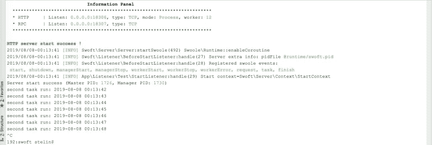
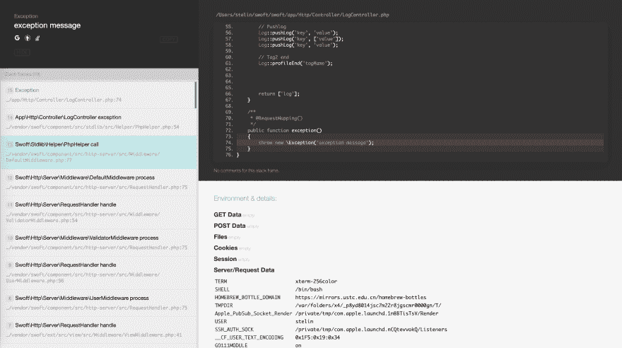

# PHP 微服务框架——Swoft 2 . 0 . 5 发布

> 原文：<https://dev.to/stelin/php-microservices-framework-swoft-2-0-5-published-83k>

## 什么是 Swoft？

Swoft 是一个基于 Swoole 扩展的 PHP 微服务协程框架。像 Go 一样，Swoft 有一个内置的协程 web 服务器和一个公共的协程客户端，驻留在内存中，独立于传统的 PHP-FPM。还有类似 Go 的语言操作，类似 Spring 的云框架灵活的注解，强大的全局依赖注入容器，全面的服务治理，灵活强大的 AOP，标准的 PSR 规范实现等等。

Swoft 通过三年的积累和方向探索，将 Swoft 打造成 PHP 界的春天云，是 PHP 高性能框架和微服务管理的不二之选。

## 高效秒 crontab

下面简单的几行代码定义了一个每秒执行一次的定时任务，可以完全替代系统 crontab。

```
<?php declare(strict_types=1);

namespace App\Crontab;

use Swoft\Crontab\Annotaion\Mapping\Cron;
use Swoft\Crontab\Annotaion\Mapping\Scheduled;

/**
 * Class CronTask
 *
 * @since 2.0
 *
 * @Scheduled()
 */
class CronTask
{
    /**
     * @Cron("* * * * * *")
     */
    public function secondTask()
    {
        printf("second task run: %s ", date('Y-m-d H:i:s', time()));
    }
} 
```

crontab 启动服务，将看到以下显示:

[](https://res.cloudinary.com/practicaldev/image/fetch/s--m42YF-FZ--/c_limit%2Cf_auto%2Cfl_progressive%2Cq_auto%2Cw_880/https://habrastorage.org/webt/ta/ag/1h/taag1h3rpqrxtv8nqgkhvt0q6ti.jpeg)

## 异常管理

在开发过程中，如果错误消息是一串字符，不方便业务解决问题。如果使用组件，所有错误消息将显示如下:

[](https://res.cloudinary.com/practicaldev/image/fetch/s--rBHdbVqm--/c_limit%2Cf_auto%2Cfl_progressive%2Cq_auto%2Cw_880/https://habrastorage.org/webt/rs/6c/qy/rs6cqyiok1gkruxsvajjamjqxvm.png)

## 更新

固定:

*   修复早期中断请求逻辑可能导致相应内容类型 [f031398](https://github.com/swoft-cloud/swoft-component/pull/493/commits/f03139886a471a0424d236061e8cb30d90b32a89) 的不正确格式化
*   修复了使用 sgo 创建子协程的问题，最后没有清理与顶层协程 [de11ae5b](https://github.com/swoft-cloud/swoft-component/pull/493/commits/de11ae5bc63833b80ca491132d156d51b95f6c8d) 的映射
*   修复 Xml 格式解析方法 [24d0038](https://github.com/swoft-cloud/swoft-component/pull/495/commits/24d0038dc644fccf238d9642f049ceb961dd22b3)
*   修复类代理唯一字符串问题 [444ddeb](https://github.com/swoft-cloud/swoft-component/pull/495/commits/444ddeb51e0741dda06e8f548f2579cf534bdf30)
*   修正了`context()->get()`问题并丢弃了`Context::mustGet()`方法 [6acc1b5](https://github.com/swoft-cloud/swoft-component/pull/496/commits/6acc1b55163a18edc95de6cdb899398a9a7d0f2e)
*   固定接口注入，类名访问错误 [2d9a31f](https://github.com/swoft-cloud/swoft-component/pull/496/commits/2d9a31fe1855054055daa6e6e73aeaddfa280900)
*   修复模型使用`paginate`方法，结果集没有映射字段 [3027287](https://github.com/swoft-cloud/swoft-component/commit/3027287a58bfa66b3c87b8d2d03fddbfc6c2c754)
*   修复了当有多个工作线程并主动关闭非当前工作线程连接时的 websocket 服务器错误 [7666969](https://github.com/swoft-cloud/swoft-component/pull/500/commits/7666969f731dce68d395f45749260731eead7bda)

更新:

*   默认的工人数量设置通过`swoole_cpu_num`功能 [553f6500](https://github.com/swoft-cloud/swoft-component/pull/493/commits/553f6500678b258080b84cffeab0fe2d5bf65550) 获得
*   验证器调整为，默认不需要，用户打开 [e5b258d](https://github.com/swoft-cloud/swoft-component/pull/496/commits/e5b258db35683e50f4abeba22a2c6fa82dbc7ceb)
*   不再将 swowt 内部的`containerException`抛出到用户使用的层 [1e74893](https://github.com/swoft-cloud/swoft-component/pull/498/commits/1e74893bf6e05fe954334e527e8b76eca2cef6e9)
*   控制台输出添加交互方式如`confirm` `select` [0181138a](https://github.com/swoft-cloud/swoft-component/pull/498/commits/0181138af6f1bc1dc0f3f1025b23d9a6354d122a)

增强功能:

*   控制台命令选项设置`CommandOption`，现在允许选项被描述为多行信息 [e5914983](https://github.com/swoft-cloud/swoft-component/pull/493/commits/e591498363dac1888f503ab18766e89542e33665)
*   websocket 服务器的所有消息传递方法，支持传入的`opcode`参数 [dc164ffe9](https://github.com/swoft-cloud/swoft-component/pull/493/commits/dc164ffe97d507e505ac8cd1b50a421a27ae5859)
*   websocket 模块允许设置当前模块的默认`opcode`，用于自动处理返回数据设置`opcode` [9e3e9672](https://github.com/swoft-cloud/swoft-component/pull/493/commits/9e3e9672ed83579e6135ed47ae0c30ef335d8659)
*   增强的 websocket 相关类，现在的消息处理方法允许注入更多的数据对象类型`Request` `Response` [3d6c60b4](https://github.com/swoft-cloud/swoft-component/pull/493/commits/3d6c60b4812535c48d51c57476f801529f66655f)
*   当工人退出时，websocket 服务器将自动关闭所有连接 [5ea10ecc](https://github.com/swoft-cloud/swoft-component/pull/498/commits/5ea10ecc4bcf767b374dad9652dd57a4fcfc8fc5)
*   添加定时器定时器包 [eb92ee6](https://github.com/swoft-cloud/swoft-component/pull/495/commits/eb92ee6a7d5e7f2a47e30920a83ed192626b42e3)
*   添加协程方法包 [d8c2b88](https://github.com/swoft-cloud/swoft-component/pull/495/commits/d8c2b8848d492fc4b389df6edee595ef8f0e39c5)

## 资源

*   GitHub:[https://github.com/swoft-cloud/swoft](https://github.com/swoft-cloud/swoft)