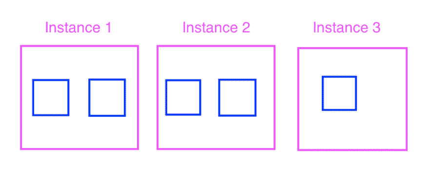
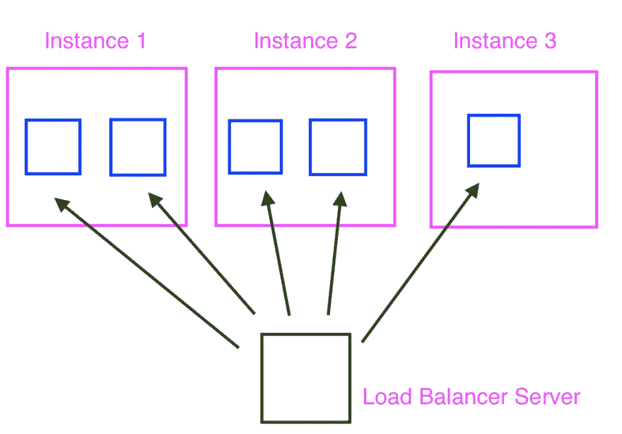
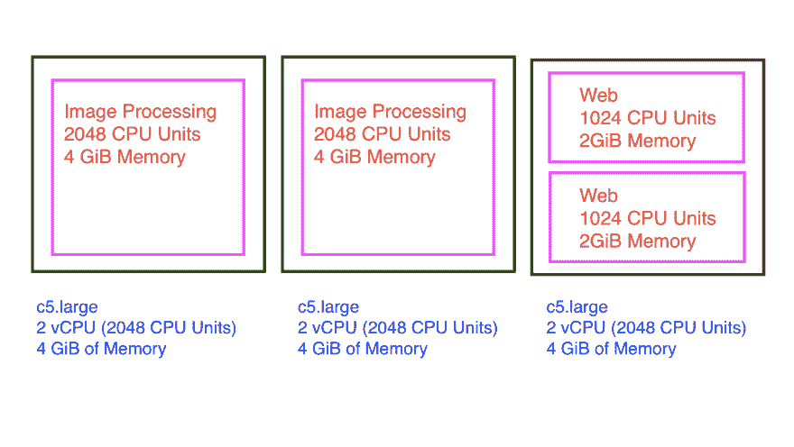

# 在 Amazon ECS 中部署 Rails:第 1 部分——概念

> 原文：<https://dev.to/raphael_jambalos/deploy-rails-in-amazon-ecs-part-1-concepts-26nl>

这是亚马逊 ECS 文章中*部署 Rails 的第一部分。它是 Docker* 中更广泛的系列*的一部分，而不是“你好世界”。该系列将带您从 Docker 中的 *hello world* 到在 AWS 中部署您的应用程序。*

*   [在 Docker 中构建 Rails + Sidekiq web 应用](https://dev.to/jamby1100/more-than-hello-world-in-docker-run-rails-sidekiq-web-apps-in-docker-1b37)
*   **在亚马逊 ECS 中部署 Rails**
    *   **概念-我们在这里**
    *   [将图像推送到 ECR](https://dev.to/jamby1100/deploy-rails-in-amazon-ecs-part-2-push-an-image-to-ecr-43fl)
    *   [创建 RDS 数据库、任务定义和负载平衡器](https://dev.to/jamby1100/deploy-rails-in-amazon-ecs-part-3-create-the-rds-database-task-definition-and-load-balancer-1ffe)
    *   [创建 ECS 群集并将其全部连接在一起](https://dev.to/jamby1100/deploy-rails-in-amazon-ecs-part-3-create-the-rds-database-task-definition-and-load-balancer-1ffe)
    *   [配置 Sidekiq](https://dev.to/jamby1100/deploy-rails-in-amazon-ecs-part-5-integrate-sidekiq-and-redis-for-background-processing-150f)
*   [使用 AWS CodeDeploy 自动部署](https://dev.to/raphael_jambalos/automate-deployments-with-aws-codepipeline-52f5)
    *   [深入了解 AWS 代码构建](https://dev.to/jamby1100/automate-docker-build-with-aws-codebuild-9om)
*   高级 ECS 概念:
    *   服务发现和自动扩展-即将推出
    *   Fargate -即将推出

Docker 上不缺如何入门的教程。然而，当你开始设置它以供生产使用时，并没有很多教程深入介绍你必须做的事情，从显示 *hello world* 到准备让它在生产中受到流量的冲击。本系列深入探讨了在 AWS 上开发和部署 dockerized 应用程序。

在[的上一篇文章](https://dev.to/jamby1100/more-than-hello-world-in-docker-run-rails-sidekiq-web-apps-in-docker-1b37)中，我们制作了一个简单的 Rails 5 应用程序，运行在 Docker 和 Docker Compose 之上。我们将在这里使用该应用程序。如果你决定跳过上一篇文章，这里有一份[源代码](https://github.com/jamby1100/rails-docker-project/releases/tag/v0.0.1)让你开始。如果你是从 Docker 开始，我强烈建议从上一篇文章开始。它包含了基本的 Docker 核心概念，是理解本系列概念的基础。

在本帖中，我们将了解开始使用 ECS 所需的概念。

## 0 | ECS 是什么，为什么要用？

[AWS 弹性容器服务(ECS)](https://aws.amazon.com/ecs/) 是一个支持 Docker 的高性能容器编排服务。它允许您在 AWS 上运行容器化的应用程序。它也是 AWS 自制的谷歌 Kubernetes 的竞争对手。AWS 将 ECS 与其许多其他服务集成在一起，当您在 AWS 上运行大部分工作负载时，这是显而易见的选择。

**为什么我们需要流程编排服务？**

简单的容器化应用程序很容易处理。如果你有一个容器来存放你的应用——这就是你需要管理的全部。

然而，生产工作负载不是这样的。中度繁忙工作负载的基线容量通常至少为 5 个集装箱。你必须确保 5 个容器同时运行。有时，这些容器不在同一个实例中——而是分布在 2-3 个实例中。在这种情况下，部署变得很麻烦。你必须去多个实例，运行新版本的 X 个副本，手动测试，然后关闭新版本。

您还必须管理如何在一个实例中拥有多个容器。对于传统部署，您在一个实例中有一个应用服务器，然后您将它指向端口 80，然后*瞧*，您就完成了！现在可以通过 HTTP 访问了。但是如果有两个容器跨多个实例呢？你不能直接将两个集装箱放在一个港口 80。因此，您可能会使用 1 台服务器在不同实例的容器之间进行负载平衡。即使这样，您也必须手动向该服务器注册和注销每个容器。

通过这种方式，使基础设施运行所需的维护工作不值得迁移到 Docker。我真的宁愿做传统的部署。

但是，ECS 作为一项 orchestrator 服务，其中的大部分成本都被取消了:

*   它为您提供实例。它部署的实例已经可以使用了。你只要说你想要多少个实例和什么样的实例。
*   ECS 处理如何跨 EC2 实例部署容器。
*   它与 AWS 的*负载平衡服务*集成，因此您不必管理自己的负载平衡器。它还处理向负载平衡器注册健康实例，以便流量可以被路由到容器。相反，它处理注销不健康的实例，因此流量不会被路由到有缺陷的容器。
*   它为您处理部署，使用健康检查来确保您的新版本在流量被路由到它之前通过某种测试。否则，它不会将流量路由到这些新实例。
*   ECS 免费！你只需为你的应用所使用的资源付费。

# 1 |概念

**码头登记处**

您需要做的第一件事是将您的 Docker 映像推送到 Docker 注册表中。Docker 注册表与 GitHub 非常相似，但用于 Docker 图像。您可以拉、推和标记图像。标签是我们给不同版本的图像起的名字。您可以在图像库中推送任意多的图像版本，只要它们具有不同的标签(即 v0.0.1 和 v0.0.2)。如果它们具有相同的标记(都标记为 v0.0.1)，则较新的版本将覆盖较早的版本。

最突出的注册表是 [Docker Hub](https://hub.docker.com/) ，它包含了我们用来构建图像的大部分[基础图像](https://www.ibm.com/support/knowledgecenter/en/SS6PEW_9.5.0/com.ibm.help.install.omsoftware.doc/installation/c_DockerBaseImage.html)。Docker Hub 提供无限量的免费公共图像，但存储私人图像要收费。AWS 有自己的私有注册中心:[【弹性容器注册中心(ECR)](https://aws.amazon.com/ecr/) 。目前收费 0.1 美元/GB/月。它还对流出 ECR 和进入实例的流量收费(例如，当您的容器从 ECR 提取图像时)。在本教程中，我们将使用 ECR。

**任务定义**

任务定义是一个 JSON 文件，它定义了一个任务和其中的容器。*任务*是容器的逻辑分组(即一个“图像处理任务”可以有一个 Sidekiq 容器、一个 web 容器和一个 Redis 容器)。任务*中的容器必须*一起运行。在图像处理示例中，缩放 web 容器还需要缩放 Sidekiq 和 Redis 容器。

我认为每个任务只有一个容器是最佳实践——这样你就可以独立地扩展应用程序的不同部分。

任务定义包含如下信息:

*   一个任务应该有多少 CPU 和内存？
*   定义任务中的容器:
    *   容器消耗了多少 CPU 和内存？它不能超过任务的 CPU 和内存分配。如果一个任务中有多个容器，它们的 CPU 和内存消耗的总和不能超过分配给该任务的量。
    *   如何跨容器管理日志？
    *   容器将使用什么 Docker 图像？
    *   哪些环境变量应该对容器可见？
    *   我们将使用什么命令来启动容器？(对于 Rails，这是打开应用服务器的`rails s`)

由于这种配置会随着应用程序的生命周期而变化，任务定义可以包含多个版本，称为*修订*。

**ECS 服务**

服务保证你总是有 X 数量的任务在任何时候运行。当一个容器死亡时，它会为你再生一个。该服务还负责决定在 EC2 实例群中部署哪个实例。

当它生成一个容器时，它将确保该容器将被注册到附加到它的应用程序弹性负载平衡器(ALB )(如果有的话)。ALB 在您拥有的许多容器之间重定向流量。一旦容器注册到 ALB，流量就可以流向它。

有两种类型的服务:ECS-EC2 和 ECS-Fargate。

ECS-EC2 服务在您可以访问的 EC2 实例之上运行容器。 **ECS-Fargate** 服务在由 AWS 管理的*EC2 实例之上运行容器。您无权访问这些 EC2 实例。我们将在这篇文章中使用 ECS-EC2。*

**ECS 集群**

集群是服务和任务的集合。运行 ECS-EC2 服务时，集群也是 EC2 实例的集合。您可以设置想要提供的 EC2 实例的数量和类型。每个 EC2 实例的内存单元和 CPU 单元的总和决定了您可以在集群中提供多少容器。

例如，我们为我们的图像处理应用程序创建了一个集群。它有两个 ECS-EC2 服务:一个呈现网站的 **web** 服务，和一个调整图像大小的**图像处理**服务。该集群还有 3 个 c5.large 实例，每个实例有一个 2vCPU (2，048 个 CPU 单元)和 4gb 内存。这为我们提供了 6，144 个 CPU 单元和 12GiB 内存的总容量。该容量由集群中的所有 ECS-EC2 服务共享。

假设我们的 web 服务每个任务需要 1，024 个 CPU 单元和 2GB 的 RAM，我们的图像处理服务每个任务需要 2，048 个 CPU 单元和 4GB 的 RAM。在这 3 个 c5 .大型实例中，我们可以容纳 2 个图像处理任务和 2 个 web 服务任务。如果我们决定再添加 1 个 web 服务任务，我们将不能再添加了，因为所有 3 个 c5.large 实例都将它们的资源专用于其他 4 个任务。

# 接下来是什么？

在下一篇文章中，我们将设置我们的 AWS 帐户，并将一个图像推送到 AWS 的图像注册中心，弹性容器注册中心(ECR)。