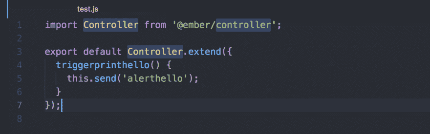
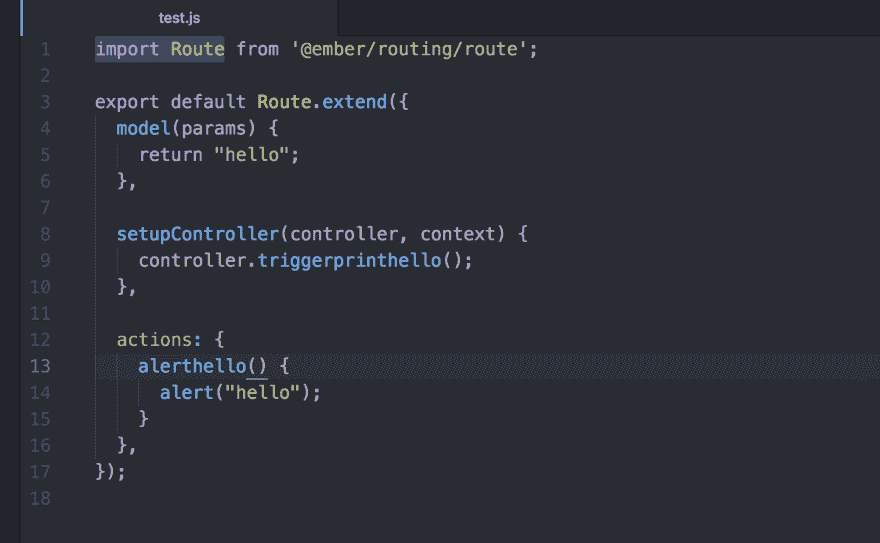

# 过渡期间 Ember route 的操作

> 原文：<https://dev.to/sarath/ember-route-s-actions-during-transitions-59o4>

当我在使用 EmberJS webApp 的时候，我突然发现了一个错误*没有处理动作“alerthello”。*😔

考虑一下，

我在名为 *test.js* 的路径中有一个 **alerthello** 动作，还有一个名为 *test.js* 的控制器，带有函数 **triggerprinthello** 。

控制器部分看起来像:

路线部分看起来像:

这是全部代码吗？，不，这只是一个样本(如果我给他们看，你可能会窃取代码😂)

你可能会想，到底是谁会写这样的剧本，我就是那个人。

好了，言归正传。

我试图执行上面的代码，而不是显示它抛出错误的警告。

然后我深究这件事，然后我发现了一些有趣的东西(也许🤔对我来说)。

## 你知道我发现了什么吗？😲

事情是这样的，ember 维护一个活动的路由列表(基于该列表冒泡发生)。🤔

当我从某个**x 路线**过渡到**测试路线**时，ember 不会将**测试路线**添加到活动路线列表中，直到过渡完成。

在我的例子中， **setupcontroller** 将调用函数 **triggerprinthello** ，该函数反过来将在活动路由列表中搜索动作 **alerthello** ，由于**测试路由**(仍处于转换状态)尚未在*活动路由列表*中列出，因此它将一直冒泡，直到**应用程序**路由查找动作(**成员:**您是否忘记添加关于💥它抛出错误。

那么，我是如何解决这个问题的:

从两个方面来说，

1)我在控制器本身中处理动作。我处理了路线的 **didTransition** 钩子中的动作。😌

你可能会问为什么这个垃圾被贴在这里，我认为这个帖子可能对其他人有所帮助。

此外，如果我做错了什么，请分享你的想法，以便我可以纠正自己😊。