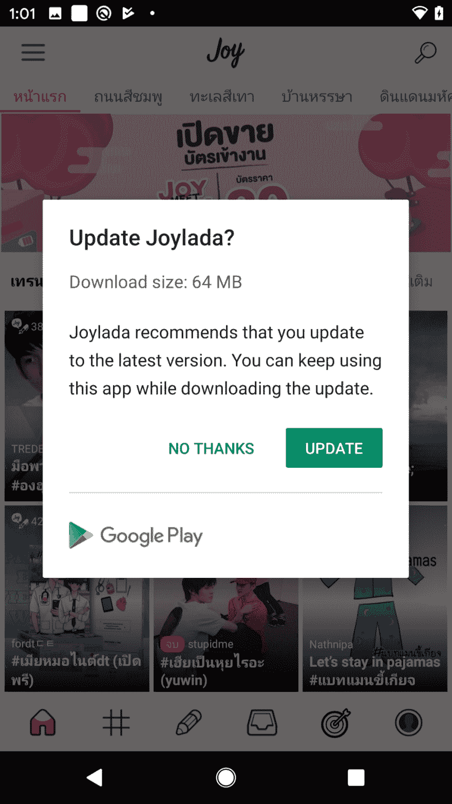
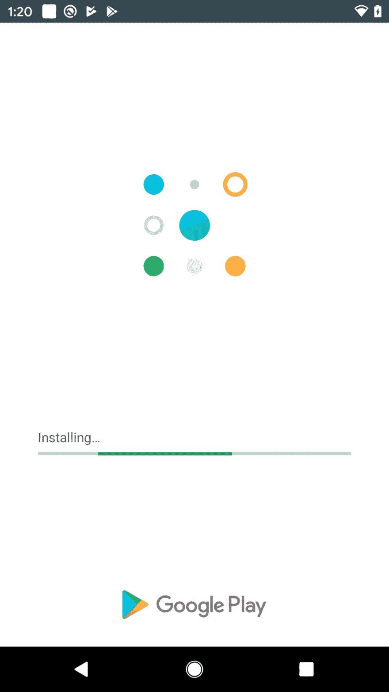

# Android 应用内更新

> 原文：<https://dev.to/ookbee/android-in-app-update-4fng>

期待已久的是，2019 年 5 月，Google 发布了一个 API，让 Developer 可以在我们正在使用的 App 过程中进行 app 更新，即我们 Dev 通过方法。

*【可伸缩性】*用于调用 user update，决定是否更新。

*【中值】t1⾹在理想情况下使用，我们用大量的 impact 强迫他更新。*

所以我们就把它放在 App 上，看上去很 Smooth。唯一的缺点是回调也做得很差。我们不知道下载的 Apk 文件是从 flexible 调用的。

它只说了这个，应该把那个版本的细节也画出来，不过不管怎样，算了，在安装之前我们可以自己给用户添加 UI

好的是‘t0’flexible 模式。它在后台进行下载，然后向上贴在记事本上，User 就可以了。

总结来说，公平是很有意思的，但它好像还做了很多事情，它并没有完全说服用户加载应用程序，但是它已经完全满足了我们的需求。

参考链接

[https://developer . Android . com/guide/app-bundle/in-app-updates](https://developer.android.com/guide/app-bundle/in-app-updates)