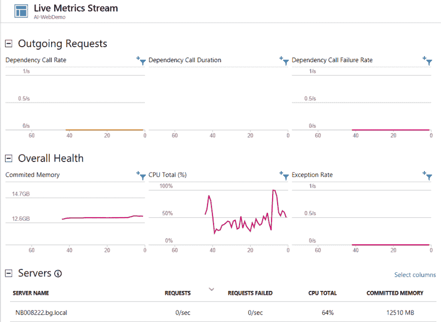
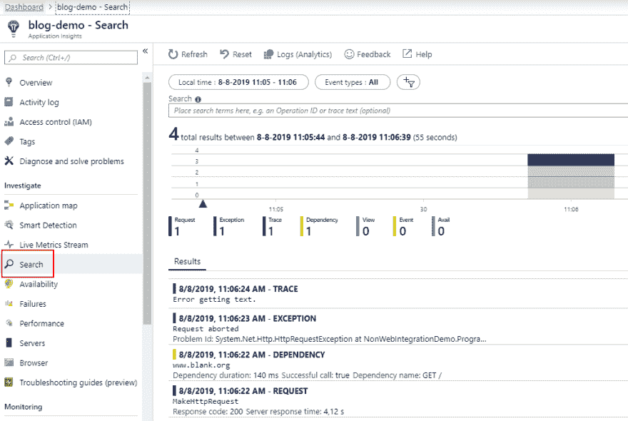
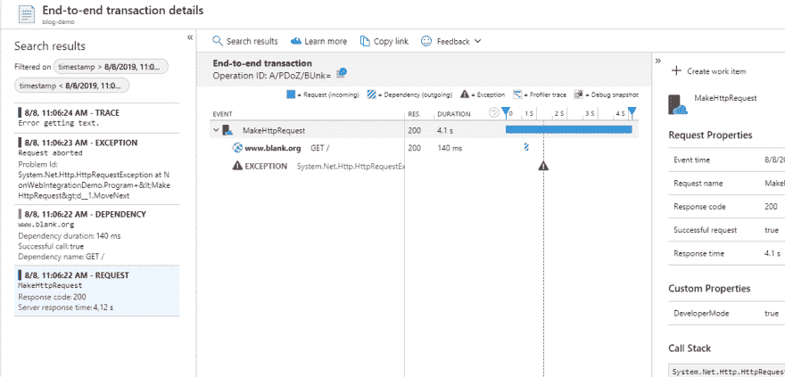
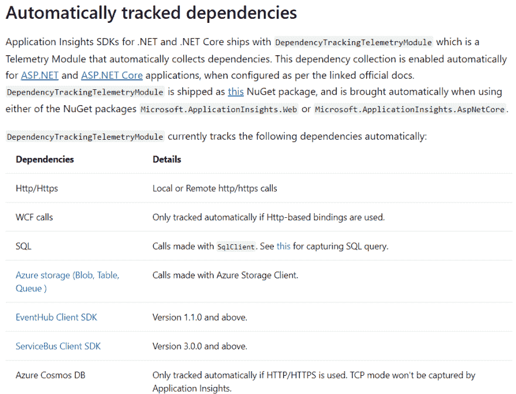

# 使用 Azure Application Insights 监控非 web 应用程序(第 2 部分:基本工具)

> 原文：<https://dev.to/expecho/monitoring-non-web-apps-using-azure-application-insights-part-2-basic-instrumentation-2fcj>

欢迎阅读本系列的第二篇文章，内容涉及使用 Azure Application Insights 监控非 web 应用程序。

在[之前的帖子](https://dev.to/expecho/monitoring-non-website-applications-using-azure-application-insights-part-1--42oa)中，我们使用 Azure 门户创建了一个应用洞察资源，并将应用洞察集成到一个简单的控制台应用中。结果，我们得到了应用程序的实时监控，如下所示。

[](https://res.cloudinary.com/practicaldev/image/fetch/s--QLs_k5r0--/c_limit%2Cf_auto%2Cfl_progressive%2Cq_auto%2Cw_880/https://expecho.blob.core.windows.net/blogposts/LiveMetricsStream-Basic.PNG)

现在是时候在我们的代码中添加工具了。Application Insights SDK 允许跟踪这些实体:

*   页面视图

*   例外

*   要求

*   跟踪

*   属国

*   韵律学

*   事件

当你将应用洞察添加到一个 web 应用中时，对页面浏览量、请求、依赖性等的整体跟踪。是自动完成的。不幸的是，在构建控制台、WPF 或 WinForms 应用程序时，我们需要手动创建遥测项，并使用 [SDK](https://docs.microsoft.com/en-us/azure/azure-monitor/app/api-custom-events-metrics) 发送它们。

为了向 Application Insights 发送遥测数据，我们需要一个`TelemetryClient`。创建遥测项目的方法有多种，但有一点需要记住。应用洞察的真正力量是关联遥测项目的能力。您确实想知道什么请求属于什么页面视图，什么请求触发了依赖关系调用，以及在抛出异常时发生了什么。我们稍后将回到这一点，让我们先发送一些遥测数据。我们将扩展我们在前一篇文章中创建的控制台应用程序。

假设我们将这样一个方法添加到控制台应用程序的`Program`类:

```
private static async Task MakeHttpRequestAsync()
{
    try
    {
        using (var httpClient = new HttpClient())
        {
            var result = await httpClient.GetStringAsync("http://www.blank.org");
            Console.WriteLine(result);
        }
    }
    catch (HttpRequestException ex)
    {
        Console.WriteLine("Error getting text.");
    }
} 
```

鉴于上述代码，我希望应用洞察跟踪方法被调用，以及它需要多长时间来执行。我也很高兴能够看到`HttpRequestException`被登录到应用洞察中。最后，我很高兴知道对 http://www.blank.org 的[的外部依赖调用用了多长时间。此外，如果发生了除了`HttpRequestException`之外的异常，我希望将方法调用标记为失败。](http://www.blank.org)

因此，让我们扩展这个方法，使用一个`TelemetryClient`来跟踪各种遥测项目:

```
private static async Task MakeHttpRequestAsync(T)
{
    var telemetryClient = new TelemetryClient(TelemetryConfiguration.Active);
    using (var operation = 
                 telemetryClient.StartOperation<RequestTelemetry>(nameof(MakeHttpRequestAsync)))
    {
        try
        {
            using (var httpClient = new HttpClient())
            {
                var result = await httpClient.GetStringAsync("http://www.blank.org");
                telemetryClient.TrackTrace($"The http call returned '{result}'");
                Console.WriteLine(result);
            }
        }
        catch (HttpRequestException ex)
        {
            telemetryClient.TrackException(ex);
            Console.WriteLine("Error getting text.");
        }
        catch
        {
            operation.Telemetry.Success = false;
            throw;
        }
    }
} 
```

然后我们修改在[前一篇文章](https://dev.to/expecho/monitoring-non-website-applications-using-azure-application-insights-part-1--42oa)中创建的`Program`类中的`Main`方法的代码，以调用这个方法:

```
static async Task Main(string[] args)
{
    ConsoleKeyInfo keyInfo = new ConsoleKeyInfo();

    while (keyInfo.Key != ConsoleKey.Q)
    {
         await MakeHttpRequest();
         keyInfo = Console.ReadKey();
    }

    Console.WriteLine("Press any key to run again or Q to exit.");
    Console.ReadKey();
} 
```

让我们浏览一下代码。我们首先创建一个`TelemetryClient`的实例，并用一个`TelemetryConfiguration.Active`初始化它。这将应用文件`ApplicationInsights.config`中定义的配置。

接下来，我们使用 [`TelemetryClient.StartOperation()`](https://docs.microsoft.com/en-us/azure/azure-monitor/app/api-custom-events-metrics#operation-context)
在 Application Insights 中将方法调用作为请求遥测项进行跟踪

```
using (var operation = 
             telemetryClient.StartOperation<RequestTelemetry>(nameof(MakeHttpRequestAsync))) 
```

当操作在 using 块的末尾被处理时，计算从开始到结束的总持续时间，并将请求项发送到 Application Insights。

接下来，除了跟踪异常或请求等实体，您还可以使用跟踪遥测项目在 Application Insights 中记录一些任意文本。这是使用行`telemetryClient.TrackTrace($"The http call returned '{result}'");`完成的

如果出现我们能够处理的异常，我们可以在应用洞察中记录该异常。这是通过调用`telemetryClient.TrackException(ex);`来完成的。

最后，当出现我们无法处理的异常时，我们可以通过将`RequestTelemetry`的`Success`属性的值设置为 false，将对该方法的调用标记为失败。为了到达通过调用`TelemetryClient.StartOperation()`发起的操作的`RequestTelemetry`，我们可以使用`Telemetry`属性:

```
operation.Telemetry.Success = false; 
```

然后我们重新抛出异常，以便调用者可以处理它。

在启动应用程序之前，在浏览器中打开一个选项卡，导航到 Application Insights 中的实时指标流。

现在，如果我们运行该应用程序，我们将会看到遥测数据出现在应用洞察中。请注意，可能需要几秒钟时间才能初始化实时指标流，遥测项目也需要几分钟时间才会出现在门户中:

[](https://res.cloudinary.com/practicaldev/image/fetch/s--qWmxI6i6--/c_limit%2Cf_auto%2Cfl_progressive%2Cq_auto%2Cw_880/https://expecho.blob.core.windows.net/blogposts/ai-search.png)

如果我们点击请求，我们会看到一个更详细的视图。

[](https://res.cloudinary.com/practicaldev/image/fetch/s--XSVajzzX--/c_limit%2Cf_auto%2Cfl_progressive%2Cq_auto%2Cw_880/https://expecho.blob.core.windows.net/blogposts/ai-search-result.png)

如你所见，遥测项目被分组在一起。门户将向您显示发出的 Http 调用来自请求。这就是使用“`TelemetryClient.StartOperation()`,而不是像`telemetryClient.TrackRequest(...);`那样做的好处。一旦操作开始，在操作范围内发送的所有遥测项目都链接在一起。

此外，您可以看到，传出的 Http 调用被 Application Insights 检测到并自动记录。这是由`DependencyTrackingTelemetryModule`完成的。Application Insights 可以跟踪的不仅仅是 http 调用，正如在文档中看到的[:](https://docs.microsoft.com/en-us/azure/azure-monitor/app/asp-net-dependencies#automatically-tracked-dependencies)

[](https://res.cloudinary.com/practicaldev/image/fetch/s--GDr4Xdzz--/c_limit%2Cf_auto%2Cfl_progressive%2Cq_auto%2Cw_880/https://expecho.blob.core.windows.net/blogposts/ai-tracked-dependencies.png)

最酷的是，应用程序创建的遥测数据也可以被实时指标流捕获！

[](https://res.cloudinary.com/practicaldev/image/fetch/s--iGgCzPqz--/c_limit%2Cf_auto%2Cfl_progressive%2Cq_66%2Cw_880/https://expecho.blob.core.windows.net/blogposts/live-metrics-anim.gif)

然而，坏的一面是检测这样的应用程序所涉及的大量代码。想象一下，必须为您想要检测的每一个方法编写这段代码。在下一篇博文中，我会告诉你一个让生活变得更简单的方法，所以请继续关注。我保证不会花我写第二部分的时间:-)