# 在应用和基础设施层面扩展 Kubernetes

> 原文：<https://dev.to/tetiana_ftv/scaling-kubernetes-on-application-and-infrastructure-levels-5bfe>

Kubernetes 曾经是谷歌的一个内部项目，如今它已经改变了软件开发的方式。蓝色背景的白色方向盘现在似乎随处可见。企业希望增长并降低成本，开发人员希望有一个稳定的平台来大规模运行应用程序，开发人员希望有可靠且可重复的流程来编写、测试和调试代码。Kubernetes 承诺这一切。现在 Jelastic 提供了托管的 Kubernetes，构建一个集群再简单不过了。

但是，您是否考虑过如何获得这样一个强大的容器编排平台，并且只为您实际需要的资源付费？本文将在 Jelastic(基础架构)和 Kubernetes(应用程序)两个层次上阐明水平和垂直伸缩。

# 在基础设施层面上扩展 Kubernetes

Kubernetes 集群通常由一个主节点(或几个主节点)和多个节点组成，在这些节点上调度应用程序单元。这里的数学很简单:集群中运行的应用程序越多，需要的资源(节点)就越多。比方说，您有一个由 3 个服务组成的微服务应用程序，每个服务都是作为一个单独的 pod 启动的，需要 1gb 的 RAM。这意味着您将需要一个 4 GiB 节点(K8s 组件和操作系统也需要一些 RAM)。如果您在高负载、潜在内存泄漏的情况下需要额外的 RAM，或者如果您向集群部署更多的服务，该怎么办？正确，您需要一个更大的节点，或者向群集中添加一个额外的节点。通常在这两种情况下，您将为虚拟机附带的确切资源量付费(例如，您将为 3GiB 的 RAM 付费，即使其中一半未使用)。但 Jelastic 的情况并非如此。

## Kubernetes 节点的垂直缩放

让我们回到数学上来。如果应用程序大约需要 3GiB 的 RAM，并且集群中没有太多活动，那么您只需要一个节点。当然，拥有一些额外的空闲 RAM 总是一个好主意，所以 5GiB 节点很有意义。

再说一次，不是和杰拉斯特。您可以做的是请求一个 3gb 的节点，并存储一个 2gb 的节点。当您的应用程序(K8s pod)开始消耗更多的资源(也在 K8s 端配置)或者您简单地部署更多的 pod(如下图所示)时，这两个额外的 GiB 会立即可用，并且您只有在使用它们时才开始为这些资源付费。

[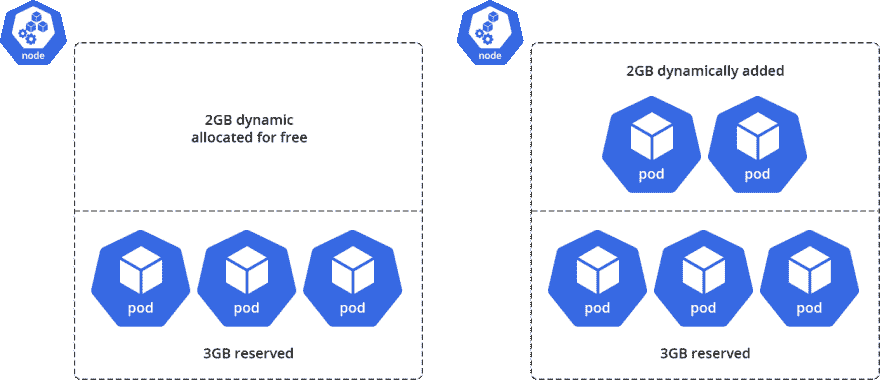](https://res.cloudinary.com/practicaldev/image/fetch/s--Ho2ywD0W--/c_limit%2Cf_auto%2Cfl_progressive%2Cq_auto%2Cw_880/https://jelastic.com/blog/wp-content/uploads/2019/08/vertical-scaling-kubernetes.png)

因此，您可以做一些简单的计算，找出最佳的集群拓扑:比如说，3 个节点，4 GiB 的保留 RAM 和 3GiB 的动态资源。

## Kubernetes 节点的水平自动缩放

在 Kubernetes 集群中拥有一个巨大的节点并不是一个好主意，因为一旦发生中断或任何其他重大事故，所有的部署都会受到影响。让几个节点处于备用模式是不经济的。有没有可能 Kubernetes 在需要的时候增加一个节点？是的，Jelastic 中的 Kubernetes 集群可以配置水平节点自动伸缩。当 RAM、CPU、I/O 或磁盘使用率达到一定水平时，新节点将添加到集群中。不用说，只有在使用额外资源时，才会向您收取费用。将根据当前拓扑创建新添加的节点，即应用现有的垂直扩展配置。一旦资源消耗恢复到预期水平，系统就会缩小规模。您的 Kubernetes 集群不会挨饿，但您不会为未使用的资源付费。

[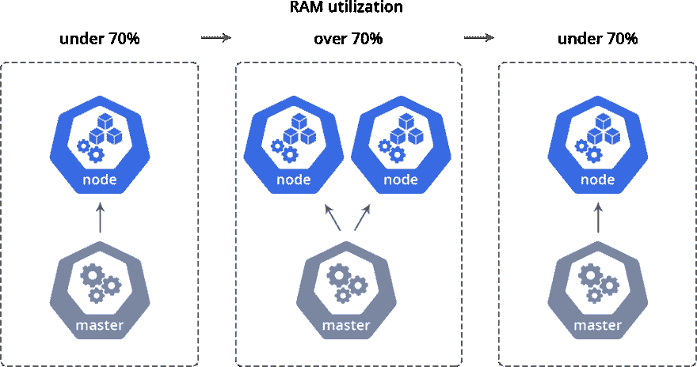](https://res.cloudinary.com/practicaldev/image/fetch/s--vXHUCa0p--/c_limit%2Cf_auto%2Cfl_progressive%2Cq_auto%2Cw_880/https://jelastic.com/blog/wp-content/uploads/2019/08/horizontal-scaling-kubernetes.png)

# 在应用级别上扩展 Kubernetes

Kubernetes 拥有自己的水平 [pod 自动定标器](https://kubernetes.io/docs/tasks/run-application/horizontal-pod-autoscale-walkthrough/) (HPA)。简而言之，HPA 将根据 CPU 利用率复制选定的部署。如果所有单元的 CPU 消耗增长超过 70%，HPA 将调度更多的单元，当 CPU 消耗恢复正常时，部署将缩减到副本的原始数量。

为什么这很酷，它如何与 Kubernetes 节点的自动水平缩放一起工作？比方说，您有一个节点，其中有几个正在运行的 pod。突然，pod 中的一个特定服务开始收到大量请求，并执行一些消耗 CPU 资源的操作。RAM 利用率不会增长，因此此时没有机制来扩展应用程序，应用程序很快就会变得无响应。Kubernetes HPA 将纵向扩展 pod，内部 K8s 负载平衡器会将请求重定向到健康的 pod。这些新的 pod 将需要更多的资源，这就是 Jelastic 水平和垂直伸缩发挥作用的地方。新的 pod 将被放置在同一个节点上并利用动态 RAM，或者将添加一个新的节点(以防现有节点上没有足够的资源)。

*立方缩放输出*

[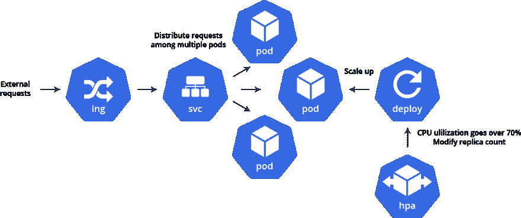](https://res.cloudinary.com/practicaldev/image/fetch/s--It6k1Bba--/c_limit%2Cf_auto%2Cfl_progressive%2Cq_auto%2Cw_880/https://jelastic.com/blog/wp-content/uploads/2019/08/scaling-kubernetes-out.png)

*Kubernetes 缩放在*

[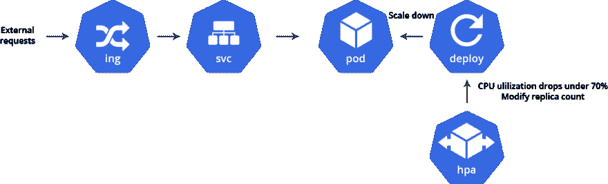](https://res.cloudinary.com/practicaldev/image/fetch/s--Yd_pvkFm--/c_limit%2Cf_auto%2Cfl_progressive%2Cq_auto%2Cw_880/https://jelastic.com/blog/wp-content/uploads/2019/08/scaling-kubernetes-in.png)

最重要的是，你可以在 Kubernetes 豆荚上设置资源上限。例如，如果您确定某个特定的服务不应该消耗超过 1gb 的内存，并且如果它消耗了内存，就会发生内存泄漏，那么您可以指示 Kubernetes 在 RAM 利用率达到 1gb 时终止 pod。新的 pod 将自动启动。这使您能够控制 Kubernetes 部署使用的资源。

# 用托管在 Kubernetes 上的 WordPress 进行活生生的证明

现在，让我们将一个真实的应用程序部署到 Kubernetes 集群，以展示上面提到的所有伸缩特性。WordPress 网站就是一个很好的例子。巨大的 Kubernetes 社区是其最大的优势和采用因素之一，因此很容易找到如何部署流行应用程序的教程。让我们浏览一下官方的 [WordPress 教程](https://kubernetes.io/docs/tutorials/stateful-application/mysql-wordpress-persistent-volume/)(为了本文简单起见，选择了非生产部署，您可以使用 helm charts 来部署 WordPress)。

一旦完成，还有一件事要做。我们需要创建一个绑定到 WordPress 服务的入口，因为对 Jelastic Kubernetes 集群中运行的应用程序的访问是由 Traefik 反向代理提供的。

创建一个名为 *wp-ingress.yaml* 的文件，内容如下:

API version:extensions/v1 beta 1
kind:Ingress
元数据:
标签:
app: wordpress
name: wp
注释:
kubernetes.io/ingress.class: trae fik
ingress.kubernetes.io/secure-backends: " true "
trae fik . frontend . rule . type:pathprifxstrip
spec:
规则:

*   http:路径:
    *   路径:/后端:服务名称:服务端口:80

创建入口后，WordPress 站点就可以在 *https://上找到了。*

[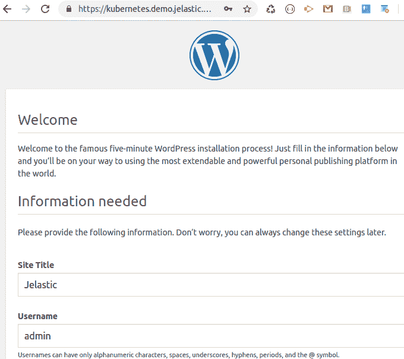](https://res.cloudinary.com/practicaldev/image/fetch/s--AZ_0JyJF--/c_limit%2Cf_auto%2Cfl_progressive%2Cq_auto%2Cw_880/https://jelastic.com/blog/wp-content/uploads/2019/08/scaling-kubernetes-welcome-wordpress.png)

很好，我们在 Kubernetes 集群中有一个正在运行的 WordPress 实例。让我们为 WordPress 部署创建水平 pod 自动缩放器(HPA ),以确保服务总是在高负载下响应。在您的终端中，运行:

kubectl 自动缩放部署 WordPress-CPU-percent = 30-min = 1-max = 10-n WP

现在，如果 WordPress pod 开始为所有的 pod 利用超过 30%的 CPU，autoscaler 将修改部署以添加更多的 pod 副本，以便内部负载平衡器将请求路由到不同的 pod。当然，选择的值仅用于演示目的，可以根据您的需要进行调整。

下一步是审查 Jelastic Kubernetes 环境的垂直和水平扩展选项。这里有两个主要目标:

*   只为实际使用的资源付费
*   确保 Kubernetes 集群在需要时有一个备用节点

为了使演示更简单(即更快用完 RAM)，让我们将节点配置为使用高达 1.5GiB 的 RAM 和 4.8GHz 的 CPU。点击*改变环境拓扑*并声明每个节点的*缩放限制*。

[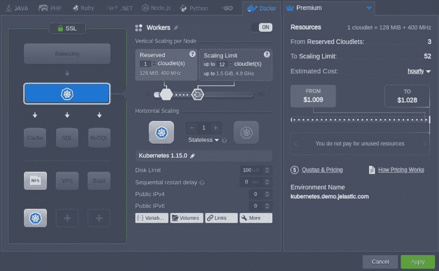](https://res.cloudinary.com/practicaldev/image/fetch/s--tKJoivoC--/c_limit%2Cf_auto%2Cfl_progressive%2Cq_auto%2Cw_880/https://jelastic.com/blog/wp-content/uploads/2019/08/scaling-kubernetes-wordpress-topology-edit.png)

自动水平缩放的配置是最后一步。与垂直缩放类似，值被设置为立即触发，以适应本演示的目的。让我们指示 Jelastic 何时添加和删除 Kubernetes 节点。打开*设置>自动水平缩放*和*添加*一组需要的触发器。

[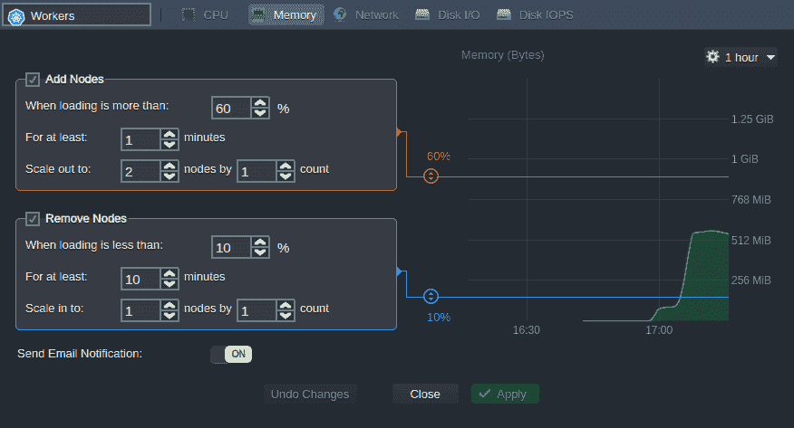](https://res.cloudinary.com/practicaldev/image/fetch/s--suYWGtG9--/c_limit%2Cf_auto%2Cfl_progressive%2Cq_auto%2Cw_880/https://jelastic.com/blog/wp-content/uploads/2019/08/scaling-kubernetes-wordpress-horizontal-scaling.png)

我们来看看内存消耗。Kubernetes node (Workers)使用 8 个 cloudlets，另外 4 个 cloudlets 可以动态添加，也就是说，有一些 RAM 可以调度更多的 pods。

[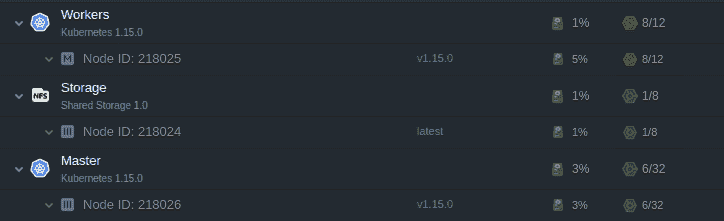](https://res.cloudinary.com/practicaldev/image/fetch/s--tarbEEeS--/c_limit%2Cf_auto%2Cfl_progressive%2Cq_auto%2Cw_880/https://jelastic.com/blog/wp-content/uploads/2019/08/scaling-kubernetes-workers-added.png)

是时候给 WordPress 网站施加一些压力了。有多种方法可以启动 HTTP GET 请求。我们将在 WordPress pod 内部执行的 while-true 循环中使用最简单的–wget(WordPress 是一个服务名称，将被解析为只能从集群访问的内部 IP):

虽然真实；do wget-q-O-[http://WordPress](http://wordpress)；完成的

稍后，我们可以从 HPA 中观察到以下数据:

[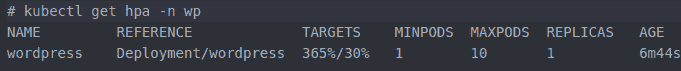](https://res.cloudinary.com/practicaldev/image/fetch/s--SIygyqlh--/c_limit%2Cf_auto%2Cfl_progressive%2Cq_auto%2Cw_880/https://jelastic.com/blog/wp-content/uploads/2019/08/scaling-kubernetes-hpa.png)

Kubernetes autoscaler 已经修改了 WordPress 部署来添加更多的副本。不出所料，集群没有足够的 RAM，因此正如 Kubernetes Dashboard 建议的那样，剩余的 5 个 pods 不能被调度:

[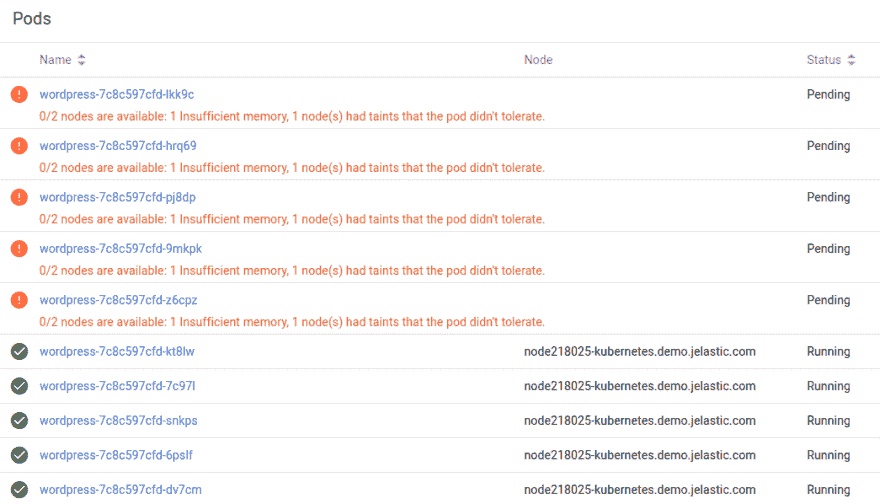](https://res.cloudinary.com/practicaldev/image/fetch/s--IcKVHCcU--/c_limit%2Cf_auto%2Cfl_progressive%2Cq_auto%2Cw_880/https://jelastic.com/blog/wp-content/uploads/2019/08/scaling-kubernetes-workers-required.png)

虽然有几个 pods 能够启动，但是 Jelastic 动态地向节点添加了 cloudlet(RAM 和 CPU)。然而，剩下的两个小云团不足以让至少一个以上的吊舱启动。

[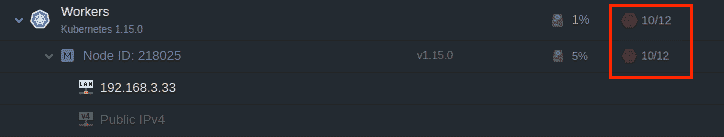](https://res.cloudinary.com/practicaldev/image/fetch/s--XMFmTLai--/c_limit%2Cf_auto%2Cfl_progressive%2Cq_auto%2Cw_880/https://jelastic.com/blog/wp-content/uploads/2019/08/scaling-kubernetes-lack-resources.png)

这是魔法开始的地方。由于我们已经配置了自动节点自动缩放，Jelastic 现在正在添加一个新节点。

[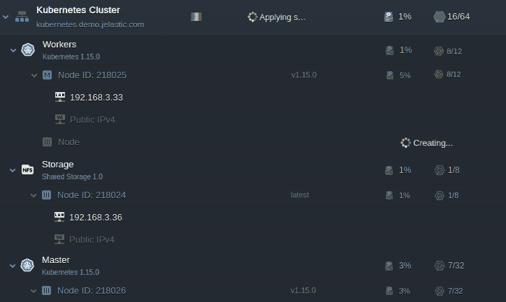](https://res.cloudinary.com/practicaldev/image/fetch/s--o5OokCFZ--/c_limit%2Cf_auto%2Cfl_progressive%2Cq_auto%2Cw_880/https://jelastic.com/blog/wp-content/uploads/2019/08/scaling-kubernetes-automatic-workers-adding.png)

让我们通过运行一个简单的命令 *kubectl get nodes* 来检查一个新节点是否注册到了 master

[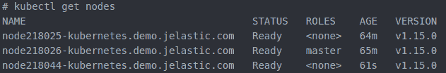](https://res.cloudinary.com/practicaldev/image/fetch/s--LPGoIJL7--/c_limit%2Cf_auto%2Cfl_progressive%2Cq_auto%2Cw_880/https://jelastic.com/blog/wp-content/uploads/2019/08/scaling-kubernetes-kubectl-get-nodes.png)

片刻之后:

太棒了。所有的 pod 都已经启动，这意味着 WordPress 可以处理我们几分钟前发起的所有请求。现在，让我们中止这个`while true`命令，等待一分钟左右。副本计数再次回到 1，这意味着我们不需要额外的节点。

[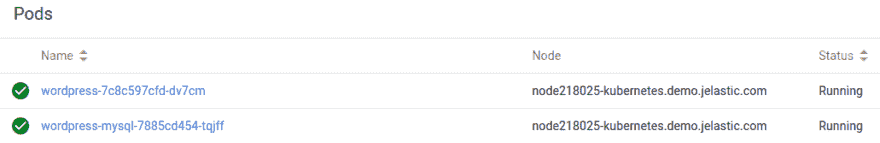](https://res.cloudinary.com/practicaldev/image/fetch/s--H9UR77c5--/c_limit%2Cf_auto%2Cfl_progressive%2Cq_auto%2Cw_880/https://jelastic.com/blog/wp-content/uploads/2019/08/scaling-kubernetes-workers-scaled-in.png)

内存利用率数据表明可以删除该节点。

[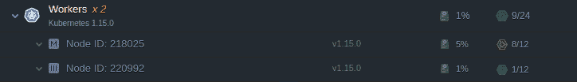](https://res.cloudinary.com/practicaldev/image/fetch/s--Xjn47Ir2--/c_limit%2Cf_auto%2Cfl_progressive%2Cq_auto%2Cw_880/https://jelastic.com/blog/wp-content/uploads/2019/08/scaling-kubernetes-have-resources.png)

Jelastic 确实在大约一分钟内移除了它。

[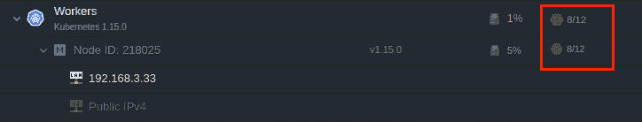](https://res.cloudinary.com/practicaldev/image/fetch/s--pVRl19Wv--/c_limit%2Cf_auto%2Cfl_progressive%2Cq_auto%2Cw_880/https://jelastic.com/blog/wp-content/uploads/2019/08/scaling-kubernetes-remove-worker.png)

我们刚刚目睹了什么？让我们回顾一下。为 WordPress 部署创建 HPA 启动了更多 pod 副本的调度，以处理高负载。由应用程序管理员来配置触发器。接下来，Jelastic 在节点内动态分配 RAM。如果内存不足，一个新节点将被添加到集群中。当资源利用率恢复正常时，HPA 将副本计数设置回 1，Jelastic 删除一个节点。当 HPA 再次扩大部署时，Jelastic 会做出相应的反应。任何时候都没有额外的 RAM 在使用！没有停机时间！

[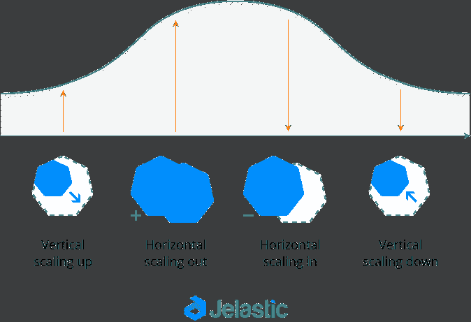](https://res.cloudinary.com/practicaldev/image/fetch/s--pDzenhM9--/c_limit%2Cf_auto%2Cfl_progressive%2Cq_auto%2Cw_880/https://jelastic.com/blog/wp-content/uploads/2019/08/scaling-kubernetes-summary.png)

由于在集群(基础设施)和应用程序(部署/pod)级别上有如此多的扩展选项，Jelastic 中的 Kubernetes 集群成为一个智能平台，可以根据您的应用程序工作负载增长或收缩。Kubernetes 甚至检查您的应用程序是否启动并运行，并在应用程序更新新映像时，在必要时以零停机时间重新部署应用程序，这使连续交付成为现实，而不仅仅是一个时髦词。在[je elastic 公共云服务提供商](https://jelastic.cloud/?featuresSupport=K8S&_ga=2.229140316.1727426656.1564915764-1869759705.1551013954)之一试用自己，或者请求[使用 Kubernetes 集群](https://jelastic.com/managed-auto-scalable-clusters-for-business/)安装私有云。