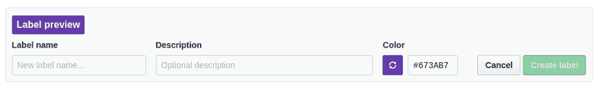

# 关于 Github 标签的一个有趣的怪癖

> 原文：<https://dev.to/callmekatootie/an-interesting-quirk-about-github-labels-5ag4>

本周日早些时候，我试图为我的 Github 问题跟踪器创建标签，我观察到了一些情况。看看你是否能在下面找到它:

[](https://res.cloudinary.com/practicaldev/image/fetch/s--k37cmVkh--/c_limit%2Cf_auto%2Cfl_progressive%2Cq_66%2Cw_880/https://i.imgur.com/YnMw03O.gif)

注意标签文本是如何改变颜色的？而不仅仅是标签的背景？更奇怪的是，标签的颜色不是白色就是黑色，它总是与标签的背景形成对比。如果背景颜色为深色，则标签文本为白色，否则为黑色。

酷！也很奇怪！Github 如何知道我设置的颜色需要黑色还是白色的标签文本？

出于好奇，我首先试图确定这是发生在前端本身还是发生在后端。快速检查一下 Network 选项卡，我发现它实际上发生在后端——当我们试图分配一种颜色时，颜色被传递到后端，后端用需要显示的`span`标签作出响应，用内嵌样式将标签文本设置为黑色或白色。我不能再对此进行逆向工程，结果走进了死胡同。

然后，我在 Node.js 中搜索如何确定颜色是深还是浅(相应地给标签的文本添加黑色或白色),并遇到了 [color](https://www.npmjs.com/package/color) 模块。这有以下两个函数来决定传递给的颜色是深还是浅:

```
color.isLight();
color.isDark(); 
```

Enter fullscreen mode Exit fullscreen mode

酷！浏览这个模块的源代码，找出它们在这些方法中做了什么，这让我来到了这个[博客](https://24ways.org/2010/calculating-color-contrast)，它详细介绍了这是如何工作的。我讨厌给出一个 TL；博士版本，如果这是任何安慰，链接并没有那么长阅读。

我想象 Github 正在使用博客中的两种方法之一(或者是`color`模块本身)并返回最终元素进行显示。小而*酷*功能提供。