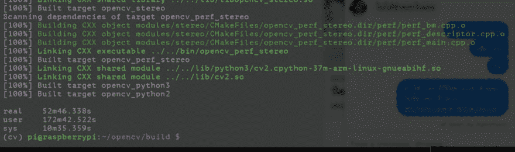
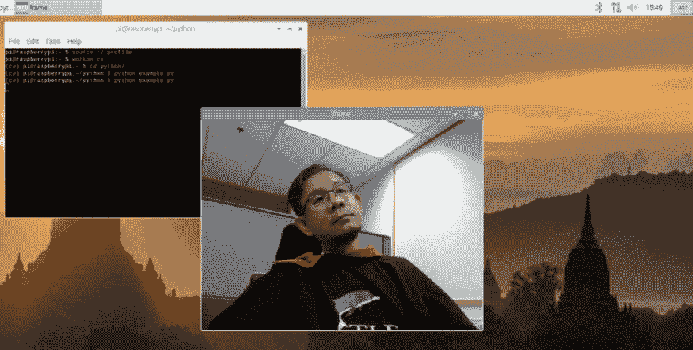

# 编译 OpenCV 4 บน树莓 pi 4

> 原文：<https://dev.to/mrchoke/compile-opencv-4-raspberry-pi-4-66d>

新版手工 Copy 的卷尺是在 raspberry pi4gb opencv 4 上制作的。1.1 和 Raspbian GNU/Linux 10，我们将一起学习！我的天啊！

真的，很多人写的东西，就像我们尝试的那样。有些问题是成功的，有些不成功，所以整理我完成的仪式的顺序，因为

#### 开始吧

如果担心 RAM 不够，请在此之前添加一个交换。这会在编译的最后一步 link 上花费很大。如果确定 4GB 可用，可以跳过此步骤。【2300】。

```
sudo nano /etc/dphys-swapfile 
```

然后修改如下 t0㎡

```
CONF\_SWAPSIZE=2048 
```

然后，停止和启动开关
。

```
sudo /etc/init.d/dphys-swapfile stop
sudo /etc/init.d/dphys-swapfile start 
```

安装所有需要 t0㎡的东西。

```
sudo apt update && sudo apt upgrade
sudo apt install build-essential cmake unzip pkg-config libjpeg-dev libpng-dev libtiff-dev libjasper-dev libavcodec-dev libavformat-dev libswscale-dev libv4l-dev libxvidcore-dev libx264-dev libgtk-3-dev libcanberra-gtk\* libatlas-base-dev gfortran python3-dev python3-pip libfontconfig1-dev libcairo2-dev libgdk-pixbuf2.0-dev libpango1.0-dev libhdf5-dev libhdf5-serial-dev libhdf5-103 libatomic1-armhf-cross 
```

安装 virtualenv 使用 virtualenvwrapper 也很简单
t0㎡

```
sudo pip3 install virtualenv virtualenvwrapper 
```

将 user 设置为使用 virtualenvwrapper[t0 }的默认设置

```
nano -w ~/.profile 
```

输入
值。

```
# virtualenv and virtualenvwrapper
export WORKON\_HOME=$HOME/.virtualenvs
export VIRTUALENVWRAPPER\_PYTHON=/usr/bin/python3
source /usr/local/bin/virtualenvwrapper.sh 
```

使用值来执行
操作。

```
source ~/.profile 
```

创建一个 virtualenv，用于使用 cv
名称。

```
mkvirtualenv cv -p python3 
```

一旦构建完成，它将自动激活它，但如果重新打开 shell 或我们，下一个系统必须使用
命令。

```
workon cv 
```

安装 python numpy 软件包以进行编译

。

```
pip install numpy 
```

下载 OpenCV

```
wget -O opencv.zip [https://github.com/opencv/opencv/archive/4.1.1.zip](https://github.com/opencv/opencv/archive/4.1.1.zip)

wget -O opencv\_contrib.zip [https://github.com/opencv/opencv\_contrib/archive/4.1.1.zip](https://github.com/opencv/opencv_contrib/archive/4.1.1.zip) 
```

破 zip㎡t 0㎡

```
unzip opencv.zip 
unzip opencv\_contrib.zip 
```

会改名字还是不改，但当 config 把 contrib 的 path 说得够对的时候，

。

```
mv opencv-4.1.1 opencv
mv opencv\_contrib-4.1.1 opencv\_contrib 
```

开始 config
进程

```
cd opencv
mkdir build
cd build/

cmake -D CMAKE\_BUILD\_TYPE=RELEASE \
-D CMAKE\_INSTALL\_PREFIX=/usr/local \
-D OPENCV\_EXTRA\_MODULES\_PATH=~/opencv\_contrib/modules \
-D ENABLE\_NEON=ON \
-D ENABLE\_VFPV3=ON \
-D BUILD\_TESTS=OFF \
-D OPENCV\_ENABLE\_NONFREE=ON \
-D INSTALL\_PYTHON\_EXAMPLES=OFF \
-D CMAKE\_SHARED\_LINKER\_FLAGS='-latomic' \
-D BUILD\_EXAMPLES=OFF .. 
```

等到完成后，如果没有任何问题需要进行 successful，哈哈。完成后，按照核心 cpu 的数量进行编译输入-j4，很快就可以得到
t0㎡。

```
time make -j4 
```

我用的是同时销售的 microSD，附带的是董事会，它几乎要花上一个小时，但我曾经尝试过 10 个很好的类，它也花了一点时间来减少它。

[](https://res.cloudinary.com/practicaldev/image/fetch/s--_nSr11Y5--/c_limit%2Cf_auto%2Cfl_progressive%2Cq_auto%2Cw_880/https://cdn-images-1.medium.com/max/1024/1%2A_hm0CMoQIHm4nen7QLRZ7g.png) 

<figcaption>【如果编译完成】</figcaption>

。

如果有错误，那就试着去阅读，然后解决问题。看，哈哈，但如果你成功了，就完成了 install
。

```
sudo make install
sudo ldconfig 
```

为 virtualenv cv
提供 lib 链路。

```
cd ~/.virtualenvs/cv/lib/python3.7/site-packages/

ln -s /usr/local/lib/python3.7/site-packages/cv2/python-3.7/cv2.cpython-37m-arm-linux-gnueabihf.so cv2.so 
```

它是一个测试仪式的完成〔t0〕。

```
python

\>\>\> import cv2

\>\>\> cv2.\_\_version\_\_

'4.1.1' 
```

下次使用时，不要忘记每次使用前的活动 virtualenv。
t0㎡。

```
workon cv 
```

我拿了 Python OpenCV 的样本代码来做测试

```
nano -w example.py 
```

复制码到
中

```
import numpy as np
import cv2

cap = cv2.VideoCapture(0)

while(True):
 ret, frame = cap.read()
 cv2.imshow('frame',frame)
 if cv2.waitKey(1) & 0xFF == ord('q'):
 break
cap.release()
cv2.destroyAllWindows() 
```

好吧差不多吧

[](https://res.cloudinary.com/practicaldev/image/fetch/s--HMMRrKHh--/c_limit%2Cf_auto%2Cfl_progressive%2Cq_auto%2Cw_880/https://cdn-images-1.medium.com/max/1024/1%2ARFDmeuyVnhzCCRooArg5OQ.png) 

<figcaption>被认为是成功的</figcaption>

。

这之后，做咖喱做什么都行，让新手享受美味的水果。

引用

[https://www . pyimagesearch . com/2018/09/26/install-opencv-4-on-your-raspberry-pi/](https://www.pyimagesearch.com/2018/09/26/install-opencv-4-on-your-raspberry-pi/)

* * *