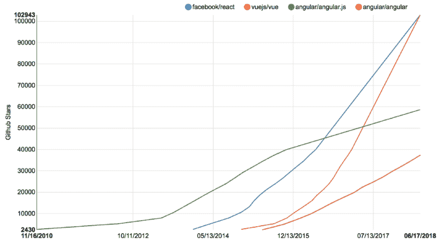
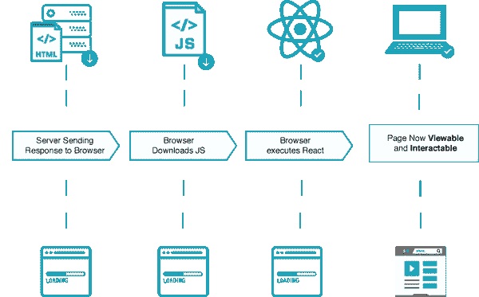
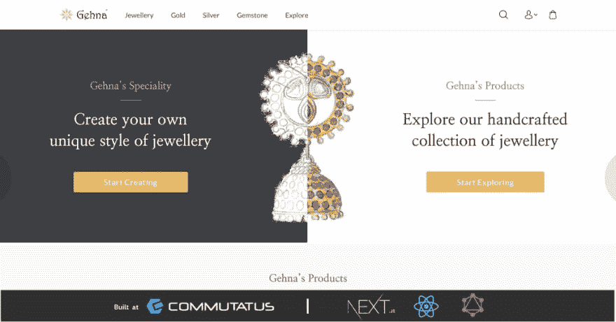
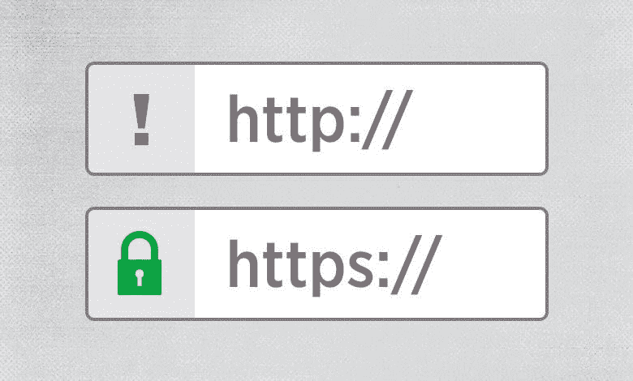
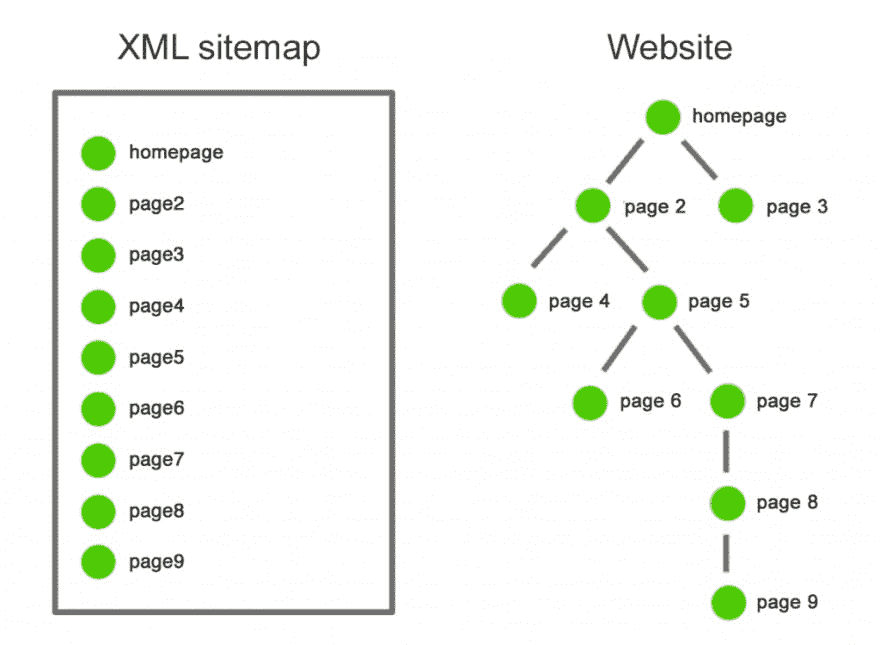

# 单页应用对 SEO 有多友好？

> 原文：<https://dev.to/chandan/how-friendly-are-single-page-applications-to-seo-47h5>

### 2020 年单页应用还相关吗？

<figure>[](https://res.cloudinary.com/practicaldev/image/fetch/s--vzhf7Z-U--/c_limit%2Cf_auto%2Cfl_progressive%2Cq_auto%2Cw_880/https://cdn-images-1.medium.com/max/1000/1%2AK0flpUHuNKMJEJ99q9K5rA.jpeg) 

<figcaption>SEO 单页应用</figcaption>

</figure>

让我们从目前最流行的 JavaScript 框架开始，REACT！使用 React 构建的单页面应用程序提供了无缝的用户体验和令人难以置信的性能，但也带来了一些问题。开箱即用，温泉是不是搜索引擎优化友好，这是一个必须的，当谈到在线存在。搜索引擎爬虫看到一个空白页，因为网站在客户端呈现。解决方案是在服务器上呈现网页。了解客户端呈现相对于服务器端呈现的优缺点可以帮助您构建满足您需求的最佳应用程序。

#### 让我们回到过去:

[](https://res.cloudinary.com/practicaldev/image/fetch/s--Sqq2eOcD--/c_limit%2Cf_auto%2Cfl_progressive%2Cq_auto%2Cw_880/https://cdn-images-1.medium.com/max/1000/1%2A_EqHpn0XBowPv7HeVKw2Wg.png)

追溯到 web 开发的历史，浏览器只需向服务器发送一个请求，要求加载页面，服务器就会按照要求发回一个或多个简单的文件，如 HTML/ CSS。当浏览器收到它们时，它们就可以被渲染了，因此它们几乎会立即出现在屏幕上。我们将这些简单的预建网站命名为 static，因为它们托管在文件服务器上，只需发送文件，因为它们既不需要任何预先处理，也不需要特殊的硬件。

#### 现代网络:

今天，如果我们想要构建人们所说的 web 2.0 的 web 应用程序，随着 react 和 angular 等 JavaScript 框架的出现，我们需要更加动态的东西。客户端渲染的单页应用程序的受欢迎程度逐年飙升。

<figure>[](https://res.cloudinary.com/practicaldev/image/fetch/s--Rm7G1_Er--/c_limit%2Cf_auto%2Cfl_progressive%2Cq_auto%2Cw_880/https://cdn-images-1.medium.com/max/1024/1%2Ay8YB7HLbKTYm5P45dWTvng.png) 

<figcaption>单页应用这些年的增长。</figcaption>

</figure>

#### 客户端渲染(CSR)概述— SPA:

在客户端渲染中，像 HTML、CSS、JavaScript 这样的所有代码，甚至像 SVG 这样的图像都在一个包中发送。这种捆绑是在模块捆绑器(如 webpack)的帮助下提前完成的，该模块捆绑器解析所有外部依赖项，如库/导入，并将所有代码合并到一个文件中，然后在初始页面加载时从服务器发送到客户端。在 react 的例子中，应用程序最初是由一个叫做虚拟 DOM 的东西构建和管理的，它监视变化并在必要时用 JavaScript 更新页面。

#### 现在，一个页面应用可以有多个页面吗？

是的。在 SPA 中，页面之间的路由是使用所谓的客户端路由来模拟的，使用的工具有 react router。您可以在 URL 栏中看到视图和更新的浏览器端点，但是请求永远不会到达服务器。客户端呈现的最大优势在于，只有一个对服务器的请求来加载网页，从而减少了服务器的负载。通过客户端路由进行的页面导航非常快，因为所有内容都是在初始页面加载时预加载的。反应来自于为 CSR 编写的大部分文档的客户端渲染。最后，默认情况下，最流行的 react starter 框架 create react app 也是客户端呈现的。

#### CSR 怎么会伤害到你的网站？

假设一个 web 应用程序有许多页面，每个页面上都有大量 JavaScript。加载初始包，如果它很大，会花费大量的时间，使你的网站变慢。毫不奇怪，随着时间的推移，项目中的所有依赖项可能会达到 2mb 或更多。

<figure>[](https://res.cloudinary.com/practicaldev/image/fetch/s--U3Yr9VAH--/c_limit%2Cf_auto%2Cfl_progressive%2Cq_auto%2Cw_880/https://cdn-images-1.medium.com/max/365/1%2AUQt-aeBazttECQmcIpFntA.png) 

<figcaption>网站 SEO 速度</figcaption>

</figure>

#### 解:

在你与 SPA 分手之前，我们可以通过使用现代 JavaScript 框架的服务器端渲染来优化单页应用的性能。这种形式的服务器端渲染分阶段加载每个页面，通过使用一种称为水合的方法来减少第一个像素的时间。在引擎盖下，它就像是老式静态站点和客户端渲染的组合，其中 JavaScript 将说明 DOM。

#### 服务器端渲染(SSR)是如何工作的？

现代服务器端渲染分为四个不同的阶段:

1.  客户端对网页的请求和服务器上生成的普通标记文件被发送到浏览器。
2.  然后，浏览器在不加载任何动态特性(如事件侦听器)的情况下呈现标记。
3.  服务器向浏览器发送 JavaScript，它可能是一个大的包，也可能是一个代码分割的小包。
4.  页面最终在浏览器中用 JavaScript 实现了动态化，并对用户动作和数据输入做出响应。

[](https://res.cloudinary.com/practicaldev/image/fetch/s--RN-R-nDf--/c_limit%2Cf_auto%2Cfl_progressive%2Cq_auto%2Cw_880/https://cdn-images-1.medium.com/max/600/1%2AE5pmLXazZXe8_lJUgsuSAg.png)

简单来说，SSR 的工作原理是提前生成标记，以减少显示第一个像素的时间，因为用户将看到完全呈现的页面。然而，在从服务器下载实际的 javascript 包之前，它不会被完全加载。这整个过程使得页面的感知加载时间更快。

#### CSR vs SSR 中的 SEO:

<figure>[](https://res.cloudinary.com/practicaldev/image/fetch/s--V9yWoRB_--/c_limit%2Cf_auto%2Cfl_progressive%2Cq_auto%2Cw_880/https://cdn-images-1.medium.com/max/1000/1%2A4wrCw15cxd-bwWYbD1_8wg.jpeg) 

<figcaption>针对 CSR 和 SSR 的搜索引擎优化</figcaption>

</figure>

服务器端渲染的关键优势是它对搜索引擎优化或 SEO 的影响。众所周知，在谷歌搜索上对网站进行排名的谷歌网络爬虫或机器人在抓取依赖 JavaScript 生成标记的客户端渲染应用程序时存在问题。有了服务器端的渲染，你就没有这个问题了，因为标记页面保证你每次都有好的 SEO。

#### 准备好搭建 SSR app 了吗？

在你开始这个项目之前，最好了解 SSR 的缺点。其中最主要的是服务器请求。对于加载的每个页面，至少会发生一个新的服务器请求。因此，20 次页面加载将导致 20 个单独的请求，尽管每个请求会更小。好消息是，页面之间共享的 javascript 将被重用，然后特定于页面的 JavaScript 将仅在您加载该页面时以单独的包发送。这通常被称为代码分割或延迟加载，也就是说，只是当前视图需要的代码。

#### 结论:

有很多方法可以用你现有的 react 应用从头开始实现它，但是这样做非常耗时并且难以维护。所以，我建议你用一个叫做 NEXT 的轻量级框架。JS 用于构建服务器渲染的 React 应用程序，因为它提供了大量 create react 应用程序所没有的特性。你不仅可以在没有配置的情况下获得服务器端渲染，还可以延迟加载模块，内置代码分割和许多不同的东西，这些都将提高你的应用程序的性能。如果您想了解更多有关如何合并 NEXT 的信息。请访问官方文档[这里](https://nextjs.org/docs)。也要看看我们用 NEXT.JS 在 communication us 建立的很棒的电子商务网站 Gehna。

<figure>[](https://res.cloudinary.com/practicaldev/image/fetch/s--Wwbrmi-W--/c_limit%2Cf_auto%2Cfl_progressive%2Cq_auto%2Cw_880/https://cdn-images-1.medium.com/max/1024/1%2AOvcEv8uJ7iI-nSi9Ej6s1g.jpeg) 

<figcaption>与❤️联手打造的 Gehna(电子商务珠宝平台)使用 NEXT.js</figcaption>

</figure>

#### 奖金提示:

您可以更进一步，通过遵循 SEO 的最佳实践来提高您的应用程序的 google 搜索排名。

#### 构造 U-R-L

一个语义明确的 URL 可以改善用户体验和谷歌搜索的可见性。这将提高你的搜索引擎优化，因为关键词出现在你的标题、描述和网页的 URL 中，有助于谷歌确定搜索内容的相关性。例如，在您的 url 中包含关键词或产品名称:

```
https://www.gehnaindia.com/product/ritzy-diamond-and-18k-gold-dangler-earrings 
```

而不是在 url 中包含产品编号或 id，如下所示:

```
https://www.gehnaindia.com/product/82436 
```

#### 标记您的页面

元标签是看不见的，但它使搜索引擎更容易确定你的内容是什么，以及它与搜索词的相关性如何，从而提高你的搜索引擎优化。Next JS 为您提供了“next/head ”,可用于设置页面的元标题和元描述。示例片段如下:

```
import Head from 'next/head';

<Head>
 <title key="title">{props.title}</title> 
 <meta key="description" 
  name="description" 
  content={props.description} 
 />
</Head> 
```

> 您还可以选择使用 [next-seo](https://www.npmjs.com/package/next-seo) 来简化 Next.js 项目中的 seo 管理。

#### 得到它的保护

通过 HTTP 加载网站会对 SEO 产生负面影响。谷歌优先考虑通过 HTTPS 加载的安全内容，同时对页面进行关键词排名。因此，重要的是要确保您的网站内容和资产加载超过 HTTPS 更好的搜索排名和可见性。

<figure>[](https://res.cloudinary.com/practicaldev/image/fetch/s--lDN3PnjG--/c_limit%2Cf_auto%2Cfl_progressive%2Cq_auto%2Cw_880/https://cdn-images-1.medium.com/max/780/1%2AY28HbqqduSDQQ5Hh_IEMPQ.jpeg) 

<figcaption>https 为了更好的 SEO</figcaption>

</figure>

#### 机器人地图

想象你去一个没有地图的地方。你很可能会迷路。对于试图索引你网站上的网页的网络爬虫和机器人来说，情况类似。一个简单的目录或“网站地图”包含了 web 应用程序中包含的页面信息，使机器人更容易理解页面层次结构。

<figure>[](https://res.cloudinary.com/practicaldev/image/fetch/s--G6ECqV-4--/c_limit%2Cf_auto%2Cfl_progressive%2Cq_auto%2Cw_880/https://cdn-images-1.medium.com/max/1024/1%2AOwEpJwMrPT-c-7m4IhLIIQ.png) 

<figcaption>Sitemap 帮助爬虫更好地理解你的网站</figcaption>

</figure>

#### 不要忽视图像

图像和图形对你网站的用户体验起着至关重要的作用。但是搜索引擎爬虫不能解释图像，克服这一点的唯一方法是使用“alt”标签。在图像上指定适当的 alt 标签有助于爬虫为相关的搜索词建立索引。例如，在电子商务网站的产品照片上使用 alt 标签可以提高商店的 SEO。

<figure>[](https://res.cloudinary.com/practicaldev/image/fetch/s--zIjQv2OJ--/c_limit%2Cf_auto%2Cfl_progressive%2Cq_auto%2Cw_880/https://cdn-images-1.medium.com/max/1000/1%2AbL_WENenlWlDsfgfdo3BRQ.jpeg) 

<figcaption>带有适当 alt 标签的图片示例。</figcaption>

</figure>

```
 
```

如果您发现这篇文章在改进单页应用程序的 SEO 方面很有用，请给出👏并留下评论——你希望在即将到来的框架中看到哪些改进来使它们对 SEO 友好？我很想听听关于这个话题的任何想法😋。

* * *