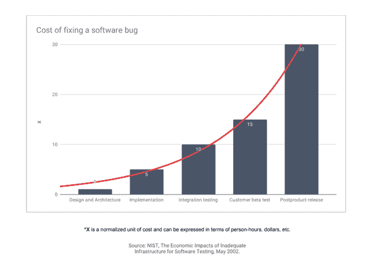
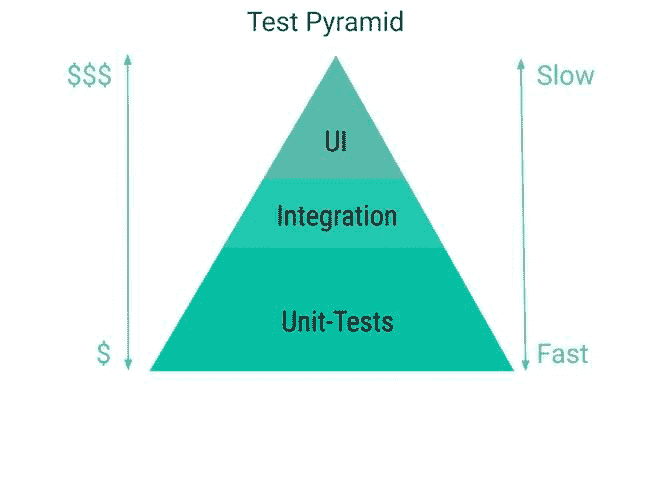
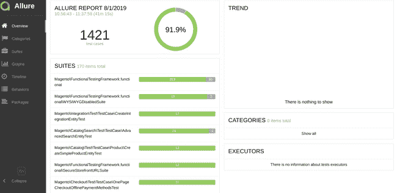

# 提高电子商务项目或模块质量的四大支柱

> 原文：<https://dev.to/larsroettig/four-pillars-to-improve-the-quality-of-your-e-commerce-project-or-module-33el>

对于每个开发人员来说，确保代码正常工作是至关重要的。没有人喜欢在部署后，实时或临时系统出现致命错误或整个页面/网站不再工作。

在这篇博文中，我将分享我从 Magento 社区团队学到的东西以及我过去的经验。对我来说，它们是确保你的新模块/项目得到更少的阻碍票的四个关键支柱。这四个领域是干净的代码、测试、自动化以及持续的过程改进。

[](https://res.cloudinary.com/practicaldev/image/fetch/s--qzK_uDpo--/c_limit%2Cf_auto%2Cfl_progressive%2Cq_auto%2Cw_880/https://larsroettig.dev/static/cddf5e6700a8c25b8bd1cc61cb52752f/a111b/businessman-3300907_1920.jpg)

### 清理代码

根据我的经验，干净的代码有助于减少维护、编写测试、项目开发人员的成本。

我最喜欢的马丁·福勒的名言是:

> 任何傻瓜都能写出计算机能理解的代码。优秀的程序员编写人类能够理解的代码。

这意味着任何开发人员都应该编写人类能够理解的代码。通常，在一个项目的平均开发/生命周期中，开发人员阅读的代码比我们编写的代码多。

这个来自[干净代码书](https://learning.oreilly.com/library/view/clean-code/9780136083238/)的简短例子展示了干净代码对于新实现的价值。

**重构前的代码:**

```
class FunnyName
{
    /**
     * Demo data
     */
    private $theList = [
        [0 => 4],
        [0 => 2]
    ];

    public function getThem() // what means getThem ?
    {
        $list = [];
        foreach ($this->theList as $x) { // what is theList there ?
            if ($x[0] === 4) { // what 0 and 4 there ?
                $list[] = $x;
            }
        }

        return $list; // list of what ?
    }
} 
```

**重构后的代码:**

```
class GameBoard
{
    private const STATUS_KEY = 0;
    private const FLAGGED = 4;

    /**
     * Demo data
     */
    private $cells = [
        [self::STATUS_KEY => 4],
        [self::STATUS_KEY => 2]
    ];

    /**
     * Returns all flagged game board cells.
     * @return array
     */
    public function getFlaggedCells()
    {
        $flaggedCells = [];
        foreach ($this->cells as $cell) {
            if ($cell[self::STATUS_KEY] === self::FLAGGED) {
                $flaggedCells[] = $cell;
            }
        }
        return $flaggedCells;
    }
} 
```

**Clean Code** 是所有程序员都应该读的优秀书籍，

《干净的代码》一书中的规则可以通过重构应用到你的旧代码中。我建议将 sprint Tickets 作为子任务来减少技术债务。评估这些子任务，并为您的团队或客户定义一个好处。

**收益可以是:**

> 我们减少了此功能下一次更改的更改时间。

在重构之前，您应该用 Intitragtionstests 覆盖您的实现。在像 Magento 这样的现有框架中，应用书中的规则有时并不容易。有了 Magento 2，构建干净的代码更加容易。你可以使用依赖注入这样的特性。在一个例子中， [Magento Inventory (MSI)](https://github.com/magento/inventory) 已经使用模式 like 命令查询责任分离。

**阅读提示:**Matthias no back 的对象设计风格指南

对象设计风格指南是一本很好的基础书。应用对象设计的最佳实践意味着您的代码将易于阅读、编写和维护。本书中的所有代码示例都是用通用的面向对象编程语言编写的。

链接:[https://www.manning.com/books/object-design-style-guide](https://www.manning.com/books/object-design-style-guide)

#### 向后兼容发展

如果你为 Magento 市场开发模块。知道如何开发向后兼容是很重要的。我强烈建议遵循本指南的规则:

**[https://dev docs . magento . com/guides/v 2.3/contributor-guide/向后兼容-开发/](https://devdocs.magento.com/guides/v2.3/contributor-guide/backward-compatible-development/)**

### 测试

对于生产就绪的软件，需要进行测试来验证软件的行为是否符合预期。你可以通过无数的手工软件测试人员来做到这一点。但是手工软件测试的成本和维护是昂贵的，而且反馈也是缓慢的。

在 IBM 的研究中“最小化代码缺陷以提高软件质量和降低开发成本”是一个很好的说法:

在发布后发现缺陷的成本是在设计和架构阶段发现缺陷的 30 倍。

[](https://res.cloudinary.com/practicaldev/image/fetch/s--MqktmXpj--/c_limit%2Cf_auto%2Cfl_progressive%2Cq_auto%2Cw_880/https://larsroettig.dev/static/506f0768e425f79f3399b7d5349d6acd/dbb61/The%2520EconomicImpactsSoftwareTesting.png)

这句话让我想到我们需要不同类型的自动化测试来减少反馈时间。但是作为一名开发人员，你不喜欢在你能推之前运行几个小时的测试。为了拆分测试，Mike Cohn 在他的书 [*中提出了一个“测试金字塔”的概念，这个概念在敏捷*](https://www.oreilly.com/library/view/succeeding-with-agile/9780321660534/) 中获得了成功。

如果您想了解更多关于测试金字塔的信息，您应该阅读:

**[实战测试金字塔](https://martinfowler.com/articles/practical-test-pyramid.html)** 。

[](https://res.cloudinary.com/practicaldev/image/fetch/s--MoF0ni5k--/c_limit%2Cf_auto%2Cfl_progressive%2Cq_auto%2Cw_880/https://larsroettig.dev/static/60c09a82c09001b4da9f3a3c67a97bfe/a111b/TestPyramid.jpg)

在地面上，我们有单元测试，然后是集成测试和用户界面测试。

#### 单元测试

单元测试相对容易创建，运行也很快。我们可以使用它们来实现良好的覆盖率，并在开发的早期阶段检测出大多数错误。单元测试应该在我们提交你的代码版本之前运行。理想情况下，他们甚至使用 TDD 进行开发，或者遵循干净代码的原则。

#### 集成测试

集成测试可以相对较好地自动化，这些测试需要安装 Magento 和数据库。安装需要时间，不应在本地运行。

设置和运行 Magento 2 集成测试的文档。

[https://dev docs . magento . com/guides/v 2.3/test/integration/integration _ test _ execution . html](https://devdocs.magento.com/guides/v2.3/test/integration/integration_test_execution.html)

#### 用户界面测试

自动运行 UI 测试可能会很复杂和棘手。此外，自动化维护非常耗时，因此您应该考虑自动化是否有意义。我在很多项目中使用 Selenium 或 Cypress 这样的工具。对于 UI 测试，我可以推荐评估的两个工具，并找到最适合您的项目。

#### 突变检测

在[感染库](https://github.com/infection/infection)的帮助下，可以检查测试套件的弹性。该库对被操纵的代码运行单元测试，以计算变异分数指标。

**注意**此步骤是一个扩展，但应在 CI 系统上完成，因为这可能需要很长时间。

#### 烟雾检测

Manuelle 测试范围很广，但是覆盖了一些复杂的自动化测试。我建议在我们目前只使用谷歌文档的系统中逐步收集测试用例。更好的方法是将它用作测试用例管理软件，然后通过自动化测试来运行。

#### 编码标准

大多数开发团队定义编程风格(编码标准)。编码标准允许获得更好理解的代码。这可以减少新开发人员的入职时间。编码标准工具(PHP_CodeSniffer)也应该通过 git 钩子在提交时运行。

### 结论

*   学习编写测试和使用测试驱动开发
*   测试不是免费的，但非常有帮助
*   代码覆盖率仅显示尚未执行的内容
*   使用代码覆盖率来寻找测试套件中的缺口
*   生产中的 bug 非常昂贵
*   在开发过程中找到最好的错误

#### 倾城报告

[](https://res.cloudinary.com/practicaldev/image/fetch/s--p7tqp_6Y--/c_limit%2Cf_auto%2Cfl_progressive%2Cq_auto%2Cw_880/https://larsroettig.dev/static/ba973a6b23e789c8b996b2e92e329d1e/dbb61/Allure.png)

Allure Framework 是一个测试报告工具，它显示了已执行测试的表示。这种表示对于了解失败的测试是非常重要的。

**文档可在以下位置找到:**

**https://devdocs.magento.com/mftf/docs/reporting.html**

### 自动化

有了自动化，就有可能在项目时间内节省时间和金钱。对于设置，您将有少量的一次性费用。我认为从项目生命周期来看，这是一个很好的质量投资。有了像 [Gitlab](https://about.gitlab.com/) 这样的 CI 系统，就有可能建立自动评论。自动审查可以减少审查的时间和拒绝率。

为了充分利用自动化，我们需要在推送之前进行检查。为了设置 git 钩子，我推荐像 GrumPHP 或 T2 Captian 钩子这样的工具。在任何推送之前，应运行以下测试:

*   提交消息
*   [编码标准](https://github.com/magento/magento-coding-standard)
*   Unit Tests

    阅读提示:如何编写 Git 提交消息

    一篇关于优秀 Git 提交消息的七条规则的博客文章

    链接:[https://chris.beams.io/posts/git-commit/](https://chris.beams.io/posts/git-commit/)

    ### Continuous Improvement

持续改进是敏捷的基本原则。在敏捷宣言中是这样定义的:

> 团队定期反思如何
> 
> 变得更有效，然后调整和调整
> 
> 它的行为相应地。

建议定期与所有成员开会讨论:

*   什么很棒？-我们留着吧
*   什么不起作用？-找到正确的方法
*   我们应该多要些什么？

持续改进不仅是团队所必需的。为了找到更好的工程师，也应该有时间进行自我提升。

但对我来说，编程是一种掌握，当你训练时，你会变得更好。你可以通过阅读书籍和博客来学习基础知识，基础知识可以帮助你理解模式。另一方面，编码训练是必不可少的，形是练习的选择。如果你是一个初级开发人员，发现改进的 arias 有助于使用同行反馈或指导。