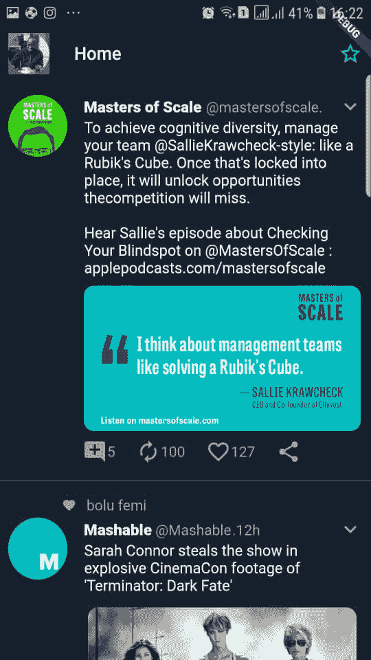

# Flutter:Everything is a Widget Series-第 1 部分:Flutter 的适用范围。

> 原文：<https://dev.to/topeomot/flutter-everything-is-a-widget-series-part-1-where-flutter-fits-in-940>

在使用 Flutter 时，一个让你很快想到的主题是，一切都是小部件。本系列的目的是帮助初学者理解这个简单而强大的概念，并向他们介绍 Flutter 中的基本小部件。

为了帮助我们更深入地了解 Flutter，我决定构建一个 Twitter 移动应用程序 UI，但是有以下限制。

*   只使用 Flutter 中开箱即用的小部件。
*   不要使用外部库。

对于我偏离的任何一点，你都会得到通知并给出理由。下面是结果，你可以在[https://github.com/topeomot2/twitter-ui-app](https://github.com/topeomot2/twitter-ui-app)找到这个项目

下面是使用的小部件的编译列表。我们将了解一些基本概念，并查看本系列中使用的每个小部件。

*   容器
*   圆柱
*   排
*   文本
*   大小合适的盒子
*   扩大
*   图标
*   圆规
*   填料
*   TextStyle
*   卡片
*   脚手架
*   出现
*   列表视图
*   listfile(列表文件)
*   CircleAvatar
*   抽屉
*   材质贴图

颤振的一个重要特点是简单。颤振很简单，但也很强大。我在本系列中的目标是遵循相同的模式，并展示其各种用例。

### widget 是从哪里进来的？

为了理解窗口小部件的来源，我们需要理解 Flutter 中的开发是如何工作的。为了有所帮助，我们将看看为移动平台开发应用程序的两种主要方式。

*   **本地开发**

在本地开发中，您编写的代码会自动利用设备 OEM 小部件进行显示，并直接与设备服务进行对话，以获得蓝牙、摄像头等功能。你注意到了吗？我说的是 OEM 部件。这意味着你必须为每个平台分别开发。它们是以原始设备制造商选择的语言完成的。对于 Android 来说，主要是 Java 和 Kotlin，对于 IOS 来说是 Objective C 和 Swift。

**优点**:对设备功能的访问更多了。
**缺点**:你要针对不同的平台分别开发。

*   **跨平台开发**

对于跨平台开发，WebView 中主要是 HTML、JavaScript 和 CSS。这些网络视图不能与 UI 的 OEM 小部件对话，当然也不能与设备服务对话。以上解释了 JavaScript 桥的使用，它充当用户代码和设备功能之间的一层。因为它们通过桥进行对话，所以您可以编写一次，让 JavaScript 桥来完成与任何平台的本机层对话的工作。

优点:你可以获得更快的开发速度，因为你只需要构建一次，它可以在 Android 和 IOS 上运行。
**缺点**:这不能利用本地设备能力。

### 但是 Flutter 是做什么的？

它引入了另一种模式，吸收了两个世界的优点。

*   Flutter 使用 Dart 编程语言，然后编译成原生 ARM 代码，这意味着您用 Flutter 构建的应用程序可以完全访问设备服务和功能。

*   为了处理不同的 OEM 部件，Flutter 完全避免使用 OEM 部件，而是使用自己的渲染器构建自己的部件。这意味着小部件看起来和感觉上都像原生 OEM 小部件，并适应各自的平台。

*   但是这些小部件是如此的可定制，以至于你可以构建一个完全不同于 OEM 普通外观和感觉的体验。这完全取决于你。

因此，在进行跨平台开发时，Flutter 为您提供了本机功能。构建 Flutter 应用程序的主要支柱是小部件，我们将在本系列的后续文章中更详细地讨论它们。