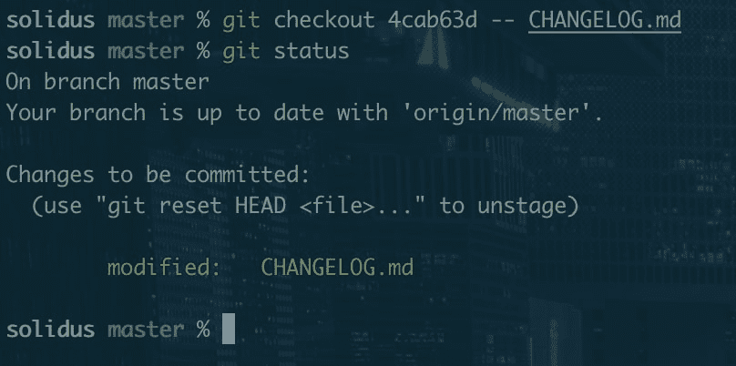
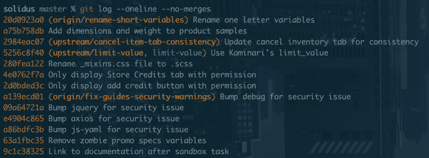
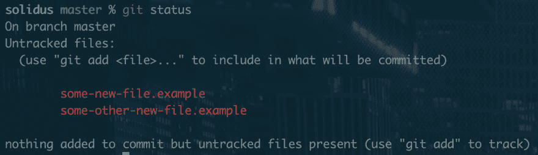
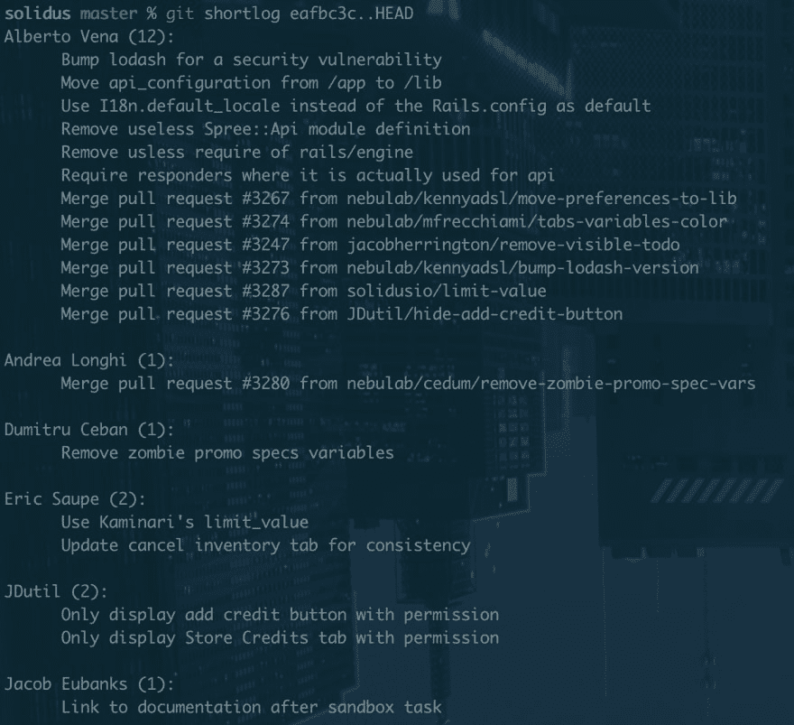
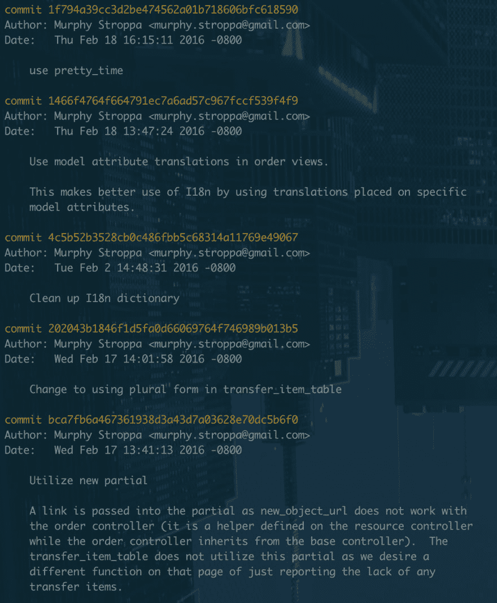

# 节省你的时间和理智的 10 个技巧

> 原文：<https://dev.to/jacobherrington/10-git-tricks-to-save-your-time-and-sanity-289h>

## 1。从另一个分支签出单个文件

你有没有销毁过一个文件，只希望能有一个新的开始？或者需要您在另一个分支的一个文件中所做的更改？这个命令允许您从另一个分支中只获取一个文件。

`git checkout some-other-branch -- yarn.lock`

您可以使用相同的技巧从特定的提交中签出一个文件。

`git checkout 9146367 -- yarn.lock`

如果`cherry-pick`会提取你不需要的其他文件，这是一个有效的技巧。

## 2。查看没有合并提交的日志

合并提交惹恼了一些人。事实上，有些人宁愿永远不使用 merge 命令，因为他们对 merge commits 非常恼火。

就个人而言，我认为它们是项目历史的重要组成部分，你不应该试图在你的工作流程中避开它们。

也就是说，如果您想快速查看项目的历史，您可以使用这个标志来过滤合并提交。

`git log --oneline --no-merges`

## 3。重写您的最后一条提交消息

当您不小心提交了一个错别字或误导性的提交消息时，这个就派上用场了。

`git commit -v --amend`

`-v`是可选的，但我喜欢它，因为它显示了许多关于更改的信息，这有助于我编写更具描述性的提交消息。

## 4。删除所有未跟踪的更改

非常简单明了，但是如果你不熟悉这个想法的话:

如果您创建了一个以前在 git 历史中不存在的新文件，那么您就做了一个未跟踪的更改。要开始跟踪该文件，您需要将它提交给回购。

有时候，你在提交的中途改变了主意，真的只想从头开始，不做任何改变。嗯，`git checkout .`将会删除所有您所做的修订，但您未修订的修订仍会浮动。为了补救这一点，我们有了`git clean`。

`git clean -f -d`

## 5。打印出一个很酷的日志可视化

这个主要是让你看起来很酷。不过，将你所有的长期分支形象化是很有用的。

`git log --pretty=oneline --graph --decorate --all`

试试看。

## 6。向 git 请求一个 changelog

如果您正在寻找关于什么发生了改变以及谁改变了它的简明解释，您可以让 git 给您一些看起来很像 changelog 的东西。

`git shortlog <commit>..HEAD`

在本例中,`<commit>`应该替换为您希望作为日志开头的提交。基本上与`git shortlog eafbc3c..HEAD`你在说，“告诉我提交`eafbc3c`和现在之间发生了什么变化。”

短日志按提交作者分组，并显示每个提交消息的第一行。如果您的提交消息写得很好，这应该会让您对每个提交实际上做了什么有一个坚实的想法。

您可以做一些很酷的事情，比如`git shortlog HEAD~20..`来获得最近 20 次提交的短日志。

## 7。查看特定日期范围的日志

按照类似的思路，你可能需要了解回购在两天之间发生了什么变化。

谢天谢地，git 支持你。`git log`命令接受`--since`和`--until`作为标志。

因此，如果我想查看 2016 年 2 月 10 日至 2016 年 2 月 19 日之间 Solidus 发生了什么，我可以运行:

`git log --since='FEB 10 2016' --until='FEB 19 2016'`

现在，我可以看到墨菲在二月中旬相当活跃。

## 8。列出所有 git 别名

有时，您可能给一些命令起了别名，但后来忘记了，或者您使用的共享配置定义了一些别名。

这是我在某处发现的一个技巧，尽管它不是 git 独有的特性，但我们正在利用`git config`命令。

`git config -l | grep alias | sed 's/^alias\.//g'`

试试看，看看有没有忘记的别名！

## 9。搜索包含关键字的提交

如果您确切地知道您正在查找哪段代码，或者确切地知道您需要在哪个关键字上查找更改，您可以按代码搜索日志。

这将给出一个提交列表，这些提交以某种方式影响了包含搜索字符串的一行代码或文本。

`git log -S"config.menu_items"`

在这个例子中，我将找到一个以某种方式操作了字符串`config.menu_items`的提交列表。

## 10。git 教程的超级秘密列表

不是什么秘密，但是非常棒:

`git help -g`

试试看。🤠

git 是一个强大的工具，充满了巧妙的技巧。这个列表既不全面也不完整，所以您应该做一些探索并阅读 git 文档。欢迎分享你在这个帖子上发现的任何酷的技巧，我喜欢学习帮助我写代码的工具！

如果你喜欢这篇文章，我写了另一篇有更多技巧的文章:[你应该知道的另外 10 个 Git 技巧](https://dev.to/jacobherrington/10-more-git-tricks-that-you-should-know-3bbp)。🤖