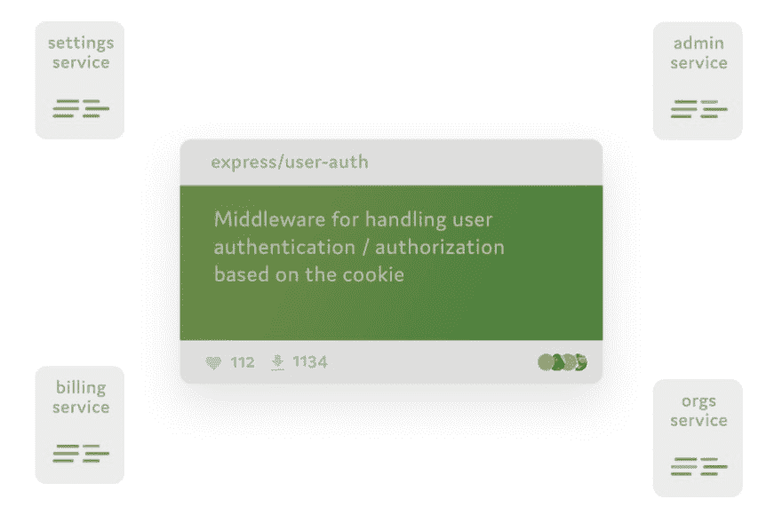
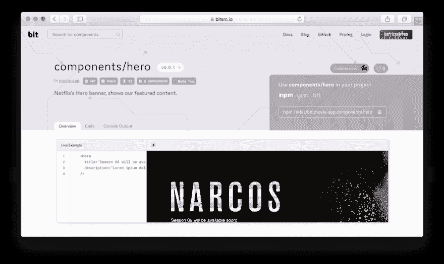

# 我们如何在微服务之间共享和重用代码

> 原文：<https://dev.to/giteden/how-we-share-and-reuse-code-between-microservices-with-bit-3fek>

### 我们如何使用[位](https://bit.dev/)在 Node.js 微服务之间有效地共享和同步代码，而不损害它们的独立性或产生耦合。

最近，我一直在听说微服务之间代码共享导致耦合和维护开销的危险。

尽管毫无疑问代码共享非常有帮助，但许多团队担心通过第三方库在服务之间创建耦合，并通过一般化的 T2 破坏特定的业务逻辑。

我想分享我们自己的经验，我们如何使用[位](https://bit.dev)在我们的服务之间共享和同步有用的代码，而不触及任何这些陷阱。

### 服务间共享代码

微服务的理念依赖于通过更好的模块化实现更好的可伸缩性、关注点分离、弹性和开发速度。这正是为什么将服务耦合到外部共享库破坏了我们最初使用微服务的原因，因为它将微服务的独立开发耦合到第三方外部库。

共享库也经常因每个服务所需的所有特性而膨胀，这反过来又膨胀了服务本身。

在我们的 Node.js 微服务架构中**我们共享了 250 多个(！)我们的服务之间的代码组件**，而不使用单个库。

多亏了[位](https://bit.dev/)，这才成为可能——它将代码的“组件”转化为可以在不同项目中共享和开发的构建块。

使用[位](https://bit.dev)，你可以在不同的服务之间共享独立的组件，对其中任何一个进行修改，并保持你所有的修改在你的代码库中被跟踪和同步。没有共享库，服务之间没有耦合。

让我们看一个例子。

### 例子:我们的用户认证中间件

像其他团队一样，我们的许多服务与我们的用户服务的 API 进行通信，以执行不同目的的用户认证。

在[位](https://bit.dev/)之前，所有这些服务都包含相同的重复代码，与我们的用户服务“对话”。对这段代码进行修改意味着在我们所有的服务中手工修改它，这是相当困难的。

关于 [Bit](https://bit.dev/) 的事情是，共享代码实际上并不存在于它自己独立的回购协议中，并且没有其他服务耦合到该回购协议或其开发中。相反，你可以认为这是“管理复制粘贴”——你可以在不同的服务中保存代码的多个实例，而[位](https://bit.dev/)将跟踪并同步它们之间的变化(取决于你自己的更新策略)。所以——服务之间没有耦合，它们不依赖于任何外部库。

我们使用[位](https://bit.dev/)将我们的`express/user-auth`中间件直接从其源存储库中无缝隔离出来，并作为一个可用的组件共享给云。

从那里，使用安装它作为一个包与 NPM 在不同的服务，如`admin`、`setting`、`billing`、`organizations`和其他一些。

现在真正令人惊叹的部分来了:当我们需要更改这些组件时，我们可以简单地使用[位](https://bit.dev/)将代码本身导入到任何一个存储库中，进行更改，并跨我们的代码库同步更新。

我们使用 [Bit 的 cloud hub](https://bit.dev) 将我们所有的组件组织成集合(称为 Scopes ),这些集合可以在我们的服务之间同步更改，并且还可以让我们的整个团队找到、使用和开发我们的组件。

这种分布式工作流消除了共享库可能产生的耦合，并使我们能够在微服务之间“管理我们的复制粘贴”。

### 为什么这比 NPM 模块对我们更有帮助

首先，向 NPM 发布 250 个甚至 30 个包需要维护和修改另外 30 个存储库。

即使我们忽略发布开销本身，我们也会发现更简单的方法是不要保留许多额外的存储库，而是隔离组件，并在存储库和项目之间直接共享它们(更多关于[隔离和对 Bit](https://docs.bit.dev/docs/add-and-isolate-components.html) 的依赖)。

第二，我们可以从任何一个存储库中修改代码。这意味着，任何团队成员都可以将组件的源代码导入到任何一个 repos 中，进行更改，并且 [Bit](https://bit.dev/) 将能够跨存储库跟踪和同步这些更改。

您甚至可以将组件作为一个包来安装，当需要更改时，只需将它导入到同一个 repo 中，对它进行更改，并在将其新版本共享到范围时，将它重新作为一个包依赖项，或者作为一个新组件导入到不同的范围中(更多关于使用 Bit 进行版本控制的信息)。

通过这种方式，您不必维护或耦合到任何额外的回购和项目的开发，发布的开销变得几乎为零，并且每个组件都可以从任何最终存储库中轻松更改。

### 可以共享服务特定代码吗？

我听说团队关心的另一个问题是代码的[泛化和重用](http://blog.christianposta.com/design/the-cost-of-code-reuse-abuse/)，这本质上是特定于某个服务的业务逻辑的。

先说重点，如果代码太具体- **就不要分享了。共享代码应该适合共享，这真的由你来决定。**

然而，Bit 的工作流程使得共享代码和开发代码成为可能，否则这些代码可能会被认为过于“具体”而无法共享。

例如，让我们假设一段代码是专门为某个服务的业务逻辑编写的，但是可以修改以用于其他服务。

这之所以成为可能，是因为[位](https://bit.dev/)允许您非常容易地共享代码，而无需在原始服务中对其进行更改，并且仍然可以从任何其他存储库中对您的代码进行更改，并在您自己的范围内共享新版本。

就像微生物一样，这种分布式进化孕育了创造，而不会损害完全适合的不同用例。

## 结论

我们自己的团队一直在使用[位](https://bit.dev/)在我们的 Node.js 微服务之间共享和同步超过 250 个源代码组件。我们没有为这些代码使用共享库，也没有将我们的任何服务耦合到外部项目。

我们团队中的每个开发人员都可以从他们正在从事的任何服务或项目中共享、查找和开发他们的任何组件，因此代码可以编写一次，并随着时间的推移而发展。

我们已经成功地扩展了服务和共享组件的数量，同时保持了维护的简单性和开发的快速性。

[Bit](https://bit.dev/) 不限于 Node.js 组件/模块，可以用于任何 js 功能，比如 UI 组件(React、Vue)、util 函数等等。

