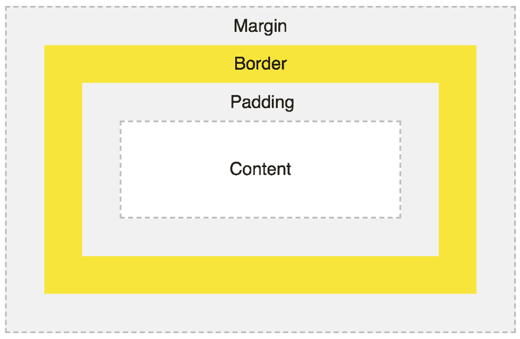
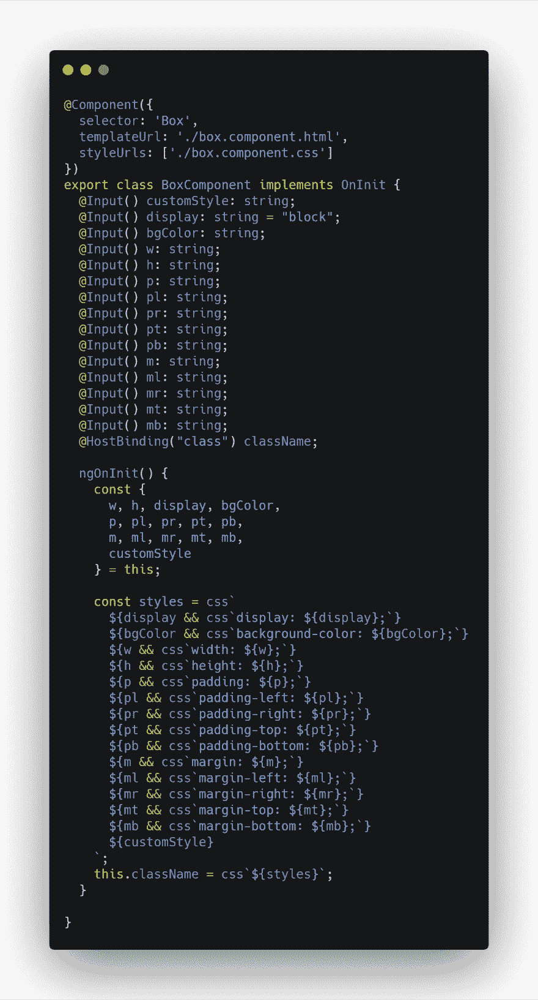
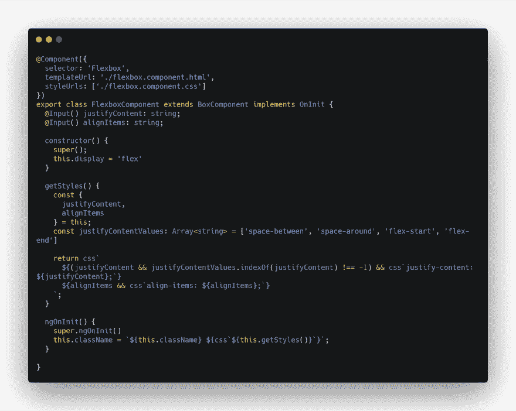
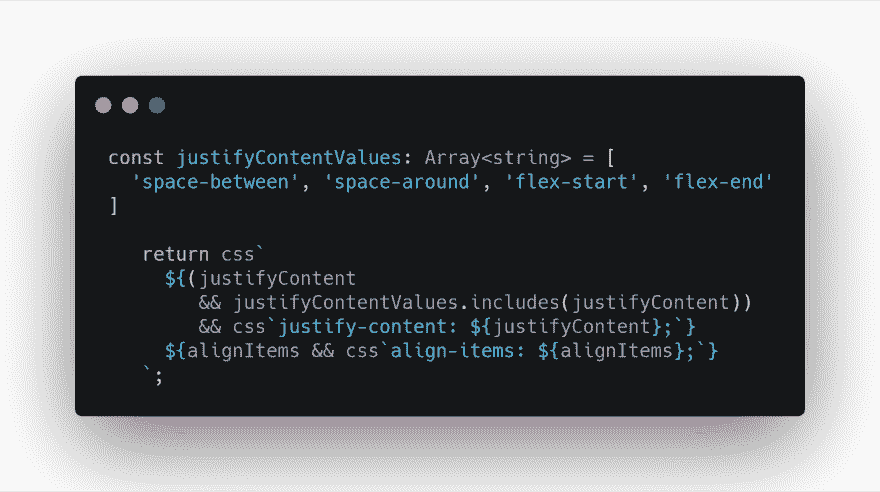

# 我的第一个角盒组件

> 原文：<https://dev.to/aziziyazit/first-component-in-ui-lib-omf>

**你可以在这里抢码**【https://stackblitz.com/edit/flexboxcssinjs T2】

## 框

所有的 HTML 元素都可以看作是盒子。在 CSS 中，当谈论设计和布局时，术语“盒子模型”被使用。

CSS 盒子模型本质上是一个包装每个 HTML 元素的盒子。它包括:边距、边框、填充和实际内容。下图展示了箱式模型

[](https://res.cloudinary.com/practicaldev/image/fetch/s--rCq7gAoT--/c_limit%2Cf_auto%2Cfl_progressive%2Cq_auto%2Cw_880/https://thepracticaldev.s3.amazonaws.com/i/ak08y8j1p19rcbvva5rw.png)

在我做的每个设计系统中，盒子组件是我开发的第一个组件。

> 我们使用 Angular 和 emotionJS (CSS-in-JS)作为代码示例。

### 框组件代码(片段版本)

[](https://res.cloudinary.com/practicaldev/image/fetch/s--07_ax_g8--/c_limit%2Cf_auto%2Cfl_progressive%2Cq_auto%2Cw_880/https://thepracticaldev.s3.amazonaws.com/i/nvw3iz8drgic1y6wr9d9.png)

Box 组件可以像下面这样简单地实现:

```
<Box p="20px 20px" ml="10px" mr="10px" w="200px" h="auto">
 Content
</Box> 
```

<svg width="20px" height="20px" viewBox="0 0 24 24" class="highlight-action crayons-icon highlight-action--fullscreen-on"><title>Enter fullscreen mode</title></svg> <svg width="20px" height="20px" viewBox="0 0 24 24" class="highlight-action crayons-icon highlight-action--fullscreen-off"><title>Exit fullscreen mode</title></svg>

> 请注意，我们没有使用**括号[rule]="value"** ，因为我们需要的是文字字符串。

我们可以扩展盒子来创建其他组件，例如 Flexbox

[](https://res.cloudinary.com/practicaldev/image/fetch/s--WyA1Kdek--/c_limit%2Cf_auto%2Cfl_progressive%2Cq_auto%2Cw_880/https://thepracticaldev.s3.amazonaws.com/i/en5z0jos367oi7epb4ru.png)

通过使用 flexbox 组件，创建 Flexbox 不再是一个问题

```
<Flexbox w="100vw" justifyContent="space-between">
  <Box w="50px" h="50px" bgColor="rebeccapurple">
  </Box>
  <Box w="50px" h="50px" bgColor="rebeccapurple">
  </Box>
  <Box w="50px" h="50px" bgColor="rebeccapurple">
  </Box>
</Flexbox> 
```

<svg width="20px" height="20px" viewBox="0 0 24 24" class="highlight-action crayons-icon highlight-action--fullscreen-on"><title>Enter fullscreen mode</title></svg> <svg width="20px" height="20px" viewBox="0 0 24 24" class="highlight-action crayons-icon highlight-action--fullscreen-off"><title>Exit fullscreen mode</title></svg>

我们还可以对值进行检查，并帮助开发人员识别错别字(我自己不是那种会记住所有规则值的人)

下面是一个如何在值上添加简单验证的示例。

[](https://res.cloudinary.com/practicaldev/image/fetch/s--eaxAkwg7--/c_limit%2Cf_auto%2Cfl_progressive%2Cq_auto%2Cw_880/https://thepracticaldev.s3.amazonaws.com/i/0ck1at4pyfn2igj2mb1k.png)

在上面的例子中，我们检查了 justifyContent 的值，只有当它是一个有效值时，才把 justifyContent 规则添加到 style 中。

> 框组件可以是其他组件的基础组件，例如语义组件，如**部分**、**标题**、**文章**、**导航**等等...

### 语义成分

```
class SectionComponent extends BoxComponent {}

class HeaderComponent extends BoxComponent {}

class ArticleComponent extends BoxComponent {}

class NavComponent extends BoxComponent {} 
```

<svg width="20px" height="20px" viewBox="0 0 24 24" class="highlight-action crayons-icon highlight-action--fullscreen-on"><title>Enter fullscreen mode</title></svg> <svg width="20px" height="20px" viewBox="0 0 24 24" class="highlight-action crayons-icon highlight-action--fullscreen-off"><title>Exit fullscreen mode</title></svg>

## 
  
汇总

将 Box 组件抽象为一个基础组件将使我们的生活变得更容易，因为 HTML 的所有组件都可以被认为是一个 Box。像框组件一样，所有的 HTML 元素(框)都是由:

*   **内容**显示文本和图像的框的内容
*   **填充**清除内容周围的区域。填充是透明的
*   **边框**环绕填充和内容的边框
*   **边距**清除边界外的区域。边距是透明的

通过扩展 Box 组件，上面提到的都被覆盖了。