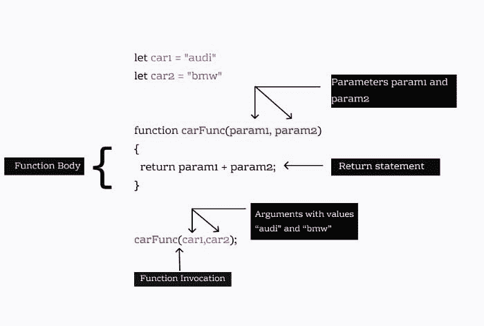

# Javascript 基础:理解函数

> 原文：<https://dev.to/shilpasyal55/javascript-basics-understanding-function-3dfm>

这篇文章将解释函数的基本架构，它的参数，调用，返回值和更多的东西。

# **简介**

***函数是为执行特定任务而设计的代码块，它可以被调用任意次。*** 它减少了我们程序中的冗余代码，使我们的代码模块化、高效化。

### **功能要点**

1.  一个函数只有在被调用时才被执行。
2.  在 JavaScript 中，函数是一级对象，因为它们可以像对象一样拥有属性和方法。
3.  对象和函数的区别在于，函数可以被调用，而对象不能。
4.  我们可以向函数传递值，并且这些值只能在函数范围内使用。

# **定义一个函数**

### **语法**

JavaScript 函数以关键字`function`开始，后面是函数名、括号`(param1,param2...)`中的参数列表和一对花括号`{..}`，花括号中的函数语句也被称为函数体。

```
function welcomeUser(name){
       alert("Hi!! Welcome Back");
} 
```

*函数名可以包含字母、数字、下划线和美元符号(大多用 camel case 书写)。*

### **函数调用**

为了执行写在函数体内的代码，我们必须调用函数。一个函数可以被调用，方法是在函数名后面加上括号。

```
welcomeUser();  //will output "Hi!! Welcome Back" 
```

由于我们的逻辑包含在 welcomeUser()函数中，我们可以根据需要多次重用它。

```
//Final Code
function welcomeUser(){
       alert("Hi!! Welcome Back");
}
welcomeUser(); 
```

### **功能参数**

在上面的例子中，`welcomeUser()`是一个提醒`”Hi!! Welcome Back”`的基本函数，但是您也可以传递参数来为该函数添加更多的功能和逻辑。

```
function welcomeUser(name) {
    alert("Welcome!!" + name );
}
welcomeUser("xyz"); 
```

在上面的例子中，`welcomeUser(name)`函数接受一个名为 name 的参数，这个 name 参数将作为该函数的一个局部变量，可以在函数中的任何地方使用。

在上面的示例中，我们将值“xyz”作为参数传递给 welcomeUser 函数，该函数通过 name 参数访问它。现在我们可以在函数中的任何地方使用 name 参数，它将输出值“xyz”。

### **参数 vs 自变量**

所以我们很多人会混淆参数和自变量这两个术语。虽然它们看起来非常相似，但它们之间还是有很大的区别。让我们看看下面的例子。

```
let car1 = "audi"
let car2 = "bmw"
function carFunc(param1, param2) {
  console.log(param1, param2);
}
carFunc(car1,car2); 
```

**函数参数是函数定义**中的变量，在括号()内用逗号分隔。这里`param1`和`param2`是两个参数。

另一方面，参数是您在函数调用期间传递的值，“audi”和“bmw”是该函数接收的两个参数。

参数(原语)通过值传递给函数(变量的副本传递给函数)。如果函数改变了一个参数的值，这不会改变实际的变量。

```
function changeName(val){
  val = "xyz";       //this will not change the actual variable
}
let name = "abc";
console.log(name);  //"abc"
changeName(name);
console.log(name);  //"abc" 
```

在上面的例子中，name 变量值在通过值传递给函数时没有改变。

但是，**对象和数组是通过引用传递的，也就是说，它们的内存位置是通过**传递的，如果函数改变了被引用对象的属性，那么这种改变在函数之外是可见的，并且会改变被传递的实际对象。下面我们来看看:

```
function changeName(obj){
   obj.name = "xyz"
}
let person = {
  name: "abc",
  age: 25
}
console.log(person.name) // "abc"
changeName(person);
console.log(person.name) // "xyz" 
```

### **函数返回值**

在 JavaScript 中，函数总是返回值。如果没有指定返回值，函数将返回默认值。

*如果该函数是用 new 关键字调用的(构造函数)，默认值是其本参数的值，否则默认返回值是未定义的*

```
function sum(a,b) {
    let c = a + b;
}
sum(2,3); 
```

sum 函数将按预期返回`undefined`。

### **返回关键字**

您可以使用 return 关键字从函数中返回值。函数返回的值实际上是返回给调用函数的，然后可以立即使用，并可以存储在一个变量中以备将来使用。

```
function sum(a,b) {
    return a + b;
} 
```

`sum`函数返回两个输入变量 a 和 b 的和。
我们可以执行该函数，然后将返回值存储到一个变量:

```
let c = sum(2,3);
console.log(c);   // Outputs: 5 
```

return 语句的另一个有趣之处是它会立即停止函数的执行。

```
function checkAge(age){
   if(age > 20)
   {
     return true;
     console.log(age);
   }
} 
```

在上面的例子中，return 语句立即停止执行我们的函数并返回 true。return 语句 console.log(age)后面的行永远不会执行。

[](https://res.cloudinary.com/practicaldev/image/fetch/s--AUqclyh6--/c_limit%2Cf_auto%2Cfl_progressive%2Cq_auto%2Cw_880/https://miro.medium.com/max/700/1%2AX-VhbxnfzeODP5Kju_fiKA.jpeg)

## **出发前:**

1.  函数是对象
2.  如果未提供 return 语句，函数将返回默认值。
3.  参数是函数定义中的变量，而自变量是函数调用过程中传递的实际值。

在下一篇文章中，我们将探索不同的类型来定义函数以及它们是如何工作的。

感谢您的阅读