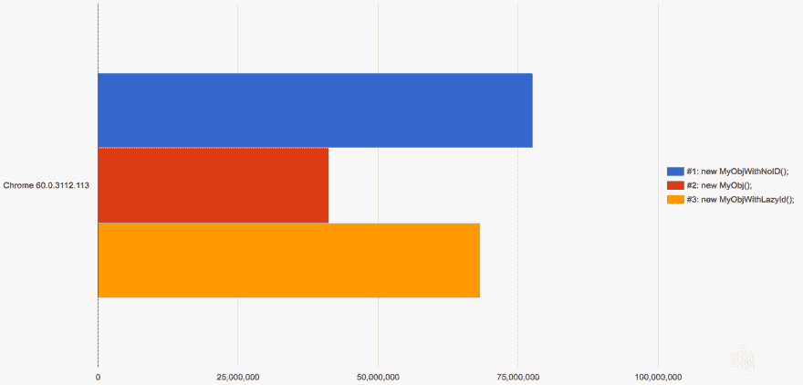

# 使用懒惰值来加速你的 JS 应用程序

> 原文：<https://dev.to/bitovi/use-lazy-values-to-speed-up-your-js-apps-2fp6>

用“惰性值”定义属性是一种可以用来提高面向对象 JavaScript 性能的技术。这尤其有益，因为它可以缩短应用程序加载时间，从而极大地影响跳出率和收入等重要指标。

在本文中，我们将回答:

*   什么是懒人价值观？
*   懒惰价值观是如何运作的？
*   应该用懒人价值观吗？

## 什么是懒值？

通常当一个属性在一个对象上被创建时，定义它的值的表达式被急切地*求值*。急切求值意味着每当调用`MyObj`时，下面例子中的`getUniqueId`函数被立即调用来计算`id`的值:

```
function getUniqueId() {
    // some magic to create an ID
}

function MyObj() {
    this.id = getUniqueId();
}
var obj1 = new MyObj();
console.log(obj1); // -> { id: 1 } 
```

即使在其余代码中从未使用过`id`属性，也会调用`getUniqueId`函数。懒惰的价值观避免了这种评价。惰性值直到第一次读取属性时才被计算:

```
var obj2 = new MyObjWithLazyId();
console.log(obj2); // -> { }
console.log(obj2.id); // -> 2
console.log(obj2); // -> { id: 2 } 
```

## 懒人价值观是如何运作的？

设置懒惰值的关键是 [Object.defineProperty](https://developer.mozilla.org/en-US/docs/Web/JavaScript/Reference/Global_Objects/Object/defineProperty) 。这个 API 允许您定义属性，并为您提供对它们的行为方式的大量控制。

为了定义一个惰性值，首先我们将属性定义为一个 [getter](https://dev.togetter) :

```
Object.defineProperty(MyObjWithLazyId.prototype, 'id', {
    get: function() {
        return getUniqueId()
    }
}); 
```

> 注意我们是如何将它添加到我们的`MyObjWithLazyId`构造函数的`prototype`中的。这允许我们定义这个属性一次，并让它被`MyObjWithLazyId`的任何实例使用。

这让我们走了一段路，但是仅仅这样，`id`属性就会在每次被读取时发生变化:

```
var obj3 = new MyObjWithLazyId();
console.log(obj3.id); // -> 2
console.log(obj3.id); // -> 3
console.log(obj3.id); // -> 5
console.log(obj3.id); // -> 8 
```

为了正确地工作，我们首先使用 getter 定义属性，但是当 getter 被调用时，我们再次使用`Object.defineProperty`将属性重新定义为值:

```
Object.defineProperty(MyObjWithLazyId.prototype, 'id', {
    get: function() {
        var id = getUniqueId();

        Object.defineProperty(this, 'id', {
            value: id
        });

        return id;
    }
}); 
```

将该属性重新定义为一个值意味着下次读取该属性时，将返回该值，而不需要调用任何函数。

## 该不该用懒人价值观？

使用惰性值的好处是，在应用程序初始化期间不必计算它们。从这个[基准测试](https://jsbench.github.io/#3da95139f6e8599bd44386e958220621)可以看出，Lazy Values(下面的橙色条)的性能非常接近于构造一个完全空的对象的性能，如蓝色条所示(越大越好):

[](https://res.cloudinary.com/practicaldev/image/fetch/s--UlQtyJB5--/c_limit%2Cf_auto%2Cfl_progressive%2Cq_auto%2Cw_880/https://lh6.googleusercontent.com/ivc_D5KWaFAUCURLN19lZeO4eCEzZePrDRZuQSIJYbxTcZfoOUoxOeoynW8G50tlHCYIPmPDjT7iJLPeHwPVVZ6qe5UD5k9K0D-brg3_GY3sUZeo4TLCtdq5KD0ph7EdqXAj1geu)

如果您正在构建一个只在应用程序中的少数地方使用的模块，那么使用这种技术的好处可能会被您下次阅读这段代码时为自己增加的复杂性所抵消。确保在你的应用中进行性能测试，看看可读性的降低是否值得。

如果您正在编写的代码将在整个应用程序中被多次使用，或者您正在构建一个世界级的 JavaScript 库，那么您的用户很可能会从 Lazy Values 提供的性能改进中受益。

如果你想使用这种技术，我们刚刚发布了 [can-define-lazy-value](https://canjs.com/doc/can-define-lazy-value.html) 让它非常容易上手。你可以从 [npm](https://www.npmjs.com/package/can-define-lazy-value) 安装它，看看它的 [25 行](https://github.com/canjs/can-define-lazy-value/blob/4c8529d566f33eb6566bbb9da93e003192545e85/dist/cjs/define-lazy-value.js)代码，看看它到底是如何工作的。