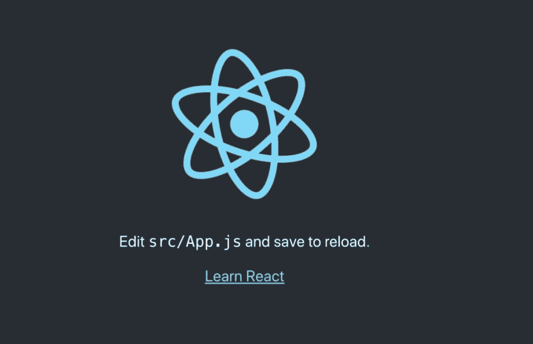
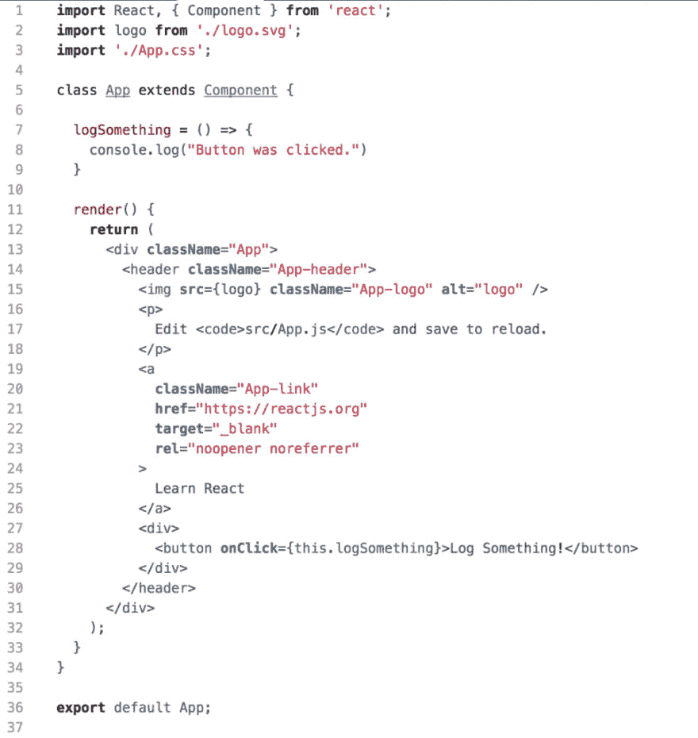
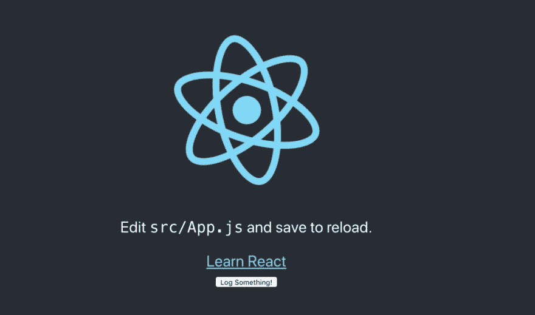
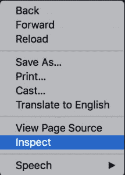
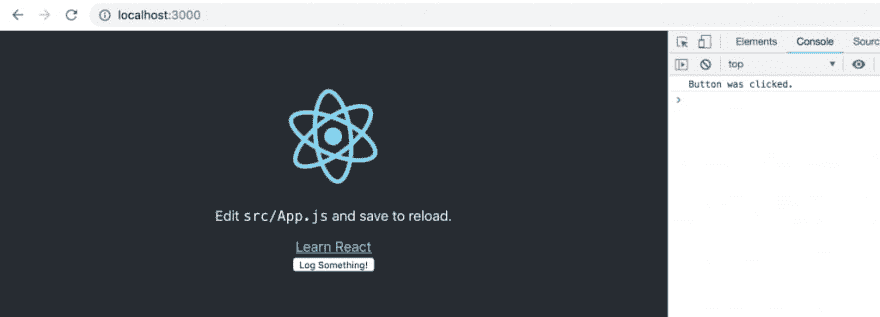
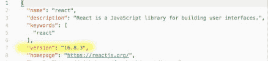
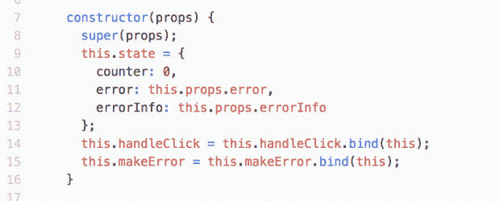
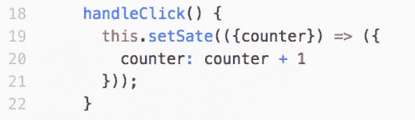
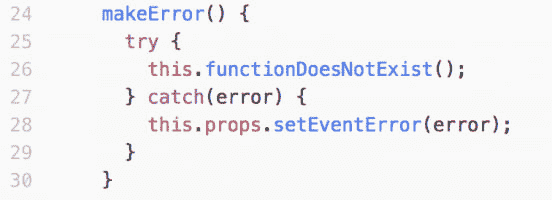

# React 日志记录快速入门

> 原文：<https://dev.to/scalyr/getting-started-quickly-with-react-logging-2c89>

在整个系列中，我们已经讨论了在 [C#](https://www.scalyr.com/blog/get-started-quickly-csharp-logging/) 、 [Java](https://www.scalyr.com/blog/get-started-quickly-java-logging) 、 [Python](https://www.scalyr.com/blog/started-quickly-python-logging) 、 [Ruby](https://www.scalyr.com/blog/getting-started-quickly-ruby-logging) 、 [Go](https://www.scalyr.com/blog/getting-started-quickly-with-go-logging/) 、 [JavaScript](https://www.scalyr.com/blog/get-started-quickly-javascript-logging) 、 [PHP](https://www.scalyr.com/blog/getting-started-quickly-with-php-logging/) 、 [Swift](https://www.scalyr.com/blog/getting-started-swift-logging) 和 [Scala](https://www.scalyr.com/blog/get-started-scala-logging) 中的日志记录。我们也探索了一些库和平台，比如 [Log4j](https://www.scalyr.com/blog/log4j2-configuration-detailed-guide/) 、 [Node.js](https://www.scalyr.com/blog/getting-started-quickly-node-js-logging/) 、 [Spring Boot](https://www.scalyr.com/blog/started-quickly-spring-boot-logging/) 、 [Rails](https://www.scalyr.com/blog/rails-logger/) 和 [Angular](https://www.scalyr.com/blog/getting-started-angular-logging) 。今天我们将学习登录 React。

在本文中，我们将

*   建立一个简单的 React 应用程序
*   完成一个简单日志记录的例子
*   讨论什么是日志记录以及它为什么重要
*   探索一些我们可以使用的其他日志记录方法。

我们开始吧！

[](https://res.cloudinary.com/practicaldev/image/fetch/s--ThPgfIL3--/c_limit%2Cf_auto%2Cfl_progressive%2Cq_auto%2Cw_880/https://library.scalyr.com/2019/03/29085441/React_atom_image_with_scalyr_colors.png)

## 一些背景信息

React 也称为 React.js 或 React JS，是一个流行的用于创建用户界面的前端开发库。它最初是为脸书开发的，于 2013 年发布。

React 使用 JavaScript 作为其核心语言。它允许我们从 JavaScript 应用程序中期待的所有交互，但是通过一种叫做虚拟 DOM 的东西提高了效率。在一个非常基本的层面上，这仅允许在进行更改时重新加载那些受影响的组件，而不是整个页面。它通过使用内存缓存将 DOM 对象与其对应的虚拟 DOM 对象进行比较，并仅重新呈现不同的对象来实现这一点。

因为 React 是一个 JavaScript 库，这意味着我们再次遇到客户端日志记录的问题，正如我们在讨论 [JavaScript](https://www.scalyr.com/blog/get-started-quickly-javascript-logging) 时看到的。在设置了简单的日志应用程序之后，我们将再次回顾这一点。

## 简单的 React 应用程序

为了创建尽可能简单的 React 应用程序，我们将使用脸书的 [Create React App](https://github.com/facebook/create-react-app#creating-an-app) 。在我们开始之前，让我们确保我们有所有必要的工具。

### 设置我们的包管理器

为了使用 Create React App，你需要一个包管理器，比如 npx、npm 或者 Yarn。在本教程中，我们将使用 npm，但这三个选项中的任何一个都可以。

如果您不确定是否已经安装了 npm，请打开命令行工具，如 Windows 命令提示符或 PowerShell (Windows)或终端应用程序(MacOS)。使用此命令:

```
npm -v
```

如果已经安装了 npm，您将获得一个版本号。例如，6.5.0 是我运行该命令时返回的版本号，也是我在本教程中使用的版本。如果你得到类似的回报，你就可以走了！

如果你没有得到一个版本号，你需要先安装 npm。查看 [npm 网站](https://www.npmjs.com/get-npm)获取官方说明。简而言之，你需要从 [Node.js](https://nodejs.org/en/download/) 网站下载一个安装程序并运行它。这是因为 npm 是随 Node.js 一起分发的。一旦您完成了安装，只需重新启动您的计算机，一切就都准备好了！

### 下载 Create React 应用程序

现在我们有了 npm，我们准备创建我们的 React 应用程序。在命令行工具中，您将输入以下命令:

```
npm init react-app my-app
```

这将从上面链接的 Create React App 页面下载我们需要的代码，并将其放在名为 **my-app** 的目录中。您将在当前目录中找到新目录。

在我们做任何新的改变之前，让我们看看它是什么样子的。使用此命令:

```
cd my-app
```

这将把应用程序移动到新创建的文件夹中。进入后，您可以使用以下命令运行应用程序:

```
npm start
```

接下来，你需要打开一个浏览器窗口，导航到 [**。您将能够看到您的应用程序在本地运行。它应该有一些文字和一个旋转的反应标志。这里没有太多内容，但是我们已经为做一些简单的日志记录做好了所有的基础工作！**](http://localhost:3000)

[](https://res.cloudinary.com/practicaldev/image/fetch/s--XTSL8rVK--/c_limit%2Cf_auto%2Cfl_progressive%2Cq_auto%2Cw_880/https://library.scalyr.com/2019/03/29085538/011-1024x660.png)

如果你想了解更多关于 Create React 应用程序如何工作的详细信息，你可以点击这里查看自述文件。

## 记录到控制台

登录 React 最简单的方法是打印到控制台。在新的 **my-app** 文件夹中，你应该会看到另一个名为 **src** 的文件夹。在里面，你会看到一个名为 **App.js** 的文件。现在在您选择的 ide 或文本编辑器中打开它。正如所料，它非常短，只有一个 div，包含一个标题、一个图像、一个段落和一个链接。我们现在不会费心去改变任何现有的代码，但是如果你想把这个简单的应用程序扩展成更复杂的东西，这是你应该开始的地方。相反，我们将通过添加以下代码在链接下添加一个按钮:

```
<div>
  <button onClick={this.logSomething}>Log Something!</button>
</div>
```

不要忘记在渲染块之外添加相应的函数。

```
logSomething = () => {
  console.log("Button was clicked.")
}
```

一旦你完成了，你完成的 **App.js** 文件应该是这样的:

[](https://res.cloudinary.com/practicaldev/image/fetch/s--JO0tqYP4--/c_limit%2Cf_auto%2Cfl_progressive%2Cq_auto%2Cw_880/https://library.scalyr.com/2019/03/29085616/021-969x1024.png)

您会注意到，一旦您保存了更改，浏览器中的应用程序就会更新。它应该是这样的:

[](https://res.cloudinary.com/practicaldev/image/fetch/s--eIHYW-0c--/c_limit%2Cf_auto%2Cfl_progressive%2Cq_auto%2Cw_880/https://library.scalyr.com/2019/03/29085642/03-1024x604.png)

要打开控制台，在应用窗口内点击右键，点击**检查**，选择**控制台**选项卡。您也可以使用 F12 键来做同样的事情。

[](https://res.cloudinary.com/practicaldev/image/fetch/s--vMxK4kzC--/c_limit%2Cf_auto%2Cfl_progressive%2Cq_auto%2Cw_880/https://library.scalyr.com/2019/03/29085707/04.png)

当控制台打开时，你可以看到按钮被按下时打印出来的任何东西。现在单击按钮，您应该会看到一条消息打印到控制台中。

[](https://res.cloudinary.com/practicaldev/image/fetch/s--ZrH4qyux--/c_limit%2Cf_auto%2Cfl_progressive%2Cq_auto%2Cw_880/https://library.scalyr.com/2019/03/29085822/05-1024x369.png)

现在你知道了！您已经在 React 中创建了一个简单的日志应用程序！

## 什么是伐木？

在我们进一步讨论之前，让我们确保对我们所谈论的日志记录有一个坚实的理解。

在本系列的[开头，我们将日志记录或应用程序日志记录定义如下:](https://www.scalyr.com/blog/get-started-quickly-csharp-logging/)

> 应用程序日志记录包括将有关应用程序运行时行为的信息记录到更持久的介质中。

这里有两点需要注意。首先，日志记录为我们提供了关于应用程序在运行时做了什么的信息。

第二，我们希望我们的日志能保留一段时间，而不是立即消失。我们需要的持久性级别可能因应用程序而异，但至少我们希望即使应用程序崩溃或服务器宕机，也能够读取日志。

现在我们知道了什么是日志记录，让我们确保我们理解为什么我们要大费周章地将日志记录添加到我们的应用程序中。

## 伐木的动机是什么？

一旦我们的软件出现在世界上，远离我们本地调试环境的安全范围，我们需要一种方法来调查问题和分析性能。简而言之，日志记录允许我们记录应用程序的行为，并在以后进行分析。有这么多事情可能出错，记录的数据允许我们查明发生了什么错误，甚至追溯用户创建或发现问题所采取的步骤。

[](https://res.cloudinary.com/practicaldev/image/fetch/s--zMxf5mQD--/c_limit%2Cf_auto%2Cfl_progressive%2Cq_auto%2Cw_880/https://library.scalyr.com/2019/03/29091319/Logging-provides-us-with-a-strategy-for-maintaining-the-health-of-our-application.png)

此外，通过记录数据并在以后进行分析，我们熟悉了正常行为的样子，甚至能够在问题发生之前检测和预防问题。日志记录——更重要的是，记录正确的数据——为我们提供了维护应用程序健康的策略。

## 我们应该记录什么？

现在我们知道了为什么日志记录很重要，我们需要决定包括哪些信息。将数据随机转储到一个日志文件中会使查找我们实际需要的数据变得繁琐而困难。另一方面，我们希望提供足够的信息，以便我们可以有效地解决出现的问题。那么我们应该记录什么呢？

我们可以从概念上将每个日志条目视为一个事件开始。事件是在特定时间发生的有趣的事情。我们的目标是获取所需的信息，以便在事件发生时理解事件。下面列出了一些有助于获取的信息:

*   一个时间戳。时间戳告诉我们一个事件何时发生，以及它与其他事件的关系。最佳实践建议以标准时区(如 UTC)记录时间戳，并使用标准格式(如 ISO-8601)。
*   语境。我们想尽可能清楚地说明这个事件是关于什么的。试图使用模糊的记录数据或错误名称来调试问题可能会非常令人沮丧。对错误的上下文提供一个好的描述会使理解和纠正错误更加有效。
*   日志级别，如**错误**、**警告**或**信息**。这些为理解问题及其严重性提供了更多的背景。它们允许我们优先考虑并首先关注那些影响最大的问题。它们还能让我们更有效地过滤和分析数据。

将此列表视为有助于记录的信息基线。显然，我们上面的简单应用程序不符合这些基本准则。

## 客户端日志的问题

我们对 React 日志记录的简单演示可能为我们提供了一些关于应用程序运行时行为的信息，但是我们记录的信息肯定不是持久的。如果我们刷新浏览器或导航到另一个页面，信息就会消失。

更重要的是，我们的应用程序将信息记录到浏览器的控制台。如果这个应用程序被发布到生产环境中，而不是仅仅在本地运行，我们将没有办法访问那些记录的消息。

通过本系列中探索的许多技术，我们能够使用文件系统来满足对持久介质的需求。然而，正如我们研究 JavaScript 时的情况一样，这种方法不适用于 React。从浏览器访问文件系统涉及几个安全问题，并且访问未知和不可访问的机器上的本地存储不是一个选项。

## 扩展我们的日志应用程序

将日志记录到控制台有一些好处，主要是用于本地调试。但是为了获得记录数据的全部好处，我们需要更好的东西。我们需要找到一种方法来满足前面给出的日志记录定义所概述的要求:

*   通过服务器而不是浏览器访问记录的信息
*   使用持久介质存储数据的能力

简而言之，我们需要一种向服务器发送消息并将其写入持久介质的方法。虽然这听起来很简单，但创建一个合适的机制所涉及的工作实际上是相当多的。我们需要用可用的 API 编写一个单独的应用程序来接受日志消息。

我们可以探索另一种选择——即日志框架，而不是让自己陷入从零开始创建东西的众多任务中。

日志框架是一个计算机数据日志包，包含允许在不同级别进行日志记录的方法。幸运的是，有几个现有的选项可以满足我们的要求。

## 探索日志框架

出于本教程的目的，我们将关注 **[通用反应记录器](https://www.npmjs.com/package/universal-react-logger)** 。给出的描述表明

> 捕捉服务器上的客户端错误的记录器。

此外，浏览器中触发的事件会发送到服务器。从那里，它们可以立即打印出来，或者发送到外部日志服务进行持久存储。我们两个的要求都满足了！

通用反应记录器如何工作？它利用了 React 16 中引入的错误边界。错误边界主要用于捕捉渲染过程中的错误，但在这里也扩展到捕捉事件错误。

## 使用通用反应记录器

现在让我们开始实现我们的日志框架。再一次，让我们首先确保我们有所有的需求。

### 要求和安装

正如您所料， **universal-react-logger** 要求 react 版本至少为 16.2.0。要了解您的项目运行的版本，请在您的 **my-app** 应用程序目录中找到 **node_modules** 文件夹。找到**/node _ modules/react/package . JSON**并找到**版本**键:

[](https://res.cloudinary.com/practicaldev/image/fetch/s--EFS0hgLT--/c_limit%2Cf_auto%2Cfl_progressive%2Cq_auto%2Cw_880/https://library.scalyr.com/2019/03/29085923/06.png)

如果您的 React 版本低于 16.2.0，请使用以下命令进行升级:

```
npm update
```

此外， **universal-react-logger** 要求 React Router DOM 的版本至少为 4.2.2。使用以下命令安装它:

```
npm install --save react-router-dom
```

最后，安装**通用反应记录器**:

```
npm i universal-react-logger
```

### 创建新组件

现在我们已经设置好了，我们可以创建一个新的组件并导入 **ErrorHandler** HOC 来使用它。下面的例子基于 [**通用反应记录器**网站](https://www.npmjs.com/package/universal-react-logger)上提供的代码。我们首先创建一个名为 **Homepage.js** 的新文件，并从 **universal-react-logger** 导入 **ErrorHandler** 。

```
import { ErrorHandler} from 'universal-react-logger';
```

接下来，我们将向我们的**主页**组件添加一个构造函数来设置我们的状态并绑定一些新函数。

[](https://res.cloudinary.com/practicaldev/image/fetch/s--PqxIE6rB--/c_limit%2Cf_auto%2Cfl_progressive%2Cq_auto%2Cw_880/https://library.scalyr.com/2019/03/29090006/07.png)

我们还需要创建构造函数中提到的函数，从更新计数器的函数开始:

[](https://res.cloudinary.com/practicaldev/image/fetch/s--PLfFBvJ7--/c_limit%2Cf_auto%2Cfl_progressive%2Cq_auto%2Cw_880/https://library.scalyr.com/2019/03/29090035/08.png)

第二个函数假装调用一个不存在的函数，导致事件错误。然后它使用 **setEventError** 函数发送错误。

[](https://res.cloudinary.com/practicaldev/image/fetch/s--WX0hpzPi--/c_limit%2Cf_auto%2Cfl_progressive%2Cq_auto%2Cw_880/https://library.scalyr.com/2019/03/29090103/09.png)

最后，我们将更新渲染块。当计数器等于 5 时，我们将添加一个条件来模拟渲染错误，这次我们还将有两个按钮。一个按钮将允许我们更新计数器，这样我们最终可以创建一个渲染错误。另一个将触发事件错误。完成的文件应该如下所示:

```
import React, { Component } from 'react';
import { ErrorHandler} from 'universal-react-logger';

class Homepage extends Component {

    constructor(props) {
        super(props);
        this.state = {
            counter: 0,
            error: this.props.error,
            errorInfo: this.props.errorInfo
        };
        this.handleClick = this.handleClick.bind(this);
        this.makeError = this.makeError.bind(this);
    }

    handleClick() {
        this.setState(({counter}) => ({
            counter: counter + 1
        }));
    }

    makeError () {
        try{
            // pretend to call a function that does not exist
            this.functionThatDontExist();
        } catch(error) {
            // send the error using the setEventError function
            this.props.setEventError(error);
        }
    };

    render() {
        if (this.state.counter === 5) {
            // Simulate a render error
            throw new Error('Error on render');
        }

        return (
            <div>
                <h1 key="welcome">universal-react-logger</h1>
                <button onClick={this.handleClick}>Update counter: {this.state.counter}</button>
                <button onClick={() => {this.makeError()}}>Make event error</button>
            </div>
        );
    }
}

export default ErrorHandler(Homepage, true);
```

### 在服务器上创建路由

准备好组件后，我们还需要在服务器上添加相应的路由。在 **src** 文件夹中，你会找到 **index.js** 文件。打开它并添加以下内容:

```
/**
 * Post client errors in order to log them
 */
app.post('/log-client-errors', (req, res) => {

    let error       = req.body.error.message;
    let errorInfo   = req.body.error.stack;

    // send these errors to some service or to a logger (ex: winston)
    //ex: logger.error(`The app received a new client log: ${error} ${errorInfo}`);

    res.status(200);
});
```

现在，当我们在服务器上运行应用程序时，当我们触发一个错误时，我们将看到我们的日志消息被打印到控制台。这意味着我们已经成功地从浏览器向服务器发回了一条日志消息！

## 下一步是什么？

即使我们在这里做了所有的工作，我们也仅仅触及了登录 React 的皮毛。特别是，将日志信息从客户端发送回服务器需要考虑一组全新的变量。例如，浏览器信息、URL 和设备信息可能是需要传输的重要信息。不同日志框架的特性和功能也值得您考虑，并且应该受到对您需要什么信息的理解的影响。

无论您做出什么决定，您无疑已经认识到客户端日志记录是不够的。了解应用程序的整体行为可能会有所帮助，但要真正有用，您需要考虑一种将日志返回到服务器的方法。

知道从哪里开始记录日志可能是一项艰巨的任务，但是清楚而详细地了解软件的功能是非常值得努力的。一旦你开始收集大量的数据，你可能想要组织它，搜索它，并且可视化地表现它。将客户端消息与服务器端消息相匹配很可能会让您受益匪浅。如果是这样的话，你的下一步就是考虑日志聚合，这恰好是 Scalyr 的专长。

要了解更多关于您可以对数据做什么的信息，请查看我们对[日志聚合](https://www.scalyr.com/product)的看法！但与此同时，从基本的日志记录开始，并在此基础上进行构建。

*本帖由* [*李玉兰*](https://www.linkedin.com/in/delila-lee-92061552/) *撰写。Delila 是 NLP 和 ML 领域的软件开发人员，拥有语言学和计算机科学学位。她目前从事函数式编程语言的工作，偶尔也做一些 web 开发。*