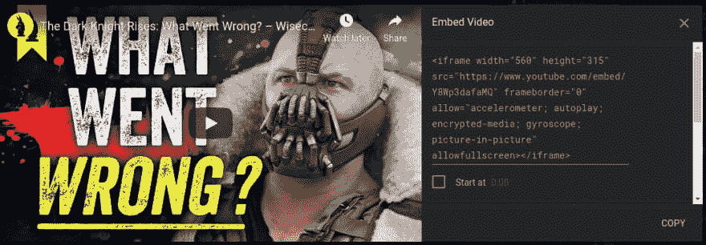
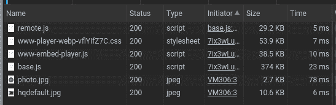

# 延迟加载嵌入的 YouTube 视频

> 原文：<https://dev.to/haggen/lazy-load-embedded-youtube-videos-520g>

我在这个简单的静态网站上工作，应该有一个 YouTube 视频显示在登录页面上。所以我愉快地走了，跳到 YouTube 上，抓取嵌入代码，粘贴到我的编辑器中，然后就到此为止。

[](https://res.cloudinary.com/practicaldev/image/fetch/s--rIpAZuz_--/c_limit%2Cf_auto%2Cfl_progressive%2Cq_auto%2Cw_880/https://i.imgur.com/HWKj35i.png)

事情是这样的，这份工作是专门提供高性能、可访问性和现代实践的，所以你可以想象当我注意到仅仅因为有这个`<iframe>`我就得到了这个:

[](https://res.cloudinary.com/practicaldev/image/fetch/s--ESjkTlur--/c_limit%2Cf_auto%2Cfl_progressive%2Cq_auto%2Cw_880/https://i.imgur.com/IT0tvqp.png)

加上我的广告拦截器为我处理的一些额外请求。

这超过了 500KB，我的用户将不得不在网站上下载，不管他们是否会观看视频。你知道这对你的用户有多沉重吗，特别是那些网速慢或者机器性能差的用户？雪上加霜的是，他们还会被跟踪——你好，谷歌——因为他们只是上传了一个他们甚至不知道在那里的视频。

这是一个简单的静态网站，我想保持我的解决方案最少，所以这里是我想出来的。

截至 2019 年 8 月，嵌入 YouTube 视频的代码是这样的:

```
<iframe 
  width="560" 
  height="315" 
  src="https://www.youtube.com/embed/Y8Wp3dafaMQ" 
  frameborder="0" 
  allow="accelerometer; autoplay; encrypted-media; gyroscope; picture-in-picture" 
  allowfullscreen>
</iframe> 
```

Enter fullscreen mode Exit fullscreen mode

所以我想，如果我展示的不是真正的视频，而是链接到视频的封面，会怎么样？它看起来仍然有点像一个嵌入式视频，但它只需要一个单一的图像。谢天谢地，YouTube 有一个视频缩略图的 URL 模式。

```
<a href="https://www.youtube.com/embed/Y8Wp3dafaMQ">
  
</a> 
```

Enter fullscreen mode Exit fullscreen mode

很酷，但是我真的不想为这一小段代码创建一个全新的页面。嗯，我们很幸运，因为`<iframe>`正好有最适合我们的东西——[srcdoc 属性](https://developer.mozilla.org/en-US/docs/Web/HTML/Element/iframe#attr-srcdoc)。有了它，你可以直接在托管页面中获取`<iframe>`。只是要小心，它[不会在 Edge 或 IE](https://caniuse.com/#search=srcdoc) 上工作，而且我们不能使用双引号。

```
<iframe 
  ...
  srcdoc="<a href=https://www.youtube.com/embed/Y8Wp3dafaMQ></a>">
</iframe> 
```

Enter fullscreen mode Exit fullscreen mode

最后，您会注意到，如果我们单击图像，它将加载视频，但处于暂停状态，我们需要再次单击它才能开始观看。不要担心，因为嵌入的视频 URL 支持[播放器参数](https://developers.google.com/youtube/player_parameters?playerVersion=HTML5)，其中有一个`autoplay`变量，它会做你所期望的事情。此外，由于浏览器的默认风格，在有滚动条的系统上的用户——即不是 MAC OS——将会看到一个不必要的滚动条，但没有什么是一个小的 CSS 重置不能修复的。

雷米·夏普指出我们应该保留`src`作为不支持`srcdoc`的浏览器的后备。 [Adrian Roselli](https://dev.to/aardrian) 提出了一些改进可访问性的建议。此外，在应用这些建议时，我固定了图像的位置，使其保持水平和垂直居中，而不需要求助于`background-size: cover`。谢谢你们的反馈！🤩️

下面是**最终结果**:

[https://codesandbox.io/embed/qdzu6](https://codesandbox.io/embed/qdzu6)

`<iframe>`单挑:

```
<iframe
  width="560"
  height="315"
  src="https://www.youtube.com/embed/Y8Wp3dafaMQ"
  srcdoc="<style>*{padding:0;margin:0;overflow:hidden}html,body{height:100%}img,span{position:absolute;width:100%;top:0;bottom:0;margin:auto}span{height:1.5em;text-align:center;font:48px/1.5 sans-serif;color:white;text-shadow:0 0 0.5em black}</style><a href=https://www.youtube.com/embed/Y8Wp3dafaMQ?autoplay=1><span>▶</span></a>"
  frameborder="0"
  allow="accelerometer; autoplay; encrypted-media; gyroscope; picture-in-picture"
  allowfullscreen
  title="The Dark Knight Rises: What Went Wrong? – Wisecrack Edition"
></iframe> 
```

Enter fullscreen mode Exit fullscreen mode

这样，所有用户都必须提前下载封面图片，这在我看来很合理。您可以进一步定制它，例如为不同的设备使用不同的缩略图大小，如果您需要更多地控制用户将加载什么以及启用什么功能，您可以随时探索 [YouTube 播放器 API](https://developers.google.com/youtube/iframe_api_reference) 。

如果您有任何问题、更正或建议，欢迎在下面评论。谢谢你的时间。😊️