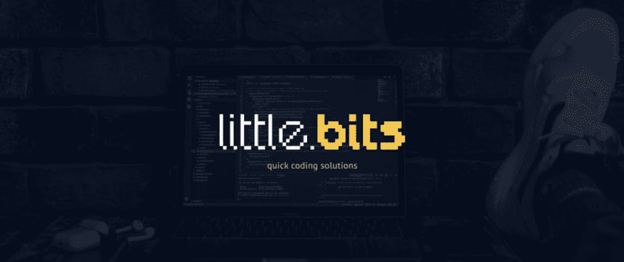
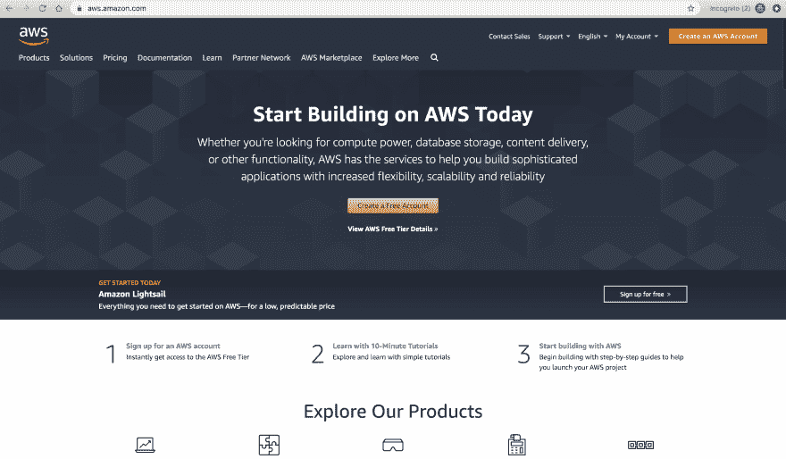

# 用无服务器框架让你的网站活起来——一点点

> 原文：<https://dev.to/maciekgrzybek/make-your-website-live-with-serverless-framework-little-bits-16gj>

[](https://res.cloudinary.com/practicaldev/image/fetch/s--LYltK6hi--/c_limit%2Cf_auto%2Cfl_progressive%2Cq_auto%2Cw_880/https://res.cloudinary.com/practicaldev/image/fetch/s--kDnOm6Tc--/c_imagga_scale%2Cf_auto%2Cfl_progressive%2Ch_420%2Cq_auto%2Cw_1000/https://thepracticaldev.s3.amazonaws.com/i/ktl98648vzd366rxgst6.jpg)

##### Little Bits 是一系列短文，解释常见开发问题的快速解决方案。没有不必要的描述或代码片段。不废话。

#### 我们要做什么？

将 [GatsbyJS](https://www.gatsbyjs.org/) 项目部署到 [AWS S3](https://aws.amazon.com/s3/) 桶中，使用实时 URL 查看网站。

#### 我们要用什么工具？

*   [盖茨比](https://www.gatsbyjs.org/)
*   [无服务器](https://serverless.com/)
*   [无服务器 finch 插件](https://github.com/fernando-mc/serverless-finch)

#### 计划

1.  创建 AWS 帐户。
2.  设置凭据
    *   全局安装无服务器框架。
    *   创建 IAM 用户和访问密钥
    *   在您的计算机上设置 AWS 凭据。
3.  创建 GatsbyJS 启动项目。
4.  安装无服务器项目和无服务器 finch 插件。
5.  插件的设置配置。
6.  部署网站。

### 1。创建 AWS 帐户。

不言自明。要开始使用 AWS，您需要创建一个帐户。注意:你必须添加你的信用卡详细信息，但是不要担心，AWS 有免费的等级，你可能不会检查它们。除非你会使用一些大规模的人工智能计算，并坚持 S3，你是排序。
[](https://res.cloudinary.com/practicaldev/image/fetch/s--swH1Mwqu--/c_limit%2Cf_auto%2Cfl_progressive%2Cq_auto%2Cw_880/https://articles-images-123123123898989.s3-eu-west-1.amazonaws.com/Screen%2BShot%2B2019-08-05%2Bat%2B13.13.45.png)

### 2。设置凭据

##### 全局安装无服务器框架。

从您的终端运行:

```
npm install -g serverless 
```

<svg width="20px" height="20px" viewBox="0 0 24 24" class="highlight-action crayons-icon highlight-action--fullscreen-on"><title>Enter fullscreen mode</title></svg> <svg width="20px" height="20px" viewBox="0 0 24 24" class="highlight-action crayons-icon highlight-action--fullscreen-off"><title>Exit fullscreen mode</title></svg>

或者，如果您使用的是 Mac:

```
sudo npm install -g serverless 
```

<svg width="20px" height="20px" viewBox="0 0 24 24" class="highlight-action crayons-icon highlight-action--fullscreen-on"><title>Enter fullscreen mode</title></svg> <svg width="20px" height="20px" viewBox="0 0 24 24" class="highlight-action crayons-icon highlight-action--fullscreen-off"><title>Exit fullscreen mode</title></svg>

##### 创建一个 IAM 用户和访问密钥

登录您的 AWS 帐户，并转到身份和访问管理(IAM)部分。创建具有管理员权限的新用户。

##### 在您的机器上设置 AWS 凭证

从 IAM 帐户获取访问密钥和秘密密钥，并从终端运行命令:

```
serverless config credentials --provider aws --key <your-access-key> --secret <your-secret-key> 
```

<svg width="20px" height="20px" viewBox="0 0 24 24" class="highlight-action crayons-icon highlight-action--fullscreen-on"><title>Enter fullscreen mode</title></svg> <svg width="20px" height="20px" viewBox="0 0 24 24" class="highlight-action crayons-icon highlight-action--fullscreen-off"><title>Exit fullscreen mode</title></svg>

如果你被困住了，可以看看这个来自无服务器的很棒的短片。

### 3。创建 gatsby starter 项目。

从终端运行:

```
gatsby new my-awesome-website https://github.com/gatsbyjs/gatsby-starter-default 
```

<svg width="20px" height="20px" viewBox="0 0 24 24" class="highlight-action crayons-icon highlight-action--fullscreen-on"><title>Enter fullscreen mode</title></svg> <svg width="20px" height="20px" viewBox="0 0 24 24" class="highlight-action crayons-icon highlight-action--fullscreen-off"><title>Exit fullscreen mode</title></svg>

当然不一定是 GatsbyJS 项目，想用什么都可以。

### 4。安装无服务器项目和无服务器 finch 插件。

在“终端”中，转到您的新网站文件夹:

```
cd my-awesome-website 
```

<svg width="20px" height="20px" viewBox="0 0 24 24" class="highlight-action crayons-icon highlight-action--fullscreen-on"><title>Enter fullscreen mode</title></svg> <svg width="20px" height="20px" viewBox="0 0 24 24" class="highlight-action crayons-icon highlight-action--fullscreen-off"><title>Exit fullscreen mode</title></svg>

现在只需运行:

```
serverless 
```

<svg width="20px" height="20px" viewBox="0 0 24 24" class="highlight-action crayons-icon highlight-action--fullscreen-on"><title>Enter fullscreen mode</title></svg> <svg width="20px" height="20px" viewBox="0 0 24 24" class="highlight-action crayons-icon highlight-action--fullscreen-off"><title>Exit fullscreen mode</title></svg>

并按照提示进行操作。记得选择 AWS Node.js 环境。现在安装无服务器 finch 插件。为此，运行:

```
npm install --save serverless-finch 
```

<svg width="20px" height="20px" viewBox="0 0 24 24" class="highlight-action crayons-icon highlight-action--fullscreen-on"><title>Enter fullscreen mode</title></svg> <svg width="20px" height="20px" viewBox="0 0 24 24" class="highlight-action crayons-icon highlight-action--fullscreen-off"><title>Exit fullscreen mode</title></svg>

### 5。插件的设置配置。

要设置插件，请使用:
更新您的 serverless.yml 文件

```
plugins:
  - serverless-finch
custom:
  client:
    bucketName: unique-s3-bucketname #Bucket will be created automatically.
    distributionFolder: public
    #You can find more config options on the plugin's GitHub page. 
```

<svg width="20px" height="20px" viewBox="0 0 24 24" class="highlight-action crayons-icon highlight-action--fullscreen-on"><title>Enter fullscreen mode</title></svg> <svg width="20px" height="20px" viewBox="0 0 24 24" class="highlight-action crayons-icon highlight-action--fullscreen-off"><title>Exit fullscreen mode</title></svg>

您的 serverless.yml 文件看起来应该是这样的(在删除了安装过程中的所有注释之后):

```
service: awesome-name
app: awesome-name-app
org: your-name

provider:
  name: aws
  runtime: nodejs10.x
plugins:
  - serverless-finch
custom:
  client:
    bucketName: unique-s3-bucketname #Bucket will be created automatically.
    distributionFolder: public
    #You can find more config options on plugins github page.
functions:
  hello:
    handler: handler.hello 
```

<svg width="20px" height="20px" viewBox="0 0 24 24" class="highlight-action crayons-icon highlight-action--fullscreen-on"><title>Enter fullscreen mode</title></svg> <svg width="20px" height="20px" viewBox="0 0 24 24" class="highlight-action crayons-icon highlight-action--fullscreen-off"><title>Exit fullscreen mode</title></svg>

### 6。部署网站。

从终端运行网站的构建过程:

```
npm run build 
```

<svg width="20px" height="20px" viewBox="0 0 24 24" class="highlight-action crayons-icon highlight-action--fullscreen-on"><title>Enter fullscreen mode</title></svg> <svg width="20px" height="20px" viewBox="0 0 24 24" class="highlight-action crayons-icon highlight-action--fullscreen-off"><title>Exit fullscreen mode</title></svg>

之后运行部署命令:

```
serverless client deploy 
```

<svg width="20px" height="20px" viewBox="0 0 24 24" class="highlight-action crayons-icon highlight-action--fullscreen-on"><title>Enter fullscreen mode</title></svg> <svg width="20px" height="20px" viewBox="0 0 24 24" class="highlight-action crayons-icon highlight-action--fullscreen-off"><title>Exit fullscreen mode</title></svg>

并按照提示进行操作。在这个过程的最后，你会收到一个崭新网站的网址。

### 总结

就这样，您已经成功地将您的静态网站部署到 AWS S3 Bucket。现在，你可以尝试添加一个自定义域名，将你的网站连接到 CloudFront 或其他任何需要的东西。如果你喜欢这篇文章，并且你认为简短紧凑的形式很酷(或者如果你不喜欢😃)在评论区告诉我。