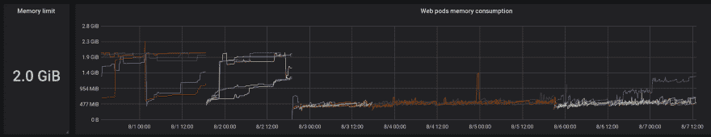
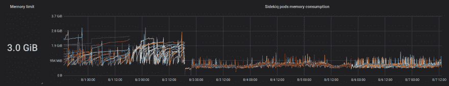
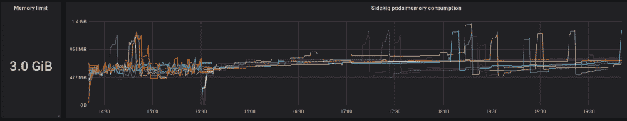

# Fullstaq Ruby:第一印象，以及如何移植你的 Docker/Kubernetes Ruby 应用程序

> 原文：<https://dev.to/evilmartians/fullstaq-ruby-first-impressions-and-how-to-migrate-your-docker-kubernetes-ruby-apps-today-4fm7>

## 什么是 Fullstaq Ruby？

Fullstaq Ruby 是标准 MRI Ruby 解释器的定制版本，替换了内存分配器，应用了安全补丁，还有更多的好东西。

如果一些老前辈在这里，他们应该还记得 Ruby 1.8.7 和 Ruby on Rails 2.2 时代的 REE-Ruby Enterprise Edition(差不多十年前！).啊，美好的时光！您可以通过 RVM 或 Rbenv 安装它，一些遗留应用程序仍在其上运行，或者只是最近才被迁移。REE 在 Ruby 1.8.7 上有十几个不同的补丁来提高性能，减少内存消耗，调整过时的安全设置等等。

在 MRI 1.9.x 中，这些问题大部分都得到了解决，随着它的普及，REE 变得过时了。但是，即使是现代的“普通”核磁共振成像仍然有一些相对容易解决的问题。其中最烦人的是由于内存碎片导致的内存膨胀。

所以，REE 的创造者李鸿·赖发布 Fullstaq Ruby 一点也不奇怪。

> REE 死了，Fullstaq Ruby 万岁！

## 我们为什么需要它？

在我们在[的一个项目中，邪恶的火星人](https://evilmartians.com/)经历了严重的内存膨胀。我们的应用程序执行大量的 IO，并且我们有许多具有高并发设置的 Sidekiq 进程(每个进程 20 个线程)。从性能的角度来看，这个设置是最佳的，因为工作人员主要向不同的远程 API、我们自己的数据库和缓存发出请求。但是如此高的并发性也导致了高内存碎片。我们的 Sidekiq 进程每个都要消耗*几千兆字节*的 RAM。

> 阅读 Nate Berkopec 的《实践中的 Sidekiq》第 1 部分中关于选择 Sidekiq 并发设置的更多信息。

我们已经决定用 [jemalloc](http://jemalloc.net/) 替换我们的 MRI 2.6.3 到 Fullstaq Ruby 2.6.3，看看它的表现如何。

## 这就是区别！

我们在一个商业应用程序上尝试了 Fullstaq Ruby，该应用程序在生产环境中运行，全天候为付费客户的请求提供服务。

> 首先:什么都没坏。零停机时间！

现在，看一下这些监控图表。长时间运行的进程的内存膨胀实际上已经消失了！

1.  Web 应用程序进程在内存消耗方面变得非常稳定(内存减少了 4 倍！).膨胀仍然偶尔发生，但是读数仍然显示在峰值期间消耗了大约 50%的内存。

    [](https://res.cloudinary.com/practicaldev/image/fetch/s--gN3xSFNd--/c_limit%2Cf_auto%2Cfl_progressive%2Cq_auto%2Cw_880/https://thepracticaldev.s3.amazonaws.com/i/kdku0n5tfx9t4yajc8sr.png)

2.  背景工作人员(我们使用 Sidekiq)也减轻了三分之二的体重。从迁移到 Fullstaq Ruby 之前的 1.5-2 GB 到迁移后的 500-700 MB。

    [](https://res.cloudinary.com/practicaldev/image/fetch/s--AzGzJS3i--/c_limit%2Cf_auto%2Cfl_progressive%2Cq_auto%2Cw_880/https://thepracticaldev.s3.amazonaws.com/i/t93jdbvzwrgp9n3tlsm9.png)

3.  短进程(例如 cron 作业)的内存消耗没有明显的差异

4.  我们没有注意到响应时间或 CPU 利用率有任何变化。

上面的图表证明了内存碎片是高内存消耗的原因。

就是这样——将一个 ruby 二进制文件替换成另一个 ruby 二进制文件是一个很大的改进，不是吗？

## 替代品？

如果 jemalloc 不是你的选择，或者你负担不起用其他东西代替 MRI，你可以尝试用`MALLOC_ARENA_MAX=2` *拼写*来调整 MRI 的标准 glibc malloc 行为。结果与 Fullstaq Ruby 非常接近，几乎可以同等对待。

[](https://res.cloudinary.com/practicaldev/image/fetch/s--YFs8FjKE--/c_limit%2Cf_auto%2Cfl_progressive%2Cq_auto%2Cw_880/https://thepracticaldev.s3.amazonaws.com/i/i4wc99f0xb5b2f39mbix.png)

在我们的例子中，带有有限数量 malloc arenas 的 Ruby(右边)比带有 jemalloc 的 Ruby(左边)多消耗了大约 50-100 MB 的内存。

> 阅读更多内容，查看本帖中`MALLOC_ARENA_MAX=2`的基准:
> 
> [](/palkan_tula) [## Cables vs. malloc_trim，或者另一个 Ruby 内存使用基准
> 
> ### 弗拉基米尔德门捷耶夫 3 月 19 日 196 分钟阅读
> 
> #ruby #benchmarks #rails](/evilmartians/cables-vs-malloctrim-or-yet-another-ruby-memory-usage-benchmark-3emo)

我们决定继续使用 Fullstaq Ruby。

## 如何安装？

目前安装 Fullstaq Ruby 的唯一方法是使用 deb 或 rpm 包(直接安装或通过存储库安装)。但是我们将应用程序部署到 Kubernetes 集群，所以我们需要一个 Docker 映像。由于官方网站上还没有“容器版”,所以让我们建立自己的形象——实际上，这并不难！

让我们使用 Debian 9，因为这是官方 Ruby Docker 镜像使用的 Linux 发行版，并定义 Ruby 版本:

```
FROM debian:stretch-slim

ARG RUBY_VERSION=2.6.3-jemalloc 
```

Enter fullscreen mode Exit fullscreen mode

然后安装先决条件，添加 Fullstaq Ruby APT 库，安装 Ruby 本身并清理 APT 缓存——所有这些都在一个命令中完成，以减少 Docker 层的大小:

```
RUN apt-get update -q \
    && apt-get dist-upgrade --assume-yes \
    && apt-get install --assume-yes -q --no-install-recommends curl gnupg apt-transport-https ca-certificates \
    && curl -SLf https://raw.githubusercontent.com/fullstaq-labs/fullstaq-ruby-server-edition/master/fullstaq-ruby.asc | apt-key add - \
    && echo "deb https://apt.fullstaqruby.org debian-9 main" > /etc/apt/sources.list.d/fullstaq-ruby.list \
    && apt-get update -q \
    && apt-get install --assume-yes -q --no-install-recommends fullstaq-ruby-${RUBY_VERSION} \
    && apt-get autoremove --assume-yes \
    && rm -fr /var/cache/apt 
```

Enter fullscreen mode Exit fullscreen mode

Fullstaq ruby 也安装 Rbenv 作为依赖项，但是我们在 Docker 中不需要它，所以让我们在[中将 Ruby 和 gems 二进制文件添加到系统`$PATH`中，就像官方 Docker 镜像为 Ruby 所做的那样](https://github.com/docker-library/ruby/blob/bffb6ff1fbe37874ed506a15eb1bb7faffca589b/2.6/stretch/slim/Dockerfile#L106-L111) :

```
ENV GEM_HOME /usr/local/bundle
ENV BUNDLE_PATH="$GEM_HOME" \
    BUNDLE_SILENCE_ROOT_WARNING=1 \
    BUNDLE_APP_CONFIG="$GEM_HOME" \
    RUBY_VERSION=$RUBY_VERSION \
    LANG=C.UTF-8 LC_ALL=C.UTF-8

# path recommendation: https://github.com/bundler/bundler/pull/6469#issuecomment-383235438
ENV PATH $GEM_HOME/bin:$BUNDLE_PATH/gems/bin:/usr/lib/fullstaq-ruby/versions/${RUBY_VERSION}/bin:$PATH

CMD [ "irb" ] 
```

Enter fullscreen mode Exit fullscreen mode

就是这样！

* * *

我们已经建立并发布了这张图片。你可以从码头的[我们的仓库](https://quay.io/repository/evl.ms/fullstaq-ruby?tab=tags)中提取。io :

```
docker pull quay.io/evl.ms/fullstaq-ruby:2.6.3-jemalloc-stretch-slim 
```

Enter fullscreen mode Exit fullscreen mode

GitHub 上有 docker 文件:[https://github.com/evilmartians/fullstaq-ruby-docker](https://github.com/evilmartians/fullstaq-ruby-docker)

* * *

现在我们可以替换应用程序 Dockerfile:
中的基本图像

```
-ARG RUBY_VERSION=2.6.3 +ARG RUBY_VERSION=2.6.3-jemalloc 
-FROM ruby:${RUBY_VERSION}-stretch-slim
+FROM quay.io/evl.ms/fullstaq-ruby:${RUBY_VERSION}-stretch-slim 
```

Enter fullscreen mode Exit fullscreen mode

并将其部署到试运行阶段，然后部署到生产阶段。

你也可以这样做！

## 重述

*   迁移顺利。只需重新安装 Ruby 和 gems，一切都应该正常工作。
*   应用程序服务器和后台作业工作进程应该会大大减少内存消耗。
*   短进程(如 cron 作业或脚本)的内存消耗没有明显的差异。
*   性能可能会略有提高，但这取决于您的工作负载情况。