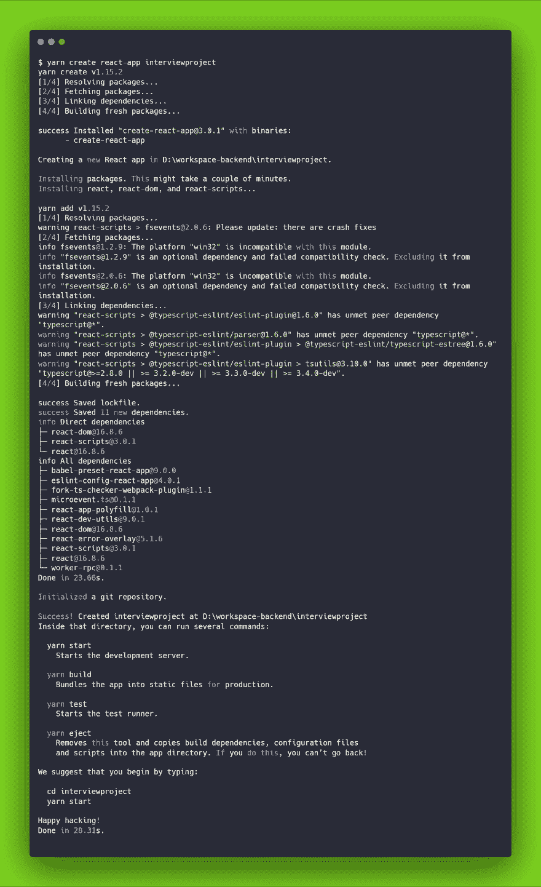
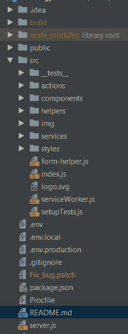

# 与 React 一起准备家庭评估面试。Js 和 JavaScript

> 原文：<https://dev.to/gabriela/prepare-for-a-home-assessment-interview-with-react-js-and-javascript-2nn1>

你好，这篇文章是关于我在面试过程中做一个 React.js home 项目之前要做的准备。我很快意识到，如果评估时间很紧，我会花一点时间从头开始创建和设置我的环境，我想让我的生活更轻松，每个人不都是这样吗？:)

首先，确保你已经准备好了 IDE，我已经用了好几个月的测试版，它们都有有效期。接下来，检查您将需要的技术堆栈(下面的命令是从终端运行的):

*   包管理器。决定使用或保留什么(yarn 或 npm ),因为从我的角度来看，在整个开发过程中一致地使用一个更干净、更容易
*   Node.js【安装或更新】[https://nodejs.org/en/](https://nodejs.org/en/)
    用于更新> $ yarn 添加全局节点

*   如果你想使用脸书的 create-react-app 项目(我总是这么做)，那么运行这个:> $ yarn add global create-react-app
    更多信息请查看官方文档:[https://Facebook . github . io/create-react-app/docs/documentation-intro](https://facebook.github.io/create-react-app/docs/documentation-intro)

*   是时候创建你的项目了。转到您希望此项目存在的文件夹并运行:> $ yarn create react-app interviewproject 这意味着我要创建一个名为“interview project”的新项目，并准备好从我选择的 IDE 中打开它。

一个创建-反应-应用程序所做的终端的标题。现在是时候从 IDE 中打开新创建的项目了。我使用 IntelliJ，为此我只需进入文件>打开，然后进入文件夹所在的位置，就这样。
为了启动项目，我也使用了终端，输入> yarn start，瞧，应用程序启动了，并在默认浏览器中打开:

本地:[http://localhost:3000/](http://localhost:3000/)
在您的网络上:[http://192 . 168 . 0 . 110:3000/](http://192.168.0.110:3000/)

在这种情况下，如果需要，我想添加版本控制，如果我想更改应用程序的名称，请检查 package.json，最重要的是，如果我知道我将需要，请添加额外的依赖项。这需要一点时间(取决于网络)，但是安装它们需要很长时间。

作为额外的东西，我喜欢创建我的文件结构，因为我发现它一直很有用，我知道每个人都有不同的风格，这是我的:

1.  src -> ' **tests** '保持' components '和' service '文件夹并保持相同的路径
2.  如果您在应用程序中使用 Redux，src--> ' actions '具有操作创建者文件
3.  src ->“组件”有许多用户故事文件夹，例如:“登录”、“设置”、“帖子”、“添加帖子”等。
4.  src-->“服务”包含所有使用过的服务(具有清晰的名称)
5.  src--> ' helpers '拥有所有助手。服务逻辑中使用的 js 文件
6.  src--> ' img '，' styles '顾名思义

这是我一个项目的开始，它让我觉得更有准备去完成任务。希望这也能帮助你。

你如何准备家庭项目评估？通过分享，我们都能学到东西。

快乐编码。