# 数据工程—A-Z[2019]的完整参考指南

> 原文：<https://dev.to/yan_parker/data-engineering-complete-reference-guide-from-a-z-2019-4jig>

# 1。数据工程—快速起步

科学家可以发现一颗新星，但他不能制造一颗。他将不得不请一位工程师来为他做这件事。 —戈登·林赛·格莱格

如今，每个人都想成为数据科学家。数据工程师呢？不要以为这是针对个人的，但事实上，数据科学家和他们所获得的数据质量一样好。由于公司在数据库和文本文件中以各种格式存储数据，数据工程师的主要职责是构建数据工作流、管道和 ETL 流程，为数据科学家准备和转换数据，从而提高他们的工作效率。

[https://www.youtube.com/embed/k22oAGEkObU](https://www.youtube.com/embed/k22oAGEkObU)

**更多关于这个话题:**
[数据工程 101 对于像我这样的傻瓜](https://towardsdatascience.com/data-engineering-101-for-dummies-like-me-cf6b9e89c2b4)
[数据工程:快速简单的定义](https://www.oreilly.com/ideas/data-engineering-a-quick-and-simple-definition)
[谁是数据工程师&如何成为数据工程师？](https://towardsdatascience.com/who-is-a-data-engineer-how-to-become-a-data-engineer-1167ddc12811)
[数据工程师:你忘记雇佣的数据科学家最好的朋友。](https://uwekorn.com/2019/02/13/data-engineers-the-best-friends-of-data-scientists-you-forgot.html)
[什么是数据工程师？](https://www.dataquest.io/blog/what-is-a-data-engineer/)

# 2。数据工程与数据科学

[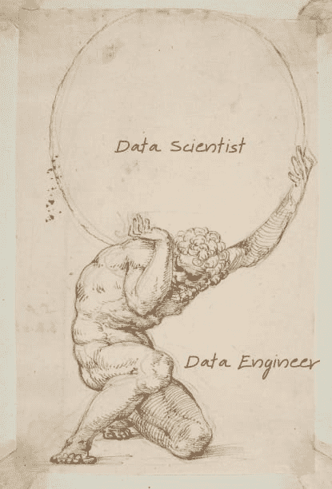](https://res.cloudinary.com/practicaldev/image/fetch/s--N2VL7WYZ--/c_limit%2Cf_auto%2Cfl_progressive%2Cq_auto%2Cw_880/https://miro.medium.com/max/415/1%2AXfG2bNwZZdQRzZ1kvpoVxw.png) 
*图片来源:[https://Twitter . com/jesset Anderson/status/1115618459725979649](https://twitter.com/jessetanderson/status/1115618459725979649)T7】*

“数据工程师是构建数据管道的管道工，而数据科学家是画家和故事讲述者，给原本静态的实体赋予意义。”Urthecast 的大卫·比安科指出。

这两个位置不能互换。然而，当涉及到技能和责任时，数据工程师和数据科学家之间有很大的重叠。主要区别在于它们关注数据利用的不同方面。

 
*图片来源:数据科学家和数据工程师的核心能力及其重叠技能。杰西·安德森[@杰西·安德森](https://dev.to/jessetanderson)和大数据研究所@bdi_oxford* 的插图

简而言之，数据工程师专注于为数据生成构建基础设施和架构，而数据科学家则专注于对生成的数据进行高等数学和统计分析。

技能组合的差异转化为双方使用的语言、工具和软件的差异。下面是由 [DataCamp](https://www.datacamp.com/community/blog/data-scientist-vs-data-engineer) 提供的一个很好的概述，包括商业和开源替代方案以及重叠区域。

[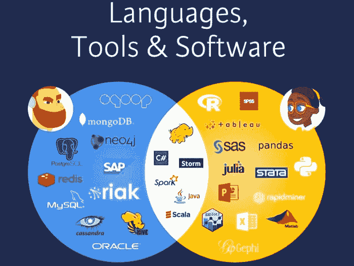](https://res.cloudinary.com/practicaldev/image/fetch/s--i2VdgH5b--/c_limit%2Cf_auto%2Cfl_progressive%2Cq_auto%2Cw_880/https://miro.medium.com/max/700/1%2AWEEyyerDibCg9Si2w-Yl8w.png) 
*图片来源:[https://www . data camp . com/community/blog/data-scientist-vs-data-engineer](https://www.datacamp.com/community/blog/data-scientist-vs-data-engineer)T7】*

如果你需要数据工程师和数据科学家之间的另一种解释，看看由 [*莫妮卡·罗加蒂*](https://hackernoon.com/the-ai-hierarchy-of-needs-18f111fcc007) 撰写的广泛共享的人工智能需求层次。

数据工程涵盖前 2-3 个阶段，而数据科学涵盖第 4 和第 5 个阶段。

[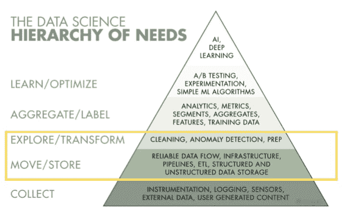](https://res.cloudinary.com/practicaldev/image/fetch/s--EL1-JHge--/c_limit%2Cf_auto%2Cfl_progressive%2Cq_auto%2Cw_880/https://miro.medium.com/max/700/1%2AGZOO60G4Y9NGMuahEe1I7A.png) 
*基于[https://hacker noon . com/the-ai-hierarchy-of-needs-18f 111 FCC 007](https://hackernoon.com/the-ai-hierarchy-of-needs-18f111fcc007)*

数据工程师和数据科学家一样重要，但似乎不太明显，因为他们倾向于远离最终的分析产品。根据 [Dataquest](https://www.dataquest.io/blog/what-is-a-data-engineer/) 的说法，这就像赛车制造商和赛车手一样。

[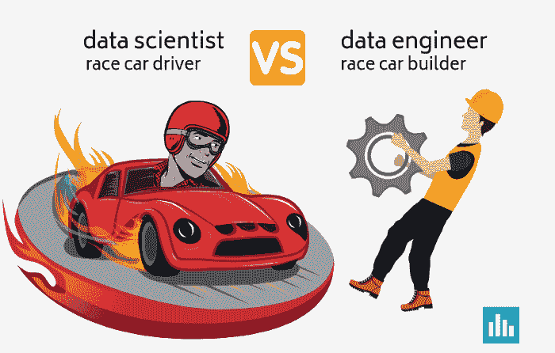](https://res.cloudinary.com/practicaldev/image/fetch/s--j2ZtSzyE--/c_limit%2Cf_auto%2Cfl_progressive%2Cq_auto%2Cw_880/https://miro.medium.com/max/700/1%2AOy1IgzKpM-ROXWfZk7QtXg.png)

**更多关于这个话题:**
[数据科学家 vs 数据工程师](https://www.datacamp.com/community/blog/data-scientist-vs-data-engineer)
[数据工程师 vs 数据科学家](https://towardsdatascience.com/data-engineer-vs-data-scientist-bc8dab5ac124)
[为什么数据科学家不是数据工程师](https://www.oreilly.com/ideas/why-a-data-scientist-is-not-a-data-engineer)
[数据工程师 VS 数据科学家](https://www.oreilly.com/ideas/data-engineers-vs-data-scientists)

# 3。数据工程技能

 
*图片来源:[https://I . pinimg . com/originals/5e/23/93/5e 23938 b 01 f 90 a 79 EB 73 C3 e 69 f 446d 64 . jpg](https://i.pinimg.com/originals/5e/23/93/5e23938b01f90a79eb73c3e69f446d64.jpg)*

数据工程师是为数据科学家分析“大数据”基础设施做准备的数据专业人员。他们设计、构建、集成来自各种资源的数据，然后编写复杂的查询，确保数据易于访问、运行顺畅，他们的目标是优化公司大数据生态系统的性能。

这就是为什么一个[优秀的数据工程师](https://dzone.com/articles/4-traits-of-outstanding-data-engineers)——除了完成这项工作所必需的工具和语言——首先应该擅长:

✔优秀的问题解决者
✔多才多艺
✔注重团队合作
✔充满好奇心，永不停止学习

现在，让我们来看看数据工程师需要掌握的**八大技能**:

[https://www.youtube.com/embed/Pym0oriyQgM](https://www.youtube.com/embed/Pym0oriyQgM)

**1。数据架构的工具和组件:**具备为公司构建复杂数据库系统的知识。该术语还指处理静态数据、动态数据、数据集的过程，以及它们与依赖数据的应用程序和过程的关系。

**2。大数据框架/基于 Hadoop 的技术:**在 [Hadoop 生态系统中有几个工具](https://hadoop.apache.org/)满足不同目的&不同背景的专业人士: [HDFS](https://hadoop.apache.org/docs/r1.2.1/hdfs_design.html) (Hadoop 分布式文件系统) [YARN](https://yarnpkg.com/en/) ， [MapReduce](https://hadoop.apache.org/docs/r1.2.1/mapred_tutorial.html) ， [PIG](https://pig.apache.org/) & [HIVE](https://hive.apache.org/) ，[Flume](https://flume.apache.org/)&[Sqoop](https://sqoop.apache.org/)，

[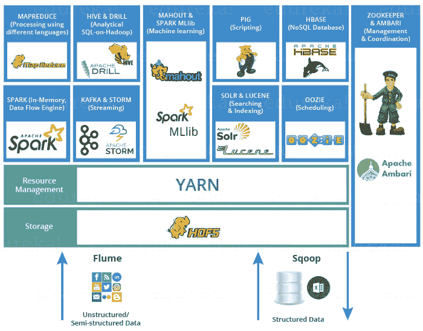](https://res.cloudinary.com/practicaldev/image/fetch/s--Jq3xwCQx--/c_limit%2Cf_auto%2Cfl_progressive%2Cq_auto%2Cw_880/https://miro.medium.com/max/700/1%2A4tyAmTnvmvCG0xl9PmSLDg.png) 
*图片来源:[https://www.edureka.co/blog/big-data-engineer-skills/](https://www.edureka.co/blog/big-data-engineer-skills/)*

**3。实时处理框架:** [Apache Spark](https://spark.apache.org/) —一个分布式实时处理框架，可以很容易地)利用 HDFS 与 Hadoop 集成。

**4。厚重、深入的数据库知识——SQL**(如 [MySQL](https://www.mysql.com/) ) **和 NoSQL** (如 [HBase](https://hbase.apache.org/) 、 [Cassandra](http://cassandra.apache.org/) 和 [MongoDB](https://www.mongodb.com/) ):结构化查询语言用于结构化、操作&管理数据库中存储的数据，而 NoSQL 数据库可以根据应用需求，以快速迭代和敏捷的结构存储大量结构化、半结构化&非结构化数据。

**5。编码技能:** Python，C/C++，Java，Perl，Golang，或者其他这样的语言。

**6。ETL/数据仓库解决方案**(例如 [Talend](https://www.talend.com/) ， [Informatica](https://www.informatica.com/#fbid=m8rgH3w_yPI) ):当管理来自异构数据源的大量数据时，您需要应用 ETL(提取转换负载)。数据仓库帮助您从一个或多个来源聚集非结构化数据，以便进行比较和分析，从而获得更好的业务。

7 .**。机器学习:**虽然机器学习在技术上是分配给数据科学家的事情，但对如何使用统计分析和数据建模将数据投入使用有一定程度的理解是一个巨大的优势。

**8。扎实的操作系统知识:**除了 UNIX、Linux、Solaris 或 MS Windows 等操作系统方面的广泛知识外，这些知识也非常有用，因为大多数工具都基于这些系统。

**更多关于这个话题:**
[数据工程入门指南](https://medium.com/@rchang/a-beginners-guide-to-data-engineering-part-i-4227c5c457d7) —第一、二、三部分
[大数据工程师技能:成为大数据工程师所需的技能](https://www.edureka.co/blog/big-data-engineer-skills/)
[奥莱利的一套免费数据工程电子书](https://www.oreilly.com/data/free/)

# 4。我的团队何时需要数据工程师？

特里斯坦·汉迪 [*@jthandy*](https://twitter.com/jthandy) 创始人& CEO @ Fishtown Analytics 表示，数据工程师在创业数据团队中的角色正在快速变化，这影响了数据工程师的招聘顺序。以前，我们首先需要数据工程师，因为如果没有数据平台，数据分析师和科学家就没有工作可做。如今，数据分析师和科学家应该使用现成的工具自助构建他们的数据堆栈的第一个版本。
Handy 的建议是，当你开始达到规模点时，雇佣数据工程师:

[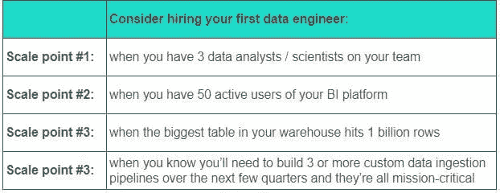](https://res.cloudinary.com/practicaldev/image/fetch/s--rSJW-Pa0--/c_limit%2Cf_auto%2Cfl_progressive%2Cq_auto%2Cw_880/https://miro.medium.com/max/622/1%2ApEjmBoCIpeE-Dvq_er8a_g.jpeg) 
*基于[https://blog . fishtownanalytics . com/does-my-startup-data-team-need-a-data-engineer-b 6 F4 d 68 D7 da 9](https://blog.fishtownanalytics.com/does-my-startup-data-team-need-a-data-engineer-b6f4d68d7da9)*

# 5。构建数据团队

 
*基于[https://marketoonist.com/2014/01/big-data.html](https://marketoonist.com/2014/01/big-data.html)*

数据驱动团队由数据工程师、数据科学家和数据分析师组成。虽然这些头衔听起来相似，但每个角色都侧重于数据利用的不同方面。认识到这些角色如何相互补充是很重要的。让数据科学家做数据工程师的工作，反之亦然，这是对宝贵资源的浪费。此外，找到一个独角兽——一个既精通数据工程又精通数据科学的人似乎是不可能的。

> 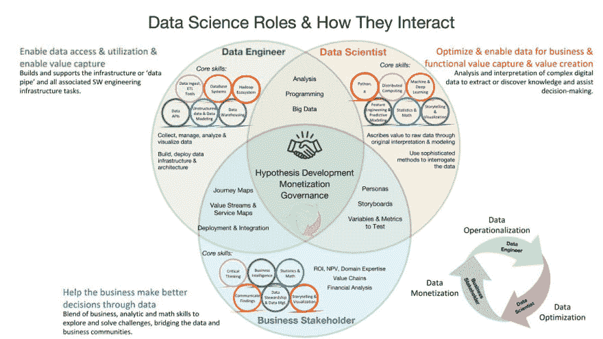KD nuggets@ KD nuggets打造你的数据科学团队的制胜之策[buff.ly/2NXhazc](https://t.co/N88C0Fo8Dt)15:20PM-01 2018 年 11 月4496【T36】

*基思·麦纽提*[*@ dr _ keithmcnulty*](http://twitter.com/dr_keithmcnulty)分享他的经验，用 [**6 个步骤描述了打造一个分析团队**](https://towardsdatascience.com/how-to-build-an-analytics-team-for-impact-in-an-organization-21bb05925587) 的过程。这些步骤建议团队应该如何运作和构建，需要什么技能，以及什么类型的档案和技能应该进入团队。

[*迈克尔·卡明斯基*](https://www.kdnuggets.com/2019/02/analytics-engineer-data-team.html) 让我们注意到，数据工程师、分析师和数据科学家的角色和职责正在发生变化。

数据工程师之前:

数据工程师:传统上，这是一项将字节从 A 点移动到 B 点的“管道”工作，通常被误称为“ETL”。他们关心的是为接收和存储数据构建健壮且可扩展的基础设施，但通常不关心“业务逻辑”——一旦数据进入仓库，就不再是他们的问题了。

当今的数据工程师:

数据工程师:仍然负责数据基础设施和管道代码，但是这个团队现在比过去要小得多。许多公司在开始时只需要使用承包商和顾问就可以了，他们可能只需要一两名数据工程师来“填补空白”,他们无法从现成的解决方案中购买到这些东西。

**关于这个话题的更多内容:**
[如何建立一个大数据工程团队](https://www.forbes.com/sites/adrianbridgwater/2017/04/24/how-to-build-a-big-data-engineering-team/#3c1131e95a15)
[如何建立一个在组织中产生影响的分析团队](https://towardsdatascience.com/how-to-build-an-analytics-team-for-impact-in-an-organization-21bb05925587)
[建立数据科学团队:你需要知道什么？](https://opendatascience.com/building-data-science-teams-what-do-you-need-to-know/)

# 6。数据工程师也应该是数据分析师吗？

来自 Intermix.io 的 Lars Kamp 在 https://qr.ae/TWnwFd 的 Quora 上给了我们他的答案。

# 7。数据工程职位描述

 
*图片来源:[https://www . equest . com/漫画/卡通-2013/感谢-facebook/](https://www.equest.com/cartoons/cartoons-2013/thank-you-facebook/)*

无论你是一个有抱负的数据工程师还是正在寻找这样的人，使用好的例子总是一个好习惯。根据 Toptal *的说法，数据工程师角色的实际定义各不相同，并且经常与数据科学家角色*混淆。他们分享了他们的 [**大数据工程师——职位描述和广告模板**](https://www.toptal.com/big-data/job-description) ，你可以使用它们来创建职位公告或简单地查看该职位通常需要的技能。你可以在 [**Glassdoor**](https://www.glassdoor.com/Job-Descriptions/Data-Engineer.htm) 找到另一个模板。

然而，以下是数据工程**角色通常对**的要求:

构建、测试和维护最佳数据管道架构
组装大型复杂数据集以满足功能性和非功能性业务需求
构建最佳数据提取、转换和加载(利用 AWS 和 SQL 技术从各种来源)所需的基础设施
识别、设计、 实施和增强内部流程
自动化手动流程
优化数据交付
重新设计基础设施以实现更大的可扩展性
构建利用数据管道提供可操作见解的分析工具
与各部门的所有利益相关方合作
协助数据科学家构建和优化产品

在筛选数据团队中的候选人**时，另一个有用的工具可能是 Hackerrank 的 [**【清单】筛选数据科学家、分析师和工程师。**](https://blog.hackerrank.com/checklist-screening-data-scientists-vs-analysts-vs-engineers/?utm_medium=content&utm_source=blog&utm_campaign=checklist&utm_content=backendassessment) “数据分析师、数据科学家和数据工程师之间的细微差别初看起来可能很细微，但在从数据中获取和传达有意义的见解方面，他们都扮演着不同的角色”。该清单很好地概述了每个角色的期望。**

> 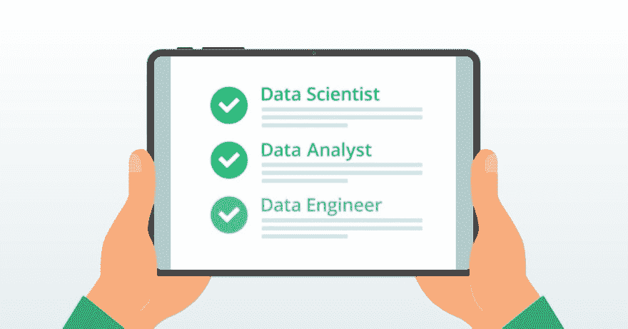hacker rank@ hacker rank了解数据科学家、分析师和工程师的区别【包含可下载清单】:[hr.gs/alm8p4](https://t.co/mkHAhfktuX)
> 
> [#数据](https://twitter.com/hashtag/data)科学家[#数据](https://twitter.com/hashtag/data)[#招聘](https://twitter.com/hashtag/recruiting)[#招聘](https://twitter.com/hashtag/hiring)11

# 8。数据工程工作

[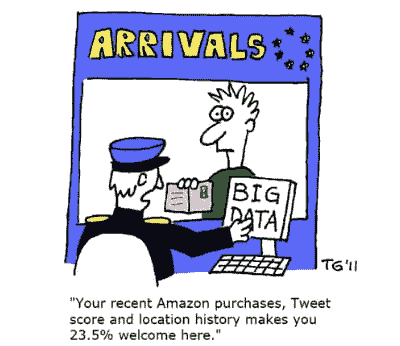](https://res.cloudinary.com/practicaldev/image/fetch/s--C9YxSEiN--/c_limit%2Cf_auto%2Cfl_progressive%2Cq_auto%2Cw_880/https://miro.medium.com/max/400/1%2A4ZpB7nxMnFjMbQayLyua7Q.png) 
*图片来源:[https://vublsts . WordPress . com/2016/09/28/any ware-privacy-and-location-data-in-the-era-of-machine-learning/](https://vublsts.wordpress.com/2016/09/28/anyware-privacy-and-location-data-in-the-era-of-machine-learning/)*

虽然《哈佛商业评论》可能已经宣布[“数据科学家:21 世纪最性感的工作”，](https://hbr.org/2012/10/data-scientist-the-sexiest-job-of-the-21st-century)是数据工程团队让他们脱颖而出。如果没有数据工程的支持，性感的数据科学家工作将很快退化为类似清道夫的性感工作。— [比尔·施马尔佐](https://www.linkedin.com/in/schmarzo/)、T5、@施马尔佐，日立万塔拉首席技术官。

由于数据工程师的需求大于供给，在这个领域找工作不成问题。像 [Indeed](http://www.indeed.com/q-Data-Engineer-jobs.html) 、 [Linkedin](https://www.linkedin.com/jobs/data-engineer-jobs/) 、 [Glassdoor](http://www.glassdoor.com/Job/data-engineer-jobs-SRCH_KO0,13.htm) 、 [Datajobs](https://datajobs.com/Data-Engineer-Jobs) 、 [Ziprecruiter](http://www.ziprecruiter.com/Jobs/Remote-Data-Engineer) 、 [Angel](https://angel.co/) 、 [Stackoverflow](https://stackoverflow.com/jobs) 等网站上有数百份工作可以向下滚动。

但是比在数据工程领域找工作更大的问题是如何在成长中的初创公司找到候选人。他们中的一些人仍然需要雇用现场员工，*。然而，在伦敦、纽约、柏林这样的大城市招聘很难，因为对于同样有限的人才库，也有竞争激烈的公司拥有巨额预算。即使你最终设法雇佣了优秀的技术人员，他们也会成为其他疯狂寻找开发人员的饥渴创业公司的目标。如果你在产品开发的高峰期失去了你的工程师怎么办？投资者和你都不会高兴。*我鼓励你阅读整篇文章作者 [*Rob Renner*](https://medium.com/@JavaShopPoland) 来自[*@ JavaShopPoland*](https://twitter.com/JavaShopPoland):[*为什么 Fintech 创业公司要在波兰建立开发团队？*](https://medium.com/javashop/why-fintech-startups-should-move-development-to-poland-b0aa5e9c62ba) 连同这个: [*数据工程师都在，能看到吗？*](https://towardsdatascience.com/data-engineers-are-there-did-you-see-them-9b6452e92b23) 来自 Moonshots 的 Guillaume Payen。

# 9。数据工程工资

[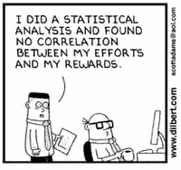](https://res.cloudinary.com/practicaldev/image/fetch/s--_gAdPhNQ--/c_limit%2Cf_auto%2Cfl_progressive%2Cq_auto%2Cw_880/https://miro.medium.com/max/200/1%2AuTfPMKjwgF3aeUXMWeDeAw.png) 
*形象[https://pl.pinterest.com/pin/842665780247850785/](https://pl.pinterest.com/pin/842665780247850785/)*

数据工程师的工资取决于角色类型、技能、经验和地点等变量。根据 Glassdoor 的数据，数据工程师的全球平均工资约为**每年 116，591 美元，而根据 Payscale 的同一指数等于[**【91，845 美元每年**](https://www.payscale.com/research/US/Job=Data_Engineer/Salary) 。**

 **根据 Apache Spark、Hadoop、AWS 和 ETL 中的 [Payscale](https://www.payscale.com/research/US/Job=Data_Engineer/Salary) 技能，薪酬高于平均水平。薪酬低于市场水平的技能包括数据分析和 SQL。

[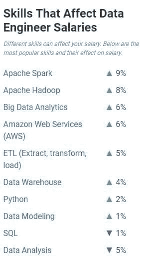](https://res.cloudinary.com/practicaldev/image/fetch/s--Vgizp8SA--/c_limit%2Cf_auto%2Cfl_progressive%2Cq_auto%2Cw_880/https://miro.medium.com/max/295/1%2AULURARevZ7j-P3kuhIEBTg.jpeg) 
*来源:payscale.com*

下面是几个地方的数据工程师平均年薪的简要概述:

[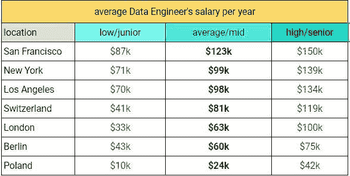](https://res.cloudinary.com/practicaldev/image/fetch/s--yiJngLpj--/c_limit%2Cf_auto%2Cfl_progressive%2Cq_auto%2Cw_880/https://miro.medium.com/max/587/1%2AZjJ5xY58PJvrLBAAcBxCBQ.jpeg) 
*资料来源:基于 payscale.com 和 neuvoo.ch*

# 10。数据工程面试问题

如果你正在寻找一份与数据工程相关的工作，你需要准备好在会议或电话中可能会遇到的面试问题。

我们推荐了几个自学页面，你一定要去看看，为这次谈话做准备。

1.  [数据工程师面试问题](https://www.educba.com/data-engineer-interview-questions/)—2019 年更新的十大数据工程师面试问题及答案列表

2.  [乘坐大数据工程宣传列车旅行时应该知道的事情](https://www.kdnuggets.com/2018/10/big-data-engineering-hype-train.html)—*Wojtek pitu za*[T5】@ krever 01](https://twitter.com/Krever01)真正有趣的文章

3.  [数据工程师面试研究指南](https://www.coriers.com/the-interview-study-guide-for-data-engineers/) —带有实用的可下载数据工程面试清单

4.  [脸书数据工程师面试问题](https://www.glassdoor.com/Interview/Facebook-Data-Engineer-Interview-Questions-EI_IE40772.0,8_KO9,22.htm) & [亚马逊数据工程师面试问题](https://www.glassdoor.ie/Interview/Amazon-Data-Engineer-Interview-Questions-EI_IE6036.0,6_KO7,20.htm) —涵盖脸书和亚马逊数据工程师面试问题的真实例子

5.  [30+个最佳数据工程师面试问题获得](https://www.algrim.co/posts/154-data-engineer-interview-questions)——另一套 33 问&答

6.  Andreas Kretz 的 1001 个数据工程面试问题也可以在 Github 的 PDF 文档中找到。

[https://www.youtube.com/embed/WbqRH2r3N40](https://www.youtube.com/embed/WbqRH2r3N40)

# 11。数据工程认证

 
*图像来源:[:https://un flash . com/photos/tambr 4 okv 4](https://unsplash.com/photos/TamMbr4okv4)*

如果你正在寻找数据工程中最受欢迎的证书，看看这个由托尔·奥拉夫斯鲁德、T2 @托罗拉夫斯鲁德撰写的令人敬畏的列表。他全面概述了 14 大认证，包括价格、托管组织以及如何准备。

以下是**前 14 名数据工程师和数据架构师认证:**

1. [*亚马逊网络服务(AWS)认证大数据—专业*](https://aws.amazon.com/certification/certified-big-data-specialty/)

2.[*cloud era Certified Associate(CCA)Spark 和 Hadoop 开发者*](https://www.cloudera.com/about/training/certification/cca-spark.html)

3. [*Cloudera 认证专家(CCP):数据工程师*](https://www.cloudera.com/about/training/certification/ccp-data-engineer.html)

4. [*谷歌专业数据工程师*](https://cloud.google.com/certification/data-engineer)

5. [*HDP 阿帕奇 Spark 开发商*](https://www.cloudera.com/about/training/certification/hdp-cert-spark-dev.html)

6. [*HDP 认证开发者大数据 Hadoop*](https://www.cloudera.com/about/training/certification/hdp-cert-dev.html)

7.

 *8. [*IBM 认证数据架构师—大数据*](https://www.ibm.com/certify/cert?id=50001701)

9. [*IBM 认证数据工程师—大数据*](https://www.ibm.com/certify/cert?id=50001501)

10. [*MapR 认证 Hadoop 开发者 1.0*](https://mapr.com/training/certification/)

11. [*MapR 认证 Spark 开发者 2.1*](https://mapr.com/training/certification/)

12. [*Oracle 商业智能基础套件 11 认证实施专家*](https://education.oracle.com/oracle-business-intelligence-foundation-suite-11g-certified-implementation-specialist/trackp_166)

13. [*SAS 认证大数据专家*](https://www.sas.com/en_us/training/academy-data-science/big-data-certification.html)

14. [*SAS 认证数据科学家使用 SAS 9*](https://www.sas.com/en_us/certification/credentials/advanced-analytics/data-scientist.html)

来源: [*前 14 名数据工程师和数据架构师认证*](https://www.cio.com/article/3395879/top-14-data-engineer-and-data-architect-certifications.html)

**关于此主题的更多信息:**
[分析、大数据、数据科学、机器学习方面的证书和认证](https://www.kdnuggets.com/education/analytics-data-mining-certificates.html)

# 12。数据工程[在线]课程

 
*图片来源:canva.com*

有许多在线课程提供这一领域的重要培训:
[Udemy](https://www.udemy.com/courses/search/?q=data%20engineering&src=ukw)
[Coursera](https://www.coursera.org/)
[data quest](https://www.dataquest.io/)
[EdX](https://www.edx.org/course/introduction-apache-spark-uc-berkeleyx-cs105x)
[Memrise](https://www.memrise.com/course/584043/r-for-data-analysis)
[data camp](https://www.datacamp.com/)
[enving](http://www.galvanize.com/)

一些网站，如 [DataCamp](https://www.datacamp.com/) 、 [Memrise](https://www.memrise.com/course/584043/r-for-data-analysis) 和 [EdX](https://www.edx.org/course/introduction-apache-spark-uc-berkeleyx-cs105x) 主要专注于数据科学和工程，而其他网站，如 [Udemy](https://www.udemy.com/courses/search/?q=data%20engineering&src=ukw) 和[enving](http://www.galvanize.com/)，范围更广。你对课程提供商的选择将取决于你的需求、知识水平和你的钱包大小。

小贴士:虽然一门课程可以帮助你扩大知识面，但它可能只是给你一个证书或文凭，而不是一个证明。因此，不要将课程视为实际认证或认可文凭颁发的替代。

**更多关于此话题:**
[学习数据工程:我最喜欢的免费资源](https://hackernoon.com/learn-data-engineering-my-favorite-free-resources-52a29ab999b)
[想成为一名数据工程师？这里有一个全面的资源列表，可以开始使用](https://www.analyticsvidhya.com/blog/2018/11/data-engineer-comprehensive-list-resources-get-started/)

# 13。数据工程播客

不断的创新可以压倒任何人，但在技术领域，如果你不学习，你就会被淘汰。因此，要了解数据世界的最新动态，请尝试收听以下 5 种播客资源:

1.[数据怀疑论者](https://www.stitcher.com/podcast/data-skeptic-podcast/the-data-skeptic-podcast)
2。[奥赖利的数据显示](https://www.stitcher.com/podcast/oreilly-media-2/the-oreilly-data-show-podcast?refid=stpr)3 日 T5。[数字分析功率小时](https://www.stitcher.com/podcast/httpanalyticshourlibsyncom/the-digital-analytics-power-hour)
4。[数据工程播客](https://www.dataengineeringpodcast.com/)
5。[数据故事](https://www.stitcher.com/podcast/data-stories-podcast/data-stories)

然而，如果你更喜欢看和听，而不仅仅是听，请前往关于人工智能、分析、大数据、数据科学的[/网络研讨会，KdNuggets 的&机器学习](https://www.kdnuggets.com/webcasts/index.html)——网络研讨会的最新列表，或者观看托马斯·汉森的 YouTube 频道 。

# 14。数据工程案例研究

关于这一点，Andreas Kretz 在他的数据工程食谱 中有一个由 [*创建的综合案例研究集。在这里，你会发现很多公司的例子，比如 Twitter、网飞、亚马逊、优步、Airbnb，以及许多其他知名企业。其中一些还可以在 Youtube 上看到。下载*](https://github.com/andkret/Cookbook) *[*PDF*](https://github.com/andkret/Cookbook) ，按照内容列表找到所需资源。*

> 柯克通天@柯克通天【免费 PDF 电子书】
> 数据工程食谱—掌握[#数据科学](https://twitter.com/hashtag/DataScience)—[bit.ly/2XX0n0l](https://t.co/qbSDsEJSIu)作者:[@ andreaskayy](https://twitter.com/andreaskayy)
> ———
> [# BigData](https://twitter.com/hashtag/BigData)[#数据工程](https://twitter.com/hashtag/DataEngineering)[#数据科学家](https://twitter.com/hashtag/DataScientists)[#机器学习](https://twitter.com/hashtag/MachineLearning)[#云](https://twitter.com/hashtag/Cloud)[#容器](https://twitter.com/hashtag/Containers) [#Docker](https://twitter.com/hashtag/Docker)

# 15。2019 年数据工程会议

 
*图片来源:[https://twitter.com/Khanoisseur/status/556881894366003200?s = 20](https://twitter.com/Khanoisseur/status/556881894366003200?s=20)T7】*

[KDnuggets](https://www.kdnuggets.com/) ，大数据和数据科学领域最大的网站之一，为我们提供了一个完整的最新列表，列出了在美洲、欧洲和亚洲举行的关于人工智能、分析、大数据、数据挖掘、数据科学、&机器学习 的 [*会议。*](https://www.kdnuggets.com/meetings/index.html#.XTCk5DZqE-A.twitter)

如果发生这种情况，你会发现更广泛的会议列表，只要把它放在评论中。

# 16。十大数据工程错误

[https://www.youtube.com/embed/Hyhwem1Gyjo](https://www.youtube.com/embed/Hyhwem1Gyjo)

其他建议？

# 17。推荐资源

[*关于人工智能、分析、大数据、数据科学、机器学习的热门活跃博客——更新*](https://www.kdnuggets.com/2019/01/active-blogs-ai-analytics-data-science.html)

[*AI 终极指南，数据科学&机器学习，文章，备忘单，教程尽在一处*](https://www.linkedin.com/pulse/all-cheatsheets-one-place-vipul-patel/)

[*数据科学—小抄/数据工程*](https://github.com/abhat222/Data-Science--Cheat-Sheet/tree/master/Data%20Engineering)

[*数据科学 101*](https://101.datascience.community/)

# 数据只是开始…

 
*图片来源:[https://everything funny . org/funny-cartoons/customer-who-buyed-this](https://everythingfunny.org/funny-cartoons/customer-who-bought-this)*

最初发布于媒体:[走向数据科学:数据工程完全参考指南](https://towardsdatascience.com/data-engineering-complete-reference-guide-from-a-z-2019-852c308b15ed)***