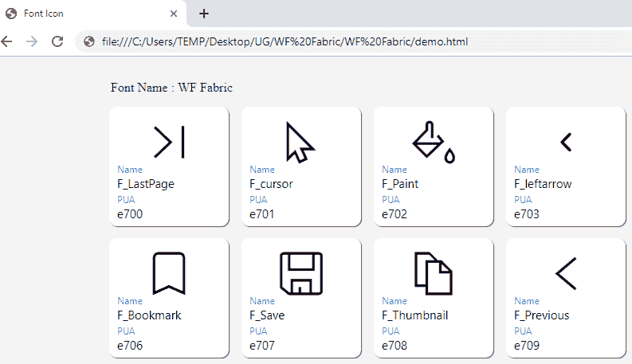
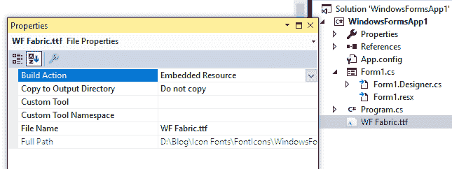
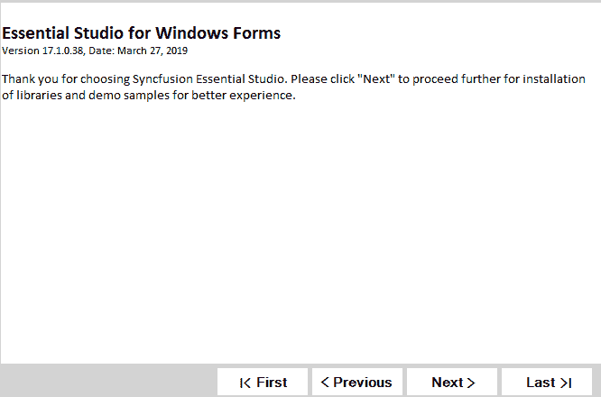

# 如何在 WinForms (Windows 窗体)应用程序中使用图标字体

> 原文：<https://dev.to/syncfusion/how-to-use-icon-fonts-in-winforms-windows-forms-applications-5cge>

图标字体包含符号，而不是数字和字母。与其他图像格式相比，图标字体在网络技术中占据主导地位。由于它们是矢量图形，用户可以在不损失质量的情况下放大和缩小它们。此外，它们体积小，易于装载。唯一的限制是单个图标只能用一种颜色绘制。

大家经常想到的问题是，“图标字体可以用在 WinForms 这种桌面应用中吗？”是的，可以。这篇博客说明了这一点。

请记住，在 DPI 的情况下，我们需要做的只是改变字体大小。我们不必担心为不同的 DPI 缩放比例维护不同大小的图像。

如何添加和绘制图标字体
系统中通常可用的字体，如 Arial 和 Times New Roman，可能没有我们在应用程序中需要使用的图标。有许多在线和离线应用程序支持创建图标字体。一个名为[地铁工作室](https://www.syncfusion.com/downloads/metrostudio)的离线工具由 [Syncfusion](https://www.syncfusion.com/) 免费提供。

<figure>

为了进行演示，我们创建了一个. ttf 文件，其中包含一个名为 **WF Fabric** 的字体系列。下图显示了生成的图标。
T3T5】

<figcaption>Icon Fonts from WF Fabric.ttf File</figcaption>

</figure>

**注:**上图所示的 Unicode(e700，e701 等。)表示在应用程序中绘制时的相应字形。

在 WinForms 应用程序中包含 **WF Fabric.ttf** 文件，并在属性对话框中将其**构建动作**标记为**嵌入资源**。

<figure>[](https://res.cloudinary.com/practicaldev/image/fetch/s--lSg42iu1--/c_limit%2Cf_auto%2Cfl_progressive%2Cq_auto%2Cw_880/https://blog.syncfusion.com/wp-content/uploads/2019/06/WF-Fabric.ttf-file-marked-as-embedded-resource.png)

<figcaption>【WF】fabric . TTF 文件标记为嵌入资源</figcaption>

</figure>

在窗体初始化过程中，包含在系统内存中注册图标字体的代码。像其他字体(Arial，Times New Roman 等。) **WF 面料**也会被注册到系统内存中的**控制面板\所有控制面板项目\字体**。

```
public Form1()
{
    InitializeComponent();
    this.Paint += Form1_Paint;
}

private void Form1_Paint(object sender, PaintEventArgs e)
{
    PrivateFontCollection pfc = new PrivateFontCollection();
    //Extracting icon fonts from the WF Fabric.ttf file and adding into system memory.
    Stream fontAsStream = this.GetType().Assembly.GetManifestResourceStream("WindowsFormsApp1.WF Fabric.ttf");
    byte[] fontAsByte = new byte[fontAsStream.Length];
    fontAsStream.Read(fontAsByte, 0, (int)fontAsStream.Length);
    fontAsStream.Close();
    IntPtr memPointer = System.Runtime.InteropServices.Marshal.AllocHGlobal(System.Runtime.InteropServices.Marshal.SizeOf(typeof(byte)) * fontAsByte.Length);
    System.Runtime.InteropServices.Marshal.Copy(fontAsByte, 0, memPointer, fontAsByte.Length);
    pfc.AddMemoryFont(memPointer, fontAsByte.Length);
} 
```

[PrivateFontCollection](https://docs.microsoft.com/en-us/dotnet/framework/winforms/advanced/how-to-create-a-private-font-collection) 类的 **pfc** 实例通过在系统内存中保存私有或自定义图标字体来发挥重要作用。在 **pfc** 对象中的**系列**属性将保存字体系列名称。如前所述，我们创建了 **WF Fabric.ttf** ，字体系列名称为 **WF Fabric** 。

现在创建一个枚举，其中所有图标字体都有适当的名称，并为其 Unicode 分配前缀 **0x** 。因此，无论你在哪里使用图标字体绘制，Unicode 都将被转换为字符串，并作为参数传递给 **DrawString** 方法。

```
public partial class Form1 : Form
{
    public Form1()
    {
        InitializeComponent();
        this.Paint += Form1_Paint;
    }

    private void Form1_Paint(object sender, PaintEventArgs e)
    {
        PrivateFontCollection pfc = new PrivateFontCollection();
        //Extracting icon fonts from the WF Fabric.ttf file and inserting into system memory.
        Stream fontAsStream = this.GetType().Assembly.GetManifestResourceStream("WindowsFormsApp1.WF Fabric.ttf");
        byte[] fontAsByte = new byte[fontAsStream.Length];
        fontAsStream.Read(fontAsByte, 0, (int)fontAsStream.Length);
        fontAsStream.Close();
        IntPtr memPointer = System.Runtime.InteropServices.Marshal.AllocHGlobal(System.Runtime.InteropServices.Marshal.SizeOf(typeof(byte)) * fontAsByte.Length);
        System.Runtime.InteropServices.Marshal.Copy(fontAsByte, 0, memPointer, fontAsByte.Length);
        pfc.AddMemoryFont(memPointer, fontAsByte.Length);

        //Icon font's unicode "0xe700" is converted to string and drawn using e.Graphics with WF Fabric set as font family. 
        string iconChar = char.ConvertFromUtf32(IconFont.LastArrow);
        Font iconFont = new Font(pfc.Families[0], 18.5f, FontStyle.Bold);
        e.Graphics.DrawString(iconChar, iconFont, new SolidBrush(Color.Orange), new PointF(10, 10));

        //Icon font's unicode "0xe710" is converted to string and drawn using e.Graphics with WF Fabric set as font family.
        iconChar = char.ConvertFromUtf32(IconFont.Plus);
        e.Graphics.DrawString(iconChar, iconFont, new SolidBrush(Color.Red), new PointF(40, 40));

        //Icon font's unicode "0xe720" is converted to string and drawn using e.Graphics with WF Fabric set as font family.
        iconChar = char.ConvertFromUtf32(IconFont.Paint);
        e.Graphics.DrawString(iconChar, iconFont, new SolidBrush(Color.Green), new PointF(70, 70));
    }
}

public static class IconFont
{
    //0xe700, 0xe710, 0xe720 - are icon font's unicode from the WF Fabric.ttf file.
    public static int LastArrow = 0xe700;
    public static int Plus = 0xe710;
    public static int Paint = 0xe720;
} 
```

现在是时候在现实世界中应用图标字体了。我们准备了一个简单的演示程序，显示了在自定义按钮控件上绘制的第一页、最后一页、上一页和下一页的导航图标。

<figure>

**参考样本链接:**【https://github.com/SyncfusionExamples/button-with-font-icon】
[](https://res.cloudinary.com/practicaldev/image/fetch/s--jSjp07wI--/c_limit%2Cf_auto%2Cfl_progressive%2Cq_auto%2Cw_880/https://blog.syncfusion.com/wp-content/uploads/2019/06/Custom-button-control-with-icon-font-and-text-drawn-inside.png)

<figcaption>Custom button control with icon font and text drawn inside</figcaption>

</figure>

使用图标字体的优点是:

1.  改进了所有字体大小的渲染质量。
2.  通过改变颜色，为不同的主题和皮肤重复使用单一的图标字体。
3.  通过不必维持不同的图像尺寸来缩小应用程序的尺寸。
4.  添加多种图标字体，并将图标字体与字母、数字和符号连接在一起。

感谢阅读。请在评论区提出你的问题。

帖子[如何在 WinForms (Windows Forms)应用程序中使用图标字体](https://www.syncfusion.com/blogs/post/how-to-use-icon-fonts-in-winforms-windows-forms-applications.aspx)首先出现在 [Syncfusion 博客](https://www.syncfusion.com/blogs)上。