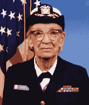
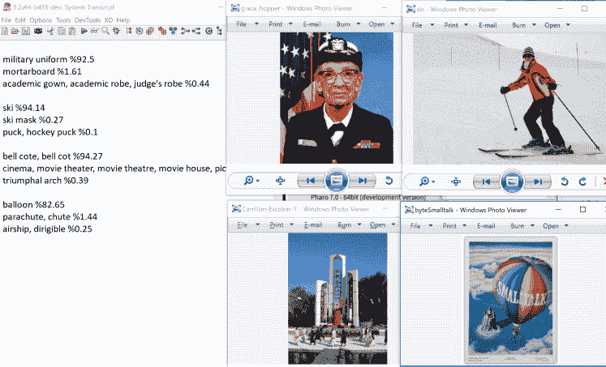

# 用 TensorFlow 和 Smalltalk 识别图像中的物体

> 原文：<https://dev.to/martinezpeck/recognizing-objects-in-images-with-tensorflow-and-smalltalk-1nep>

在这篇文章中，我将使用 Smalltalk 的 TensorFlow 库展示一个简单的图像对象识别示例。

### 不用 Python 做机器学习？用 Smalltalk？真的吗？

每当你开始进入人工智能和机器学习的世界，你会立即注意到 Python 已经被广泛接受为这些主题的“默认”编程语言。

我不反对 Python，我相信人们使用它是有原因的。然而，我确实相信提供选择也是一件好事。Smalltalk 可能是您正在寻找替代方案。

上周，我的健谈朋友马克西·塔巴克曼告诉我:

> Smalltalk 是针对复杂模型的，机器学习是复杂的。

除了 Maxi 的观点，Smalltalk 里还有一个理由。如果您在一个 Smalltalk 项目中工作，您可能会管理复杂的数据。这意味着你可能会从应用机器学习中受益。那么，为什么要在 Smalltalk 环境和模型之外工作并应用它呢？

然后，甚至[吉拉德·布拉查](https://bracha.org/Site/Home.html)告诉我:

> TensorFlow 的文明前端会很棒。

至于这是什么意思——这是一个很长的讨论:)

很久以前，[Gera“Richie”Richarte](https://github.com/gerasdf)说过:

> Smalltalk 是学习和实验的绝佳环境。这将是一个开始玩机器学习的好地方。

几年前，他终于开始玩 ML 和 Smalltalk。他开始为 Cuis Smalltalk 开发 TensorFlow 包装器。后来，这个绑定[也移植到了 Pharo Smalltalk](https://github.com/PolyMathOrg/libtensorflow-pharo-bindings/) 上，现在[终于移植到了 VASmalltalk](https://github.com/vasmalltalk/tensorflow-vast) 上。所以…如你所见..正如 Serge Stinckwich 所说:

> 所有 Smalltalk 联合起来进行机器学习和深度学习！

这个项目不仅仅是一个绑定/包装器。它试图(因为它仍在发展和改进)提供更丰富的 API，并利用 Smalltalk 的独特特性。

液体错误:内部

### 准备示例

在这篇文章中，我将使用 [VASmalltalk TensorFlow 包装器](https://github.com/vasmalltalk/tensorflow-vast)，但是类似的方法也可以用于其他 Smalltalk 方言。您必须做的第一件事是下载 TensorFlow 共享库，安装 Smalltalk 包装器并对其进行配置。所有细节[都在官方文件](https://github.com/vasmalltalk/tensorflow-vast#installation)中有解释。为了确认包装器一切正常，您可以运行我们拥有的 250 多个单元测试(在 VASmalltalk 版本的早期预览中，并不是所有的单元测试都通过了)。

液体错误:内部

您将看到 TensorFlow 示例是在标准加载过程中加载的。这意味着您应该加载了`LabelImage`类。你可能想要检查它的类注释以获得解释和细节。

`LabelImage`示例展示了如何使用预训练的 TensorFlow 网络来识别图像中的对象。由于这是一个预训练的模型，您将需要它的 proto buffers 文件(`.pb`)。这个例子还需要一个“标签”文件。但是不要担心，我们已经在`examples/labelImage`中包含了所有必要的东西。所以…您需要做的就是将目录`examples`从 git 根目录复制到您的 Smalltalk 映像工作目录。

### 运行实例！

#### 单幅图像——盗梦空间 V3

第一个示例使用此图像运行:

[](https://res.cloudinary.com/practicaldev/image/fetch/s--VwWKNgkB--/c_limit%2Cf_auto%2Cfl_progressive%2Cq_auto%2Cw_880/https://i2.wp.com/github.com/vasmalltalk/tensorflow-vast/raw/master/examples/labelImage/grace_hopper.jpg%3Fresize%3D183%252C215%26ssl%3D1)

并且运行一个 Inception V3 模型。你可以在这里阅读更多相关信息[。](https://github.com/tensorflow/tensorflow/tree/master/tensorflow/examples/label_image/README.md) 

```
|results|
results := LabelImage new
    imageSize: 299@299;
    imageFiles: OrderedCollection new;
    graphFile: 'examples\labelImage\inception_v3_2016_08_28_frozen.pb';
    labelsFile: 'examples\labelImage\labels.txt';
    addImageFile: 'examples\labelImage\grace_hopper.jpg';
    prepareImageInput;
    prepareSession;
    predict.
Transcript cr.
results do: [ :eachImage |
    (eachImage first: 3) do: [:each |
        Transcript 
            show: each key;
            show: ' %';
            show: ((each value * 100) roundTo: 0.01) asString;
            cr.
    ]
]. 
```

Enter fullscreen mode Exit fullscreen mode

这应该会在抄本上打印以下内容:

```
military uniform %92.5
mortarboard %1.61
academic gown, academic robe, judge's robe %0.44 
```

Enter fullscreen mode Exit fullscreen mode

#### 单一图像–V1 移动网络

Mobilnet 模型给出的结果不如 Inception V3 好，但是它运行得更快。

你可以运行这个代码:

```
((LabelImage new
        imageSize: 224@224;
        graphFile: 'examples\labelImage\mobilenet_v1_1.0_224_quant_frozen.pb';
        labelsFile: 'examples\labelImage\labels.txt';
        addImageFile: 'examples\labelImage\grace_hopper.jpg';
        prepareImageInput;
        prepareSession;
        predict)
            first
                first: 10)
                    collect: [:each | each key -> ((each value * 100) roundTo: 0.01) asString] 
```

Enter fullscreen mode Exit fullscreen mode

它将打印:

```
 ('military uniform' -> '39.73'
 'Windsor tie' -> '24.14'
 'bow tie, bow-tie, bowtie' -> '10.52'
 'bulletproof vest' -> '4.59'
 'mortarboard' -> '3.88' 
 'bolo tie, bolo, bola tie, bola' -> '1.69'
 'suit, suit of clothes' -> '1.21' 
 'bearskin, busby, shako' -> '1.21'
 'microphone, mike' -> '0.87' 
 'wig' -> '0.74') 
```

Enter fullscreen mode Exit fullscreen mode

**重要:**注意，在这两个模型中，我指定了不同的图像大小:`299`用于 Inception V3，`224`用于 Mobilenet V1。这是因为图像大小取决于我们使用的预训练模型。为了知道使用哪个值，您必须阅读文档。

#### 多画面——盗梦空间 V3

在前面的例子中，我们看到一次只有一个图像处理。然而，TensorFlow 允许我们并行运行多个图像。下面的例子就是这么做的:

```
|results|
results := LabelImage new
    imageSize: 299@299;
    imageFiles: OrderedCollection new;
    graphFile: 'examples\labelImage\inception_v3_2016_08_28_frozen.pb';
    labelsFile: 'examples\labelImage\labels.txt';
    addImageFile: 'examples\labelImage\grace_hopper.jpg';
    addImageFile: 'examples\labelImage\ski.jpg';
    addImageFile: 'examples\labelImage\Carrillon-Escobar-1.jpg';
    addImageFile: 'examples\labelImage\byteSmalltalk.jpg';
    prepareImageInput;
    prepareSession;
    predict.
Transcript cr.
results do: [ :eachImage |
    (eachImage first: 3) do: [:each |
        Transcript 
            show: each key;
            show: ' %';
            show: ((each value * 100) roundTo: 0.01) asString;
            cr.
    ].
    Transcript cr. 
]. 
```

Enter fullscreen mode Exit fullscreen mode

这是结果。你能把图片和笔录结果匹配吗？:)

[](https://res.cloudinary.com/practicaldev/image/fetch/s--4DExVt6x--/c_limit%2Cf_auto%2Cfl_progressive%2Cq_auto%2Cw_880/https://i2.wp.com/marianopeck.wpcomstaging.com/wp-content/uploads/2019/08/Screen-Shot-2019-08-06-at-3.48.58-PM.png%3Ffit%3D748%252C454%26ssl%3D1)

**重要提示:**请注意，在这种情况下，仍然只有一个 Smalltalk 进程对 TensorFlow 进行一次(嗯，几次)FFI 调用……这与它对单个图像场景进行的 FFI 调用完全相同。神奇之处在于 TF，因为它将并行处理这些图像。这取决于硬件、TF 的构建方式、您的配置等。，它可能只使用 CPU，也可能使用 GPU。

### 如何训练你的龙

这篇文章是关于一个我们简单下载的预先训练好的网络。但显然，更有趣和复杂的场景是开发和训练自己的模型。这将是未来文章的主题。但与此同时，您可以通过查看下面的片段来体验一下。

第一个简单明了:

```
initializeForwardGraph
   | input |
   input := graph placeholder: 'Input' type: TF_Tensor typeFloat.
   activation := (weights * input) sigmoid. 
```

Enter fullscreen mode Exit fullscreen mode

下面的这个有点复杂，但是你可以看到如何嵌套东西来构建网络:

```
initializeInferenceGraph
        hidden1 := graph
                fromBlock: [:image |
                        input := image.
                        (image * weights1 + biases1) rectified]
                named: 'layer1'.
        hidden2 := graph fromBlock: [
                (hidden1 * weights2 + biases2) rectified] named: 'layer2'.
        prediction := graph
                fromBlock: [
                        netInput := hidden2 * weights3 + biases3.
                        netInput softmax findMaxOn: 1 asInt32Tensor]
                named: 'layer3'. 
```

Enter fullscreen mode Exit fullscreen mode

准备好训练自己的了吗？

### 现在想象一下… TensorFlow + Smalltalk + ARM + GPU

正如你在以前的帖子中看到的一样，比如[这个](https://dev.to/martinezpeck/challenge-accepted-build-tensorflow-c-binding-for-raspberry-pi-in-2019-4f89)和[这个](https://dev.to/martinezpeck/the-battle-continues-build-tensorflow-c-binding-for-raspberry-pi-in-2019-553j)，我一直在不同的基于 ARM 的 SoB (Raspberry Pi，Rock64 等)上构建 TensorFlow。我在 ARM 和 ARM64 上都成功了。VASmalltalk 也支持这两者。

液体错误:内部

那么…我为什么要这么做？一个显而易见的原因是，很快我就想测试一款基于 ARM 的具有良好 GPU 的主板…比如 Nvidia Jetson Nano (128 个 GPU 核心)或 XT2 (256 个核心)。那是…我希望 TensorFlow 运行并利用所有这些内核！

液体错误:内部

### 结论

只有时间才能证明用 Smalltalk 做机器学习和深度学习是不是一个好主意。从我的角度来说，即使我远不是这方面的专家，我也会尽我所能去实现它。

感谢 Gera Richarte 和 Koan-Sin TanThanks 提供这些例子，感谢 Maxi Tabacman 评论这篇文章。