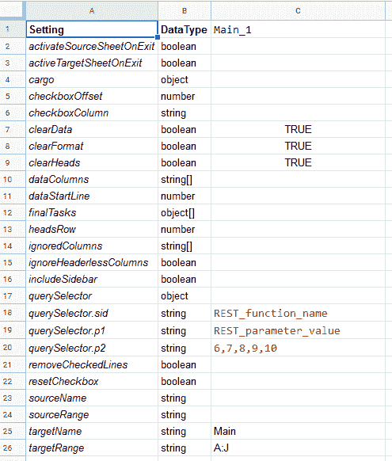

# 基于工作表的计算机辅助软件开发(CASD) #1

> 原文：<https://dev.to/bugmagnet/sheets-based-computer-aided-software-development-1ib6>

我过去经常使用电子表格来生成编程资产，尤其是使用 Excel plus 宏来为 DLL 文件生成接口描述语言文件。然后使用微软的 [MIDL](https://docs.microsoft.com/en-us/windows/win32/midl/com-dcom-and-type-libraries) 编译器编译这些文件，留下一个 [typelib](http://resources.esri.com/help/9.3/arcgisdesktop/com/COM/ExtendAO/TypeLibrariesAndIDL.htm) 文件，然后可以注册和使用符号，就好像 DLL 是一个真正的 COM DLL。

使用电子表格节省了大量时间。我可以指定每个函数和每个参数，并让宏编写相关的 IDL 代码。然后我可以将它复制并粘贴到文本编辑器中，稍微清理一下，然后编译成。TLB 等经历了这个过程。

因此，在长时间的中断之后，我又做了同样的事情，这次是从 Google Sheets 文件生成 JSON 配置对象。在这种情况下，A 列包含字段的名称，B 列包含数据类型，C 列包含将使用该数据的每个文件/函数的配置数据。

例如，这里有一个例子 A:C [](https://res.cloudinary.com/practicaldev/image/fetch/s--FMIe9T9b--/c_limit%2Cf_auto%2Cfl_progressive%2Cq_auto%2Cw_880/https://thepracticaldev.s3.amazonaws.com/i/55yj6xkr3z0tw95uarqr.png)

下面，在单元格 C28 中，我有下面的公式:

```
=GenerateSettings(C2:C26,A2:B26) 
```

Enter fullscreen mode Exit fullscreen mode

这将生成以下内容:

```
var settings = {
  "activateSourceSheetOnExit": false,
  "activeTargetSheetOnExit": false,
  "cargo": {},
  "checkboxOffset": -1,
  "checkboxColumn": "",
  "clearData": true,
  "clearFormat": true,
  "clearHeads": true,
  "dataColumns": [],
  "dataStartLine": -1,
  "finalTasks": [],
  "headsRow": -1,
  "ignoredColumns": [],
  "ignoreHeaderlessColumns": false,
  "includeSidebar": false,
  "querySelector": {
    "sid": "REST_function_name",
    "p1": "REST_parameter_value",
    "p2": "6,7,8,9,10"
  },
  "removeCheckedLines": false,
  "resetCheckbox": false,
  "sourceName": "",
  "sourceRange": "",
  "targetName": "Main",
  "targetRange": "A:J"
} 
```

Enter fullscreen mode Exit fullscreen mode

`GenerateSettings`在下面。您将看到指示`ts2gas`将 my TypeScript 转换为 ES3 的工件，ES3 是 Google Apps 脚本中使用的方言。

您可能想要检查您可以给`JSON.stringify()`(下面称为`JSON.stringify(settings, null, ' ')`)的额外参数的引用，因为它们确实提高了人类的可读性。

```
function GenerateSettings(valueRange, settingsRange) {
    var settings = {};
    var settingsValues = settingsRange; //.getValues();
    var offset = 0;
    for (var _i = 0, valueRange_1 = valueRange; _i < valueRange_1.length; _i++) {
        var cell = valueRange_1[_i];
        var nameType = settingsValues[offset];
        var name = nameType[0];
        var type = nameType[1];
        var cellValue = cell[0];
        offset++;
        var formattedCellValue = void 0;
        switch (type) {
            case "object":
                formattedCellValue = cellValue === "" ? '{}' : cellValue;
                break;
            case "object[]":
            case "number[]":
                formattedCellValue = cellValue === "" ? '[]' : '[' + cellValue.split(/,\s*/g).join(",") + ']';
                break;
            case "string[]":
                formattedCellValue = cellValue === "" ? '[]' : '[' + cellValue.split(/,\s*/g).map(function (elt) { return "'" + elt + "'"; }).join(",") + ']';
                break;
            case "number":
                formattedCellValue = cellValue === "" ? -1 : cellValue;
                break;
            case "boolean":
                formattedCellValue = cellValue === "" ? 'false' : (cellValue ? 'true' : 'false');
                break;
            case "literal":
                formattedCellValue = cellValue === "" ? '""' : cellValue; // was eval
                break;
            case "string":
                formattedCellValue = cellValue === "" ? '""' : '"' + cellValue + '"';
                break;
        }
        name = "['" + name.split(/\./g).join("']['") + "']";
        var js = "if (!settings) settings = {}; settings" + name + "=" + formattedCellValue + ";";
        eval(js);
    }
    return "var settings = " + JSON.stringify(settings, null, '  ');
} 
```

Enter fullscreen mode Exit fullscreen mode