# 如何设置本地 MongoDB 连接

> 原文：<https://dev.to/zellwk/how-to-setup-a-local-mongodb-connection-55em>

我做 app 的时候都是用 MongoDB 做数据库。我喜欢连接到我电脑上的数据库，因为这样可以加快开发和测试相关的工作。

今天，我想分享如何创建和连接一个本地 MongoDB 数据库。

## 安装 MongoDB

您需要在计算机上安装 MongoDB，然后才能连接到它。你可以按照这些说明来安装 MongoDB([Mac](https://treehouse.github.io/installation-guides/mac/mongo-mac.html)和 [Windows](https://treehouse.github.io/installation-guides/windows/mongo-windows.html) )。

一旦你完成了安装过程，试着在命令行中输入`mongo --version`。您应该会得到类似如下的响应:

```
mongo --version 
```

[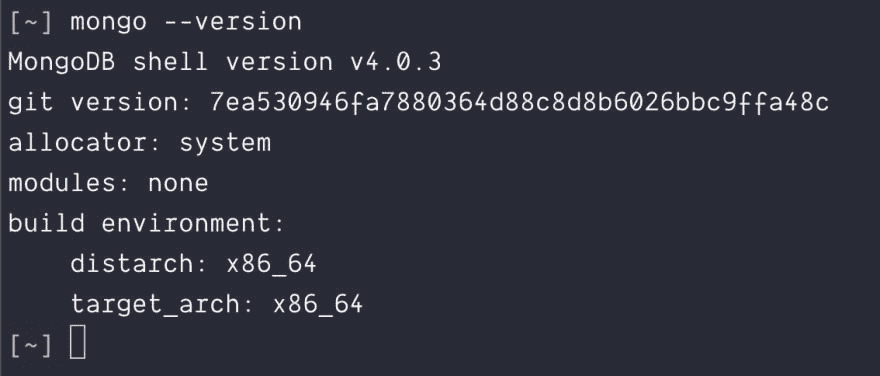](https://res.cloudinary.com/practicaldev/image/fetch/s--bUf99VBF--/c_limit%2Cf_auto%2Cfl_progressive%2Cq_auto%2Cw_880/https://zellwk.cimg/2019/local-mongodb/version.png)

## 启动 MongoDB

您可以使用`mongod`命令在您的计算机上启动 MongoDB。

```
mongod; 
```

[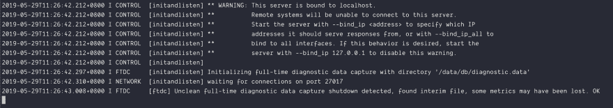](https://res.cloudinary.com/practicaldev/image/fetch/s--mwLteItl--/c_limit%2Cf_auto%2Cfl_progressive%2Cq_auto%2Cw_880/https://zellwk.cimg/2019/local-mongodb/mongod.png)

当您想使用本地 MongoDB 时，请保持`mongod`窗口运行。当你关闭窗口时，MongoDB 停止。

## MongoDB 如何工作的简要概述

MongoDB 允许你在*数据库*中存储东西(称为*文档*)。每个数据库包含多个*集合*。

为了更容易理解，你可以把 MongoDB 想象成一个建筑。它包含许多房间。

**每个房间都是一个数据库**。每个数据库负责存储一个应用程序的信息。您可以存储任意多的信息。

每个房间都有无限量供应的**箱子**。每个盒子都是一个**系列**。每个集合只能包含一种类型的数据。

例如，一个集合可用于书籍，一个集合可用于用户，一个集合可用于玩具，等等。

## 向数据库添加项目

向 MongoDB 数据库添加项目的一种方法是通过 Mongo Shell。要打开 Mongo Shell，您需要打开另一个命令行窗口并运行`mongo`。

```
mongo; 
```

[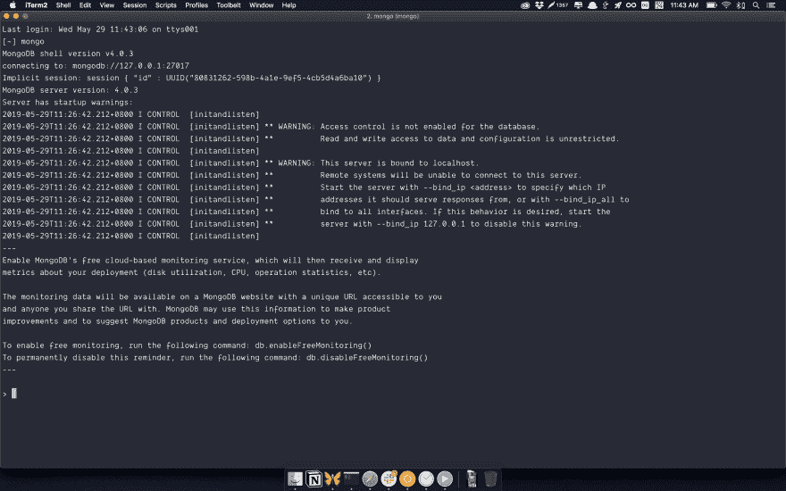](https://res.cloudinary.com/practicaldev/image/fetch/s--Yld7hZVh--/c_limit%2Cf_auto%2Cfl_progressive%2Cq_auto%2Cw_880/https://zellwk.cimg/2019/local-mongodb/mongo-shell.png)

注意:确保`mongod`窗口保持打开！如果关闭`mongod`窗口，您将无法与 Mongo Shell 交互。

首先，我们需要一个数据库。您可以使用`db`命令查看当前选择的数据库。(默认情况下，您应该在`test`数据库上)。

```
> db 
```

注意:上面代码中的`>`表示 Mongo Shell。不需要打`>`。这不是命令的一部分。

[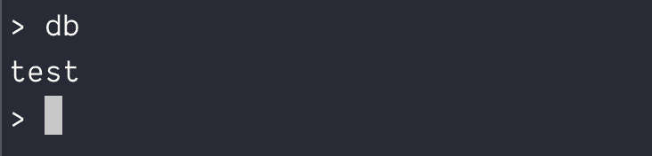](https://res.cloudinary.com/practicaldev/image/fetch/s--KGX0nv_2--/c_limit%2Cf_auto%2Cfl_progressive%2Cq_auto%2Cw_880/https://zellwk.cimg/2019/local-mongodb/test-db.png)

对于本文，我们将创建一个名为`game-of-thrones`的数据库。您可以使用`use <database>`命令创建并切换到一个新的数据库。

```
> use game-of-thrones 
```

[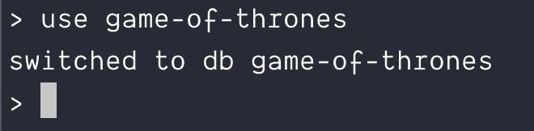](https://res.cloudinary.com/practicaldev/image/fetch/s--C5nsAcfv--/c_limit%2Cf_auto%2Cfl_progressive%2Cq_auto%2Cw_880/https://zellwk.cimg/2019/local-mongodb/switch-db.png)

我们将在`game-of-thrones`中添加一个角色。这里，我们需要将角色放入一个集合中。我们将使用`characters`作为集合的名称。

要将一个项目添加到集合中，可以将一个 JavaScript 对象传递到`db.<collectionName>.insertOne()`中。

```
db.characters.insertOne({ name: "Jon Snow" }); 
```

[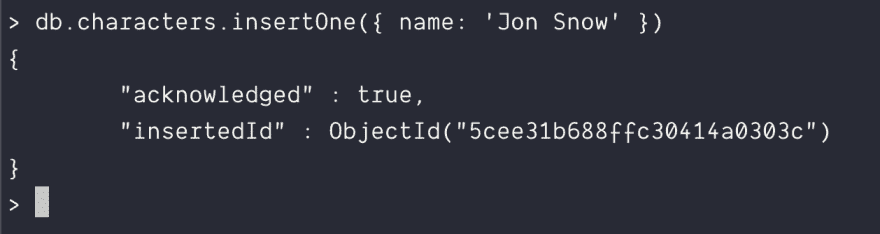](https://res.cloudinary.com/practicaldev/image/fetch/s--CKPN8Rx_--/c_limit%2Cf_auto%2Cfl_progressive%2Cq_auto%2Cw_880/https://zellwk.cimg/2019/local-mongodb/insert-1.png)

在继续之前，让我们向数据库中添加一个字符。

```
db.characters.insertOne({ name: "Arya Stark" }); 
```

[](https://res.cloudinary.com/practicaldev/image/fetch/s--51Ata1SV--/c_limit%2Cf_auto%2Cfl_progressive%2Cq_auto%2Cw_880/https://zellwk.cimg/2019/local-mongodb/insert-2.png)

您可以使用`find`命令查看我们添加的字符。(`db.<collectionName>.find()`)。

```
db.characters.find(); 
```

[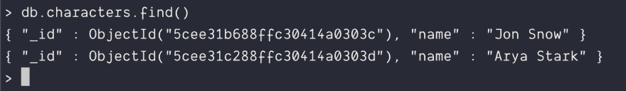](https://res.cloudinary.com/practicaldev/image/fetch/s--mfPenhc6--/c_limit%2Cf_auto%2Cfl_progressive%2Cq_auto%2Cw_880/https://zellwk.cimg/2019/local-mongodb/db-find.png)

这是您现在需要了解的关于 Mongo Shell 的所有信息。

## 使用 MongoDB Compass 访问 MongoDB

MongoDB Compass 为您提供了另一种访问 MongoDB 的方式。如果你不喜欢命令行，这款应用可以让你更容易地检查(和编辑)数据库。

要使用 MongoDB Compass，你必须先安装它。你可以从[这个页面](https://docs.mongodb.com/compass/master/install/)下载并安装 MongoDB Compass。

当你打开 MongoDB Compass 时，你会看到一个类似这样的屏幕:

[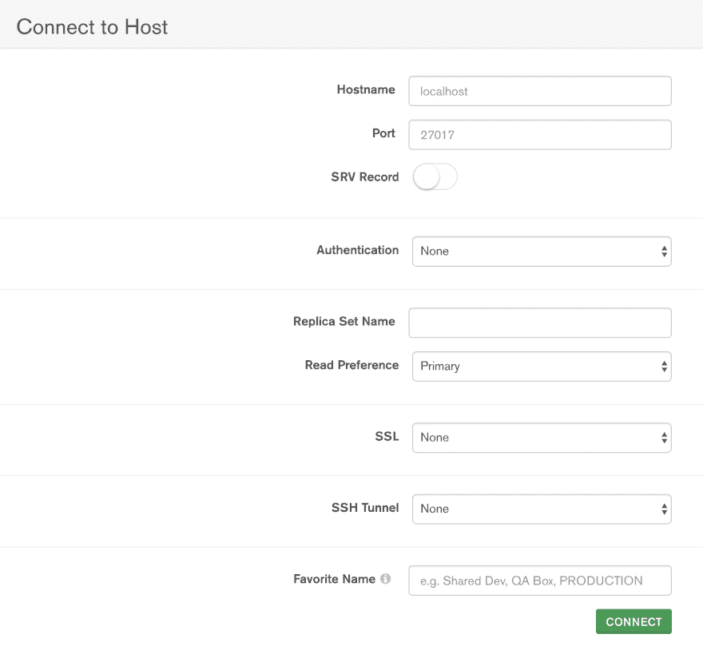](https://res.cloudinary.com/practicaldev/image/fetch/s--vJv1NFE7--/c_limit%2Cf_auto%2Cfl_progressive%2Cq_auto%2Cw_880/https://zellwk.cimg/2019/local-mongodb/mongodb-compass.png)

为了连接到您的本地 MongoDB，您将`Hostname`设置为`localhost`，将`Port`设置为`27017`。这些值是所有本地 MongoDB 连接的默认值(除非您更改了它们)。

[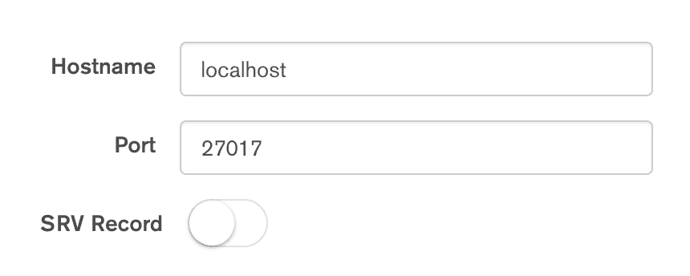](https://res.cloudinary.com/practicaldev/image/fetch/s--_UgfJ2lS--/c_limit%2Cf_auto%2Cfl_progressive%2Cq_auto%2Cw_880/https://zellwk.cimg/2019/local-mongodb/mongodb-compass-settings.png)

按 connect，您应该会在本地 MongoDB 中看到数据库。在这里，您应该能够看到`game-of-thrones`(我们为本教程创建的数据库)。

[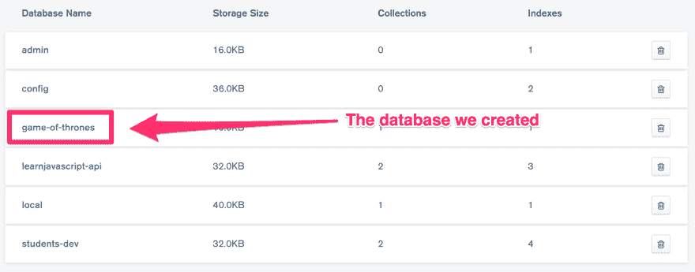](https://res.cloudinary.com/practicaldev/image/fetch/s--6K6Wu3VO--/c_limit%2Cf_auto%2Cfl_progressive%2Cq_auto%2Cw_880/https://zellwk.cimg/2019/local-mongodb/mongodb-compass-databases.png)

如果你点击`game-of-thrones`，你会看到一个`characters`收藏。

[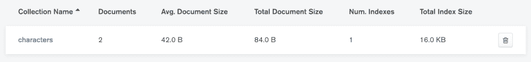](https://res.cloudinary.com/practicaldev/image/fetch/s--8xWLUNRC--/c_limit%2Cf_auto%2Cfl_progressive%2Cq_auto%2Cw_880/https://zellwk.cimg/2019/local-mongodb/mongodb-compass-collection.png)

如果你点击`characters`，你会看到我们在前面创建的两个角色。

[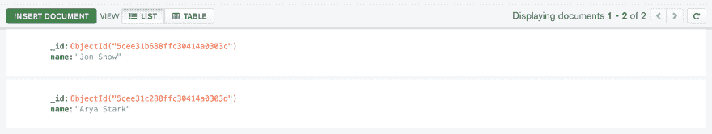](https://res.cloudinary.com/practicaldev/image/fetch/s--yUSlcd6p--/c_limit%2Cf_auto%2Cfl_progressive%2Cq_auto%2Cw_880/https://zellwk.cimg/2019/local-mongodb/mongodb-compass-documents.png)

这就是如何使用 MongoDB Compass 连接到运行在您自己的计算机上的 MongoDB。

## 通过节点服务器连接到 MongoDB

当我们构建应用程序时，我们通过我们的应用程序连接到 MongoDB(而不是通过 Mongo Shell 或 MongoDB Compass)。

为了连接到 MongoDB，我们需要使用 [mongodb](https://www.npmjs.com/package/mongodb) 包。或者，你也可以使用[猫鼬](https://www.npmjs.com/package/mongoose)。

(顺便说一句，比起 MongoDB 原生驱动，我更喜欢用 Mongoose。我会在以后的文章中分享原因)。

### 连接 MongoDB 原生驱动

首先，您必须安装并需要 mongodb 包。

```
npm install mongodb --save 
```

```
const MongoClient = require("mongodb").MongoClient; 
```

您可以使用以下 url 连接到您的本地 MongoDB:

```
const url = "mongodb://127.0.0.1:27017"; 
```

对于 Mongo 客户机，在连接到 MongoDB 之后，您需要指定正在使用的数据库。下面是它的样子:

```
const dbName = "game-of-thrones";
let db;

MongoClient.connect(url, { useNewUrlParser: true }, (err, client) => {
  if (err) return console.log(err);

  // Storing a reference to the database so you can use it later
  db = client.db(dbName);
  console.log(`Connected MongoDB: ${url}`);
  console.log(`Database: ${dbName}`);
}); 
```

[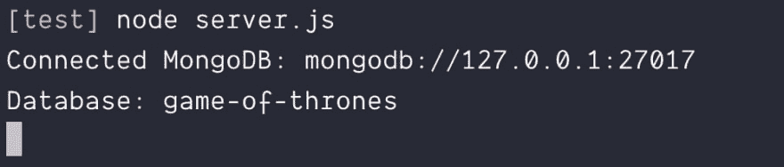](https://res.cloudinary.com/practicaldev/image/fetch/s--1N_WpBMa--/c_limit%2Cf_auto%2Cfl_progressive%2Cq_auto%2Cw_880/https://zellwk.cimg/2019/local-mongodb/connect-mongodb.png)

### 与獴相连

要连接 Mongoose，需要下载并要求`mongoose`。

```
npm install mongoose --save 
```

```
const mongoose = require("mongoose"); 
```

当您使用 Mongoose 时，连接`url`应该包括您正在连接的数据库:

```
const url = "mongodb://127.0.0.1:27017/game-of-thrones"; 
```

您可以使用`connect`方法连接到 MongoDB:

```
mongoose.connect(url, { useNewUrlParser: true }); 
```

以下是检查连接是否成功的方法。

```
const db = mongoose.connection;
db.once("open", _ => {
  console.log("Database connected:", url);
});

db.on("error", err => {
  console.error("connection error:", err);
}); 
```

[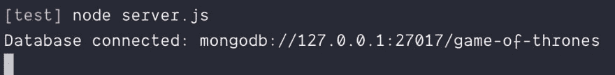](https://res.cloudinary.com/practicaldev/image/fetch/s--yY74-Hxd--/c_limit%2Cf_auto%2Cfl_progressive%2Cq_auto%2Cw_880/https://zellwk.cimg/2019/local-mongodb/connect-mongoose.png)

* * *

感谢阅读。这篇文章最初发表在我的博客上。如果你想要更多的文章来帮助你成为一个更好的前端开发者，请注册[我的时事通讯](https://zellwk.com)。