# 为 npm 包构建 Github 操作配置项

> 原文：<https://dev.to/talk2megooseman/building-github-actions-ci-for-an-npm-package-j66>

# 这个现在已经弃用了:(

今天，我想介绍一下我为我发布的一个 NPM 包 [React Twitch Embed Video](https://github.com/talk2MeGooseman/react-twitch-embed-video) 建立 CI 构建管道的过程。
如果你还不是 Github Actions Beta 的成员，你可以在这里申请访问: [Github Actions](https://github.com/features/actions) 。

## 目录

*   [第 1 部分:创建 lint 工作流](#part1)
*   [第 2 部分:创建发布工作流](#part2)

# 第 1 部分:创建 lint 工作流

在本指南的第一部分，我们将创建一个林挺工作流，您可以使用它来检查您的分支机构或拉式请求。

## 入门

访问测试版后，你会注意到在你的存储库主页上的第一件事是顶部新的**动作**标签。

[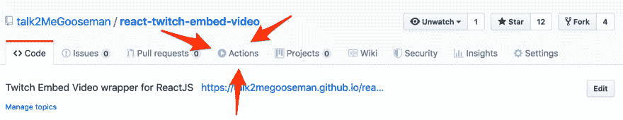](https://res.cloudinary.com/practicaldev/image/fetch/s--DatoWF8x--/c_limit%2Cf_auto%2Cfl_progressive%2Cq_auto%2Cw_880/https://imgur.com/lSrbxdi.png) 
点击**动作**你应该会看到下面用漂亮的大粗体字写的消息`Create your first workflow`

[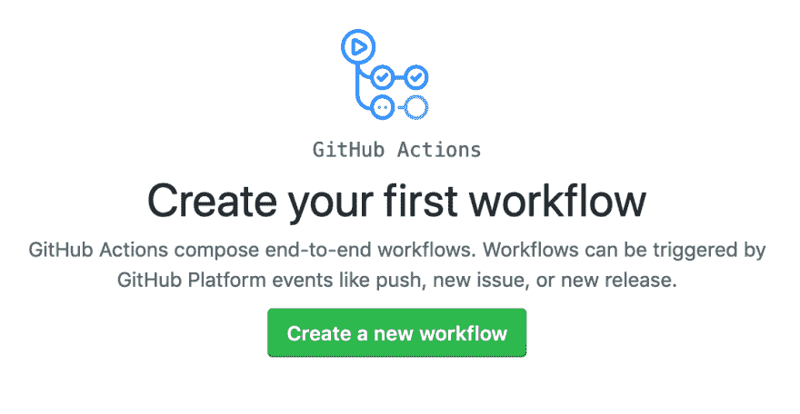](https://res.cloudinary.com/practicaldev/image/fetch/s--oKcUwN9W--/c_limit%2Cf_auto%2Cfl_progressive%2Cq_auto%2Cw_880/https://imgur.com/Z3sYspN.png) 
让我们点击`Create a new workflow`开始创建我们的工作流程

## 第一步:创建工作流

一旦你准备好开始构建你的第一个工作流，你将会看到定制的 Github 工作流编辑器。

当我们开始为我们的 npm 包构建工作流程的第一部分时，这基本上是我们将居住的地方。

要开始使用 Github 的可视化编辑器，请点击`create a new workflow`

[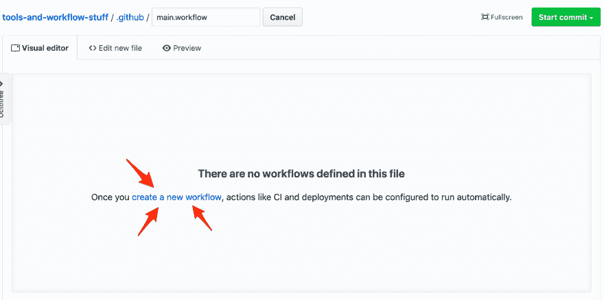](https://res.cloudinary.com/practicaldev/image/fetch/s--yz2dshRV--/c_limit%2Cf_auto%2Cfl_progressive%2Cq_auto%2Cw_880/https://imgur.com/DFC1aon.png)

现在，有趣的事情开始了。现在可视化编辑器应该用 Github Actions 工作流触发器初始化了。这是我们命名工作流和配置我们想要监听的存储库事件类型的地方。我们将在用例中监听默认的**推送**事件。

> 在推送到存储库分支时触发。分支推送和存储库标签推送也触发 webhook [推送事件](https://developer.github.com/webhooks/#events)。这是默认事件。
> 
> 以下是描述其他事件的文档链接[https://developer . github . com/actions/managing-workflows/workflow-configuration-options/# actions-attributes](https://developer.github.com/actions/managing-workflows/workflow-configuration-options/#actions-attributes)

[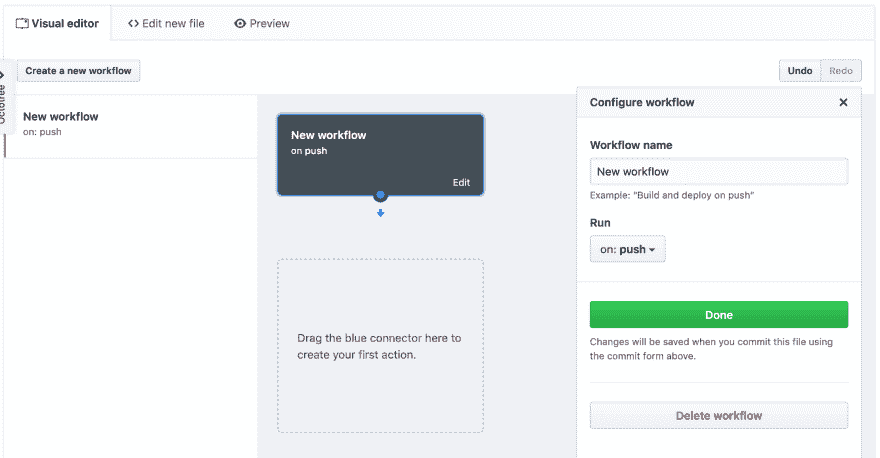](https://res.cloudinary.com/practicaldev/image/fetch/s--MglFvz84--/c_limit%2Cf_auto%2Cfl_progressive%2Cq_auto%2Cw_880/https://imgur.com/DUa3CyF.png)

## 第二步:npm 安装操作

现在让我们开始第一步行动！就像屏幕上的轮廓说我们将蓝色子弹拖到它那里，做出我们的第一个动作。完成后，我们现在可以选择我们的第一个动作了。

在右边，我们将看到**特色的**动作，我们立即看到 **GitHub 对 npm** 的动作，这正是我们想要的。

点击**使用**按钮将 npm 行动添加到我们的工作流程中。

现在我们需要在 lint 代码之前安装我们的依赖项。在右模态的 **args** 文本字段中输入出第一个 npm 命令:

```
 install 
```

让我们也将标签更新为更具描述性的东西，而不是 npm 的 **GitHub Action，类似于`npm install`。**

点击模式底部的**完成**，然后我们开始第一个动作。

[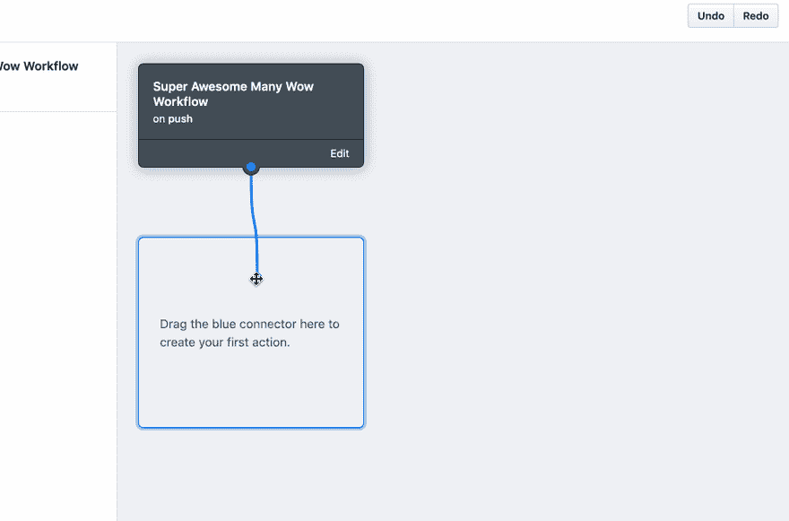](https://res.cloudinary.com/practicaldev/image/fetch/s--PRQbvo5a--/c_limit%2Cf_auto%2Cfl_progressive%2Cq_auto%2Cw_880/https://imgur.com/IKyU0WB.png)

## 第三步:线头动作

现在我们已经完成了`npm install`，让我们创建我们的 [`lint`](#part1-step2) 动作。

我们将遵循与创建`npm install`动作完全相同的步骤，但是在**参数**井输入:

```
lint 
```

[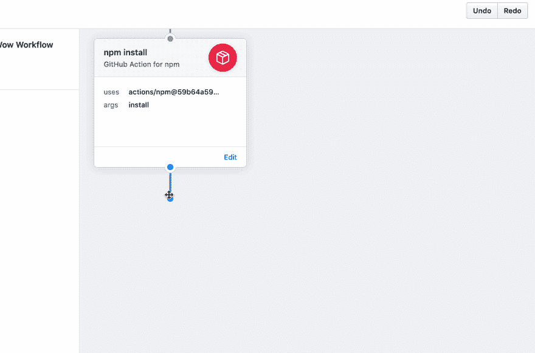](https://res.cloudinary.com/practicaldev/image/fetch/s--Xydg29gr--/c_limit%2Cf_auto%2Cfl_progressive%2Cq_auto%2Cw_880/https://imgur.com/K2MXyvT.png)

> 正如您可能已经注意到的，npm 的 **Github 动作将运行您在`package.json`中配置的任何 npm 命令，因此您可以使用相同的工作流来运行您可能作为开发过程的一部分运行的其他 npm 命令。**

## 第四步:保存工作流并触发配置项

在这一点上，让我们保存我们全新的林挺工作流，并观看它的神奇。在右上角，您可以单击**开始提交**并提交您新创建的文件。

在提交新的提交之后，您应该看到您的新工作流通过单击存储库上的 **Actions** 选项卡开始工作。然后，您应该会看到类似这样的内容(我们稍后会添加一些您看到的其他操作)

[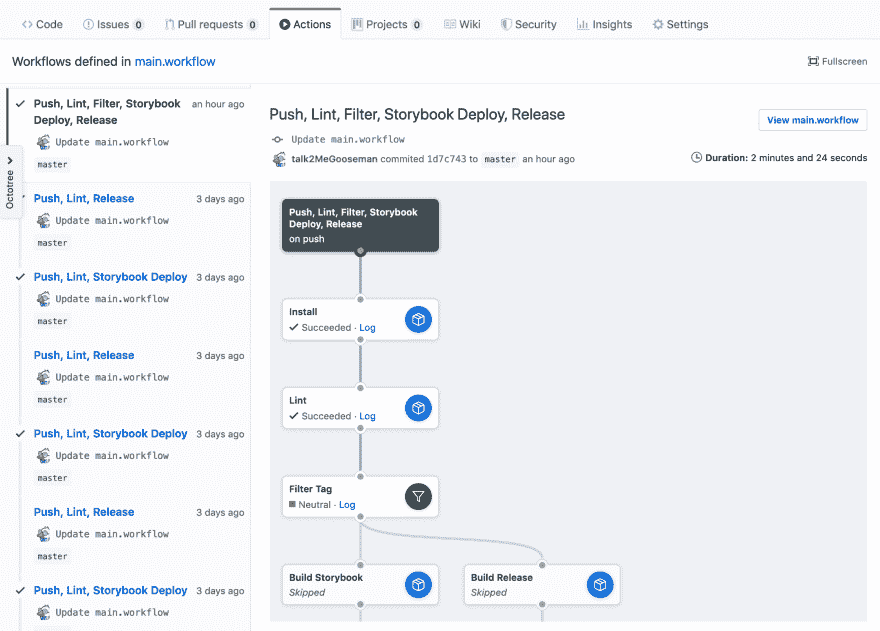](https://res.cloudinary.com/practicaldev/image/fetch/s--C4NtCo4w--/c_limit%2Cf_auto%2Cfl_progressive%2Cq_auto%2Cw_880/https://imgur.com/EmrlBu5.png)

左侧显示作业历史，右侧显示工作流程的进度，并链接到其他信息，如**日志**。如果测试通过，你会看到一个漂亮的绿色勾号，如果测试失败，你会看到一个红色的 **x** 。

# 第二部分:创建发布工作流

在指南的这一部分，我将带您创建一个发布工作流，以便您可以向 npm registry 发布新的带标记版本的软件包。

## 第一步:过滤 Git 标签

现在让我们创建一个只过滤 Git 标签事件的新动作。让我们拖动我们的 **lint 动作**上的蓝色小点，并创建一个新动作。

现在为 GitHub 动作选择**过滤器**并点击**使用**。

在 **args** 中输入:

```
tag 
```

[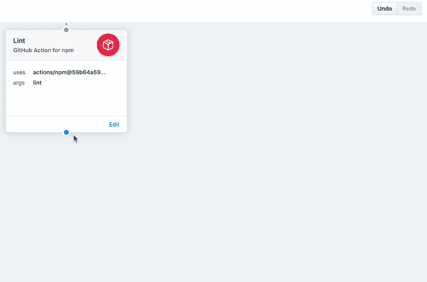](https://res.cloudinary.com/practicaldev/image/fetch/s--eJtASQV8--/c_limit%2Cf_auto%2Cfl_progressive%2Cq_auto%2Cw_880/https://imgur.com/xZXB9qz.png)

此操作现在将只过滤 Git 标签事件。好的一面是，如果这个过滤器在工作流中的这一点上停止，它不会使我们的构建失败(在针对拉请求运行时很好)。

> 访问[https://github.com/actions/bin/tree/master/filter](https://github.com/actions/bin/tree/master/filter),找出您可以过滤的所有不同活动

## 第二步:构建发布包

在发布我们的包之前，我们需要构建一个发布版本。我们将遵循与创建 **npm install** 和 **npm lint** 动作相同的步骤，并为 NPM 使用可信的 **GitHub 动作。**

这次在 **args** 中输入您的生产构建命令，在我的例子中是:

```
release 
```

[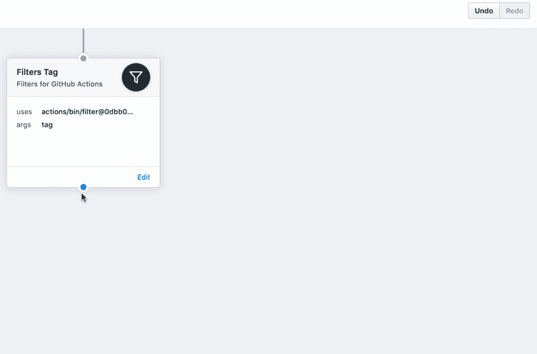](https://res.cloudinary.com/practicaldev/image/fetch/s--XfxKmU_E--/c_limit%2Cf_auto%2Cfl_progressive%2Cq_auto%2Cw_880/https://imgur.com/b9hgIOE.png) 
现在，在我们过滤了 Git 标签事件之后，我们将构建我们的包的发布版本。

## 步骤 3:将包发布到 npm

现在，让我们设置最后一步，发布我们的包。我们再次依靠 npm 的 GitHub 动作来创建我们的 npm 安装动作**、 [**npm lint**](#part1-step3) 和 NPM 释放动作**。****

 ****但是有一个小的区别，我们需要从 npm 注册中心生成一个认证令牌，然后将一个名为`NPM_AUTH_TOKEN`的**秘密**添加到回购协议中。

> 查看 NPM 回购的 Github 操作以了解详细信息[https://Github . com/actions/NPM/tree/59b 64 a 598378 f 31 e 49 CB 76 f 27 d6f 3312 b 582 f 680/# secrets](https://github.com/actions/npm/tree/59b64a598378f31e49cb76f27d6f3312b582f680/#secrets)

在**参数**中为此动作输入:

```
publish 
```

[](https://res.cloudinary.com/practicaldev/image/fetch/s--XfxKmU_E--/c_limit%2Cf_auto%2Cfl_progressive%2Cq_auto%2Cw_880/https://imgur.com/b9hgIOE.png) 
接下来，我们需要按照这些说明在 npm 上生成您的 auth token:[https://docs . npmjs . com/creating-and-viewing-authentic ation-tokens](https://docs.npmjs.com/creating-and-viewing-authentication-tokens)

有了令牌之后，我们需要将 auth 令牌作为一个秘密添加到我们的存储库中。回到我们的新`release`行动，点击**创建新的秘密**。
[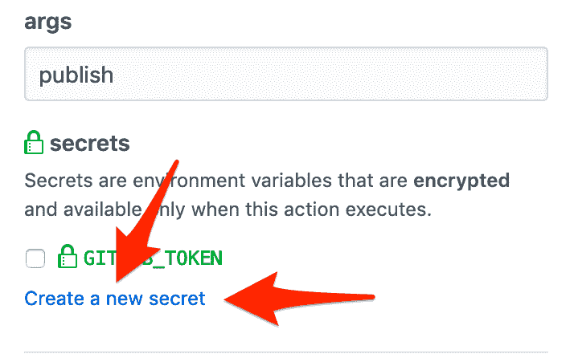](https://res.cloudinary.com/practicaldev/image/fetch/s--n4WuoOSJ--/c_limit%2Cf_auto%2Cfl_progressive%2Cq_auto%2Cw_880/https://imgur.com/nQvnJhO.png) 
为你的新秘密命名:

```
NPM_AUTH_TOKEN 
```

并插入新生成的 npm 注册表认证令牌作为**值**。
[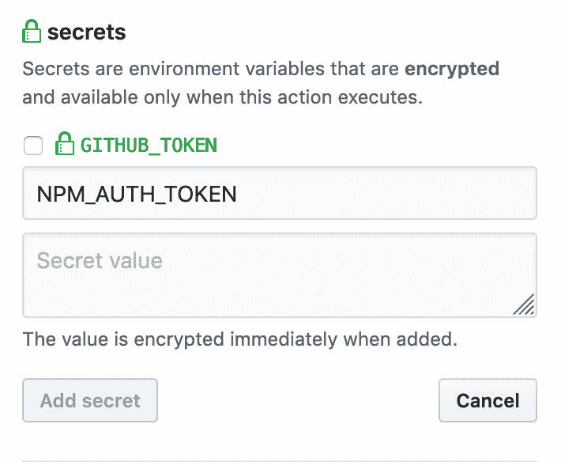](https://res.cloudinary.com/practicaldev/image/fetch/s---r2Xxzeq--/c_limit%2Cf_auto%2Cfl_progressive%2Cq_auto%2Cw_880/https://imgur.com/ZRheSFp.png) 
点击**添加秘密**

确保您新添加的**秘密**被选中，这样发布任务就可以访问它。

点击**完成**，它应该是这样的:
[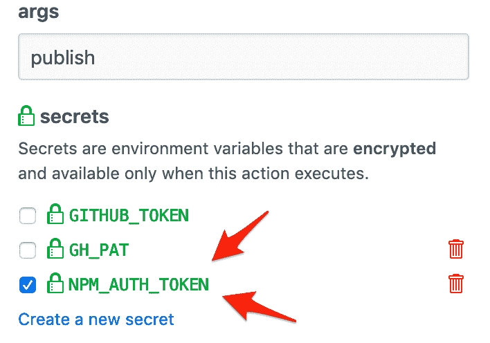](https://res.cloudinary.com/practicaldev/image/fetch/s--3wRqn31N--/c_limit%2Cf_auto%2Cfl_progressive%2Cq_auto%2Cw_880/https://imgur.com/T9xJzVn.png)

## 第四步:保存更新后的工作流程

现在，通过提交新的更改来保存新的和改进的工作流。就像上次一样，CI 过程将开始，但由于这是一个标准提交，该过程将在我们创建的**过滤器标签**动作处终止。在查看**动作**选项卡时，您应该看到后面的工作流动作标记为**跳过**。

## 第五步:终点线....标记新版本

现在我们的 Github Actions 工作流已经完成。你现在所要做的就是 **Git 标签**一个新版本，然后看着你的工作流程做它的事情。如果出现问题，请检查日志中的任何潜在问题并进行调试。

# 结论

感谢您坚持到本文结束，希望您发现这是有帮助的。我计划在其他 Github 行动的经验教训上增加一个后续帖子。****