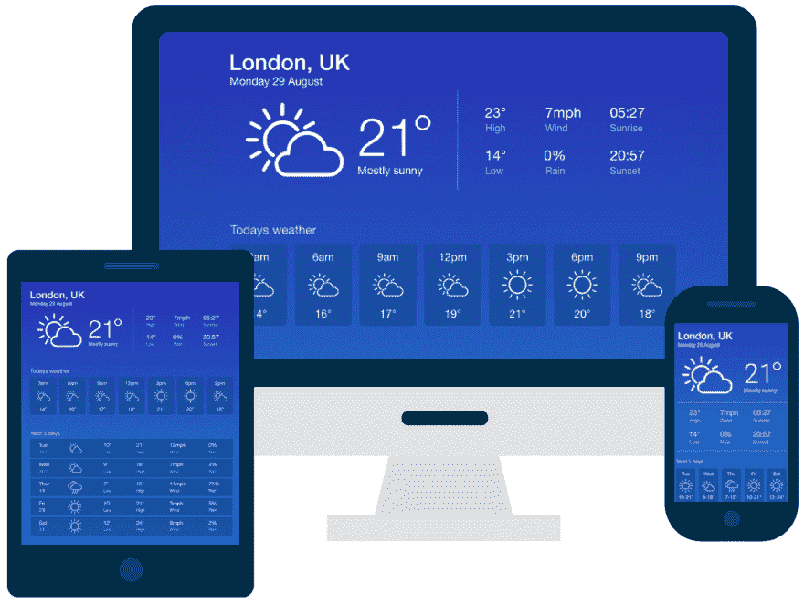
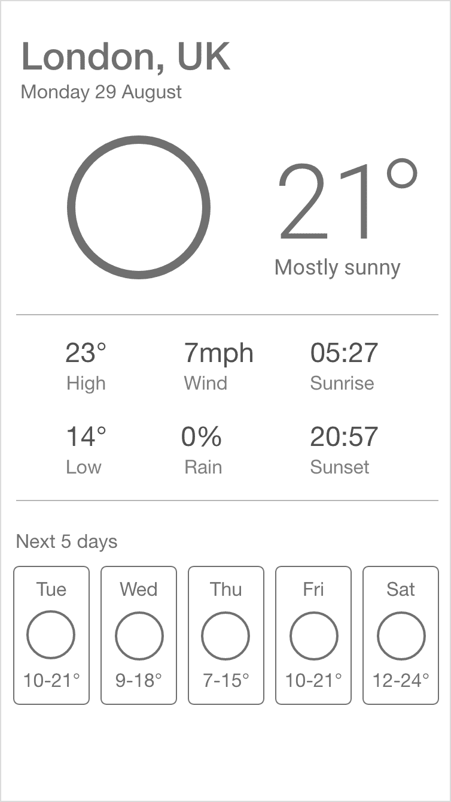
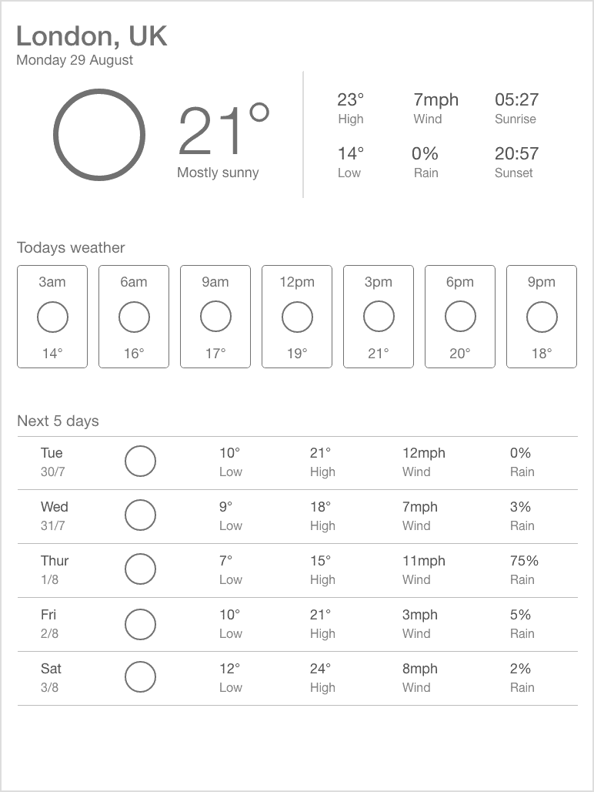
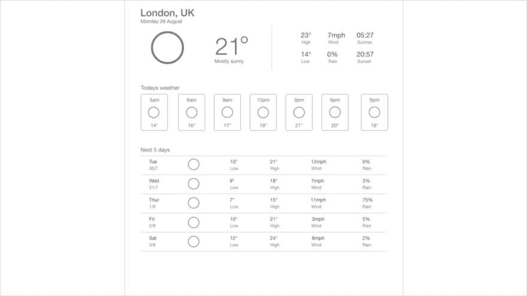
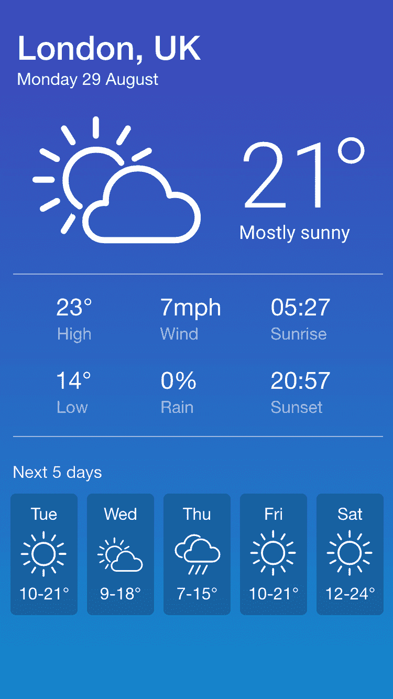
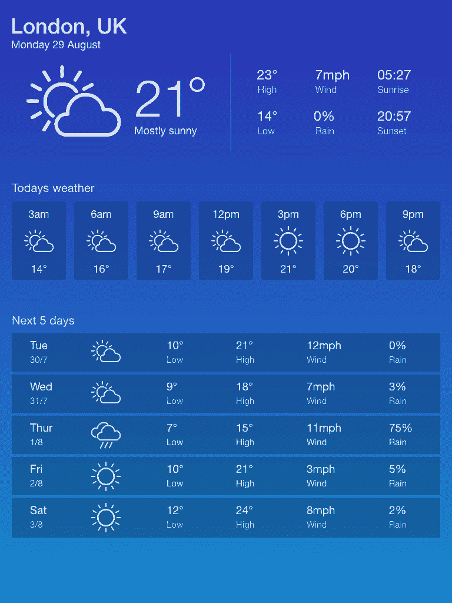
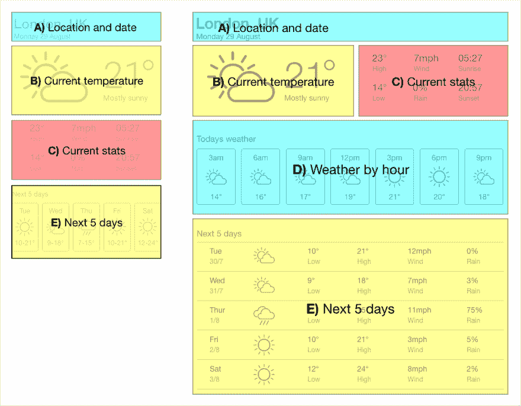
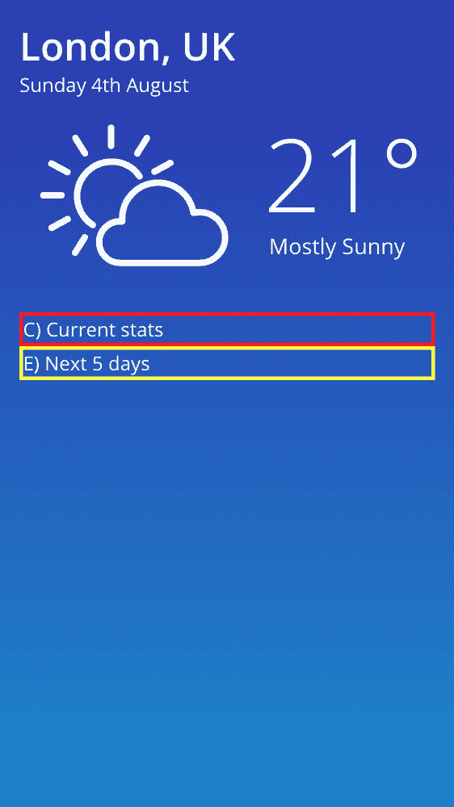

# 设计和开发响应性天气应用程序网页-第 1 部分

> 原文：<https://dev.to/jon_keeping/designing-and-developing-a-responsive-weather-app-webpage-part-1-2ee2>

这篇文章介绍了使用响应式网页设计(RWD)技术设计和开发一个天气应用程序网页。

本文将介绍如何为我们的页面创建线框，以便我们可以直观地看到应用程序如何在不同的设备上布局，然后我们将创建一些高保真设计。接下来，我们将开发响应式网页，利用 CSS 媒体查询来改变布局和设计，以适应从移动电话到大型桌面的任何设备屏幕大小。

[](https://res.cloudinary.com/practicaldev/image/fetch/s--cylxA3lr--/c_limit%2Cf_auto%2Cfl_progressive%2Cq_auto%2Cw_880/https://thepracticaldev.s3.amazonaws.com/i/w0t4rffkyizkdgetsl7b.png)

这篇文章的代码可以在 GitHub 上找到:
【https://github.com/JonUK/responsive-web-weather-app T2】

* * *

## 项目简介

在我们开始之前，让我们回顾一下天气应用程序页面的虚拟简介，这样我们就能清楚地知道我们想要实现什么。

**要求**

*   当前天气状况以大尺寸显示
*   显示未来 5 天的天气状况
*   显示当天不同时间的天气情况(如果有空间的话)
*   显示天气状况的位置
*   该页面在从手机到大型桌面的所有设备上都很好看
*   理想情况下，手机和平板电脑在纵向方向不需要滚动

* * *

## 创建线框

对于高度可视化的网页来说，一个很好的起点就是创建线框。对于需要跨不同设备大小工作的页面来说尤其如此。

我们将采用移动优先的设计方法，为移动电话创建线框，然后逐步扩展到平板电脑和台式机。在许多方面，手机是最难设计的设备，因为可用空间有限，所以迫使我们考虑基本的功能和内容。

我用 Adobe XD 创建了线框(有免费版本)。

**手机**—375×667 像素
[](https://res.cloudinary.com/practicaldev/image/fetch/s--PgOrfrDH--/c_limit%2Cf_auto%2Cfl_progressive%2Cq_auto%2Cw_880/https://thepracticaldev.s3.amazonaws.com/i/4qvqw1p8xttskalvtz5s.png)

**平板电脑**—768×1024 像素
[](https://res.cloudinary.com/practicaldev/image/fetch/s---EHv8req--/c_limit%2Cf_auto%2Cfl_progressive%2Cq_auto%2Cw_880/https://thepracticaldev.s3.amazonaws.com/i/6xr6iz24rcgqeonypfm3.png)

**桌面** — 1920 x 1080 像素
[](https://res.cloudinary.com/practicaldev/image/fetch/s--o-Y2AEWH--/c_limit%2Cf_auto%2Cfl_progressive%2Cq_auto%2Cw_880/https://thepracticaldev.s3.amazonaws.com/i/004mgcqhjwn1ydin2spg.png)

你会注意到，线框上没有颜色或图标，看起来非常简单。这是有意的，稍后我们将回来创建高保真设计。这些线框的目的是为了理解我们的页面在不同设备上的布局和内容。

在手机上，我们不会显示“每小时天气”部分，因为没有足够的空间(没有引入垂直滚动)，我们显示的是“未来 5 天”部分的压缩版本。

在平板电脑上，我们将“当前统计数据”部分上移至“当前温度”部分的右侧，并显示“未来 5 天”部分的扩展表格版本。

在台式机上，我们基本上拥有与平板电脑相同的版本，但间距更大，字体更大。

虽然我们的线框是在典型的手机(375 x 667)、平板电脑(768 x 1024)和台式机(1920 x 1080)尺寸上创建的，但这些不一定是我们用来交换布局的断点。稍后，当我们开发页面时，我们将根据内容需要显示的空间来检查要使用的断点。

* * *

## 创造高保真设计

现在，我们了解了每个设备的页面布局，也了解了我们想要展示的内容，我们可以继续创建高保真设计了。这些设计将让我们探索我们到底想要如何向我们的用户呈现用户界面。

在这一点上需要补充的是，我是一名开发人员，而不是设计人员，所以我将尽力而为！

**手机**—375×667 像素

[](https://res.cloudinary.com/practicaldev/image/fetch/s--xOIQYkwR--/c_limit%2Cf_auto%2Cfl_progressive%2Cq_auto%2Cw_880/https://thepracticaldev.s3.amazonaws.com/i/dk7d8cs21veb92hlvjqe.png)

**平板电脑**—768×1024 像素
[](https://res.cloudinary.com/practicaldev/image/fetch/s--fP7jnZNJ--/c_limit%2Cf_auto%2Cfl_progressive%2Cq_auto%2Cw_880/https://thepracticaldev.s3.amazonaws.com/i/gbdhmt03ppsn9ipacm73.png)

我使用了来自 Emske.com 的免费的 25 个天气图标，它们看起来棒极了，真的有助于给人一个漂亮的“干净”的外观。

* * *

## 开发页面布局

现在我们已经创建了线框和设计，我们准备动手开发天气应用程序页面。正如我们已经看到的，我们需要支持 2 种主要布局。

**移动和平板/桌面布局**
[](https://res.cloudinary.com/practicaldev/image/fetch/s--NBMppBLE--/c_limit%2Cf_auto%2Cfl_progressive%2Cq_auto%2Cw_880/https://thepracticaldev.s3.amazonaws.com/i/oil2gqj9r3wyviy8ufrl.png)

我们将采用移动优先的开发方法来创建我们的网页，这意味着我们将首先创建 CSS 来支持移动电话设备，然后添加媒体查询来为更大的设备调整这些样式。

让我们从 HTML 页面开始开发。用以下内容创建 HTML 文件`index.html`:

```
<!DOCTYPE html>  
<html lang="en">  
<head>  
  <meta charset="utf-8">  
  <meta name="viewport" content="width=device-width, initial-scale=1">  
  <title>Weather App</title>  
  <link href="https://fonts.googleapis.com/css?family=Open+Sans:300,400,600,700&display=swap" rel="stylesheet">  
  <link href="index.css" rel="stylesheet">  
</head>  
<body>  

<main class="main-container">  

  <div class="location-and-date">  
    A) Location and date  
  </div>  

  <div class="current-temperature">  
    B) Current temperature  
  </div>  

  <div class="current-stats">  
    C) Current stats  
  </div>  

  <div class="weather-by-hour">  
    D) Weather by hour  
  </div>  
  <div class="next-5-days">  
    E) Next 5 days  
  </div>  

</main>  

</body>  
</html> 
```

接下来创建文件`site.css`，内容如下:

```
* {  
  -webkit-font-smoothing: antialiased;  
  -moz-osx-font-smoothing: grayscale;  
  box-sizing: border-box;  
}

body {  
  margin: 16px;  
  font-size: 100%;  
  background-color: gray;
  font-family: 'Open Sans', sans-serif;
}  

.main-container {  
  display: flex;  
  flex-wrap: wrap;  
}  

.location-and-date {  
  width: 100%;  
  border: 3px solid blue;  
}  

.current-temperature {  
  width: 100%;  
  border: 3px solid yellow;  
}  

.current-stats {  
  width: 100%;  
  border: 3px solid red;  
}  

.weather-by-hour {  
  display: none;  
  width: 100%;  
  border: 3px solid blue;  
}  

.next-5-days {  
  width: 100%;  
  border: 3px solid yellow;  
} 
```

我们通过使用类`main-container`上的属性`display: flex;`在`<main>`元素上使用 flexbox，这个元素充当 flexbox 的父元素。每个 flexbox 子项(每个`<div>`元素)被设置为宽度`100%`，并且由于父项的属性`flex-wrap: wrap;`，这些项被允许换行。最终的结果是每个`<div>`元素以全幅显示，一个在另一个下面，这就是我们想要在移动电话设备上看到的。

由于属性`display: none;`，隐藏了“每小时天气”部分。正如我们在设计中看到的，只有在比移动电话大的视窗中才会显示这个部分。

HTML 包含一个`<link>`元素来加载 Google Fonts“Open Sans”字体，然后我们通过 CSS 中的`body`选择器将它应用于所有元素。

* * *

## 调整平板电脑的布局

我们确实想在平板设备或任何比平板大的设备上显示“每小时天气”部分。典型的纵向平板电脑为 768 像素宽，因此当屏幕为 768 像素或更大时，我们将使用媒体查询对“每小时天气”部分应用不同的样式。

在`.weather-by-hour`选择器下面添加以下 CSS:

```
@media screen and (min-width: 768px) {  
  .weather-by-hour {  
    display: block;  
  }  
} 
```

现在，当你将浏览器的宽度和宽度调整到 768 像素以下时，“每小时天气”部分将会显示和隐藏。

我们希望在平板设备或任何比平板更大的设备上进行的另一项更改是将“当前温度”和“当前状态”部分并排显示。为了实现这一点，当屏幕为 768 像素或更大时，我们将使用另一个媒体查询将 2 个`<div>`元素的宽度设置为`50%`。

在`.current-stats`选择器下添加以下 CSS:

```
@media screen and (min-width: 768px) {  
  .current-temperature,  
  .current-stats {  
    width: 50%;  
  }  
} 
```

为了测试您的网页在不同设备上的外观，大多数现代浏览器都有开发工具，您可以在不同的视口大小下查看您的站点。你可以在谷歌开发者网站的文章“在 Chrome DevTools 中用设备模式模拟移动设备”中阅读如何用 Chrome 做这件事。

* * *

## 调整桌面布局

在桌面上，我们将稍微增加文本大小，并将`<main>`元素的最大宽度限制为 1120 像素。在`.main-container`选择器下面添加下面的 CSS:

```
@media screen and (min-width: 1140px) {  
  .main-container {  
    width: 1120px;  
    margin: 16px auto;
    font-size: 1.1em; 
  }  
} 
```

通过将宽度设置为 1120 像素并将左边距和右边距设置为`auto`来确保当屏幕宽于 1140 像素时`<main>`元素在视口中居中。在显示浏览器滚动条的情况下，使用了 20 像素(1140 - 1120)的公差。

* * *

## 设置背景渐变

在我们的高保真设计中，我们有一个漂亮的蓝色渐变背景。为了实现这一点，我们将对`<body>`元素应用一个`linear-gradient`。由于蓝色渐变很暗，我们将前景`color`换成`white`，这样文字就清晰可见了。

```
body {  
  margin: 16px;  
  font-size: 100%;  
  font-family: 'Open Sans', sans-serif;  
  color: white;  
  height: 100%;  
  background: linear-gradient(to bottom, rgb(43,50,178) 0%, rgb(20,136,204) 100%);  
  background-repeat: no-repeat;  
  background-attachment: fixed;  
} 
```

* * *

## 位置和日期部分

我们要处理的网页上的第一部分是“位置和日期”部分。在 HTML 中，用下面的
替换现有的`<div>`和类`location-and-date`

```
<div class="location-and-date">  
  <h1 class="location-and-date__location">London, UK</h1>  
  <div>Sunday 4th August</div>  
</div> 
```

然后在 CSS 中，用下面的代码替换`location-and-date`类的样式:

```
.location-and-date {  
  width: 100%;  
}

.location-and-date__location {  
  margin: 0;  
  font-size: 2em;  
  font-weight: 600;  
} 
```

为了给我们的网页增加一些语义，我们为位置文本使用了 1 级标题，并根据我们需要的大小和粗细来设计文本。

使用的 CSS 类名遵循块、元素、修饰符(BEM)命名方法，以帮助隔离样式并使 CSS 更易于维护。
你可以在 [Smashing 网站文章 BEM For 初学者:为什么你需要 BEM](https://www.smashingmagazine.com/2018/06/bem-for-beginners/#non-evident-advantages-of-the-methodology) 上阅读更多关于 BEM 的内容。

* * *

## 当前温度段

当前温度部分由一个大的天气图标、温度和一个简短的摘要(例如“大部分时间多云”)组成。让我们改变 HTML 来添加这些元素，然后通过 CSS 来设置它们的样式。

在`index.html`中，用类别`current-temperature`替换`<div>`，替换为以下内容:

```
<div class="current-temperature">  
  <div class="current-temperature__icon-container">  
      
  </div>  
  <div class="current-temperature__content-container">  
    <div class="current-temperature__value">21°</div>  
    <div class="current-temperature__summary">Mostly Sunny</div>  
  </div>  
</div> 
```

由于图像是简短摘要文本的可视化表示，我们不需要屏幕阅读器单独宣布这一点。我们可以安全地添加一个带有空字符串的`alt`属性，这样 screens reader 就不会为这个图像发布任何消息。

接下来替换现有的`current-temperature`类，并将其他新类添加到`site.css` :

```
.current-temperature {  
  display: flex;  
  margin-top: 0.25em;  
  width: 100%;  
}  

.current-temperature__icon-container {  
  flex-grow: 1.25;  
  text-align: center;  
}  

.current-temperature__content-container {  
  flex-grow: 1;  
  text-align: center;  
}  

.current-temperature__icon {  
  width: 10.5em;  
}  

.current-temperature__value {  
  font-size: 5.25em;  
  font-weight: 300;  
}  

.current-temperature__summary {  
  margin-top: -0.5em;  
  margin-left: -0.6em;  
  font-size: 1.125em;  
} 
```

具有类`current-temperature`的`<div>`现在充当`<main>`元素的 flexbox 子元素，以及具有类`current-temperature__icon-container`和`current-temperature__content-container`的`<div>`元素的 flexbox 父元素。

两个子节点`container` `<divs>`有一个`flex-grow`属性，该属性控制当可用宽度增加时它们将占用多少空间。`current-temperature__icon-container`的生长因子为`1.25`，因此将比`current-temperature__content-container`的生长因子为`1`的宽度略大。

温度摘要文本中添加了一些自定义边距，以使文本更靠近温度值文本，并帮助文本水平对齐。

* * *

**手机截图**
[](https://res.cloudinary.com/practicaldev/image/fetch/s--0UJcOmlb--/c_limit%2Cf_auto%2Cfl_progressive%2Cq_auto%2Cw_880/https://thepracticaldev.s3.amazonaws.com/i/7o8ah6l4kw25ltqwd6p0.png)

干得好！你取得了很大的进步。很快回来参加第 2 部分，我们将开发网页的其余部分，包括“未来 5 天”部分，这将涉及一些更先进的响应技术。

这篇文章的代码可以在 GitHub 上找到:
【https://github.com/JonUK/responsive-web-weather-app T2】