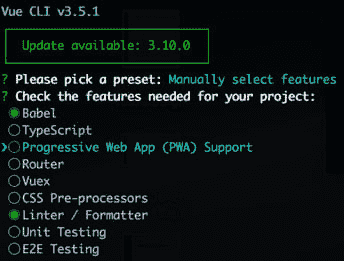

# 作为 React 开发人员学习 Vue

> 原文：<https://dev.to/vincentntang/learning-vue-as-a-react-developer-385l>

做出反应。我决定学习的第一个主要 JavaScript 框架来自 jQuery land。

我的学习之旅是痛苦的。我看了三个不同的 Udemy 教程才最终明白。我花了几个月的时间来思考这种外国的编码方式。

我慢慢地并且肯定地学会了基础知识，比如状态管理是如何工作的，以及 React 生命周期是如何运行的。随着时间的推移，这些事情发生了，最终我学会了使用这些知识在黑客马拉松中构建应用程序，并构建我将在日常生活中使用的工具。

作为使用 Vue 的团队的一员，我开始了我的第一份开发工作。我对这个框架一无所知，我觉得我必须重新学习 JavaScript。

我从 React 过渡到 Vue 的这段紧张而有趣的新旅程给我留下了以下宝贵的经验，我想与你分享。

## 安装

Vue 有一个类似 Create-React-App 的命令行界面，但它让您可以更好地控制开箱即用的设置。例如，您可以选择是否包含客户端路由或 CSS 预处理程序，如 Sass。

[](https://res.cloudinary.com/practicaldev/image/fetch/s--QfESH0-2--/c_limit%2Cf_auto%2Cfl_progressive%2Cq_auto%2Cw_880/https://thepracticaldev.s3.amazonaws.com/i/sj45votfzhc3hwpso1n2.png)

## 样式和语法

React 使用 JSX 让你编写类似 HTML 的语法。

用 Vue 写作就像重温 EJS 或任何模板语言的美好时光。我不再需要写我的 HTML，然后把它转换成 JSX。我可以写完 HTML^TM 就走。

下面是一个典型的 Vue 文件的例子:

```
<template>
  <div>
    <h1>{{message}}</h1>
  </div>
</template>

<script>
  export default {
    data() {
      return {
        message: "Hello World"
      }
    },
  }
</script>

<style lang="scss" scoped>
  .h1 {
    color: red;
  }
</style> 
```

<svg width="20px" height="20px" viewBox="0 0 24 24" class="highlight-action crayons-icon highlight-action--fullscreen-on"><title>Enter fullscreen mode</title></svg> <svg width="20px" height="20px" viewBox="0 0 24 24" class="highlight-action crayons-icon highlight-action--fullscreen-off"><title>Exit fullscreen mode</title></svg>

假设您在顶层声明了您的 Vue 组件，这将输出一个红色的“Hello World”字符串。

在 Vue 中，您编写单个文件组件。按照惯例，组件文件将在顶部包含模板声明，后面是包含所有组件逻辑的脚本定义，最后是任何必要的样式声明。

另一方面，React 在文件结构上不那么固执己见。你仍然可以创建单个的文件组件，但是不要用 HTML 来实现模板，也不要用 SCSS 来实现样式，比如，你可以用 Javascript 来写所有的东西:用 JSX 的模板，用 CSS-in-JS 的样式。这在下面的例子中得到了证明:

```
import React, { Component } from 'react';

export default class MyFirstComponent extends Component {
  state = {
    message: 'Hello World',
  };
  render() {
    return (
      <div>
        <h1 style={styles.color}>{this.state.message}</h1>
      </div>
    );
  }
}

// CSS in JS
const styles = {
  header: {
    color: 'red',
  },
}; 
```

<svg width="20px" height="20px" viewBox="0 0 24 24" class="highlight-action crayons-icon highlight-action--fullscreen-on"><title>Enter fullscreen mode</title></svg> <svg width="20px" height="20px" viewBox="0 0 24 24" class="highlight-action crayons-icon highlight-action--fullscreen-off"><title>Exit fullscreen mode</title></svg>

但是你也可以导入一个`.css`或者`.scss`文件。使用导入时遇到的问题是会污染全局名称空间。随着你的应用和团队的成长，你的开发同事很可能会给一个类起一个和你一样的名字。

你可以选择使用像`styled-components`这样的库。这给了你一个类似 Sass 的语法，将你的风格和你的 JSX 紧密地结合起来。

React 带来了另一系列问题。您使用功能组件还是有状态组件？默认情况下，最好只使用你需要的，但这意味着将来可能会有更多的重构。这并没有考虑到你现在可以使用 React 钩子来代替类组件。

## 道具，状态

React 有一个叫做 props 的东西，它是从父组件加载的数据。和称为状态的东西，即该组件固有的数据。

下面是一个渲染“Hello World”消息的例子:

```
// React Parent Component
import React, { Component } from 'react';
import Child from './Child';

export default class Parent extends Component {
  state = {
    message: 'Hello World',
  };
  render() {
    return (
      <div>
        <Child message={this.state.message} />
      </div>
    );
  }
} 
```

<svg width="20px" height="20px" viewBox="0 0 24 24" class="highlight-action crayons-icon highlight-action--fullscreen-on"><title>Enter fullscreen mode</title></svg> <svg width="20px" height="20px" viewBox="0 0 24 24" class="highlight-action crayons-icon highlight-action--fullscreen-off"><title>Exit fullscreen mode</title></svg>

```
// React Child Component
import React from 'react';

const Child = props => {
  return <div>{props.message}</div>;
};
export default Child; 
```

<svg width="20px" height="20px" viewBox="0 0 24 24" class="highlight-action crayons-icon highlight-action--fullscreen-on"><title>Enter fullscreen mode</title></svg> <svg width="20px" height="20px" viewBox="0 0 24 24" class="highlight-action crayons-icon highlight-action--fullscreen-off"><title>Exit fullscreen mode</title></svg>

对于 Vue，概念是相同的。但是 Vue 更喜欢常规而不是配置。意思是，有特定的命名约定。父组件中声明的子组件在 camelCase 中。当组件被添加到 HTML 中时，语法是 kebab-case。

示例:

```
<!-- Vue Parent Component -->
<template>
  <div>
    <child-component :message="message"/>
  </div>
</template>

<script>
  import ChildComponent from './ChildComponent.vue';
  export default {
    data() {
      return {
        message: 'hello world',
      };
    },
    components: {
      ChildComponent,
    },
  };
</script> 
```

<svg width="20px" height="20px" viewBox="0 0 24 24" class="highlight-action crayons-icon highlight-action--fullscreen-on"><title>Enter fullscreen mode</title></svg> <svg width="20px" height="20px" viewBox="0 0 24 24" class="highlight-action crayons-icon highlight-action--fullscreen-off"><title>Exit fullscreen mode</title></svg>

```
<!-- Vue Child Component -->
<template>
  <div>
    {{message}}
  </div>
</template>

<script>
  export default {
    props: {
      message: {
        type: String,
        default: undefined,
      },
    },
  };
</script> 
```

<svg width="20px" height="20px" viewBox="0 0 24 24" class="highlight-action crayons-icon highlight-action--fullscreen-on"><title>Enter fullscreen mode</title></svg> <svg width="20px" height="20px" viewBox="0 0 24 24" class="highlight-action crayons-icon highlight-action--fullscreen-off"><title>Exit fullscreen mode</title></svg>

Vue 要求你声明一个子组件两次，一次在`Components`导入另一个。

React 的不同之处在于少了一个步骤，即导入文件然后使用它。

## 类型强制执行

在像 C#或 Java 这样的静态语言中，我错过的一件事是类型强制。Javascript 是一种动态脚本语言。这意味着它不关心变量是字符串、数字还是布尔值等。

当您声明一个字符串时，您总是可以在。这使得大型前端应用难以扩展。因为您可能不知道正在处理的数据类型。

React natively 用`PropTypes`解决了这个问题。我们之前制作的`<Child/>`组件中的例子:

```
import React from 'react';
import PropTypes from 'prop-types';

const Child = props => {
  return <div>{props.message}</div>; };

Child.propTypes = {
  message: PropTypes.string.isRequired,
};

export default Child; 
```

<svg width="20px" height="20px" viewBox="0 0 24 24" class="highlight-action crayons-icon highlight-action--fullscreen-on"><title>Enter fullscreen mode</title></svg> <svg width="20px" height="20px" viewBox="0 0 24 24" class="highlight-action crayons-icon highlight-action--fullscreen-off"><title>Exit fullscreen mode</title></svg>

React 中的 propTypes 存在一些问题

*   真的很容易拼错
*   这是可选的
*   你必须申报进口

由于这些原因，我发现自己忘记了使用 propTypes。您可以选择使用 Typescript 来代替 React，但这只是意味着需要更多的时间来配置您的设置。

Vue 要求声明 props，propTypes 在同一个位置。在你的标签里面，所有其他的逻辑都在那里

子组件示例:

```
<template>
  <div>
    {{message}}
  </div>
</template>

<script>
  export default {
    props: {
      message: {
        type: String,
        default: undefined,
      },
    },
  };
</script>

<style lang="scss" scoped>
</style> 
```

<svg width="20px" height="20px" viewBox="0 0 24 24" class="highlight-action crayons-icon highlight-action--fullscreen-on"><title>Enter fullscreen mode</title></svg> <svg width="20px" height="20px" viewBox="0 0 24 24" class="highlight-action crayons-icon highlight-action--fullscreen-off"><title>Exit fullscreen mode</title></svg>

总的来说，这是一个更好的设计，使得在 Vue 中不需要 Typescript。

## 数据反应性

这个概念让我在 Vue 上犯了几次错误。在 React 中，一切都是被动的。这意味着你可以给对象添加属性，当属性改变时，React 会调用它的生命周期。

在 Vue...事情不一样了。在 React 中，每次修改状态时，都可以传递一个新的整个状态对象。

Vue 的不同之处在于你直接通过方法*改变了*你的状态。因为我们本质上是在添加副作用，所以当新的属性被添加到对象中时，你必须真正地*声明*。

也就是使用一种叫做`Vue.set()`的东西。

使用这种方法的一个常见例子是从后端加载数据。并且需要创建新的数据发送回去。

您还必须为已经迭代的组件定义一个`key`值。React / Vue 以同样的方式工作，它让库知道在数据改变时应该重新呈现哪些部分。

## 观察者和被观察者

我从来没有那么理解设计模式。但是“可观察的”这个词最终对我来说是有意义的。

Vue 有个叫 watchers 的东西。这使您可以在每次特定变量改变时调用一个方法。

然而，这里有一些警告，因为你可能会有监视者监视着监视者。这导致了循环引用问题。

Vue 医生对此提出警告。我自己也曾意外地使用输入来监视其他输入。

React 实现 watchers 是通过`componentDidUpdate`的生命周期方法。你可以在这里选择你想独立观看的项目。

对于 React 钩子实现，`useState`是可观察的另一个实现

## 计算属性

这对我来说是一个新概念，来自反应世界。在 Vue 中，您可以拥有依赖于其他变量的变量。每当依赖项发生变化时，计算的属性也会发生变化。

乍一看，这似乎很有用，但是计算属性只有在您根本不直接修改它的情况下才有用。

当你开始需要的时候，这是你完全离开计算属性到下一个项目的时候...

## 方法

Vue 中的方法与 React 中的方法工作方式相同。这些方法是通过从 HTML DOM 事件扩展的事件指令调用的。示例包括放置`@click`事件，或者如果用户在输入字段中键入文本，则放置`@input`。

当计算出的属性和观察器不适合你的用例时，方法是你在 Vue 中总是可以依靠的。

方法就像 javascript 中的任何函数。return 语句是可选的，你可以用它在后台改变数据。

## 异步陷阱

这是一个你稍后会在 Vue 和 React 中发现的陷阱。
在 React 中，有一个内置的方法叫做`setState()`。当`setState()`被调用时，它在后台被异步处理。

Vue 也不例外，您有一个名为`Vue.nextTick()`的方法，它等待数据的最新更新值。

我学到的一个教训是，最好在方法中设置局部变量，只在需要时改变数据属性。

## 模板

用 Vue，有个东西叫`templates`。在您的组件中，您能够声明`<template>`插槽。当该组件被调用时，您可以在那些槽匹配的地方注入 HTML。

这在图书馆工作时非常有用。我可以注入我认为合适的功能，以获得我需要的特性。

模板不会在 DOM 中呈现为`<div>`元素。React 对称为片段的模板有一种类似的方法，但是这种方法仅限于组件中的第一个元素。

## 生命周期方法

生命周期方法描述了组件在其生命周期中做什么。

以下是您将在 Vue 中使用的常用工具:

*   mounted()——类似 React 的`componentDidMount`。这通常发生在从后端调用 Axios/fetch 来初始化组件中的数据时。
*   更新()-类似 React 的`componentDidUpdate`。当您通过组件更新数据时，您希望向后端发送一个 POST 请求来保持同步
*   destroyed() -类似 React 的`componentWillUnmount`。您不需要使用它，但是它有助于清理剩余的事件侦听器。

## 挂钩

Hooks 使得 React 成为一个非常强大的框架。您不必再使用 redux 来处理状态，您可以只使用`useState()`来代替。你不再需要处理`setState()`，有许多其他新的改进方法可以使用。

Vue 没有钩子的等价物，尽管在写这篇文章的时候有一个 RFC

## 指令

Vue 的内置指令使开发变得轻而易举。你可以在你的 HTML 中创建 iterable 指令。

在 React 中，这通常意味着创建另一个称为“组”的组件，也可能是一个称为“组”的组件。

Vue，你可以将`v-for`、`v-if`等直接放入你的 HTML 中。你的逻辑看起来很有条理。

或者，您可以编写自己的指令！这使您可以在必要时将功能附加到页面上，从而更容易更快地开发

创业公司的一个很好的用例是开发一个报告系统。如果用户点击了一个尚不存在的功能，你可以添加一个弹出模式，说“对不起，我们正在努力开发这个新功能！以后再来吧”。在后台，你可以让 Axios 请求通知用户确实需要这个特性。

## Mixins

有些公司对这些信誓旦旦。这是一个可重用的代码片段库，可以跨多个组件实现。React out of the box 没有这样的特性，您也可以使用全局可用的回调函数

## 发射事件

属性通过单向数据绑定从父组件传递到子组件。为了在父级处理业务逻辑，通常从子组件发出事件。

对于 Vue，有两种不同的方式。

1.  您可以将对函数的引用从父级传递到子级
2.  从子进程发出事件并在父进程中捕获响应

大多数应用程序通常使用#2。触发父组件
中方法的按钮示例

```
<!-- Parent Component -->
<template>
  <ChildComponent @event-emitted="_handleUpdatedEvent"/>
</template>

<script>
  import ChildComponent from './components/ChildComponent.vue';

  export default {
    components: {
      ChildComponent,
    },
    methods: {
      _handleUpdatedEvent(val) {
        console.log('Button was clicked');
      },
    },
  };
</script> 
```

<svg width="20px" height="20px" viewBox="0 0 24 24" class="highlight-action crayons-icon highlight-action--fullscreen-on"><title>Enter fullscreen mode</title></svg> <svg width="20px" height="20px" viewBox="0 0 24 24" class="highlight-action crayons-icon highlight-action--fullscreen-off"><title>Exit fullscreen mode</title></svg>

```
<!-- Child Component -->
<template>
  <div class="hello">
    <button @click="$emit('event-emitted')">Click Me</button>
  </div>
</template> 
```

<svg width="20px" height="20px" viewBox="0 0 24 24" class="highlight-action crayons-icon highlight-action--fullscreen-on"><title>Enter fullscreen mode</title></svg> <svg width="20px" height="20px" viewBox="0 0 24 24" class="highlight-action crayons-icon highlight-action--fullscreen-off"><title>Exit fullscreen mode</title></svg>

## 全局状态管理

Vue 的 CLI 具有开箱即可添加 Vuex 的能力。

在 React 中，您使用`setState()`传递一组新状态，Redux 仅通过全局调度/流量架构扩展了这一点。

在 Vue 中，你在场景后面改变物体。Vuex 没有什么不同，但在全球范围内。

Vue 自带创建全局事件总线的能力，这类似于 React 的上下文 API。

## 最后的想法

学习 Vue 是学习新编程范例的好方法。

React 中的许多原则都适用于 Vue。有一些不同之处，即:

*   您没有替换您的状态，而是改变了它，这就产生了数据反应和异步问题。
*   新构造。有现成的 React 中不存在的计算属性、观察器和混合
*   您可以像在常规 HTML 页面中一样编写 HTML 和样式。
*   PropTypes 在 Vue 和 React 中是可选的，但是 Vue 需要更少的努力来实施。
*   造型。在 Vue 你只要写 Sass 或者 CSS，相比 React 超级简单。

这些是 React 和 Vue 的一些区别。一些相似之处包括:

*   生命周期方法
*   道具/状态
*   为迭代项分配键
*   方法/功能
*   向上传递事件